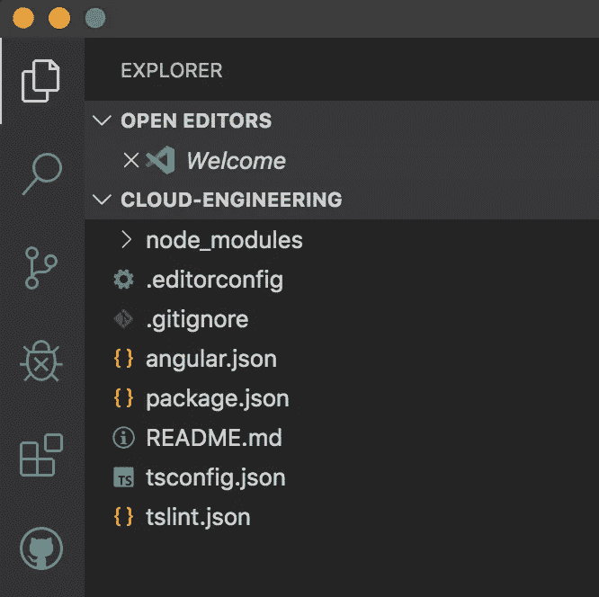
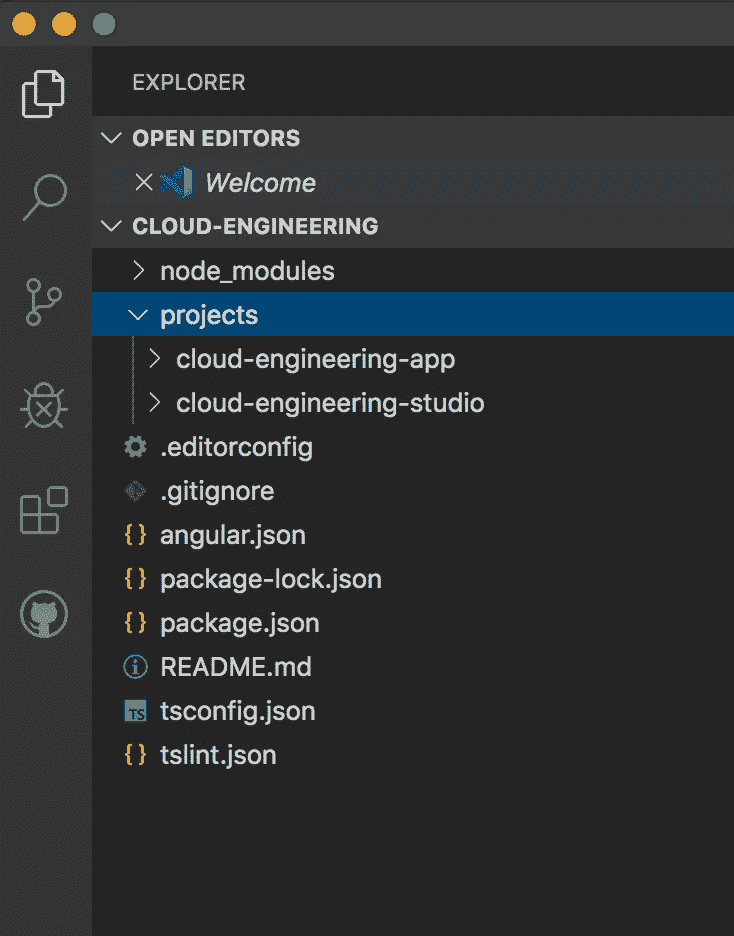
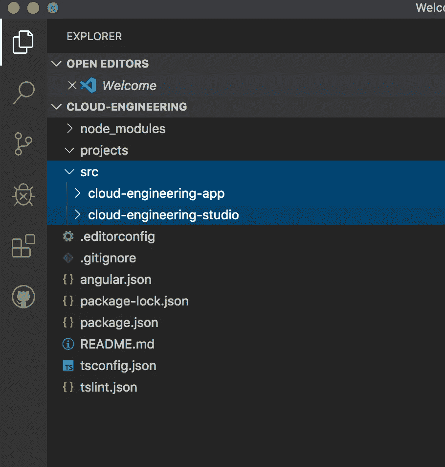
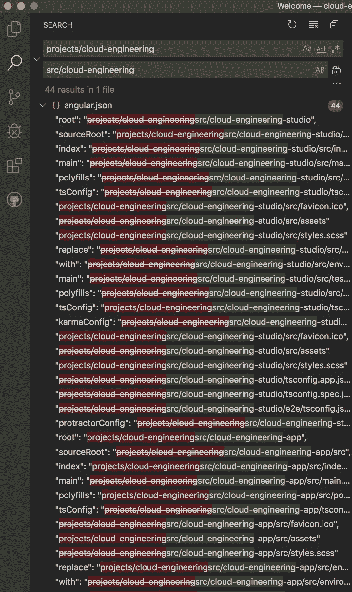
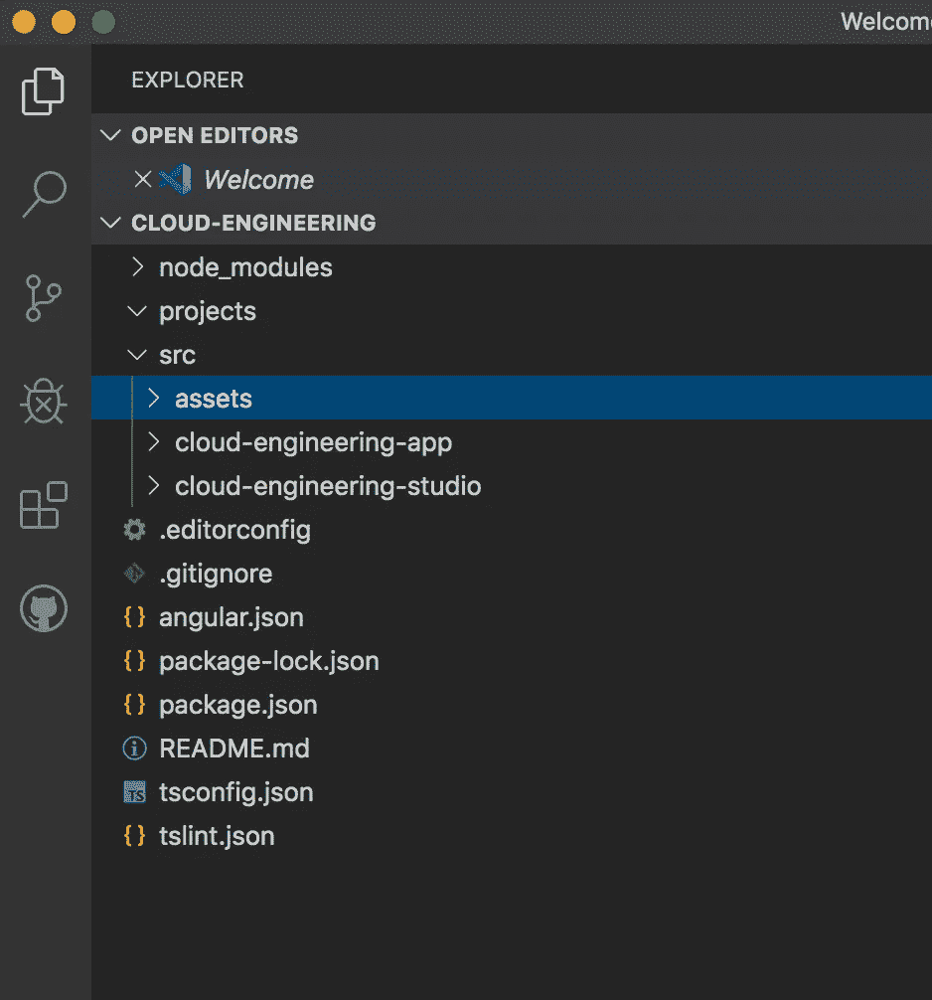

# 欺骗 Angular，让他认为你所有的应用程序共享同一个源文件夹

> 原文：<https://levelup.gitconnected.com/trick-angular-into-thinking-all-of-your-apps-share-the-same-source-folder-b8eb2e5aed16>


图片来源:Freepik

如果您使用 Angular CLI 启动一个新项目，您会注意到它附带了一个默认应用程序，其中有一个“src”文件夹。Angular 使用此文件夹作为应用程序的根位置，这样无论您在文件夹结构中的哪个位置，都可以访问相同的起点。

# 但是如果你想在多个应用之间共享同一个起点呢？

在意识到 Angular 是多么不可思议之后，你可能决定要在同一个项目工作空间中创建多个应用程序，但是由于明显的原因，你不想一次又一次地复制相同的资产。看起来好像你可以创建一个位于你的应用之上一层的资产文件夹，让你所有的应用都链接到它，这样就可以了。然而，通过巧妙的设计，Angular 限制每个应用程序只能有一个源文件夹，它不会识别源文件夹之外的任何东西，所以你必须做更多的 fanagling 来覆盖这些保护性的默认行为。

# 步骤 1:创建一个没有默认应用程序的新项目

当您创建新的 Angular 项目时，请指定您不想创建带有以下标志的默认应用程序:

```
ng new [workspace name] --create-application=false
```

阅读 Todd Palmer 的这篇伟大的文章,进一步了解这面旗帜的其他用途。

**注意:**确保使用一个足够宽泛的工作区名称来包含你所有的应用程序，因为你不能在以后为一个应用程序重复使用相同的名称。真的，这个名字并不重要，但是为什么不使它有意义呢？

您将最终得到一个看似贫瘠的角形项目，如下所示:



# 步骤 2:创建您的应用程序

使用 Angular CLI 创建尽可能多的应用程序:

```
ng generate app [app name]
```

您会注意到，这些应用程序将创建在您的“项目”文件夹中，就像您正在创建一个库一样。



# 步骤 3:在“项目”文件夹的同一层创建一个共享的“src”文件夹

**注意:**让你的应用程序将“项目”或“src”作为它们的根文件夹位置本质上没有区别。然而，如果你想轻松区分你的应用程序和你的库，你必须创建一个共享的“src”文件夹，然后将你的应用程序拖到该文件夹中。



# 第四步:修改“angular.json”

执行查找和替换搜索，将“项目/应用程序名称”替换为“src/应用程序名称”

**注意:**这个替换必须在你的“angular.json”文件的所有实例中进行(例如，2 个应用程序有 44 个结果)，否则你的应用程序会崩溃！不要依靠目测在哪里进行替换。



# 步骤 5:创建资产文件夹

创建一个“资产”文件夹，与你的应用程序放在同一层。



# 第六步:修改“angular.json”

你现在必须告诉 Angular 你的“资产”文件夹的新位置，用新的链接替换当前的资产链接。为此，您可以在每个应用程序中找到“assets”部分，并用以下代码行替换现有代码:

**之前:**

```
"assets": [
      "src/cloud-engineering-studio/src/favicon.ico",
      "src/cloud-engineering-studio/src/assets"
    ],
```

**之后:**

```
"assets": [
          { "glob": "**/*", "input": "src/assets/", "output": "/assets/" },
          "src/cloud-engineering-studio/src/favicon.ico"
        ],
```

这种替换必须在每个应用程序的两个位置进行，因为第一个位置用于应用程序，第二个位置用于测试应用程序。

**注意:**因为我希望每个应用程序都有不同的图标，所以我保留了不同的图标链接。如果这样做，请确保颠倒两个语句的顺序。

# 步骤 7:使用新的“资产”文件夹

现在，你可以对每个应用程序以同样的方式使用新的“资产”文件夹，它们都将链接到同一个位置。例如，要链接到一个图像，您可以只写:

```
"/assets/file-directory/file-name.jpg"
```

要导入位于 assets 文件夹中的样式表，可以像这样形成导入语句:

```
@import "src/assets/file-directory/file-name.scss"
```