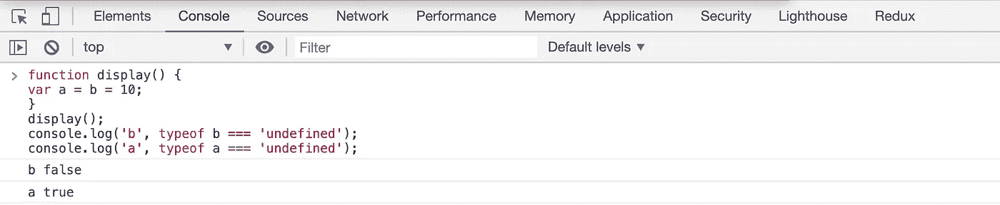

# 采访中问到的棘手的 Javascript 代码片段

> 原文：<https://levelup.gitconnected.com/tricky-javascript-code-snippets-asked-in-the-interview-8ed9b868a4a5>

## 测试您的 Javascript 知识的片段


照片由[沙哈达特·拉赫曼](https://unsplash.com/@hishahadat?utm_source=medium&utm_medium=referral)在 [Unsplash](https://unsplash.com?utm_source=medium&utm_medium=referral) 上拍摄

在本文中，我们将看到一些最著名的访谈代码片段，这些片段被用来检查您对 Javascript 概念的了解。

我们开始吧

预测下面代码的输出

```
const user = {
  name: 'Raj',
  location: {
    city: 'NY',
    state: 'NY'
  }
};const copy = Object.assign({}, user);
// OR
// const copy = { ...user };copy.location.city = 'Albany';console.log('original: ', user.location);
console.log('copy:', copy.location);
```

上述代码的输出是

```
original:  {
  city: 'Albany',
  state: 'NY'
}copy: {
  city: 'Albany',
  state: 'NY'
}
```

改变原始对象的原因是因为当我们使用`Object.assign`或`spread operator,`时，它只做`shallow copy`，这意味着在创建对象的副本时，只复制第一级的属性，如果有嵌套属性，则只复制它们的引用，这意味着复制的引用仍然引用存储对象的原始位置。

所以在我们的例子中，`location`属性仍然会引用原始对象，在我们的例子中，它是一个`user`对象。

为了更好地理解它，查看我以前的文章[这里](https://medium.com/javascript-in-plain-english/why-you-should-not-use-array-to-remove-all-the-elements-of-array-42ad2951d47e?source=friends_link&sk=d54fa416074e266121ae62f0057eda29)。

```
var number = 10;
var display = function () {
  console.log(number);
  var number = 20;
};display();
```

上面代码的输出不是`10`而是`undefined`

为什么？

这是因为 Javascript 中的`hoisting`。

所以上面的代码将被转换成下面的代码

```
var number = 10;
var display = function () {
  var number;
  console.log(number);
  number = 20;
};display();
```

正如你所看到的，只有`declaration`被移动到函数的开始处，而`value`没有被提升，所以`console.log`打印`undefined`，因为`number`在`console.log`语句之前没有在函数内赋值。

```
const number = 1;const result = (function () {
  delete number;
  return number;
})();console.log(result);
```

这段代码不会给出任何错误，因为我们在`number`上使用了 delete，但是它会将值`1`作为输出打印出来。

这种直接调用函数的语法称为`IIFE`(立即调用函数表达式)。

`delete`操作符用于删除对象的属性。这里，`number`不是一个对象，但它是一个原始类型，所以它不会抛出错误，但函数将返回变量的初始值，即`console.log`语句范围内的`1`。

```
const number = 1;const result = (function (number) {
  delete number;
  return number;
})(10);console.log(result);
```

上面代码的输出是`10`

在这段代码中，我们将值`10`作为函数的输入进行传递。但是在函数`number`中，变量只是一个局部原始类型，所以 delete 不会对数字做任何改变，传递给函数的值`10`将从函数中返回。

```
function display() {
  var a = b = 10;
}display();console.log('b', typeof b === 'undefined');
console.log('a', typeof a === 'undefined');
```

上述代码的输出是

```
b false
a true
```

这是因为赋值操作符在 Javascript 中有`right to left associativity`，这意味着它将从右到左被求值，所以首先，`b`将被赋值`10`，然后它被赋值给`a`。因此

```
function display() {
  var a = b = 10;
}
```

与相同

```
function display() {
  var a = (b = 10);
}
```

这与

```
function display() {
 b = 10; 
 var a = b;
}
```

所以`b`变成了全局变量，因为它前面没有`var`关键字，而`a`变成了局部变量。因此，在该功能之外，只有`b`可用，因此`typeof a === 'undefined'`作为`true`出现，`typeof b === 'undefined'`作为`false.`出现



输出

如果我们在如下所示的`strict mode`中执行上述代码，

```
'use strict';function display() {
  var a = b = 10;
}display();console.log('b', typeof b === 'undefined');
console.log('a', typeof a === 'undefined');
```

它会抛出一个错误，因为`b`变成了一个全局变量，而`strict mode`不允许创建全局变量，所以当你执行这段代码时会出错。

看看我最近出版的[掌握 Redux](https://master-redux.yogeshchavan.dev/) 课程。

在本课程中，您将构建 3 个应用程序以及一个点餐应用程序，您将了解:

*   基本和高级冗余
*   如何管理数组和对象的复杂状态
*   如何使用多个减速器管理复杂的冗余状态
*   如何调试 Redux 应用程序
*   如何在 React 中使用 Redux 使用 react-redux 库让你的 app 反应性。
*   如何使用 redux-thunk 库处理异步 API 调用等等

最后，我们将从头开始构建一个完整的[订餐应用](https://www.youtube.com/watch?v=2zaPDfCKAvM)，集成 stripe 以接受支付，并将其部署到生产中。

**别忘了直接在你的收件箱** [**订阅我的每周时事通讯，里面有惊人的技巧、诀窍和文章。**](https://yogeshchavan.dev/)