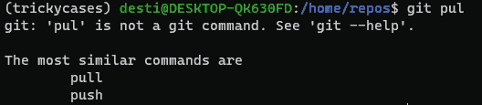
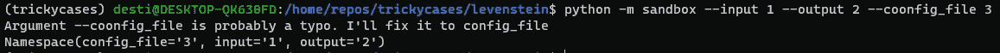

# 棘手案例四。用数学来修正你的错别字

> 原文：<https://levelup.gitconnected.com/trickycases-4-using-math-to-fix-your-typos-f20bfb0e0f7>

## ***免责声明:****【tricky cases】是一系列包含相当短的代码片段的帖子，在日常的 ML 实践中非常有用。在这里你可以找到一些你想在 StackOverflow 中搜索的东西。*


伊利亚·巴甫洛夫在 [Unsplash](https://unsplash.com?utm_source=medium&utm_medium=referral) 上的照片



99.9%的人在他们的实践中使用过 Git，并且熟悉有用的特性，可以对你写得不好的命令提出潜在的修复建议。然而，我想知道这种做法是否可以在其他控制台应用程序中实现，以及会有多困难。

事实证明，这很简单。可以计算输入命令和所有可用命令列表之间的 Levenshtein 距离。一般来说，两个字符串之间的距离代表了将一个字符串更改为另一个字符串所需的更新次数。更多关于你可以阅读[这里](https://www.sciencedirect.com/topics/computer-science/levenshtein-distance)。

在 python 中，有一个叫做 Levenshtein 的简洁的小包，为了方便起见，它封装了距离计算方法。

现在，让我们从上到下快速浏览一下上述要点:

*   get_alternative_argument_name 方法用于查找与您输入的参数最匹配的参数。您可以通过调整 max_typo_distance 参数来控制搜索的灵活程度。
*   argparser 模块让您知道所有已知的参数，这就是第 26 行所做的
*   尝试在下一个命令中使用这段代码:

```
# Execution command: python sandbox.py --input 1 --output 2 --coonfig_file 3
```

您应该会看到类似这样的内容:



这段代码现在可以在你的控制台应用中使用，甚至可以移动到 python 包中。

附注:如果你有更好的方法来做这件事，请告诉我。我有一种内在的感觉，应该有什么:)