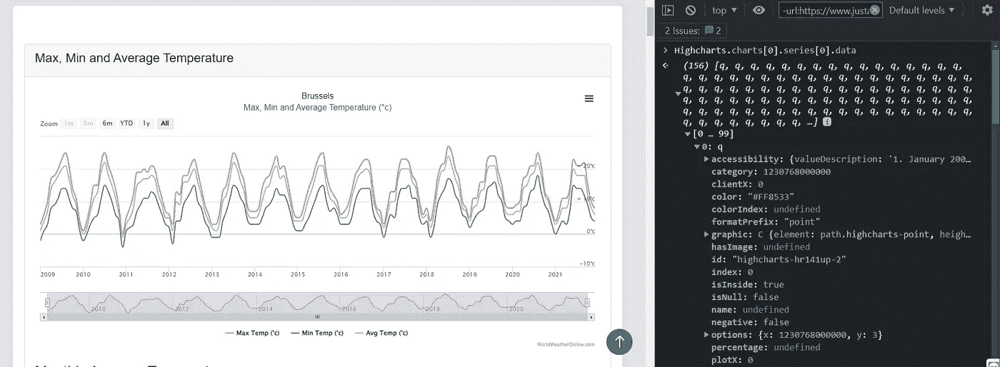

# 第六个难题。刮高图表绘图

> 原文：<https://levelup.gitconnected.com/trickycases-6-scrape-highcharts-plots-a6b3fc233fe6>

***免责声明:****【tricky cases】是一系列代码片段相对较短的帖子，在日常的 ML 实践中很有用。在这里你可以找到一些你想在 StackOverflow 中搜索的东西。*

马库斯·温克勒在 [Unsplash](https://unsplash.com?utm_source=medium&utm_medium=referral) 上拍摄的照片

图表通常包含有价值的数据，如果你和我一样是数据迷，你会想把这些数据带回家。我最近的一个发现是，解析用 HighCharts.js 模块绘制的数据是多么容易。

> 你可以在这里找到我关于[网页抓取的代码](https://bit.ly/3omBlaG)，格式简单。

在我们跳到刮擦部分之前，请确保:

*   你要抓取的站点没有通过 API 提供相同的数据。使用可编程接口总是更容易。
*   法律并没有禁止你刮这个网站。
*   你没有给网站带来高负荷。

# 我们刮的那部分

正如承诺的那样，刮擦部分会相对简单。出于练习的目的，让我们拿一个像[这样的页面。向下滚动到名为“最高、最低和平均温度”的图表，你会看到自 2009 年以来布鲁塞尔每个月的平均温度(摄氏度)。现在打开浏览器控制台，运行以下脚本:](https://www.worldweatheronline.com/brussels-weather-averages/be.aspx)

*Highcharts.charts[0]。系列[0]。数据*

数据点

经过一些检查后，您会发现现在您可以访问该图中的所有原始数据。此外，借助一些 javascript 知识，您甚至能够干净地打印数据。刮痧的诀窍是通过硒和熊猫的使用来自动化这个过程。

下面我将与你分享这样一个脚本的简化版本，这样你就能抓住要点:

在这段代码中:

1.  您将调用目标站点
2.  等待高图表出现
3.  用链接的 JS 函数解析数据
4.  将其存储到 dataframe 并保存到本地文件夹

请注意，代码假设您已经安装、运行并提供了 chromedriver。这里有一些很好的教程，教你如何在各种操作系统上做到这一点:

*   [在 Ubuntu 20.04 和 18.04 上](https://tecadmin.net/setup-selenium-chromedriver-on-ubuntu/)
*   [在 Macos 上](https://www.edureka.co/community/52315/how-to-setup-chrome-driver-with-selenium-on-macos)
*   [在 WSL 上](https://www.gregbrisebois.com/posts/chromedriver-in-wsl2/)
*   *在 Windows 上安装非常简单，只需从[这里](https://chromedriver.chromium.org/downloads)下载一个正确的 zip 文件，然后通过安装即可。exe 文件

像往常一样，我欢迎任何问题和评论。如果您在路上遇到任何麻烦，以及您如何在自动化任务中使用该脚本，请告诉我！