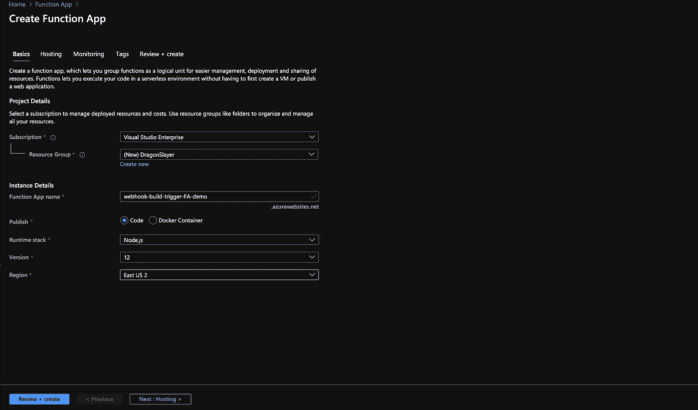
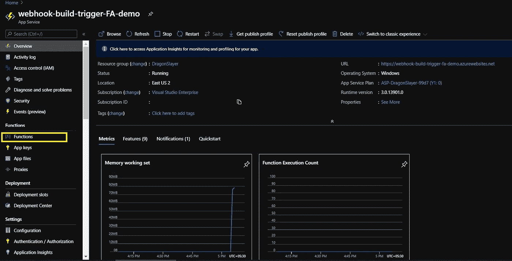
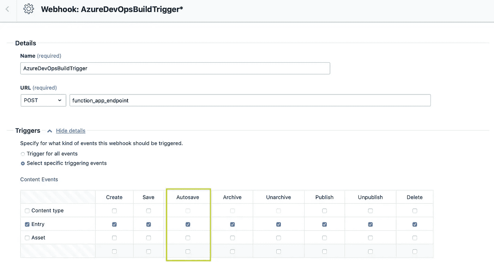

# 使用 webhook 触发管道

> 原文：<https://levelup.gitconnected.com/trigger-a-pipeline-using-webhook-586a664addd7>

您已经静态地呈现了您的 web 应用程序，并且想要在内容管理系统(CMS)中使用 webhook 进行任何发布/取消发布操作时触发您的构建管道。这不仅仅是使用 webhook 触发一个管道。在我们继续创建自动化工作流之前，我们将需要以下内容。

*   CMS(我们将使用 Contentful)
*   无服务器功能(Azure Function Apps/Google Cloud Functions/AWS lambda)
*   DevOps 管道将被触发。
*   CI tool REST API 令牌安全地触发构建管道(我们将使用 Azure DevOps 的个人访问令牌)
*   代码库
*   队列存储(我们将使用 Azure 队列存储)
*   目标服务器(应用服务/EC2 等。查看发布的内容)

0.1 工作流程图

# 1.创建功能应用程序

*   转到 Azure 门户→自定义部署→加载 GitHub 快速启动模板或加载您自己的自定义模板和参数文件

1.1 功能 App 定制模板部署

*   或者，我们可以从门户创建一个功能应用程序和一个存储帐户。
*   进入 Azure 门户→创建函数 App→填写实例详情→根据需要选择运行时。我们将使用 Node。Js 作为运行时堆栈→下一步:托管

1.2 从门户创建功能应用

*   创建新的存储帐户/使用现有帐户→根据环境/使用情况选择消费/高级计划类型。此存储帐户将用于存储功能应用程序文件。这是因为 Functions 依赖 Azure 存储进行操作，比如管理触发器和记录函数执行。存储帐户需要有队列和文件存储服务。只有 Blob 存储帐户不能与 Azure 函数一起使用。

1.3 托管

*   转到监控→根据需要启用应用洞察→添加资源创建日期、TA、所有者等标签。→查看+创建

1.4 监控

# 2.在函数应用程序中添加函数

我们将在 Azure Repos Git 中存储我们的函数应用程序代码，并使用 Azure 管道将我们的代码部署到创建的函数应用程序中。你可以直接在函数 App 编辑器里写你的代码(不推荐)。Azure Repos Git 分支中的文件夹结构如下所示。对于不同的运行时堆栈，文件夹结构会有所不同。

2.1 git 分支中函数 App 的文件夹结构

*   **package.json** 将包含依赖项和开发依赖项，如 Axios 模块或 azure-storage-module。该文件还包含与项目相关的各种元数据，如版本、描述等。
*   **index.js** 将包含我们的代码。
*   **host.json** 元数据文件包含影响一个函数 app 所有函数的全局配置选项。host.json 中与绑定相关的配置同样适用于函数 app 中的每个函数。
*   在 **function.json** 中，您可以使用解析各种来源的值的表达式。大多数表达式都用花括号括起来。例如，在队列触发器函数中，{queueTrigger}解析为队列消息文本。如果 blob 输出绑定的 path 属性是 container/{queueTrigger}，并且该函数由队列消息 HelloWorld 触发，则创建一个名为 HelloWorld 的 blob。
*   找到下面的样本文件。

2.2 功能逻辑

# 3.使用 Azure DevOps 管道部署功能应用程序代码

一旦您准备好了函数代码，就可以使用 Azure DevOps CI/CD 管道将它部署到 Azure 函数中。查看[这篇关于如何部署节点的](/configure-ci-cd-pipelines-for-nodejs-applications-with-azure-devops-44e7425f5a99)文章。使用 Azure DevOps 管道的 Js 应用程序。除了 **2.6** 我们必须选择**功能 App** 作为 **App 服务类型外，所有步骤都是相似的。**将存储账户密钥和个人访问令牌等所有机密保存在 Keyvault 中，以便安全访问。

# 4.CMS webhook 设置

当我们准备好函数应用程序时，让我们在 contentful webhook 设置页面中添加函数应用程序端点 URL。

*   获取函数端点 URL

4.1 进入功能应用程序→功能

4.2 概述→获取函数 URL →复制 URL

*   在 Contentful 中设置 webhook 设置。

4.3 转到设置→Webhooks

4.4 添加 Webhook

4.5 插入复制的端点 URL，并根据您的要求设置触发器

# 为什么我们需要队列存储？

**目标→** 使用无服务器函数触发 Azure DevOps 管道(无服务器…但是[为什么](https://www.linkedin.com/in/aniketprashar/)？🤔)
**解决方案** →调用 Azure DevOps REST API 触发管道。每当 CMS 上有任何发布或取消发布操作时，webhook 将启动一个函数应用实例，函数应用实例将触发 DevOps 管道。简单…不是吗？

上述解决方案适用于 POC，但它适用于真实项目吗？让我们试着找出它。

1.  开发团队想要在 *Contentful* 上发布新内容。该任务涉及多个成员。开发者 A 在 30 分钟内发布了~150 个内容，开发者 B 在 20 分钟内发布了 100 个内容(与 A 的时间重叠)。
2.  那么，在 30 分钟内我们能期待多少个 webhook 触发器呢？可能 250！？
    别忘了在 CMS webhook 设置中取消勾选**自动保存**触发选项，除非只是一个‘POC’([为什么](https://www.linkedin.com/in/aniketprashar/)？🤔)

> 测试:一个功能应用可以扩展到多少个实例。

2.3 Webhook 触发器设置

3.因此，30 分钟内将有 250 个 webhook 触发器，它将触发您的管道 250 次。如果这个数字增长到 1000 或者 10000 呢？这对您的 Azure DevOps 组织有好处吗？

> ***小测验:*** *您的 Azure DevOps 组织中有多少个代理池？*

4.即使您对这么多管道触发器感到满意，并且您的代理池足以处理您组织中的所有管道任务，这是最佳解决方案吗？难道不能用几个管道触发器来完成吗？

5.**场景**:有 2 辆公交车，N 个学生。学生想从上车点 P 到下车点 d。公共汽车司机不知道学生人数和他们的到达时间。司机 A 决定只要有学生到达，就开始公共汽车服务，因为他们不确定下一个学生是否会来。因此，在某一天，100 名学生以 1 分钟的间隔来到接送点 p。因此，公共汽车服务运行的次数是 100 次(不贵🤑司机 B 决定在任何学生出现后等待 15 分钟。因此，在某一天，100 名学生以 1 分钟的间隔到达接送点 p。

> ***小测验:*** *公交服务跑了几次？*

你想怎么操作完全取决于你自己。我们还是选后者吧，这样文章可以长一点。

假设，两个开发者正在发布内容。Dev A 在 12:00 发布内容。它将触发函数 app，并创建一个新的函数 app 实例。它将检查队列中是否已经有消息。它现在是空的，所以它会在队列中放一些消息，并等到 12:15(可定制)才调用 Azure DevOps REST API 并清除队列。
当该实例仍在运行时，Dev B 在 12:05 发布了一个新内容，这将启动一个新的函数应用程序实例，该实例也将检查队列中是否有任何消息。很幸运，它找到了一条消息，因此，它不会等待 15 分钟，函数实例终止。在 12:15，已经运行的实例将清除队列中的消息并触发管道。然后，管道将构建解决方案，变更 A 和 B 都将在新的构建中更新。所以，不用两个触发器，我们只用一个就能逃脱。即使 15 分钟内有 200 个 webhook 调用，仅一个管道触发器就足以发布所有最新的 200 个更改。唯一的代价是 15 分钟的短暂时间间隔，可以根据使用情况进行定制。

> ***小测验:*** *一个函数实例能运行多久？*

**如果您需要任何帮助或有任何建议，请通过** [**LinkedIn**](https://www.linkedin.com/in/aniketprashar) 联系我