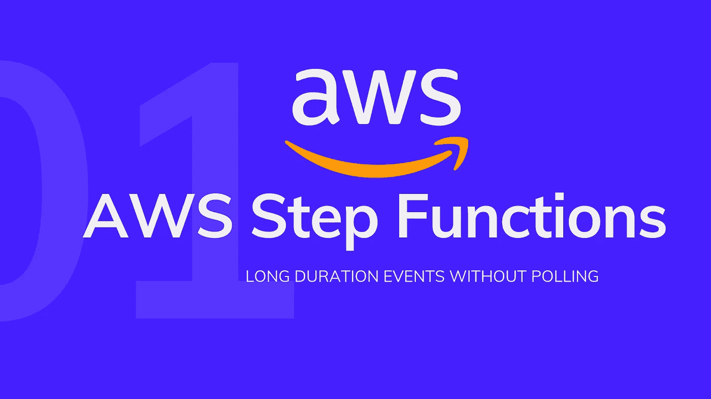
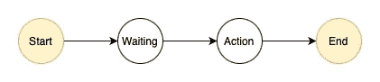
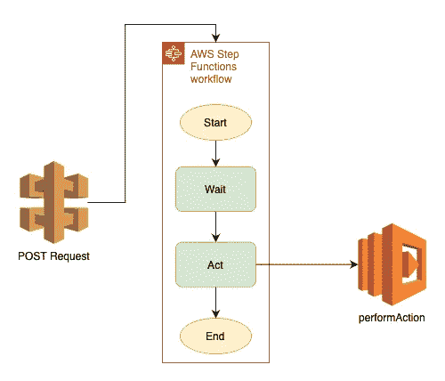

# 在特定时间戳触发事件

> 原文：<https://levelup.gitconnected.com/trigger-events-at-a-specific-timestamp-2527f9336128>

## 使用 AWS 步骤函数、API 网关和 Lambda，调度事件在特定的时间戳执行，而不需要进行任何轮询——根本不需要轮询！



长期预定事件的 AWS 步骤功能

对于许多应用程序来说，一个极其常见的用例是需要预定事件。主要有两种调度事件——一种作为 CRON 作业运行，另一种需要在特定时间触发。

CRON 作业是在固定时间、日期或间隔定期运行的软件实用程序(通常是命令或 shell 脚本)。它们可以是一次性的，也可以是重复性的。另一方面，预定触发器是需要在非常特定的时间被激发的事件，该时间通常是动态的或基于输入可配置的。

解决预定触发问题最常见的方法是通过轮询。轮询是指每隔 x 个时间单位触发一次作业，并检查执行时间是当前时间还是已经过去。虽然这可能适用于更简单、更小的用例，但极难扩展。很明显，这个作业的精度取决于它被调用的时间间隔。差距越小，函数触发的时间越准确，越接近预定时间。但是这本身带来了浪费资源和计算能力的问题，并且如果涉及到数据库，从数据库中进行不必要的读取会非常频繁。

我们需要一种方法，无论何时我们收到一个带有未来执行时间戳的事件，它都会自动进入一个`WAITING`状态，并在时间戳出现时被触发，而无需我们的干预。幸运的是，这正是在云中创建 Step 函数(也称为状态机)的确切用例。



状态机

> AWS Step Functions 是一个低代码可视化工作流服务，用于编排 AWS 服务、自动化业务流程和构建无服务器应用程序。工作流管理失败、重试、并行化、服务集成和可观察性，因此开发人员可以专注于更高价值的业务逻辑。

在这个例子中，我们将学习如何创建一个 Step 函数，它通过 API 网关接收事件，一直等到执行时间，然后触发 Lambda 函数来执行任务。



解决方案的架构图

本教程使用 Node.js 和无服务器框架，为了继续学习，您需要在系统上安装 Node.js 和 NPM。除此之外，确保你已经在全球范围内安装了`serverless` NPM 软件包。如果没有，运行下面的命令，并使用[这个](https://www.serverless.com/framework/docs/providers/aws/guide/credentials/)链接设置您的 AWS 概要文件

```
npm install -g serverless
```

如果您过去使用 Node.js 使用过 Lambda 函数和 AWS，那么您可能对设置和代码库的初始部分很熟悉。我们只是要扩展标准的 Lambda 函数模板，以包含对阶跃函数的支持。

为了开始，我们需要安装步骤函数的依赖项—

```
npm i --save-dev serverless-step-functions
```

这个包允许我们在我们的`serverless.yml`中使用`stepFunctions`关键字，在所有的配置完成后看起来像这样。

让我们浏览一下`serverless.yml`文件中的各个部分

*   *provider* —它保存了关于部署区域、云提供商、运行时细节、阶段等的所有配置。
*   *package* —这一部分包括关于我们的代码应该如何打包和构建的信息，并包括在您有多个函数的情况下单独打包的选项，包括/排除选项等。
*   *功能* —

我们的 Lambda 函数的定义在这里。它需要`handler`值来指向我们目录中的文件。还有额外的选项，如内存、超时、重试，允许进一步定制我们的 Lambda 函数。

*   *步进功能* —

这是一个自定义属性，因为我们之前安装了包，所以我们能够使用它。这是我们在 YAML 写的阶梯函数的定义。`events`对象为我们的步骤函数定义了触发器，在我们的例子中是一个 HTTP POST 请求。

阶跃函数的`definition`保存阶跃函数的不同状态和连接。这来自 Amazon States Language (ASL ),它是一种类似 JSON 的语言，Amazon 使用它来定义 Step 函数。详细资料和可用状态及选择可在[这里](https://docs.aws.amazon.com/step-functions/latest/dg/concepts-amazon-states-language.html)找到。最近，亚马逊推出了 [Workflow Studio](https://docs.aws.amazon.com/step-functions/latest/dg/workflow-studio.html) ，这是一个用于创建 Step 函数的拖放界面，使得创建 Step 函数的过程比以前容易许多倍。

*   *插件* —本节包含有助于简化或包含/扩展无服务器框架功能的包

因为我们的解决方案是使用 POST 请求触发的，所以只要我们向 API Gateway 端点发送一个包含所需数据的 POST 请求，API Gateway 就会将该数据转发给 Step 函数。然后，Step 函数将进入 START 状态，并很快转换到 WAITING 状态，并一直保持到 POST 请求主体中接收到的时间戳到达。一旦到达时间戳，Step 函数就进入下一个状态，称为 ACTION，在这里我们的 Lambda 函数被触发，之后 Step 函数进入 END 状态，从而完成执行周期。这里我们的 Step 函数依赖于请求体中一个名为`dueDate`的特定参数，这个参数必须在 POST 请求中与我们可能需要的任何其他数据一起传递。

```
curl --location --request POST 'https://...../execute' \
--header 'Content-Type: application/json' \
--data-raw '{ 
"dueDate": "2021-08-28T15:00:00Z", 
"data": { .... }
}'
```

> `dueDate`参数采用 UTC 时间戳格式，包含事件的日期和时间

要部署所有这些服务，只需从终端运行— `serverless deploy`即可！您的应用程序现在已经部署好了，一旦部署完成，您将在控制台输出中看到`POST`端点。

尽管这是一个很好的解决方案，但这种方法也有局限性，在 AWS 大师崔琰的博客文章中，这些局限性和有用的度量标准都得到了很好的强调

[](https://theburningmonk.com/2019/06/step-functions-as-an-ad-hoc-scheduling-mechanism/) [## 单步执行作为一种特别的调度机制| theburningmonk.com

### 我们之前讨论过如何使用 DynamoDB TTL 和 CloudWatch 实现一个临时调度系统…

theburningmonk.com](https://theburningmonk.com/2019/06/step-functions-as-an-ad-hoc-scheduling-mechanism/) 

最后，这是成品代码库的链接—

[](https://github.com/RyanDsilva/aws-step-functions) [## GitHub-RyanDsilva/AWS-step-Functions:使用 Step 函数在特定的…

### 使用 Step 函数在特定的时间戳触发事件

github.com](https://github.com/RyanDsilva/aws-step-functions) 

非常感谢您的阅读和理解。我希望这能帮助到需要帮助的人，如果是的话，一定要帮助别人！干杯！

# 参考

[1] AWS 阶跃函数——https://aws.amazon.com/step-functions/?step-functions[阶跃函数&](https://aws.amazon.com/step-functions/?step-functions&step-functions.sort-by=item.additionalFields.postDateTime&step-functions.sort-order=desc)

[2]无服务器事件调度—[https://medium . com/server less-transformation/server less-Event-Scheduling-using-AWS-step-functions-b4f 24997 c8e 2](https://medium.com/serverless-transformation/serverless-event-scheduling-using-aws-step-functions-b4f24997c8e2)

[3]无服务器充当临时调度机制—[https://blog . Smirnov . la/step-Functions-as-an-ad-hoc-scheduling-mechanism-ed 1787 e 44 bb 1](https://blog.smirnov.la/step-functions-as-an-ad-hoc-scheduling-mechanism-ed1787e44bb1)

[4]从 AWS Lambda 调用步骤函数—[https://iam Noah 1 . medium . com/Invoke-AWS-Step-Function-from-AWS-Lambda-using-the-server less-framework-21 b 7 FDE 38 a 42](https://iamnoah1.medium.com/invoke-aws-step-function-from-aws-lambda-using-the-serverless-framework-21b7fde38a42)