# 基于在 AWS EKS 集群中检测到的异常触发通知

> 原文：<https://levelup.gitconnected.com/trigger-notification-based-on-anomalies-detected-in-aws-eks-cluster-62d8979c4b98>

在这篇博客中，我们将了解如何设置和使用**AWS cloud watch Container Insights**来运行代理，作为 **Kubernetes** 集群或 **AWS EKS(弹性 Kubernetes 服务)**中的守护进程，以检测异常并触发对 **AWS SNS(简单通知服务)主题**的警报，从而向您的支持团队发送电子邮件通知，以便采取必要的措施。

Container Insights 设置需要两个 pods **cloudwatch-agent** 和 **fluent-bit** 作为守护程序在集群中名为 **amazon-cloudwatch** 的名称空间中运行，以收集与集群、节点、服务、pods 等相关的所有必要指标，并作为日志组提交给 cloudwatch 日志。

# 建筑:-

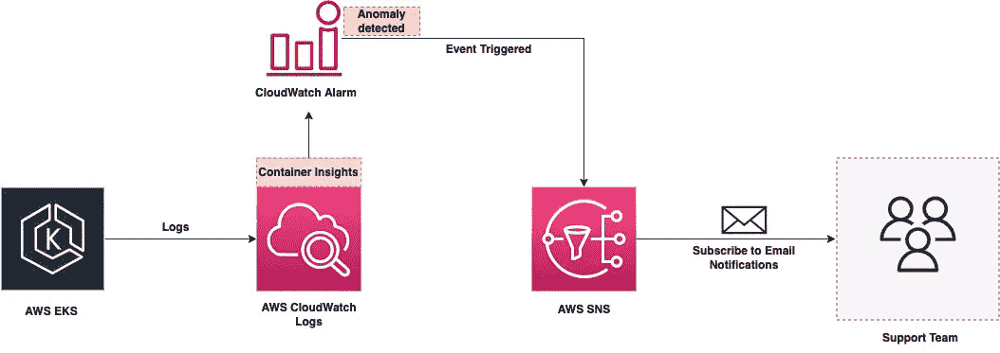

## 步骤 1:创建 EKS 集群

使用下面的集群配置创建一个名为**001-create-cluster . YAML**的 YAML 文件

```
apiVersion: eksctl.io/v1alpha5
kind: ClusterConfig
metadata:
  name: my-karpenter
  region: us-west-2
  version: '1.21'
managedNodeGroups:
  - instanceType: t3.medium
    amiFamily: AmazonLinux2
    name: my-karpenter-ng
    desiredCapacity: 1
    minSize: 1
    maxSize: 10
iam:
  withOIDC: true
```

运行命令创建群集。

```
eksctl create cluster -f 001-create-cluster.yaml
```

输出:

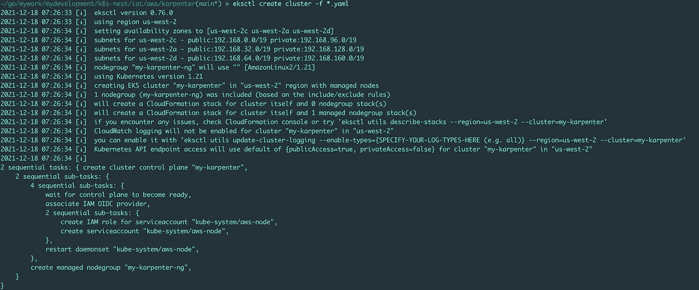

## 步骤 2:通过在本地终端上执行以下命令，在 EKS 集群中设置 Container Insights

```
ClusterName=my-karpenter
RegionName=us-west-2
FluentBitHttpPort='2020'
FluentBitReadFromHead='Off'[[ ${FluentBitReadFromHead} = 'On' ]] && FluentBitReadFromTail='Off'|| FluentBitReadFromTail='On'
[[ -z ${FluentBitHttpPort} ]] && FluentBitHttpServer='Off' || FluentBitHttpServer='On'curl https://raw.githubusercontent.com/aws-samples/amazon-cloudwatch-container-insights/latest/k8s-deployment-manifest-templates/deployment-mode/daemonset/container-insights-monitoring/quickstart/cwagent-fluent-bit-quickstart.yaml | sed 's/{{cluster_name}}/'${ClusterName}'/;s/{{region_name}}/'${RegionName}'/;s/{{http_server_toggle}}/"'${FluentBitHttpServer}'"/;s/{{http_server_port}}/"'${FluentBitHttpPort}'"/;s/{{read_from_head}}/"'${FluentBitReadFromHead}'"/;s/{{read_from_tail}}/"'${FluentBitReadFromTail}'"/' | kubectl apply -f -
```

请注意，您需要根据您的需求适当地传递 ClusterName 和 RegionName。在我的例子中，集群名和区域分别是' **my-karpenter** 和' **us-west-2** 。

输出:

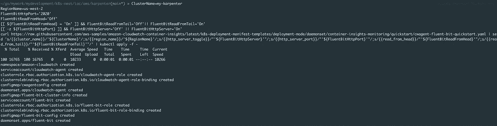

如果您尝试在名为 **amazon-cloudwatch** 的名称空间中获取守护进程集，那么您会看到新的 pods 作为 cloudwatch 代理和 fluent-bit 在那里运行

```
kubectl get ds -n amazon-cloudwatchNAME               DESIRED   CURRENT   READY   UP-TO-DATE   AVAILABLE   NODE SELECTOR   AGE
cloudwatch-agent   1         1         1       1            1           <none>          6m22s
fluent-bit         1         1         1       1            1           <none>          6m13s kubectl get po -n amazon-cloudwatchNAME                     READY   STATUS    RESTARTS   AGE
cloudwatch-agent-sgf9b   1/1     Running   0          4m5s
fluent-bit-bpmds         1/1     Running   0          3m56s
```

检查名为' **amazon-cloudwatch** '的名称空间中的 fluent-bit pod 的日志，查看是否有错误( **AccessDeniedException** )

```
kubectl logs fluent-bit-bpmds -n amazon-cloudwatch -f[2021/12/18 02:42:15] [ info] [output:cloudwatch_logs:cloudwatch_logs.0] Sent 17 events to CloudWatch
[2021/12/18 02:42:15] [ info] [engine] flush chunk '1-1639795323.399393566.flb' succeeded at retry 1: task_id=1, input=tail.1 > output=cloudwatch_logs.0
[2021/12/18 02:42:18] [ info] [output:cloudwatch_logs:cloudwatch_logs.0] Sent 10 events to CloudWatch
[2021/12/18 02:42:18] [ info] [output:cloudwatch_logs:cloudwatch_logs.1] Creating log group /aws/containerinsights/my-karpenter/dataplane
[2021/12/18 02:42:18] [ info] [output:cloudwatch_logs:cloudwatch_logs.1] Created log group /aws/containerinsights/my-karpenter/dataplane
[2021/12/18 02:42:18] [ info] [output:cloudwatch_logs:cloudwatch_logs.1] Creating log stream ip-192-168-61-230.us-west-2.compute.internal-dataplane.systemd.kubelet.service in log group /aws/containerinsights/my-karpenter/dataplane
[2021/12/18 02:42:18] [ info] [output:cloudwatch_logs:cloudwatch_logs.1] Created log stream ip-192-168-61-230.us-west-2.compute.internal-dataplane.systemd.kubelet.service
[2021/12/18 02:42:18] [ info] [output:cloudwatch_logs:cloudwatch_logs.1] Sent 1 events to CloudWatch
```

(注意:如果您得到了 AccessDeniedException，那么您需要确保与节点相关联的 IntanceRole 附加了策略( **CloudWatchFullAccess** )。在我的例子中，NodeInstance 角色名是[**eks CTL-my-kar penter-nodegroup-my-NodeInstanceRole-1282 vu8z 0 TG 2s**](https://us-west-2.console.aws.amazon.com/iam/home?region=us-east-1#roles/eksctl-my-karpenter-nodegroup-my-NodeInstanceRole-1282VU8Z0TG2S)，但它会因人而异。您可以通过访问 AWS 控制台上的 EC2 实例并参考附加到它的 IAM 角色来找到正确的角色名，如下所示:-

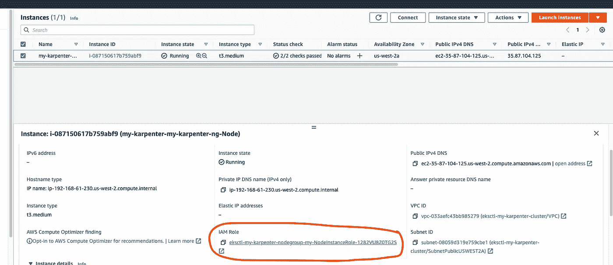

AWS EC2-IAM 角色

单击角色并将策略 **CloudWatchFullAccess** 添加到 IAM 角色部分下。

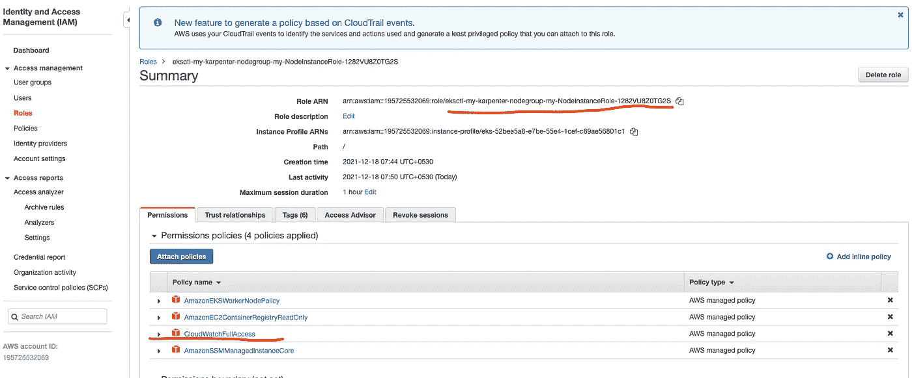

AWS IAM 角色

现在，前往 AWS 控制台-> CloudWatch -> Logs Groups，您将看到在那里创建了新的日志组

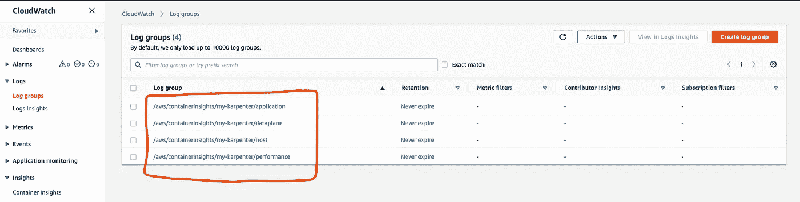

AWS 云观察—日志组

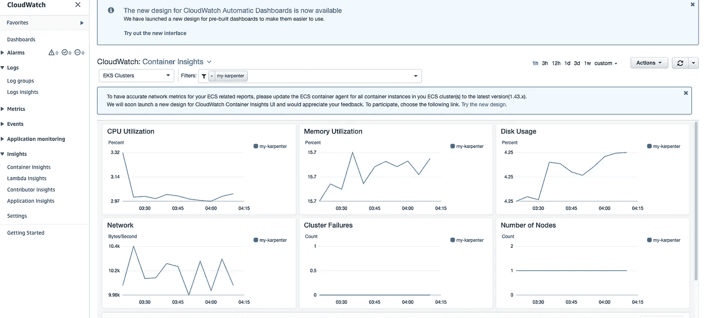

AWS CloudWatch —容器洞察

日志可能需要几分钟才能到达这里。

## 步骤 3:设置 CloudWatch 警报以检测异常情况:-

有多种指标可用于设置 CloudWatch 警报，如**cluster _ failed _ node _ count**、 **pod_cpu_utilization** 、**pod _ number _ of _ container _ restarts**等。完整的列表可以在 AWS 文档[页面](https://docs.aws.amazon.com/AmazonCloudWatch/latest/monitoring/Container-Insights-metrics-EKS.html)找到。在这篇博客中，我将演示如何使用名为**pod _ number _ of _ container _ restarts**的指标，通过计算容器重启的总数来检测 pod 是否有任何问题，然后向 **AWS SNS(简单通知服务)主题**发送电子邮件通知。

创建一个新的 CloudWatch 警报，其指标名称为**pod _ number _ of _ container _ restarts、**您适当的 Pod 名称(如果适用于您，在我的情况下是 **my-nginx** )、您适当的 EKS 集群名称等，静态阈值为 **2** ，这意味着如果总的容器重启次数超过此值，它将被通知 SNS Topic，后者最终会发送一封电子邮件。

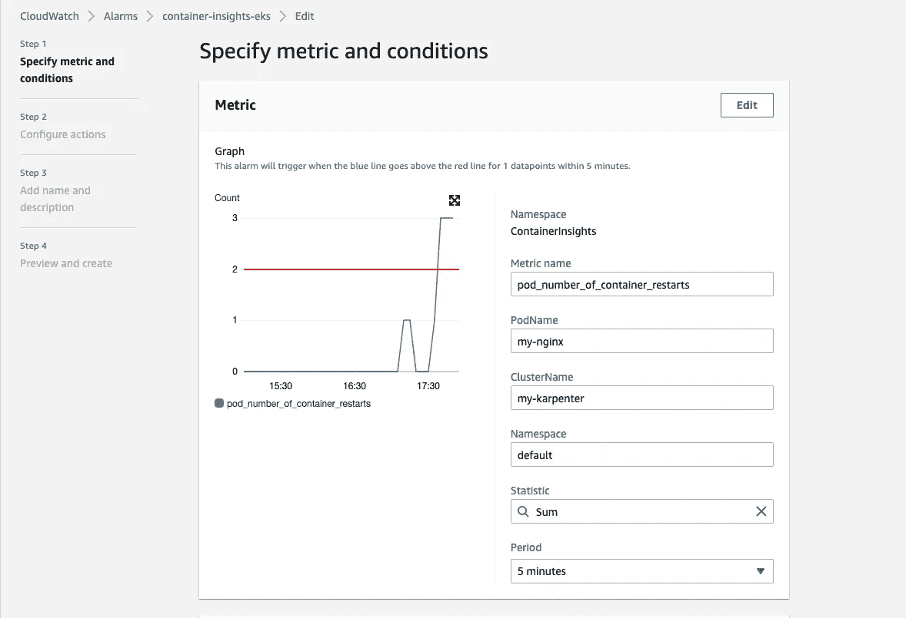

AWS CloudWatch 警报

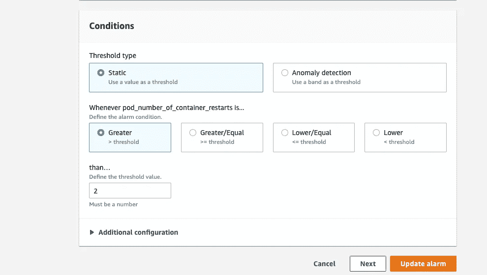

AWS CloudWatch 警报

瞧啊。！！现在都做完了。

## 测试:

要复制容器重启，您可以 **ssh** 到运行 Pod 的 worker 节点，然后识别它的容器 id 并停止它，这将通知 Kubernetes 服务器重启另一个容器，如下所示

```
sudo docker ps | grep <pod name>
sudo docker stop <container id>
```

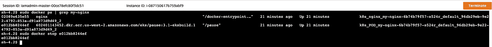

EKS 工人节点

它重新启动了容器，您可以通过在终端上运行以下命令进行验证:-

```
kubectl get poNAME                                               READY   STATUS    RESTARTS   AGE
my-nginx-6b74b79f57-s524r                          1/1     Running   3          13h
```

CloudWatch Alarm 现在处于 **in-alarm** 状态，我们也成功收到了邮件通知。

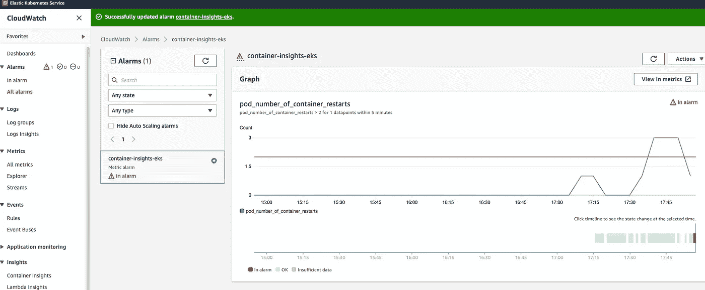

AWS CloudWatch 警报—处于警报状态

希望你喜欢这篇文章:-)

# 总结:

在这篇博客中，我们学习了如何使用 AWS CloudWatch Container Insights 从 AWS EKS 集群获取指标，并创建 CloudWatch Alarm 来检测异常情况，并通过 SNS 主题发送电子邮件通知。

像往常一样，完整的源代码可以在 GitHub 存储库中找到。请随意分享您自己的 IaC(基础设施代码)

[https://github . com/vinod 827/k8s-nest/tree/main/IAC/AWS/container-insight](https://github.com/vinod827/k8s-nest/tree/main/iac/aws/container-insights)s