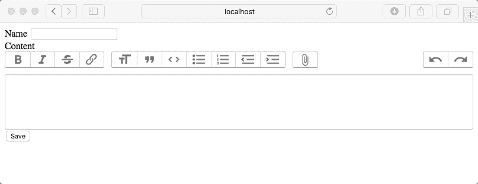

# trix——Rails 6 应用程序的丰富编辑器

> 原文：<https://levelup.gitconnected.com/trix-rich-editor-for-your-rails-6-application-7b89e2f33de8>


*   安装文本编辑器
*   向 ActiveRecord 添加新的文本内容
*   它在表单中的样子
*   保存内容

在本系列的第 1 部分中，我们讨论了 RESTful API 和令牌认证。我们将继续扩展我们的旅行规划应用程序。

[](https://medium.com/@billy.sf.cheng/a-rails-6-application-part-1-api-1ee5ccf7ed01) [## 在带有令牌认证的 Rails 6 应用程序中构建 Restful APIs

### 通过示例一步一步地在 Rails 6 中创建带有令牌认证的新 API。

medium.com](https://medium.com/@billy.sf.cheng/a-rails-6-application-part-1-api-1ee5ccf7ed01) 

# 安装文本编辑器

在 Rails 6 之前，如果我们要使用所见即所得编辑器，有很多选项，如 CKEditor 或 TinyMCE。现在在 Rails 6 中，它附带了由 Ruby on Rails 和 Basecamp 的开发者开发的 Trix 编辑器。

安装它非常简单，你运行`rails action_text:install`。一旦完成，你会看到

```
**$ rails action_text:install**
Copying actiontext.scss to app/assets/stylesheets
      **create**  app/assets/stylesheets/actiontext.scss
Copying fixtures to test/fixtures/action_text/rich_texts.yml
      **create**  test/fixtures/action_text/rich_texts.yml
Copying blob rendering partial to app/views/active_storage/blobs/_blob.html.erb
      **create**  app/views/active_storage/blobs/_blob.html.erb
Installing JavaScript dependencies
      **run**  yarn add trix@^1.0.0 @rails/actiontext@^6.0.1 from "."
**yarn add v1.19.0** [1/4] 🔍  Resolving packages...
[2/4] 🚚  Fetching packages...
[3/4] 🔗  Linking dependencies...
warning " > webpack-dev-server@3.9.0" has unmet peer dependency "webpack@^4.0.0".
warning "webpack-dev-server > webpack-dev-middleware@3.7.2" has unmet peer dependency "webpack@^4.0.0".
[4/4] 🔨  Building fresh packages...success Saved lockfile.
warning Your current version of Yarn is out of date. The latest version is "1.19.1", while you're on "1.19.0".
info To upgrade, run the following command:
$ brew upgrade yarn
success Saved 2 new dependencies.
info Direct dependencies
├─ @rails/actiontext@6.0.1
└─ trix@1.2.1
info All dependencies
├─ @rails/actiontext@6.0.1
└─ trix@1.2.1
✨  Done in 10.97s.
Adding trix to app/javascript/packs/application.js
      **append**  app/javascript/packs/application.js
Adding @rails/actiontext to app/javascript/packs/application.js
      **append**  app/javascript/packs/application.js
Copied migration 20191124011114_create_active_storage_tables.active_storage.rb from active_storage
Copied migration 20191124011115_create_action_text_tables.action_text.rb from action_text
```

# 在 ActiveRecord 中添加新的文本内容

让 ActiveRecord 使用 ActionText 很简单，只需添加`has_rich_text :content`即可。

```
**# app/models/trip.rb**
class Trip < ApplicationRecord
  has_rich_text :content
end
```

# 它在表单中的样子

当你表演`rails action_text:install`时，会有一个`actiontext.scss`为你而生。你必须在你的`application.css`档案中‘要求’这一点。

```
**# app/assets/stylesheets/application.scss**
//= require actiontext
```

在您的视图文件中，您包含一个`rich_text_area`，奇迹就会发生。

## 视角

```
**# app/views/trips/_form.html.erb** <%= form_with(model: trip) do |form| %>
  <div class="field">
    <%= form.label :name %>
    <%= form.text_field :name, class: "form-control" %>
  </div><div class="field">
    <%= form.label :content %>
    <%= form.rich_text_area :content %>
  </div>
  <div class="field">
    <button type="submit" class="btn btn-success">Save</button>
  </div>
<% end %>**# app/views/trip/news.html.erb**
<%= render partial: "form", locals: { trip: [@trip](http://twitter.com/trip) } %>
```

## 控制器

```
**# app/controllers/trips_controller.rb**
class TripsController < ApplicationController

  def new
    [@trip](http://twitter.com/trip) = Trip.new
  end

  def create
    trip = Trip.create! trip_params
    redirect_to trip
  end

  def show
    [@trip](http://twitter.com/trip) = Trip.find(params[:id])
  end

  private

  def trip_params
    params.require(:trip).permit(:name, :content)
  end

end
```

## 结果



特里克斯编辑器


如果你像我在例子中所做的那样附加图像，你也需要将`gem 'image_processing', '~> 1.0'`添加到你的 Gemfile 中。

# 保存内容


瞧，现在在你的应用程序中有一个富文本编辑器是非常简单和直接的。试试吧，我们下次再见！