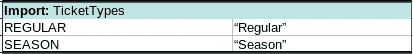

# trool:NodeJS/TypeScript 的电子表格规则引擎

> 原文：<https://levelup.gitconnected.com/trool-a-spreadsheet-rule-engine-for-nodejs-typescript-edcb05fca231>

从你的代码中去掉规则，这样非工程师也可以随时更新


Trool 让你的程序随时更新变得容易！

# Trool 简介

Trool 是一个简单的用于 NodeJS 的 npm 库，它允许你以电子表格的格式为你的程序创建规则。企业的工程时间可能会很昂贵:您希望将其保持在最低水平。问题是，随着时间的推移，根据业务需要，您的程序可能需要许多小的更新。每次需要做小改动的时候就找程序员是浪费钱。与其在代码中硬编码这些小的变化，为什么不把它们移到电子表格中，这样你或者你团队中的非工程师就可以快速地做出改变。

> 虽然 Trool 可以在 NodeJS 中直接与 JavaScript (ES5 或 ES6)一起使用，但所有文档都是 TypeScript 格式的，我们鼓励您使用这种格式。

# 链接

[](https://www.npmjs.com/package/trool) [## trool

### 用 TypeScript 编写的 NodeJS 规则引擎

www.npmjs.com](https://www.npmjs.com/package/trool) [](https://github.com/seanpmaxwell/trool) [## seanpmaxwell/Trool

### 用 TypeScript 编写的 NodeJS 的规则引擎。通过在…上创建帐户，为 seanpmaxwell/Trool 开发做出贡献

github.com](https://github.com/seanpmaxwell/trool) 

# 它是如何工作的

要使用 Trool，您只需创建要更新的类和电子表格，将它们传递给一个 Trool 方法，您将收到所有相同的对象，但根据您的规则进行了更新。电子表格的工作方式是检查所提供对象的属性，并根据满足条件的方式调用每个对象的方法。如果您想在整个电子表格的多个地方重用值，您可以创建 ***导入*** ，它们是简单的键/值对列表。导入可以在电子表格中硬编码，也可以通过 NodeJS 代码传递。这是一个电子表格的示例。


Trool 电子表格，用于根据游客年龄和团体规模设定门票价格

# 装置

```
$ npm install --save trool// the library includes the typings files so you don't need to install @types/trool
```

# 辅导的

## 设置 Trool

安装 Trool 后，在程序中导入并实例化它。您可以向构造函数传递一个布尔值，这取决于您是否希望 Trool 在运行时显示任何日志记录数据。您应该在开发期间打开它，在生产时关闭它。

```
import Trool from 'trool';

class PriceCalculator {

    private trool: Trool;

    constructor() {
        this.trool = new Trool(true);
    }
}
```

## 事实

要使用 Trool，您必须首先理解一个**事实**的概念。事实是需要更新的实例对象或实例对象数组。若要创建事实，请实现一个 TypeScript 类，并确保每个属性都有 getters 和 setters。如果你看上面截图中的单元格`2A`，可以看到单元格的内容是`**Table**: Visitors`。访问者是使用一组`Visitor`实例对象创建的。

创建了 TypeScript 类之后，必须将事实传递给事实持有者对象中的 Trool。事实持有者对象是一个 JSON 对象，键是电子表格中要访问的事实的名称，值是实例对象的数组。因此，使用`**Table**: Visitors`，我们需要设置一个事实持有者对象，将访问者作为键，将单个访问者或访问者数组作为值。

```
public calculate() { const factsHolder = {
        Visitors: [new Visitor(), new Visitor()]
    }
}
```

## 决策表

设置好事实后，打开 Excel、LibreOffice Calc 或您选择的其他电子表格工具。为了更新事实，我们需要建立一个**决策表**。决策表是一组操作(列)和规则(行)。如果规则通过，将调用操作来更新事实。如果事实是一个数组，决策表将遍历每个实例对象，并将其逻辑应用于每个值。

表格的第一个单元格指定了事实，它必须遵循精确的格式`**Table**: "Name of the fact"`，否则将会抛出错误。接下来创建至少一个**条件**列和一个**动作**列。如果所有条件都通过，将执行该操作。您实现的条件和操作的数量没有限制，但是您必须指定其中一个，并且所有条件必须在所有操作之前。

在决策表的第二行，为条件和动作创建操作。条件必须是布尔运算，格式为`factAttribute operator $param`。换句话说，`$param`必须在操作的右侧。操作左侧的属性可以是常规方法或 getter，但它必须是其中之一，并且存在于实例对象上。如果没有，Trool 将抛出一个错误。

动作是当所有条件评估为`true`时要触发的操作。该操作可以是事实上的 setter 或常规方法。如果使用常规方法，可以指定多个`$param`。

**规则**是要传递给条件和动作操作的值的列表。规则的第一个单元格必须指定规则名称，该名称可以是任何值，但不能为空。在决策表上，Trool 将遍历每个规则中的单元格，然后移动到下一个规则。单元格中的值将替换操作中的`$param`值，操作将执行。如果某个条件的单元格为空，它将自动计算为真。如果某个规则的所有条件都为真，则将执行具有该规则值的操作。但是，如果一个单元格是空，则动作操作将不会执行。单元格值必须是可以用比较运算符计算的值，强烈建议您坚持使用原语，不要使用对象作为值。

让我们看一个简单的决策表，它有 1 个条件、1 个动作和 2 个规则(*“设定价格—常规”*和*“设定价格—季节”*)。Trool 将遍历 Tickets 数组，首先查看`option`的 getter，并将其与每个规则的单元格值进行比较。在第一个规则(*设置价格-常规*)中，该表将查看每张票的`option`属性是否设置为*“常规”*。如果是，将调用`price`的设置器并设置值`70`。*“定价—常规”*结束后，表格进入*“定价—季节”*。


用于设置默认票价的决策表

感谢 Trool，如果您的机票价格定期变化或您希望在未来添加新的机票选项，您不必浪费宝贵的工程时间！

## 进口

假设有一个特定的值需要在多个表中使用，比如说，你需要字符串值总是以某种方式拼写。对于门票选项*“季节”*，你可能总是想确保它拼写为*季节*而不是*季节性*或其他什么。这就是进口派上用场的地方。通常，通过导入而不是直接使用字符串值来防止拼写错误是一个好主意。导入可以在电子表格中实现，也可以通过代码传递。对于较大的应用程序，您可能需要动态创建导入，并需要通过代码传递它们。对于简单的应用程序，建议您将导入保留在电子表格中。

要在电子表格中创建导入，从单元格`**Import:** “Import Name”`开始。接下来的行将作为键/值对添加到导入中，直到它到达一个空行、表或新导入。出于可读性的目的，您应该用空行将导入和决策表分开。

下面是一个包含 2 个键/值对的导入示例。对于这个导入，您可以说`TicketTypes.SEASON`，而不是为规则*“设置价格-季节”*做“季节”。



票证类型导入

如果您想通过代码传递导入，就像事实一样，它们必须通过 holder 对象来传递。该键必须是导入的名称和导入本身的值。对于我们刚刚在电子表格中进行的导入`TicketTypes`，下面是在代码中做同样事情的等效操作:

```
public calculate(): void { const factsHolder = {
        Visitors: [new Visitor(), new Visitor()]
    } const importsHolder = {
        TicketTypes: {
            REGULAR: 'Regular',
            SEASON: 'Season'
        }
    }
}
```

## 使用 Trool

一旦你完成了电子表格的设置，确保将其导出为*。csv* 文件。在 Trool 实例上，调用方法`applyRules(…)`，传递 csv 文件的路径、事实对象，以及您决定在代码中而不是在电子表格中创建的任何导入。这个方法是异步的，它返回一个包含相同事实持有者对象的承诺，但是所有事实都根据调用的操作更新。现在，NodeJS 程序可以继续使用它需要的所有更新值了。

```
public **async** calculate(): Promise<void> { const factsHolder = {
        Visitors: [new Visitor(), new Visitor()]
    } const importsHolder = {
        TicketTypes: {
            REGULAR: 'Regular',
            SEASON: 'Season'
        }
    } try {
        const csvFilePath = path.join(__dirname,'filename.csv'); const **updatedFacts** = **await** this.trool.applyRules( csvFilePath, factsHolder, importsHolder);

    } catch (err) {
        console.log(err.message);
    }
}
```

# 结论

希望 Trool 对你大有用处，并大大减少你的工程时间。使用 Trool 的规则比一篇文章中所能描述的要多。我强烈建议您通过上面发布的 GitHub 链接阅读自述文件，以避免在实现决策表时出现错误。

如果您觉得这篇文章/库有帮助，请启动 GitHub repo:)

[](https://gitconnected.com/learn/node-js) [## 学习 Node.js -最佳 Node.js 教程(2019) | gitconnected

### 前 33 个 Node.js 教程-免费学习 Node.js。课程由开发人员提交和投票，使您能够…

gitconnected.com](https://gitconnected.com/learn/node-js)