# CORS 错误故障排除

> 原文：<https://levelup.gitconnected.com/troubleshooting-cors-errors-67eaded865d1>

## 深入探究 Azure 中的设置如何 CORS 错误

[摄影张](https://unsplash.com/@asher_yj)在 [Unsplash](https://unsplash.com/photos/8JJ_sPcUaNA)

前几天，我在工作中遇到了一个需要解决的问题。我们的 web 应用程序无法向我们的 web 服务发出 HTTP 请求。

在网络选项卡中，您可以看到关于 CORS 的错误。除此之外，其中一个请求的响应代码是`Ip Forbidden`。

# 四个要求

当 web 应用程序在浏览器中加载时，它尝试向我们的 web 服务发出一个请求，这将产生以下四个请求:

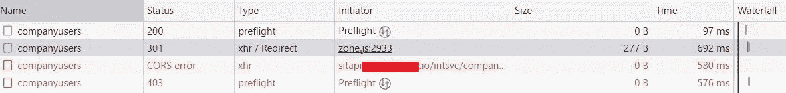

让我们看看为什么这里列出了四个请求。

## 第一个请求——飞行前请求

当我们的 web 应用加载时发生的第一件事是，浏览器试图向 Azure APIM 发出 GET 请求，后者又将请求转发给我们的 web 服务。

因为发送到 APIM 的请求包含非标准的报头，所以浏览器会进行飞行前检查，以确保 web 服务器能够识别 CORS。

正如您从下面的截图中看到的，飞行前请求是通过 APIM 处理的，它有一个 CORS 策略，允许任何来源/HTTP 动词/头。

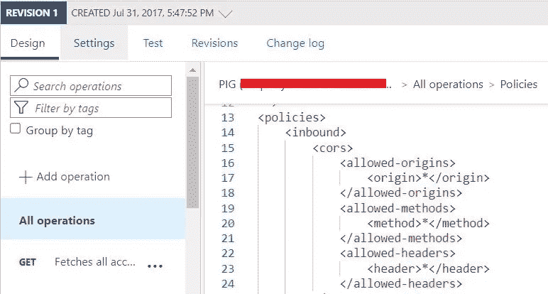

APIM 向浏览器返回一个带有适当访问控制头的 200 OK 响应，表示可以发送实际的 GET 请求。

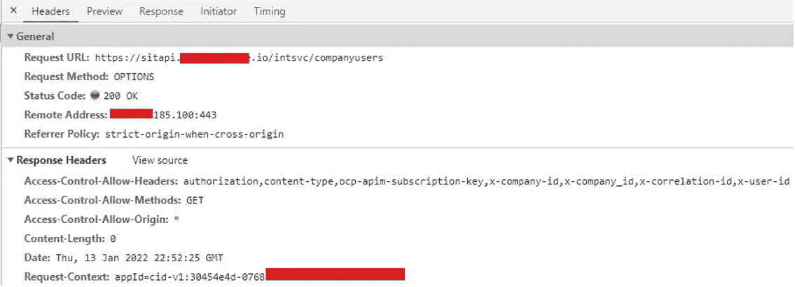

## 第二个请求— xhr/Redirect

由于之前成功的飞行前请求，浏览器现在可以发出原始请求。

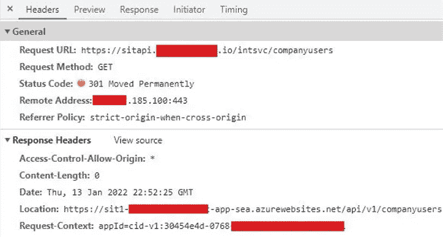

这个请求导致了一个`301 Moved Permanently`响应。

这是因为 web 服务 APIM 将请求转发到，使用 HTTP:

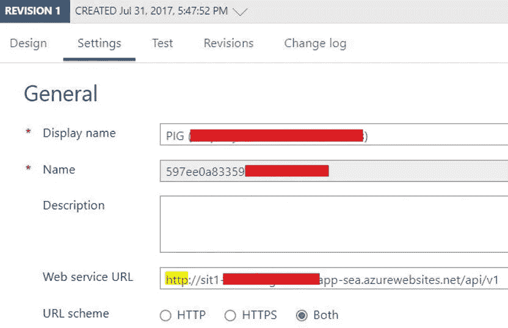

但是，web 服务被设置为只允许 HTTPS 请求:

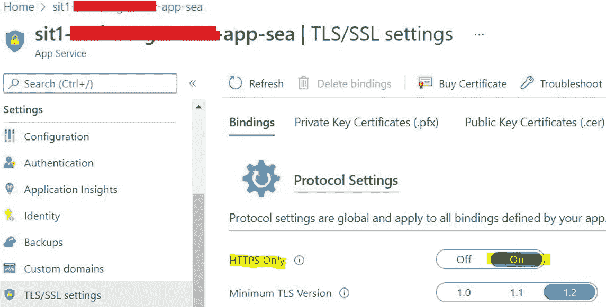

web 服务返回一个 301 给 APIM，APIM 将它转发给你的浏览器，告诉浏览器使用 HTTPS 版本的 URL。

## 第三个请求—飞行前请求

这在 Network 选项卡中被列为第四个请求，但实际上是要执行的第三个请求。

如果您查看第二个请求的屏幕截图中的响应头，您可以看到一个 Location，header，这是 web 服务的 URL，但是在开头是 HTTPS 而不是 HTTP。

就像之前飞往 APIM 的飞行前请求一样，该请求也是飞行前请求，因为它是非标准请求。

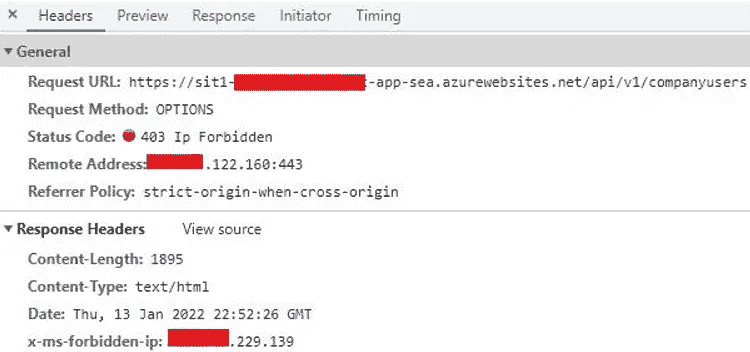

但是，响应代码是`403 Ip Forbidden`。

这是因为 web 服务在 Azure 中设置为限制 IP 地址:

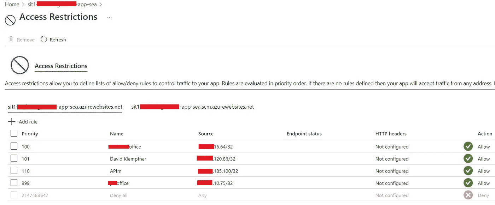

## 第四个请求— xhr (CORS 误差)

这在浏览器中被列为第三个请求，但并不是真正的请求，因为浏览器甚至没有发送这个请求。

如果 web 服务用 200 OK(和适当的访问控制头)而不是`Ip Forbidden`来响应，这就是应该发出的请求。

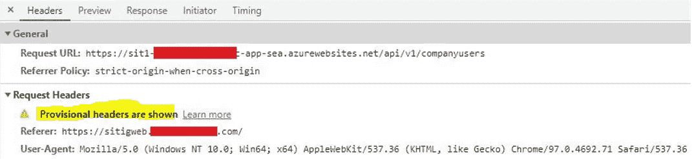

在这里，您可以看到“显示临时标题”。这意味着由于飞行前请求失败，浏览器无法发送请求。

# 怎么修

通过将 APIM 设置为使用 web 服务 URL 的 HTTPS 版本而不是 HTTP 版本，不存在 CORS/Ip 禁止的错误:

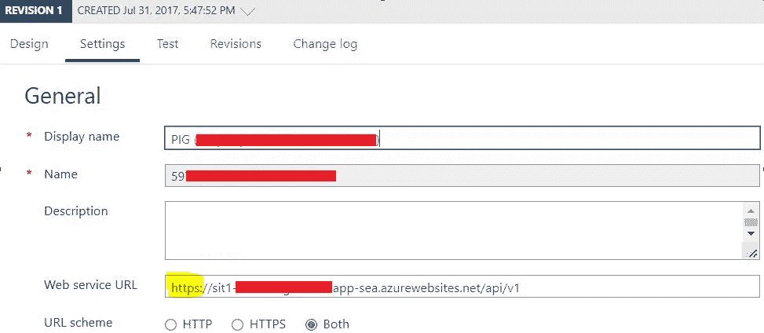

第一个飞行前请求的工作方式和之前一样:

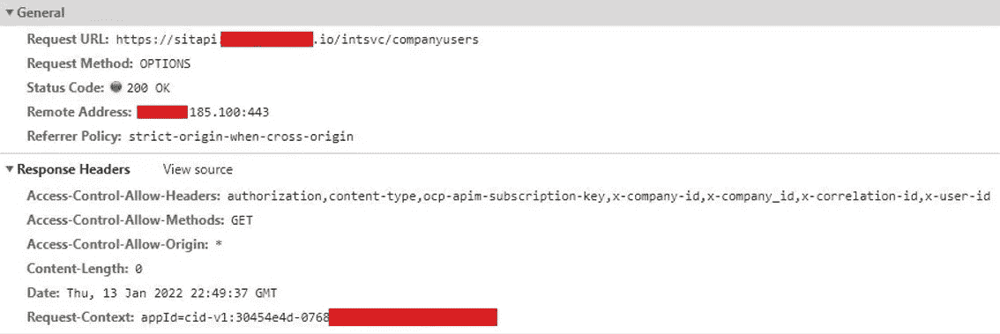

因为 APIM 调用 HTTPS 版本的 web 服务(它可以调用，因为它的 IP 不受限制)，所以不需要重定向。

请求成功，响应被发送到您的浏览器。

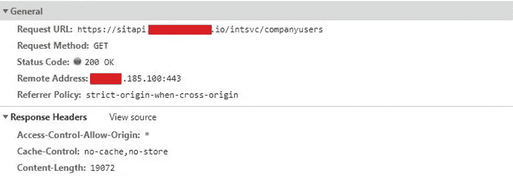

# 摘要

我希望这可以帮助你们中的一些人，他们在 Azure 上有类似的问题。

理解 Azure 是如何工作的，尤其是 IP 限制、APIM 和 CORS 是如何工作的，在调试失败的 HTTP 请求时会非常有帮助。