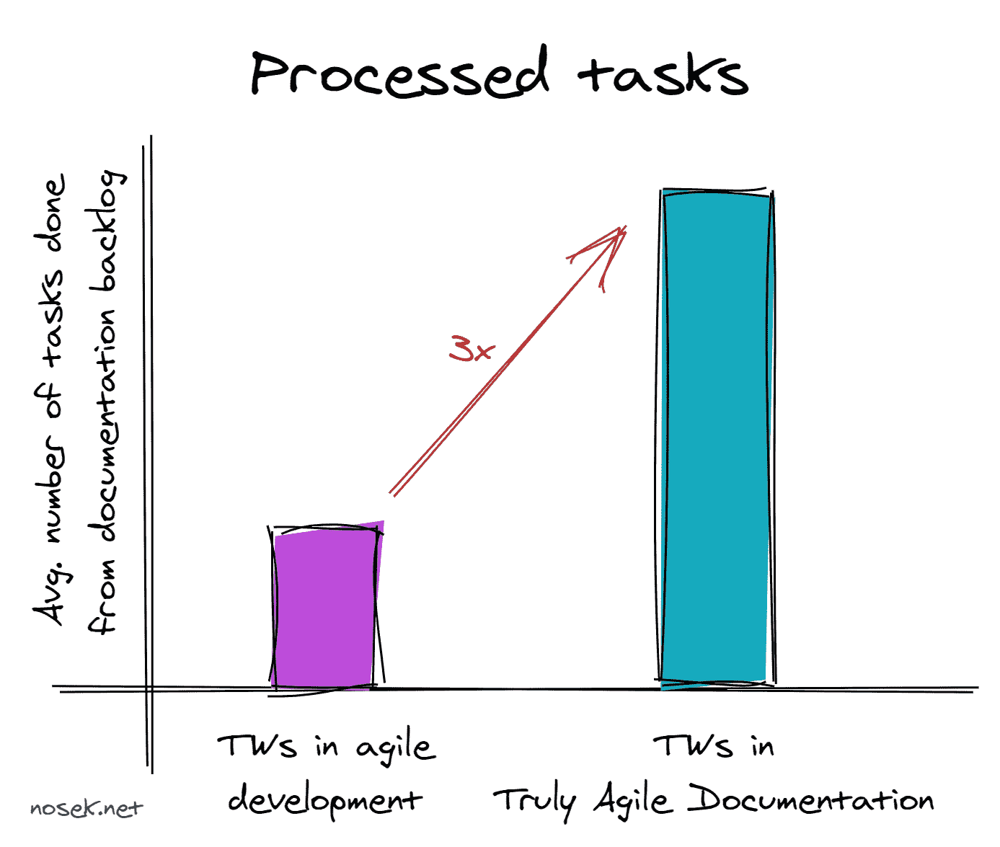

# 真正敏捷的文档:将文档与开发分开

> 原文：<https://levelup.gitconnected.com/truly-agile-documentation-separate-docs-from-development-e658bccc69b8>

文档团队的圣杯通常是从瀑布方法切换到敏捷方法。在 Scrum 团队中工作的开发团队的美丽土地，他们的技术作者在那里从事 sprint 任务。这的确是敏捷开发，但它是敏捷文档吗？在这一部分中，我将关注为什么关键是将文档从开发中解放出来。

# 我如何认识敏捷

七年前，我开始在软件(CMS)供应商 Kentico 工作。他们将瀑布方法转换为敏捷方法后没多久。Scrum 是被选中的敏捷框架。有几个十人左右的团队，代表了所有典型的敏捷角色。

> *如果要我给我们在敏捷开发下的表现打分，我会给 b，甚至 A。*

据我所知，相比其他公司，Kentico 一直拥有相对较多的技术作家。当我开始的时候，我们曾经有五个技术作者和八个开发团队的团队协调员。那是因为我们不只是写文件。我们也自己编写代码示例，维护我们的文档系统，帮助产品所有者编写用户故事，等等。

在大多数情况下，我们设法按时完成冲刺。是的，我们的文档水平和风格是不一样的，因为我们没有在技术作者之间进行太多的交流。但即便如此，我们还是随着时间的推移不断进步。

# 改进有用的东西？你疯了吗？

即使我们在敏捷开发中工作得很好，做了期望我们做的事情，我们的文档也可以改进。问题是我们只看到了我们工作的开发团队的范围。和他们坐在一起，和他们合作，和他们一起吃零食。在这样的环境中，接受内部开发人员的观点是很自然的。

> *我该如何评价我们对文档优先级的覆盖程度？嗯 C？*

虽然最初很微妙，但它们成了我们需要摆脱的负担。它们不会阻止你创建文档，但是会减慢你的速度，阻止你创建更多的东西。

我列举了十件在敏捷开发中对我们不利的事情。你可以在我以前的文章中读到它们:

*   在敏捷开发中写文档时最糟糕的 10 件事:第 1 部分
*   [在敏捷开发中写文档时最糟糕的 10 件事:第二部分](https://medium.com/@tom.nosek/10-things-that-suck-when-writing-documentation-in-agile-development-part-2-de130e6de154)

# 不就是敏捷做的很差吗？

我们确实做错了一些事情，当然，在我们前进的道路上也有错误。此外，敏捷不仅仅是 Scrum。在看板中工作，一些问题可以更容易地解决。但是这些问题并不是一开始就表现出来的。对于新产品来说，它们通常非常小，你甚至不会注意到它们。你在一个产品上工作的时间越长，它们就会慢慢扩大。直到他们已经是每天的面包，他们开始烦你。

> 敏捷开发不反对文档，但也不支持教育。

作为一名文档经理，我反复思考我们可以做得更好的地方。更多同步？技术作家的日常单口相声？额外任务的积压？当前流程的大多数改进都是成功的，但没有一个带来我所希望的变革。尤其是上面链接文章中提到的第十个问题——文档只是副产品——非常难以克服。最终，很明显，大多数约束是由敏捷开发过程带来的。

# 所以，瀑布比敏捷好，对吧？

在我继续之前，让我们停一会儿。我不仅在这里，而且在链接的文章中也对敏捷大加赞赏。但这并不意味着我不喜欢敏捷。对于产品开发来说，敏捷提供了更快地响应变化的能力。虽然看起来它给文档世界制造了一个混乱，但是它同样需要技术作者来适应这些变化。这是件好事。

作为技术作家，我们在这里教育我们的用户，帮助我们的公司完成它的使命。我们是来写应该写什么*的。作为技术作家，我们必须反对写长篇大论来写每一个小的边缘案例，或者写关于产品设计中的错误的文章。我们不是来写*能*写什么的。敏捷让你关注的远不止瀑布。*

> 如果你正处于瀑布阶段，尽你所能追求敏捷，这是一个进步。

虽然敏捷可能会导致你偶尔重写你以前写的东西，但是对于它所提供的东西来说，这是一个很低的价格。因为这不是一篇关于过渡到敏捷的文章，只有几点:

*   你将会现场记录一些东西，你将会成为开发过程的一部分。
*   当你问他们的时候，开发人员仍然会记得他们编码了什么。他们和你同时做这件事。
*   你可以做更多的活动。您将开始为 microcopy 做贡献，创建自己的工具，等等。看看我在开头写的关于我们一直在做的事情。
*   总的来说，你的工作量会更加均衡。
*   你将能够跨产品划分你的团队，更深入地了解产品。

由于产品开发受益于增量扩展的较小模块，文档也受益于创建较小的教程和参考资料。它们面向用例及场景，而不是那些可能已经完成但从未阅读过的文章。

所以，答案不是回到禁欲。答案是更加敏捷。

# 革命万岁！

除非我们将文档和开发分开，否则不可能有革命。幸运的是，在我们的案例中，正是开发部门自己考虑调整其开发过程的时候。他们想要更小、更敏捷的团队，只由开发人员组成。

事情就在那时发生了。我们创建了一个客户教育团队，所有的技术作者(我们称他们为内容开发者)作为一个团队一起工作，坐在一起，以同样的方式对待开发和所有其他任务。

# 转换在公司中的角色

从在开发团队中工作的个人，只是彼此同步，我们已经改变了。我们现在运行我们自己的敏捷团队，使用改进的 Scrum。作为一名文档经理(我们称我的职位为客户教育主管)，我既是产品经理又是 Scrum 大师。尽管如此，我还是试图分散和轮换团队的许多职责，以实现自给自足。

我们不仅从开发团队中分离出来，还从开发部门中分离出来。我们现在定位于客户成功。这让我们离客户更近，离内部视角更远。

由于我们仍然需要通过发布新特性来履行我们对开发(和其他部门)的“支持责任”,我们使用一周冲刺来代替通常的两周。这给了我们快速调整优先级的能力。我们最初开始使用两周冲刺，但随着临时请求的出现，它变得很麻烦，并且它们通常伴随着一个紧迫的截止日期。

> 一周冲刺让你变得敏捷，即使是在你的敏捷开发中。

尽管这无疑恶化了开发者和技术作者之间的关系，但他们并没有破裂。直到今天，这种关系仍然和 Devs 认识的技术作家保持着良好的关系。在我们完成转换后加入的新技术作家没有达到同样的水平，但他们的关系仍然不错。

# 时间越来越长

在我们转行后，我们开始思考我们能做些什么来用我们创造的产品支持公司。因为文档也是一种产品。

自从我们在大约两年前与开发团队分离以来，我们设法及时交付了产品品牌重塑和重新设计的一切，监督了我们自己的文档系统、我们全新的电子学习(包括内容、门户和视频创作)的构建，并建立了一个紧密的团队，在这个团队中，每个人都可以相互依赖。

随着每个项目的进行，我们的极限向前推进，我们变得更好。如果我们仍然是开发团队的一部分，我无法想象我们会用一个功能性的门户来创建整个电子学习组合。

技术作家的工作是多样化的，这也是我喜欢做技术作家的原因之一。但是随着我们获得的新时间，多样性、学习和可能性成倍增加。即使对作为团队经理的我来说，这也不仅仅是协调和人员管理的问题。我可以推动有助于我们的客户、公司，最终也有助于我们个人的项目。

# 这还没有结束

我不知道为什么，但我总是在一篇相当长的文章中选择一个太大的话题来讨论。尽管很多技术作家，包括我的同事，对非洲慈鲷的关注时间很长(很明显，很长)，我将在下一章继续我们的工作流程和工作方式。

感谢您阅读这篇文章。如果你想在我发布新内容时得到通知，请在 [Twitter](https://twitter.com/tomnosek) 、 [LinkedIn](https://www.linkedin.com/in/tomasnosek/) 上关注我，或者将[我的 RSS 订阅源](http://nosek.net/rss/)添加到你的阅读器中。