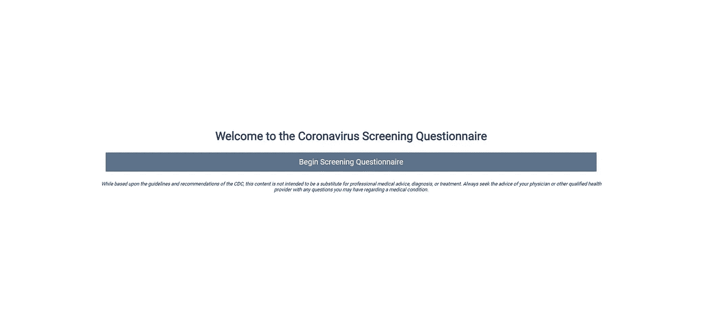
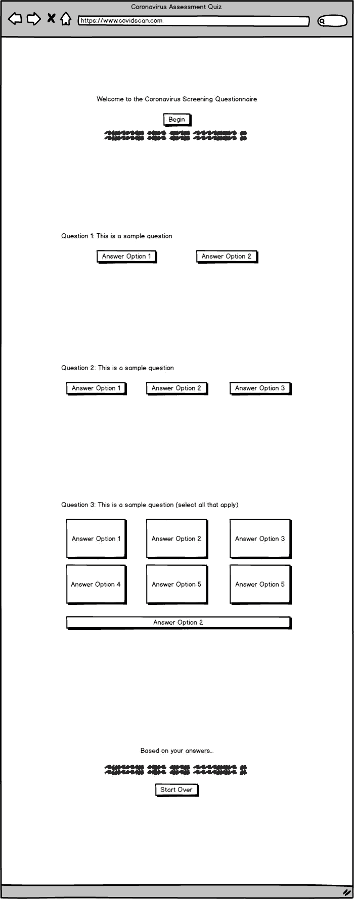
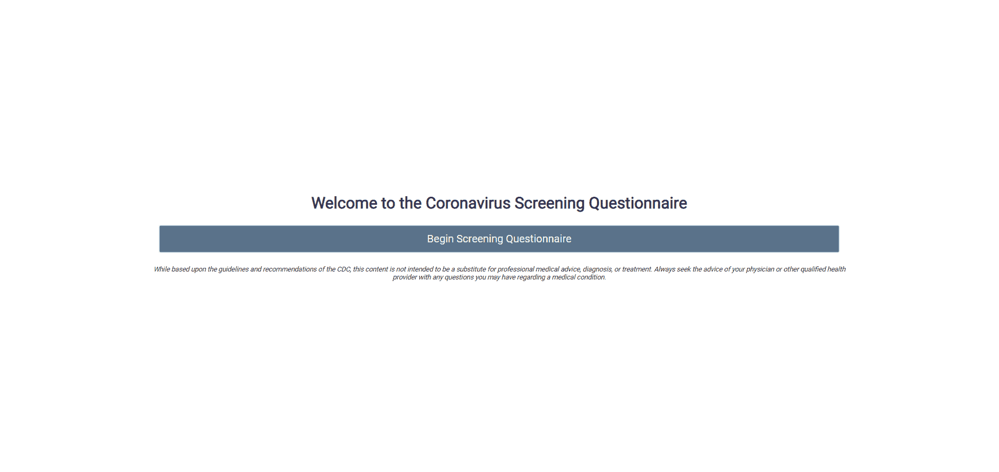

# 特朗普表示，1700 名谷歌工程师将建立一个冠状病毒评估网站。我在 24 小时内建成了它。

> 原文：<https://levelup.gitconnected.com/trump-said-1700-google-engineers-are-building-a-coronavirus-assessment-tool-i-built-it-in-24-hours-79342d6abe6e>

## 美国总统川普 [*上周表示*](https://www.factcheck.org/2020/03/trump-misrepresents-google-coronavirus-website/) *谷歌正在与美国政府合作建立一个网站，帮助人们决定他们是否需要接受新冠肺炎病毒测试，并且“谷歌目前有 1700 名工程师在从事这项工作。”*

## 我在 24 小时内建立了一个简单的网站。

我建立的冠状病毒评估网站主页:covidscan.com

# 动机

我在建立这个项目时有两个主要动机:

1.  我想看看在这种情况下，考虑到时间的价值，构建这样一个评估工具会有多复杂。当然，我并没有试图构建一个可以被 5 亿多人使用的东西，但是它可以作为一个概念的证明。
2.  考虑到正在分发的社交距离处方，我手头有了更多的额外时间，并希望以一种富有成效的方式来度过这些额外时间

基于这些动机，我想尽可能快地建立这个网站，使用低开销的技术栈。这个想法本身很简单，所以我决定使用普通的 HTML、CSS 和 JavaScript。对于部署，我决定使用 Netlify 的可信服务。我认为这个网站足够轻量级，并且考虑到 Netlify 的免费层(允许高达 100GB 的带宽/月)，它将是完美的选择。现在来说说设计。

# 设计

网站的模型

我想创建一个最小的、切中要点的、对老年人和年轻人都容易使用的网站。我认为最好是以单个问卷的形式创建一个单页的应用程序，可以在 30 秒内完成。参与者将被要求输入尽可能少的信息，但仍能得到有用的评估。

在经历了几次设计迭代之后，我决定使用按钮和复选框的组合来尽可能无缝地获取所有数据。设计可以在这里看到。

如你所见，我非常重视让用户体验尽可能的流畅。按钮将用于回答多项选择问题，而复选框允许用户选择适用于他们的多个答案。这些因素的结合将使网站能够捕捉到所有的个人状况、健康因素和症状，从而做出评估。

此外，我决定坚持使用简单的单页布局，因为这将最小化老用户的困惑，并使整个体验尽可能简单。

用户在开始调查问卷之前，一进入页面就会看到免责声明。这是一个预防措施，尽管网站上没有任何医疗建议。有了健康相关的网站，一个人永远不会太安全。

# 执行

构建实际的网站前端相当简单。我使用 HTML 表单为每个问题创建单独的表单。我之所以选择创建多个表单，而不是一个表单，是因为它允许我用一个问题创建一个非常简单的网站，并快速地进行端到端开发。这使我能够迭代地构建，并尽可能快地在市场上获得最小的可行产品，同时仍然能够在没有任何停机时间的情况下添加功能。

> 这使我能够迭代地构建，并尽可能快地在市场上获得最小的可行产品，同时仍然能够在没有任何停机时间的情况下添加功能

对于后端，我决定利用一个简单的谷歌表来模拟一个数据库。网站不会捕获太多数据，因此建立和运行数据库所需的时间和资源是不必要的。我想对[大卫·麦考伊](https://medium.com/u/4a2d079fd895?source=post_page-----79342d6abe6e--------------------------------)的精彩文章大声欢呼，这篇文章清晰地概述了[如何建立一个谷歌表单来从静态网站](https://medium.com/@dmccoy/how-to-submit-an-html-form-to-google-sheets-without-google-forms-b833952cc175)获取数据。对于我的用例，我只需要对他的教程做一些小的修改，但是由于像 David 这样的聪明人提供了大量的指南，整个过程变得简单多了。

简而言之，我的数据管道由 3 个简单的步骤组成:

1.  用户回答问题
2.  后端 JavaScript 阻止默认提交，而是将问题(及其答案)添加到一个 JS 对象中
3.  重复步骤 1 和 2，直到用户回答了所有问题。完成后，后端 JS 使用 AJAX 提交一个请求，将信息存储在 Google Sheet 中

鉴于整个项目设计的简单性，我没花多长时间就建立并运行了网站！

# 结果

你可以去 www.covidscan.com[的](http://www.covidscan.com)查看实际的网站。你也可以在下面看到最终网站的演示。

最终产品的工作演示

正如承诺的那样，该网站保持了极小的规模，易于使用，并在 24 小时内部署完毕。我用 Netlify 直接通过[项目 Github](https://github.com/hr23232323/corona-test) 免费部署网站。我还用 Google Domains 花 12 美元购买了域名“covidscan.com”。请随意与你的朋友和家人分享这个链接，他们觉得自己有这些症状。该评估完全基于[疾病预防控制中心的指导方针](https://www.cdc.gov/coronavirus/2019-ncov/symptoms-testing/symptoms.html)，是一种有助于减轻医护人员负担的方法。

我希望你喜欢读这篇文章，就像我喜欢把它放在一起一样。如果您有任何问题、反馈或意见，请随时通过 [LinkedIn](https://www.linkedin.com/in/harshrana1997/) 或我的[网站](http://www.harshrana.com/)与我联系。总的来说，这是一个非常令人满意的方法，在这个疯狂的时代，利用国家规定的额外的社交距离时间，所以请留意我的更多这样的项目。

每个人都要保持安全，继续创造酷的东西。