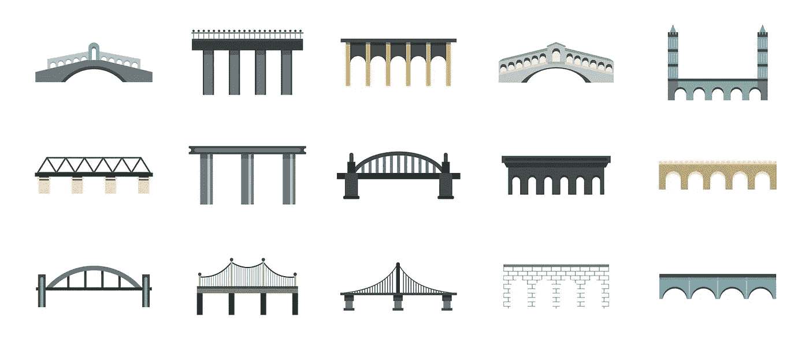

# { SOAP vs REST vs GRPC vs GraphQL }清单的真相

> 原文：<https://levelup.gitconnected.com/truth-about-soap-vs-rest-vs-grpc-vs-graphql-checklist-f50bcb475adf>

**简介**

随着比较的进行，这似乎有点奇怪。虽然前两个是通用的竞争“标准”，但这两个不同的标准具有某种独特的范围。
他们的共同点是经常出现的统计操纵的概念。它们中的每一个都允许外部实体在一定限度内访问您的信息。

**肥皂**

“简单对象访问协议”(虽然这个意思已经被遗忘了，因为它很简单)是我大学里最古老也是最忌讳的文件访问机器。它通过 HTTP 传递 XML 内容的使用(大多数时候，然而，遍历不是时尚**，**的一部分，所以它应该在任何东西上使用)用于通过服务调用检测标准的特定目的。
这迫使提供者描述可用的程序、它们的参数和类型、正文格式、响应等。、和对象。我敢打赌，你一定看到了简单在很久以前就消失了。

**优点**

*   SOAP 批准了主要基于 XML 的代码技术，XML 是众所周知的，并且无处不在，具有很大的灵活性(例如，名称空间)。
*   因为它是基于文本的，所以调试很方便，并且对传输没有限制。由于这些方法是在 WSDL 中描述的，因此该文件充当赞赏消息和类型的绑定契约。

**缺点**

*   XML 非常冗长，对消息的度量往往呈指数级增长。SOAP 必然是单向的(因为客户机不能添加服务器，反之亦然，即使每个功能都可以充当网络服务器)。
*   当前语言对代码技术的支持很少(你的首选是 Java、Python 和 C#，而带有 Go/Rust/PHP/Elixir 的 SOAP 是令人失望的训练例程)**。**
*   总的来说，**，** SOAP 仍然在支持更灵活、更环保的口头交流技术(尽管在一些保险和银行工作之后，我的噩梦又回来了)。排)。

**休息**

*   当有人说**“**Web API”时，大多数人可能会假设这是代表性转换。事实上，这是众所周知的，当有人说“API”时，它就是人类使用的元素，更不用说网络(或 HTTP)部分了。
*   作为一个标准，它是极其轻量级的，因为它指定了专门使用 HTTP 和 HTTP 标准(动词、代码、状态等。)
*   这导致了许多围绕REST 的最佳实践场景，处理非 dit:如何描述和排序 URIs，将操纵的统计限制到某个 URI，如何封装数据，如何返回以及返回什么，等等。
*   REST 提供的另一个重要特性是无状态性:请求之间没有上下文，每个请求都被单独处理，并且必须有自己的**目的。**
*   虽然 JSON 是 REST 数据最常见的内容类型，但是 XML 已经不是什么的谜了，HTML 本身就有了。

**优点**

基于现有的 HTTP 请求，它具有所有的灵活性和限制。大多数流量问题都是通过使用当前需求并随其发展而解决的。与交易相关的动词(例如，简化 CRUD 交易的映射)，证券借贷实体，以及这对 URIs 意味着什么。简单的约定使得与 REST API 的交互相当简单。JSON 使得 REST 特别容易用于前端服务，在前端服务中，JS 普遍存在于记录到对象的即时转换中。此外，JSON 可读性很强，对于调试也很有用。

**缺点**

实际上，REST 服务几乎从未接近预期。当检测到的实体与统计层中建模的信息相匹配时(提示:不要透露事实)，使用哪些动词有无数的争论。那种细节，用 DTO 赢。).灵活性经常导致实现混乱，最重要的是，在用于消息的形式上没有绑定契约。我的一个国内小偷是当一个人仍然返回一个 HTTP 200 响应，并进而将错误的感觉编码到响应体中。

**GRPC**

*   gRPC 是来自 Google 的现代轻量级通信协议。…它是一个递归缩写，代表 grpc 远程过程调用。gRPC 起源于 2015 年的 Google。它基于一个名为 Stubby 的谷歌内部项目，这是一个 gRPC 的内部框架，但只针对谷歌服务。
*   gRPC 是一个现代的、开源的远程过程调用(RPC)框架，可以在任何地方运行。它使客户机和服务器应用程序能够透明地通信，并使构建连接的系统变得更加容易。

**优点**

非常有效。它利用了 HTTP/2 所提供的一切，因此您可以同步发送问题(等待响应)，可以广播，可以多路传输，所有这些都在同一个连接上进行。加上二进制消息非常小的事实，对于整体性能至关重要的情况，您有很多好处。代码时代使它变得更容易，而 HTTP/2 需要 TLS，所以您在一些压力下需要最低限度的安全性。

**缺点**

难以调试，因为消息是二进制的，现在人类无法阅读。虽然它在所有语言中都受支持，但仍有一些障碍(例如，没有 PHP gRPC 服务器，只有一个客户端),并且由于 HTTP / 2 的性质，该应用程序的用户界面中可能没有任何帮助(目前)。因为您应该(而且应该)在任何地方都有 TLS，所以您可能希望安装一个基本组件(无论是从可信 CA 获得内部使用的证书，还是开发一个 CA)来解决您自己的内部证书问题，但是，您可能希望在整个基础结构/容器等中将其添加为可信组件。

**图表 QL**

GraphQL 允许您在单个查询中查询您想要的内容，从而节省带宽并减少瀑布请求。它还使客户能够请求他们自己独特的数据规范。API 开发人员使用 GraphQL 创建一个模式来描述客户端可以通过该服务查询的所有可能的数据。GraphQL 模式由对象类型组成，对象类型定义了您可以请求哪种对象以及它拥有哪些字段。当查询进来时，GraphQL 根据模式验证查询。

**优点**

它对 JSON 的依赖使它成为非常强大的 REST，但是通过引入自适应查询功能的优势，您可以以自己喜欢的方式请求您想要的统计信息= >不，要获得您需要的一切，需要的条件不止一个。它有模式验证和输入，所以这个测试非常接近 gRPC 如何定义事物。

**缺点**

所有的灵活性都会影响缓存的潜力。几乎没有 GraphQL 查询可以与委托缓存相比。尽管有这个名字，但它不再是一个设计精美的界面。例如，你不能得到一个守护实体的所有祖先。

感谢您的阅读，请在评论区告诉我您的问题、想法或反馈。感谢您的反馈和鼓励。

继续学习！