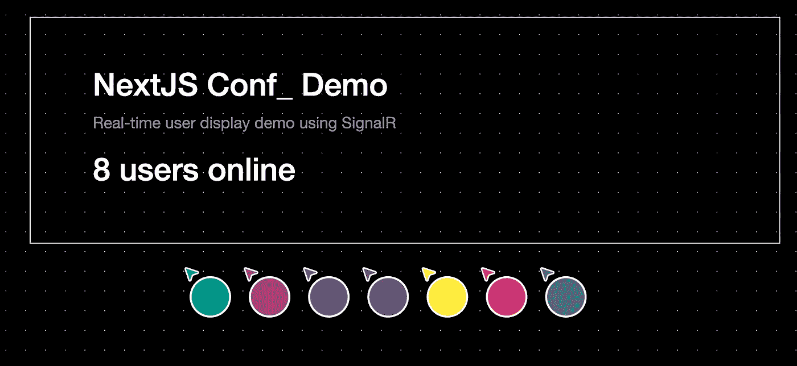
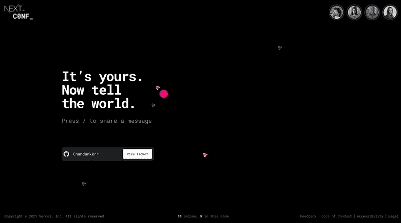
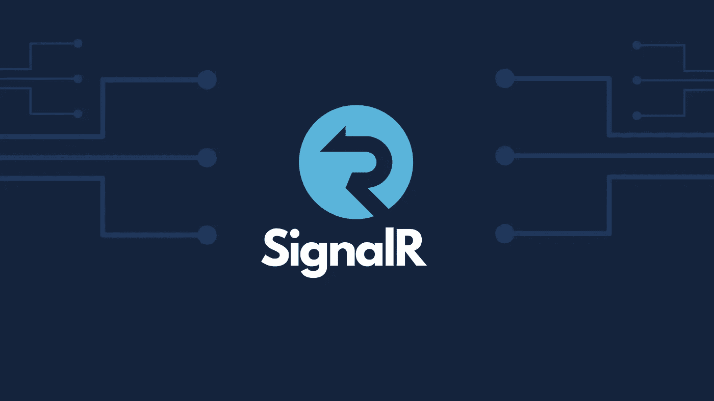

# 使用 SignalR 和 Blazor 的实时用户交互

> 原文：<https://levelup.gitconnected.com/trying-out-signalr-22948e809618>

## *dotnet 新 blazorserver*

L 上周 NextJS Conf 开放注册(如果你还没有注册的话，请注册)。该网站有一个有趣的元素，访问该网站的用户可以看到其他用户，并可以与其他人实时共享消息。我认为这是对常规注册页面的一个很好的补充。

[https://nextjs.org/conf](https://nextjs.org/conf)

我知道 SignalR 及其实时功能，但从未真正尝试过。我想尝试看看是否可以使用 ASP.NET 核心信号构建类似于 NextJS Conf 网站的东西。

# 关于 SignalR 的一点信息

> SignalR 是微软 ASP.NET 的免费开源软件库，允许服务器代码向客户端 web 应用程序发送异步通知。ASP.NET 核心信号是一个开源库，它简化了向应用程序添加实时网络功能。实时 web 功能使服务器端代码能够将内容即时推送到客户端。

SignalR 可用于:

*   需要频繁更新用户界面的应用，如游戏、仪表盘和监控应用
*   白板等协作应用
*   需要通知的应用程序。社交网络、电子邮件、聊天、游戏、旅行提醒和许多其他应用程序都使用通知

ASP.NET 核心 can 的信号装置:

*   自动管理连接
*   同时向所有连接的客户端发送消息
*   向特定客户端或客户端组发送消息
*   扩展以处理不断增长的流量

你可以在微软的网站上了解更多关于 SignalR 的信息

 [## 使用 SignalR |的实时 ASP.NET。网

### 你可以自己托管 SignalR 应用，或者使用 Azure SignalR 服务作为完全托管的平台。Azure SignalR 服务…

dotnet.microsoft.com](https://dotnet.microsoft.com/apps/aspnet/signalr) 

# 让我们看看代码

## 服务器端

在服务器端，我有一个简单的`ClientHub`类，它继承自 SignalR 的基本 Hub 类。SignalR 使用`hubs`在客户端和服务器之间进行通信。集线器是一个高级管道，它允许客户端和服务器相互调用方法。SignalR 自动处理跨机器边界的分派，允许客户端调用服务器上的方法，反之亦然。集线器通过发送包含客户端方法的名称和参数的消息来调用客户端代码。作为方法参数发送的对象使用配置的协议进行反序列化。客户端尝试将该名称与客户端代码中的方法进行匹配。当客户端找到匹配项时，它调用方法并传递反序列化的参数数据。

在`ClientHub`类中，我有`SendMessage`方法和基类中被覆盖的几个方法。被调用的`SendMessage`方法将向所有连接的客户端发送消息，传递的是数据。我还有一个静态类`ConnectedClients`和一个静态属性`ConnectedClientIds`。当新客户端加入时，它们的 id 会被添加到`ConnectedClientIds`列表中，当客户端断开连接时，它们的 id 会从列表中删除。这是为了让我可以跟踪连接的客户端，并使用他们的 id 来更新他们在应用程序中的光标位置。

当新用户访问网站时，`OnConnectedAsync`方法被调用，`UserConnected`和`LoadAllConnectedUsers`消息被发送到所有连接的客户端。类似地，当一个客户端断开连接时，`userDisconnected`消息被发送到所有客户端，之后用户的光标元素被从客户端移除。

# 客户端

在客户端，我有一个标准的 razor 文件，包含基本的 HTML 和 c#代码。在组件被初始化之后，一个新的`HubConnection`被创建，并且客户机被连接到服务器。还设置了由服务器发布的特定类型消息的监听器，如`ReceiveMessage`、`UserConnected`、`UserDisconnected`和`LoadAllConnectedUsers`。在`index.html`页面上，我们定义了 JavaScript 函数，当客户端收到不同类型的消息时将调用这些函数。

`hubConnection.On`扩展方法注册一个处理程序，当调用指定名称的 hub 方法时，该处理程序将被调用。一旦接收到特定的消息，就会执行相应的处理程序代码。当客户端收到`UserConnected`或`UserDisconnected`消息时，处理程序将调用定义在窗口对象上的 JavaScript 函数`nextjs.onUserConnected`或`nextjs.onUserDisconnected`。一旦开始连接到服务器，就会调用`nextjs.addMouseEventListener`函数来注册`mousemove`事件监听器。

`nextjs.addMouseEventListener`在`mousemove`事件上设置一个事件监听器。当这个事件发生时，它捕获用户光标的`clientX` 和 `clientY`值，最后调用传入数据的`c#` `CaptureMouseEvents`方法。

`CaptureMouseEvents`方法将传入的数据反序列化为一个`Cursor`记录类型，然后调用 func，func 调用`SendMouseEvents`,从这里使用指定的名称和参数调用服务器上的 hub 方法。

`SendMessage`方法是在我们的`ClientHub`中定义的，它向所有连接的客户端发送消息，并传入`connectionId`、`x`和`y`值。

当客户端收到这个消息时，它调用传入数据的`updateCursor` JS 函数来更新连接的用户的光标位置。

`updateCursor`方法简单地获取 id 等于`connectionId`的光标元素，并通过应用转换来更新元素

下面是该应用程序在多个客户端(浏览器窗口)中运行的短片。当在新窗口中打开页面时，将建立从客户端到 SignalR hub 的新连接。所有连接的客户端都会收到此消息，新的光标元素会添加到 DOM 中。

你可以通过下面的链接查看这个网站

 [## NextJS 会议信号演示

### 使用 blazor 和 SignalR 的实时用户交互

nextjsconf-server.azurewebsites.net](https://nextjsconf-server.azurewebsites.net/)