# 试用 Docker Hub CLI 工具

> 原文：<https://levelup.gitconnected.com/trying-out-the-docker-hub-cli-tool-e33c56d289b3>

## 还在实验阶段…


阿伦·伊金在 [Unsplash](https://unsplash.com?utm_source=medium&utm_medium=referral) 上的照片

从我以前的文章中，您可能会得出这样的结论:我更喜欢尽可能使用命令行界面。不可否认，有时候我会更加努力地使用命令行。其中一个例子是我的 R 入门文章，在这篇文章中，我们使用 Visual Studio 代码和终端来运行 R 脚本。使用 RStudio 之类的东西会容易得多，我们对图形就是这样做的，但偶尔学习一点命令行也没什么错。

如果你是 Docker 新手或者需要复习，这是一个集装箱工具。容器的目标是“分而治之”概念的一种形式。通常，您只需使用独立的界面。但是，我发现 Docker 也支持命令行界面。很难找到任何关于它的文件。事实上，几乎没有。考虑到这一点，我想我应该摆弄一下这些命令，并记下我的发现，希望将来有人会发现它们有用。重要的是，Hub-Tool 在他的时间点上更具实验性，但仍然值得一看。

# **安装 Docker 轮毂工具**

在开始之前，我们需要安装 hub-tool。这是假设你已经有一个 Docker 帐户，并且安装了 Docker。导航到 Github 获取 hub 工具[下载](https://github.com/docker/hub-tool/releases):

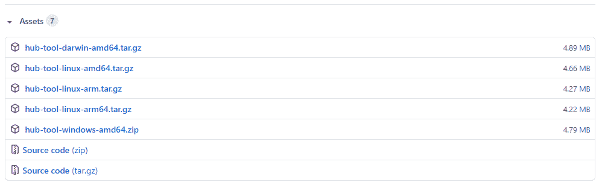

中枢工具下载页面。

为您的系统下载软件包。在我的例子中，它是用于 Linux 的 amd64。下载完成后，解压缩 tar 文件。现在它已经解压缩了，我们可以通过命令行导航到该目录。在“hub-tool”目录中，我们可以运行帮助来查看我们的选项。

```
./hub-tool --help
```

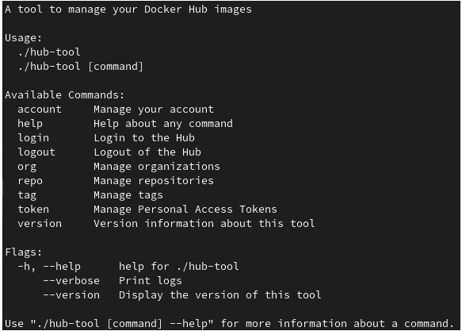

列出命令。

注意，在其他地方开始之前，我们需要登录我们的 Docker 帐户。运行其他命令将会抛出一个要求帐户的错误。我们可以通过以下方式登录:

```
./hub-tool login
```


登录中。

现在，我们可以深入了解每个选项。获取有关帐户的信息，如所有者姓名、计划、限额、加入日期等。，请使用以下命令:

```
./hub-tool account info
```

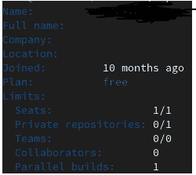

账户信息。

有关帐户的限速信息，请使用以下内容:

```
./hub-tool account rate-limiting
```

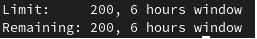

限速的。

列表中的下一项是我们之前使用过的帮助功能。请注意，对于命令列表，您可以简单地使用“help”来代替“— help”。列表中的下一个命令是 login，我们也使用了它。接下来，注销，我们将在最后使用。注销后的列表上是 org。

```
./hub-tool org
```

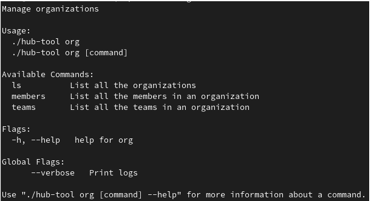

组织命令。

Org 用于列出组织。要列出基本内容，请使用 ls 命令，如下所示:

```
./hub-tool org ls
```

要列出更具体的内容，可以使用“组织成员”或“组织团队”。为此，您可以使用以下命令:

```
./hub-tool org members <MemberName>
```

或者:

```
./hub-tool org teams <TeamName>
```

因为我目前没有设置，所以没有什么可搜索的。

接下来我们可以列出存储库:

```
./hub-tool repo
```

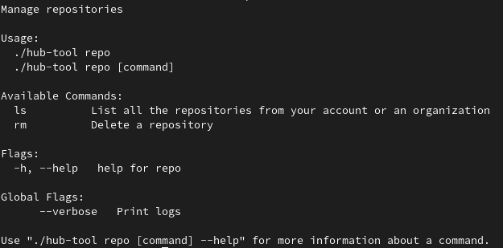

存储库命令。

如您所见，我们可以首先列出我们的存储库:

```
./hub-tool repo ls
```

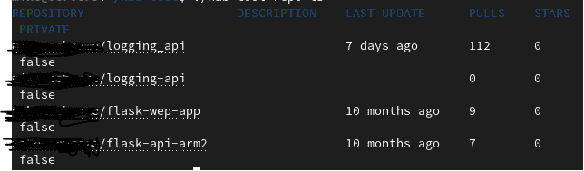

列出存储库。

另一种选择是，我们可以通过以下方式删除存储库:

```
./hub-tool repo rm <RepositoryName>
```

我现在不会运行它，因为我现在没有想要删除的内容。

我们可以查看的下一个命令是如何管理标记:

```
./hub-tool tag
```

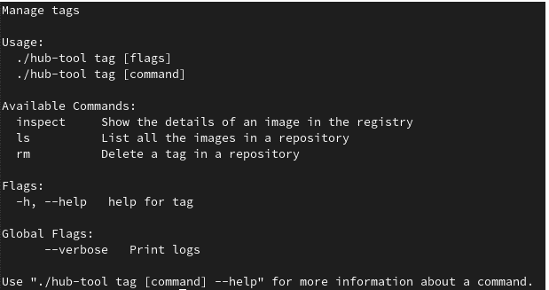

标签命令。

我们现在可以列出存储库的标签。您将需要存储库的名称来查看:

```
./hub-tool tag ls <RepositoryName>
```

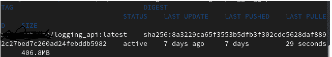

存储库信息。

接下来是标签，我们可以检查存储库中的标签。这包括诸如在哪里显示、配置和层之类的数据。这个将不包括截图，因为它包括私有路径和信息。

```
./hub-tool tag inspect <RepositoryName>
```

和我们之前使用的其他命令一样，我们也可以使用带有存储库名称的 remove 命令。

```
./hub-tool tag rm <RepositoryName>
```

接下来是令牌命令，我们可以在这里管理个人访问令牌:

```
./hub-tool token
```

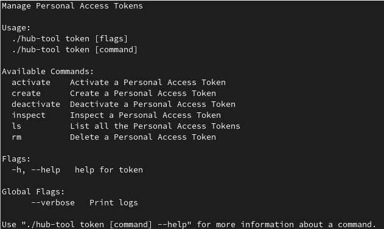

令牌命令列表。

我们首先需要创建一个令牌:

```
./hub-tool token create
```

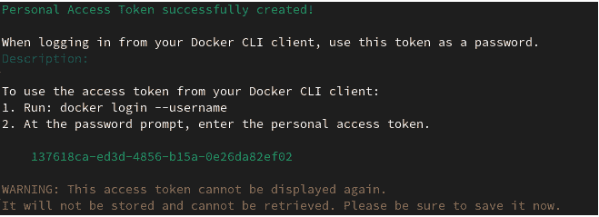

创建令牌。

创建令牌后，我们可以使用列表来查看它们:

```
./hub-tool token ls
```


展示代币。

接下来，我们可以检查该令牌的细节:

```
./hub-tool token inspect <TokenName>
```

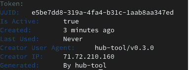

令牌信息。

因为我们看到活动是真实的，所以如果需要，我们可以停用令牌:

```
./hub-tool token deactivate <TokenName>
```

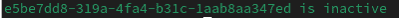

停用的令牌。

如果我们希望令牌重新激活，我们也可以使用类似的命令:

```
./hub-tool token activate <TokenName>
```


已激活令牌。

像所有其他事情一样，当不再需要令牌时，我们也可以使用 remove 选项。此操作还需要用户名验证。

```
./hub-tool token rm <TokenName>
```

另一个选项是版本选项。它将显示 Docker 的版本，以及 Git 提交:

```
./hub-tool version
```

注意，你可以用"--版本"来代替"版本"。

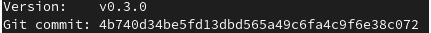

Docker 版本已安装。

最后一个选项是注销选项:

```
./hub-tool logout
```


已注销。

# **结论**

尽管该列表包含了所有选项，但并不完全详细，仅包含每个选项的简要概述。然而，我觉得它为没有各种文档的选项带来了更多的清晰度。我希望我的例子和总结对你有用。

尽管 Docker 界面强大而有用，但对于管理存储库来说，我可能会再次看到自己使用这个 CLI。虽然目前没有太多的选择，但我喜欢深入了解 Docker Hub-tool。下次见，干杯！

***用我的*** [***每周简讯***](https://crafty-leader-2062.ck.page/8f8bcfb181) ***免费阅读我的所有文章，谢谢！***

***想看完介质上的所有文章？成为中等*** [***成员***](https://miketechgame.medium.com/membership) ***今天！***

**|** *参考文献*

[](https://www.docker.com/blog/docker-hub-experimental-cli-tool/) [## 🧪 Docker Hub 实验 CLI 工具- Docker 博客

### 我们很高兴地告诉你，我们已经发布了一个新的实验工具。我们希望得到您的反馈…

www.docker.com](https://www.docker.com/blog/docker-hub-experimental-cli-tool/) [](https://www.digitalocean.com/community/tutorials/how-to-install-and-use-docker-on-ubuntu-16-04) [## 如何在 Ubuntu 16.04 | DigitalOcean 上安装和使用 Docker

### 在 Ubuntu 16.04 上安装 Docker 有两种方法。一种方法是将它安装在现有的…

www.digitalocean.com](https://www.digitalocean.com/community/tutorials/how-to-install-and-use-docker-on-ubuntu-16-04) [](https://www.docker.com/resources/what-container) [## 什么是容器？码头工人

### 容器是软件的一个标准单元，它将代码及其所有依赖项打包，以便应用程序运行…

www.docker.com](https://www.docker.com/resources/what-container) [](https://www.infoworld.com/article/3204171/what-is-docker-the-spark-for-the-container-revolution.html) [## Docker 是什么？容器革命的火花

### Docker 是一个基于容器构建应用程序的软件平台——小型轻量级执行…

www.infoworld.com](https://www.infoworld.com/article/3204171/what-is-docker-the-spark-for-the-container-revolution.html) [](https://github.com/docker/hub-tool/releases) [## 发布 docker/hub 工具

### 在 account info 命令中添加了一个可选参数，用于检查组织的状态。添加了一个- platform 标志，用于标记…

github.com](https://github.com/docker/hub-tool/releases) 

**|** *看看我最近的一些文章*

[](https://towardsdatascience.com/introduction-to-r-318ca6dcb56) [## R 简介

### R 语言适合我吗？

towardsdatascience.com](https://towardsdatascience.com/introduction-to-r-318ca6dcb56) [](https://medium.com/codex/a-journey-with-kubernetes-part-4-apis-19b311290a4f) [## 库伯内特之旅第 4 部分:API

### 将 Python API 部署到 Kubernetes

medium.com](https://medium.com/codex/a-journey-with-kubernetes-part-4-apis-19b311290a4f) [](https://towardsdatascience.com/mongodb-3f605f8533a0) [## MongoDB

### 从安装到实现:第 4 部分

towardsdatascience.com](https://towardsdatascience.com/mongodb-3f605f8533a0) [](https://medium.com/swlh/why-i-needed-to-graduate-college-with-no-debt-2bdcd37ccd4f) [## 为什么我需要无债一身轻地从大学毕业

### 比你想的更重要…

medium.com](https://medium.com/swlh/why-i-needed-to-graduate-college-with-no-debt-2bdcd37ccd4f) [](https://py.plainenglish.io/3-ways-to-handle-errors-in-fastapi-that-you-need-to-know-e1199e833039) [## 你需要知道的 FastAPI 中处理错误的 3 种方法

### 在过去的几个月里，我写了很多关于 FastAPI 以及它有多棒的文章。然而，有一件事…

py .平原英语. io](https://py.plainenglish.io/3-ways-to-handle-errors-in-fastapi-that-you-need-to-know-e1199e833039)