# 调整预测模型—第 2 部分

> 原文：<https://levelup.gitconnected.com/tuning-a-forecasting-model-part-2-f7b4c5a54335>

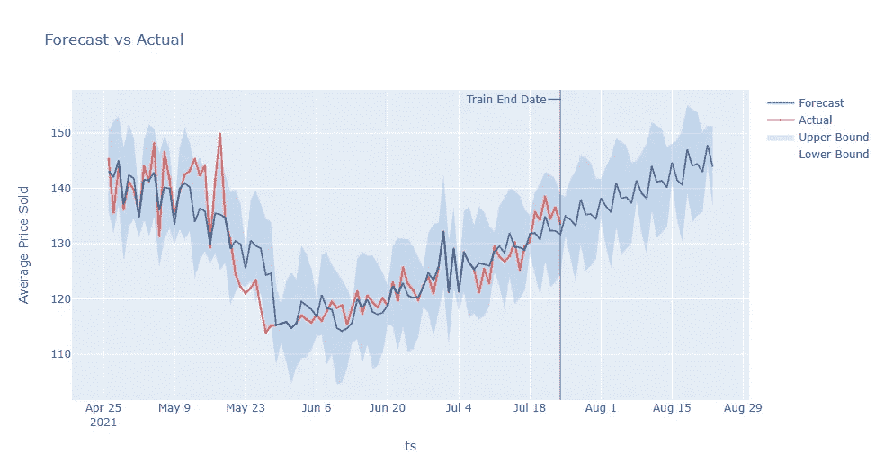

这篇文章是这个系列的第一部分的延续。在之前的文章中，我们学习了如何使用 Greykite 预测库创建一个基线预测模型。

[](/pokemon-tcg-product-price-forecasting-with-greykite-in-python-a77223567d58) [## 用 Python 中的 Greykite 进行口袋妖怪 TCG 产品价格预测

### 时间序列预测包括基于以下因素预测未来的观察值(例如价格或连续测量值)

levelup.gitconnected.com](/pokemon-tcg-product-price-forecasting-with-greykite-in-python-a77223567d58) 

在本帖中，我们感兴趣的是改进预测特定产品销售价格的基线模型。因此，我们将从数据集的样本开始，如下所示。

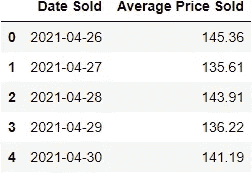

快速查看一下数据集的数据类型，它包含一个产品总共 90 天(大约 3 个月)的平均销售价格。

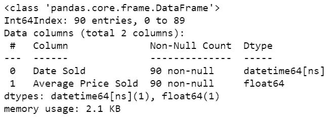

与上一篇文章类似，我们将从一个基线预测模型开始，预测范围为未来 30 天。

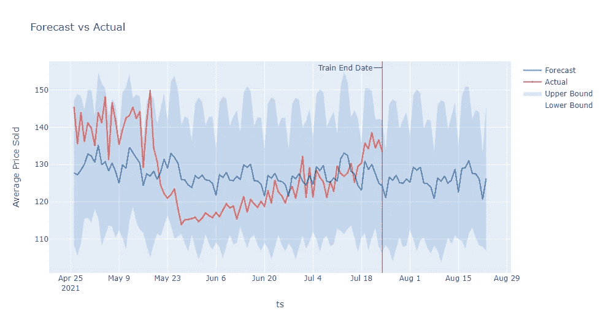

此外，我们可以访问基线模型的交叉验证结果。这将使我们更好地了解预测模型。灰风筝图书馆提供了广泛的信息和性能测量，如 RMSE，梅，MAPE 等。

```
grid_search = result.grid_search
cv_results = summarize_grid_search_results(
    grid_search=grid_search,
    decimals=4,
    cv_report_metrics=None,
    column_order=["rank", "mean_test", "split_test", "mean_train", "split_train", "mean_fit_time", "mean_score_time", "params"])cv_results["params"] = cv_results["params"].astype(str)
cv_results.set_index("params", drop=True, inplace=True)
cv_results = cv_results.transpose()
```

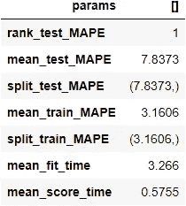

对于本例，我们将使用 MAPE 绩效评估来评估预测模型(越低越好)。如我们所见，平均而言，基线模型的预测值与真实值相差约 7.84%。

平均绝对百分误差(MAPE)衡量真实值的误差百分比。例如，对于 100 的真实观测值，1 的误差被认为是 1%，但是对于 10 的真实观测值，误差被认为是 10%。

## 增长和趋势

我们将关注时间序列的增长和趋势，以确定数据集中的任何长期趋势。我们从观察数据集中可能的趋势变化点开始。

```
from greykite.algo.changepoint.adalasso.changepoint_detector import ChangepointDetectormodel = ChangepointDetector()res = model.find_trend_changepoints(
     df=modified,  # data df
     time_col="Date Sold",  # time column name
     value_col="Average Price Sold",  # value column name
     yearly_seasonality_order=1,  # yearly seasonality order, fit along with trend
     regularization_strength=0.3,  # between 0.0 and 1.0, greater values imply fewer changepoints, and 1.0 implies no changepoints
     resample_freq="D",  # data aggregation frequency, eliminate small fluctuation/seasonality
     potential_changepoint_n=5,  # potential changepoints
     yearly_seasonality_change_freq="D",  # varying yearly seasonality for every year
     no_changepoint_distance_from_end="D")  # the proportion of data from end where changepoints are not allowedfig = model.plot(
     observation=True,
     trend_estimate=False,
     trend_change=True,
     yearly_seasonality_estimate=False,
     adaptive_lasso_estimate=True,
     plot=False)pio.show(fig)
```

根据变点检测器，似乎在数据集中检测到了两个变点，一个在 2021 年 5 月 11 日，另一个在 2021 年 6 月 10 日。

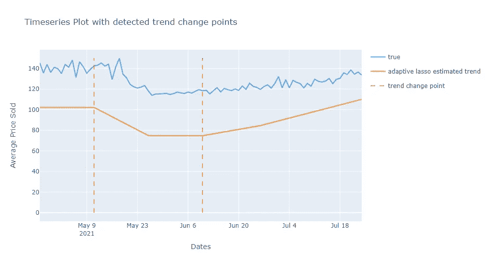

这表明该时间序列在 2021 年 6 月 10 日之前总体呈下降趋势，之后总体呈上升趋势。因此，在调整基线模型时，我们将包括这个参数。

```
# The following specifies the growth and trend changepoint configurations.growth = {
     "growth_term": "linear"
}
changepoints = {
    "changepoints_dict": dict(
         method="auto",
         yearly_seasonality_order=1,
         regularization_strength=0.3,
         resample_freq="D",
         potential_changepoint_n=5,
         yearly_seasonality_change_freq="D",
         no_changepoint_distance_from_end="D"
    )
}
```

## 季节性

接下来，我们将查看数据集中的季节性。由于数据集不包含大量的历史数据，我们将关注每周的季节性。

```
# Includes weekly seasonality with order 5.
# Set the other seasonality to False to disable them.weekly_seasonality_order = 5
seasonality = {
     "quarterly_seasonality": False,
     "monthly_seasonality": False,
     "weekly_seasonality": weekly_seasonality_order,
     "daily_seasonality": False
}
```

## 假期和活动

由于这些数据大多来自主要在美国使用的市场，我们预计美国的主要节假日可能会影响产品的销售价格。

```
from greykite.algo.forecast.silverkite.constants.silverkite_holiday import SilverkiteHoliday# Includes major holidays in USA.
events = {
     # These holidays as well as their pre/post dates are modeled as individual events.
     "holidays_to_model_separately": SilverkiteHoliday.ALL_HOLIDAYS_IN_COUNTRIES,  # all holidays in "holiday_lookup_countries"
     "holiday_lookup_countries": ["UnitedStates"],  # only look up holidays in the United States
     "holiday_pre_num_days": 2,  # also mark the 2 days before a holiday as holiday
     "holiday_post_num_days": 2,  # also mark the 2 days after a holiday as holiday
}
```

## 自定义特征和回归量

看看口袋妖怪 TCG 的产品发布，似乎每个季度都有新产品发布。因此，我们将为此创建一个自定义回归器。

```
from greykite.common.features.timeseries_features import build_time_features_df
from greykite.common.features.timeseries_features import convert_date_to_continuous_time# Makes augmented df with forecast horizon 3 daysdf_full = ts.make_future_dataframe(periods=30)
 # Builds "df_features" that contains datetime information of the "df"
df_features = build_time_features_df(
    dt=df_full["ts"],
    conti_year_origin=convert_date_to_continuous_time(df_full["ts"][0])
 )# Roughly approximates the quarterly product release.
# "doq" is short for "day of quarter every year", created above.
# Pokemon TCG product release is roughly the first day of every quarter in a year.
quarter_product_release = (df_features["doq"] == 1)
 # Adds the new feature to the dataframe.
df_full["quarter_product_release"] = quarter_product_release.astype(int).tolist()
df_full.reset_index(drop=True, inplace=True)# Configures regressor column.
regressors = {
    "regressor_cols": ["quarter_product_release"]
}df_full = df_full.rename(columns={"ts": "Date Sold", "y": "Average Price Sold"})
```

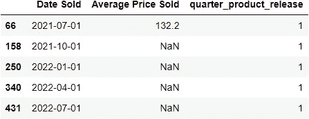

## 相互作用

我们还可以尝试捕捉季度产品发布和每周季节性之间的乘法项。这将使我们能够看到在另一个特征的不同值上表现不同的特征，以及它们是否可能具有潜在的交互作用。

```
fig = ts.plot_quantiles_and_overlays(
     groupby_time_feature="str_dow",
     show_mean=True,
     show_quantiles=False,
     show_overlays=True,
     center_values=True,
     overlay_label_time_feature="month",  # splits overlays by month
     overlay_style={"line": {"width": 1}, "opacity": 0.5},
     xlabel="day of week",
     ylabel=ts.original_value_col,
     title="weekly seasonality by month",
)
pio.show(fig)
```

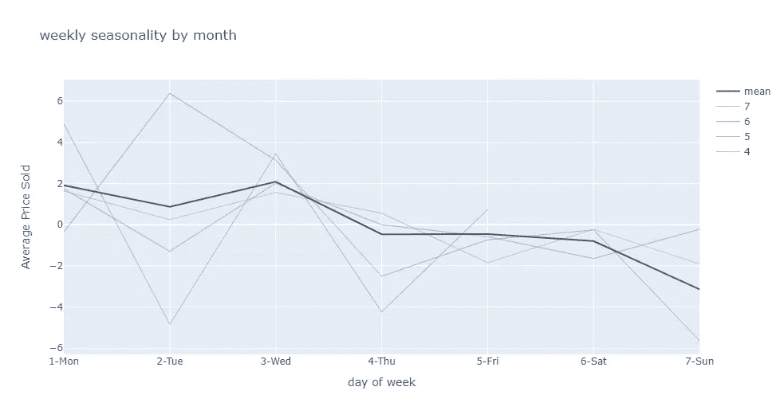

```
from greykite.algo.forecast.silverkite.forecast_simple_silverkite_helper import cols_interact
from greykite.algo.forecast.silverkite.constants.silverkite_seasonality import SilverkiteSeasonalityEnumproduct_release_day = cols_interact(
     static_col="quarter_product_release",
     fs_name=SilverkiteSeasonalityEnum.WEEKLY_SEASONALITY.value.name,
     fs_order=weekly_seasonality_order,
     fs_seas_name=SilverkiteSeasonalityEnum.WEEKLY_SEASONALITY.value.seas_names
)
extra_pred_cols = product_release_day
```

## 把所有东西放在一起

最后，在查看了基线模型中可以调整的参数后，我们可以生成一个包含这些参数的新预测。

```
from greykite.framework.templates.autogen.forecast_config import ModelComponentsParammetadata = MetadataParam(
     time_col="Date Sold",            
     value_col="Average Price Sold",             
     freq="D",                  
)model_components = ModelComponentsParam(
     seasonality=seasonality,
     growth=growth,
     events=events,
     changepoints=changepoints,
     autoregression=None,
     regressors=regressors,  # quarter_product_release defined above
     uncertainty={
         "uncertainty_dict": "auto",
     },
     custom={
         # What algorithm is used to learn the relationship between the time series and the features.
         # Regularized fitting algorithms are recommended to mitigate high correlations and over-fitting.
         # If you are not sure what algorithm to use, "ridge" is a good choice.
         "fit_algorithm_dict": {
             "fit_algorithm": "ridge",
         },
         "extra_pred_cols": extra_pred_cols  # the interaction between product_release_day and weekly seasonality defined above
     }
)
```

带有调整参数的新预测。

```
# Runs the forecast
result_tuned = forecaster.run_forecast_config(
    df=df_full,
    config=ForecastConfig(
    model_template=ModelTemplateEnum.SILVERKITE.name,
    forecast_horizon=30,  # forecasts 30 steps ahead
    coverage=0.95,  # 95% prediction intervals
    metadata_param=metadata,
    model_components_param=model_components
     )
)
```

并使用调整后的参数检查新模型的性能。

```
# Summarizes the cv result
cv_results = summarize_grid_search_results(
    grid_search=result_tuned.grid_search,
    decimals=4,
     # The below saves space in the printed output. Remove to show all available metrics and columns.
    cv_report_metrics=None,
    column_order=["rank", "mean_test", "split_test", "mean_train", "split_train", "mean_fit_time", "mean_score_time", "params"])
# Transposes to save space in the printed output
cv_results["params"] = cv_results["params"].astype(str)
cv_results.set_index("params", drop=True, inplace=True)
cv_results_tuned = cv_results.transpose()
```

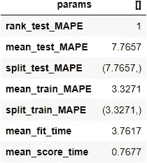

与基线模型值相比，模型的 MAPE 从 7.84%显著降低至 7.76%(大约提高了 1.02%)。

此外，我们可以在调整模型后绘制新的预测。

```
forecast_tuned = result_tuned.forecast
fig = forecast_tuned.plot()
pio.show(fig)
```


甚至模型总结。

```
summary = result_tuned.model[-1].summary()  # -1 retrieves the
estimator from the pipeline
print(summary)
```

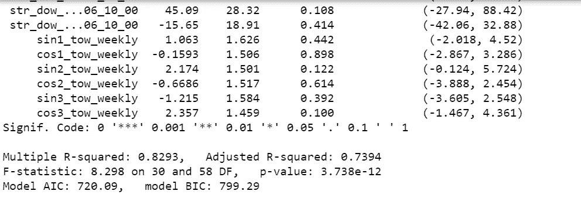

我们还可以获得对预测模型有意义的纯趋势特征，这可以被研究用于参数的进一步调整。

```
# pure trend features, including the continuous growth term and trend changepointsoutput = summary.get_coef_summary(
    is_intercept=True,
    is_trend=True,
    is_seasonality=False,
    is_interaction=False,
    return_df=True  # returns the filtered df
)
```

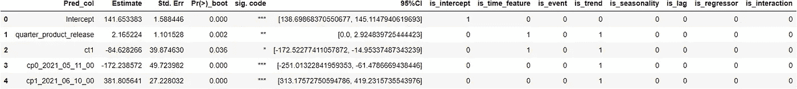

这就是我对这篇文章的全部看法。虽然它远非完美，但我确实从学习和调整预测模型中获得了很多乐趣。我希望你也一样！

好奇的学习者？释放你在媒体上学习的全部潜力，用不到一杯咖啡的钱支持像我这样的作家。

[](https://lzpdatascience.medium.com/membership) [## 通过我的推荐链接加入媒体——杰森·LZP

### 作为一个媒体会员，你的会员费的一部分会给你阅读的作家，你可以完全接触到每一个故事…

lzpdatascience.medium.com](https://lzpdatascience.medium.com/membership)