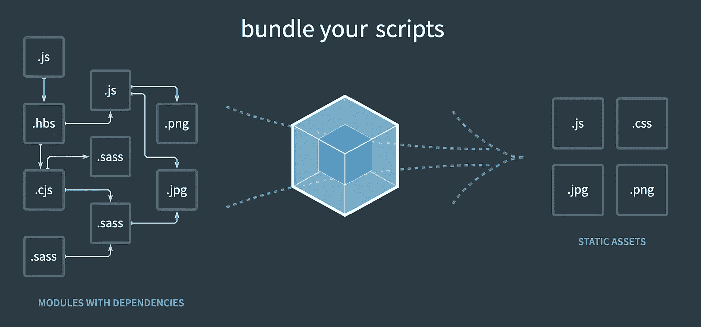
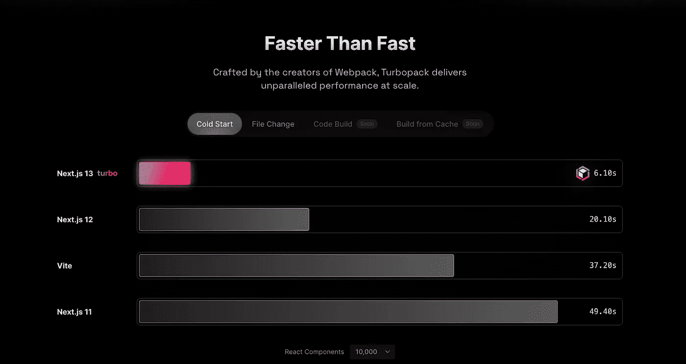
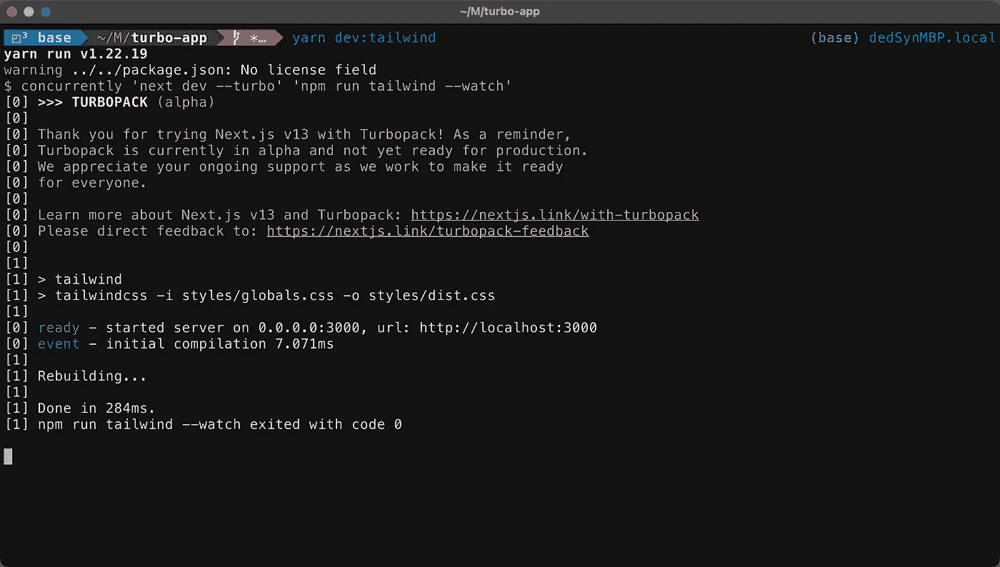

# 涡轮包:铁锈建造的发电站

> 原文：<https://levelup.gitconnected.com/turbopack-a-rust-built-powerhouse-7e43cb90c84e>

认识一下新的 Rust-powered Webpack 继任者，它将在开发人员社区掀起波澜！


罗斯·芬登在 [Unsplash](https://unsplash.com?utm_source=medium&utm_medium=referral) 上的照片

对于我们这些多年来从事任何类型的 web 开发的人来说，我们已经非常熟悉它以及它在捆绑我们的项目中所扮演的角色，无论是大项目还是小项目。当然，不是每个人都知道 web 应用程序是如何制作的…更不用说什么是“捆绑器”了！

> webpack 的核心是现代 JavaScript 应用程序的静态模块捆绑器。当 webpack 处理您的应用程序时，它在内部从一个或多个*入口点*构建一个依赖图，然后将您的项目需要的每个模块组合成一个或多个*捆绑包*，这些捆绑包是为您的内容提供服务的静态资产。



Webpack 概述

许多开发人员利用 Webpack 作为他们的主要捆绑机制，不管他们是否意识到，它实际上已经统治了多年。也就是说，性能更高的编程语言的新进展(如 Rust)现在已经打开了改变这种现状的大门。

# 你好 Turbopack

Turbopack 是最新的捆扎机，刚刚作为 alpha 版本首次亮相……真是太快了！更好的是，它实际上是由 Webpack 的创造者开发的，**所以这并不像是一场势均力敌的比赛**。Turbopack 实际上是新一代捆绑器，旨在成为开发人员的下一个****工具*** ！*

> *Turbopack 是一个针对 JavaScript 和 TypeScript 优化的增量捆绑器，由 Webpack 和[next . js](https://nextjs.org/)at[Vercel](https://vercel.com/)的创建者用 Rust 编写……turbo pack 性能的秘密有两个:高度优化的机器代码和一个低级增量计算引擎，它支持缓存到单个函数的级别。一旦 Turbopack 完成了一项任务，它就不会再做了。*

## *铁锈再次来袭*

*鲁斯塔西亚人有理由再次欢呼，这一次是件大事！Turbopack 有可能在我们构建未来 web 工具包的方式上产生巨大的范式转变。很长一段时间以来，这些工具中的许多都是用 JavaScript 或 TypeScript 编写的，但是使用 Rust 编写这样一个工具的结果是**非常不可否认的**:*

**

*如果您可能没有注意到该图底部的文字，时间表示使用 **10，000 个** React 组件冷启动项目的时间。很快就可以看出，在大型项目中使用 Next.js 和 Turbopack 可以大大加快加载速度，这意味着更快的开发速度和更好的资源利用率。*

# *帮我报名*

*你们许多人现在唯一剩下的问题(至少我有过)是:*

> ***“我该如何开始使用这种神奇的力量？”***

*请允许我帮忙！因为 Turbopack 刚刚在 alpha for Next.js v13 中发布，所以使用`create-next-app`命令行工具最容易上手。我知道，我知道，如果您想直接进入并在现有的 Next.js 项目中测试它，该怎么办？！事实证明，这个过程并不那么简单…或者至少对于我试图开始使用它的项目来说不是这样。出现这种情况的一个主要原因似乎是最新 React 版本的新 Next.js v13 处理服务器端呈现(SSR)的方式发生了变化，以及正确处理初始资源缓存和声明所需的变化。*

> *我将在以后写一篇配套文章来解决使用 Turbopack 的现有项目的问题，敬请关注！*

***让我们选择感受 Turbopack 的最佳方式:***

*打开系统的终端，导航到要创建新项目的目录，然后运行:*

```
*npx create-next-app — example with-turbopack*
```

*你将被提示输入你的项目名称，一旦所有这些都完成了，你就可以开始了… **简单吧？！随着新项目的建立，你所需要做的，取决于你使用哪个包管理器，就是运行`npm run dev`或`yarn dev`。就像任何其他 web 项目一样，剩下的就是打开一个浏览器并导航到`localhost:3000`来查看呈现的示例应用程序以及对源代码所做的任何新更改！***

**

*开始您的项目*

***关于新的 Next.js v13 Turbopack 设置，需要指出另一个要点:***

*   *TailwindCSS 是内置的，可以开箱即用来转换您的 CSS 样式表*
*   *为了利用各种各样的 Tailwind 框架组件，使用单独的`yarn dev:tailwind`或`npm run dev:tailwind`命令来运行开发服务器是很重要的*

# *走向*

*既然你已经准备好了，我建议你深入研究一下示例应用程序的源代码，以及 Turbopack [网页](https://turbo.build/pack/docs)上的补充文档。*

*开发新的 Turbopack 项目还有一个额外的隐藏宝藏: **TailwindUI。**由于新的 Next.js Turbopack 项目对 TailwindCSS 提供了开箱即用的支持，这也意味着开始使用 TailwindUI 提供的各种组件要容易得多。一定要检查一下[文档](https://tailwindui.com/documentation)，以便快速将其添加到您的项目中，并使您的页面看起来更好！*

**

*做了一些更改后，新的登录页面*

> *如果你喜欢这篇关于探索 Turbopack 和如何开始的简短介绍，请查看我的其他一些[开发文章](https://medium.com/@erutherford_nullreturn)，并关注我以获得新出版物的更新*😎👌🔥*。*

*“概念。” *Webpack* ，[https://webpack.js.org/concepts/.](https://webpack.js.org/concepts/.)*

*“Turbopack 快速入门— Turbopack。”*涡轮*，[https://turbo.build/pack/docs.](https://turbo.build/pack/docs.)*