# 将 Youtube 播放列表转变为网站

> 原文：<https://levelup.gitconnected.com/turn-a-youtube-playlist-into-a-website-98235f9230aa>

从头开始:现在使用 Next.js (React)、布尔玛和 Zeit

(4 月写的，8 月贴的，有些东西可能过时了)

我是前端新手。乐趣的一部分是搞清楚小项目来发现新花样。后来的乐趣来自展示我的发现，以防其他人想尝试同样的事情。本指南使用 Next.js(基本上是 react)来构建前端和后端，我们将使用布尔玛来设计应用程序的样式，并使用 Zeit Now 来托管它(隐藏我们的 API 密钥，这样就没有人会攻击我们)。

为了这个项目，我将我的无人机视频的 youtube 播放列表转到我的网站上呈现一个画廊 **dean.red.**

[查看演示](https://dean.red)——[Github 回购](https://github.com/JollyGrin/youtube-playlist)

## 先决条件

*   节点. js
*   立即注册[Zeit](https://zeit.co)并下载他们的 CLI

# 入门指南

让我们先解决安装和配置问题。让我们从创建 next.js 框架开始。

```
npx create-next-app
```

现在让我们安装将要使用的 node_modules:

```
npm i node-sass bulma dotenv axios
```

# 安装造型(布尔玛)

让我们用 node-sass & bulma 设置样式。打开 package.json 配置文件，复制/粘贴**CSS:build**&**CSS:watch**的脚本:

```
*// package.json*"scripts": {"dev": "next dev",
"build": "next build",
"start": "next start",
**"css:build": "node-sass --omit-source-map-url assets/sass/styles.scss static/css/styles.css",
"css:watch": "npm run css:build -- --watch"**}
```

这个脚本将把一个. SCSS 文件变成一个静态的 CSS 文件。为此，我们需要创建。SCSS 档案。

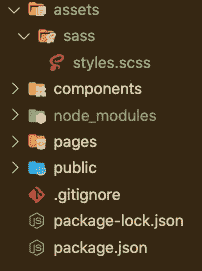

在文件夹根目录中，创建一个名为 **assets** 的新文件夹，然后创建一个名为 **sass** 的子文件夹，然后在这个文件夹中创建一个名为 **styles.scss** 的文件

现在，我们可以使用以下代码将 bulma 加载到 styles.scss 中:

```
*// assets/styles/styles.scss*@charset "utf-8";
@import '../../node_modules/bulma/bulma.sass';
```

接下来，我们将建立静态。终端中包含 styles.scss .的 CSS 文件:

```
npm run css:build
```

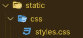

这将创建一个名为 static 的文件夹，其中嵌套了 styles.css。

现在我们可以在应用程序中使用这种样式。为此，让我们创建一个可以在所有页面中一致使用的 Head 组件。在 components 文件夹中创建文件 **TheHead.js** :

```
*// components/TheHead.js*import Head from 'next/head'export default () => (
    <Head>
        <meta name="viewport" content="width=device-width, initial-scale=1" />
        <meta charSet="utf-8" />
        <title>youtube playlist</title>
        **<link rel="stylesheet" type="text/css" href="/static/css/styles.css" />**
    </Head>
)
```

现在让我们用下面的代码替换掉所有的内容，从而更新 **pages/index.js** 。注意**<head/>**组件的导入和使用。

```
*// pages/index.js*import React, { Component } from 'react'
**import TheHead from '../components/TheHead'**export default class index extends Component {
  render() {
    return (
      <div>
        **<TheHead />**
        <section className="section">
          <div className="columns">
            <div className="column is-8 is-offset-2">
              <h1 className="title">
                Bulma is installed!
              </h1>
              <a className="button is-primary">Button Test</a>
            </div>
          </div>
        </section>
      </div>
    )
  }
}
```

现在让我们看看这个看起来怎么样。

```
npm run css:build
npm run dev
```

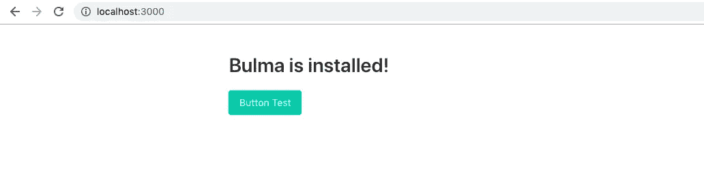

如果一切安装正确，您的网站应该看起来像这样(与绿色按钮)。

# 创建后端

要使用 Youtube API v3，您需要有一个 API 密钥。如果我们在前端/客户端使用这个，任何人都可以看到这个密钥并侵入我们的谷歌账户。幸运的是，Next.js & Zeit 现在可以很容易地部署一个后端来获取播放列表信息，而不暴露我们的 API 键。

## 设置环境变量

让我们从配置我们的。env 文件，它允许我们在不暴露密钥的情况下在本地和生产上工作。

在根目录下创建一个名为 **next.config.js.** 的新文件

```
*// next.config.js*require('dotenv').config()module.exports = {
    env: {
        // Reference a variable that was defined in the .env file and make it available at Build Time
        APIKEY: process.env.APIKEY,
        PLAYLIST: process.env.PLAYLIST,
    },
}
```

然后在根目录下创建一个名为**的新文件。环境**

```
APIKEY=keyABC
PLAYLIST=appABC
```

然后在根目录下创建两个名为**的新文件。现在忽略** & **。gitignore**

```
// .nowignore
.env
node_modules// .gitignore
.env
node_modules
```

## 设置 API

Next.js 使得开箱即用的 API[设置](https://nextjs.org/docs#api-routes)变得容易*(我们不需要 express)。*

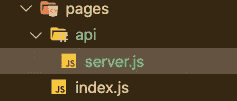

创建一个新文件 **pages/api/server.js** (在 pages 内创建一个名为 **api** 的新文件夹)。

```
*// pages/api/server.js*import fetch from 'axios'
import getConfig from 'next/config'const key = process.env.APIKEY
const playlist = process.env.PLAYLIST
const maxResults = 3
const apiURL = `[https://www.googleapis.com/youtube/v3/playlistItems?part=snippet&type=video&order=date&maxResults=${maxResults}&playlistId=${playlist}&key=${key}`](https://www.googleapis.com/youtube/v3/playlistItems?part=snippet&type=video&order=date&maxResults=${maxResults}&playlistId=PL1i-TpHn0Xgz8ASjlgGUG-OpCCaKrqZsC&key=${key}`)module.exports = async (req, res) => {

    try {
      // const result = await fetch(apiURL)
      // res.status(200).json(result.data)

      res.status(200).json(apiURL) } catch (err) {
      res.status(500).json('Whoops, something went wrong')
    }

}
```

保存文件，然后重启你的服务器 *(ctrl-c & npm run dev)。*然后访问**localhost:3000/API/server**。您应该会得到以下响应。

```
https://www.googleapis.com/youtube/v3/playlistItems?part=snippet&type=video&order=date&maxResults=3&playlistId=**appABC**&key=**keyABC**
```

如果你看到**app ABC**&**key ABC**，那么你的环境变量正在工作！

## 设置 API 键和播放列表

浏览并登录到:[https://console.developers.google.com/](https://console.developers.google.com/)并创建一个新项目

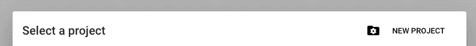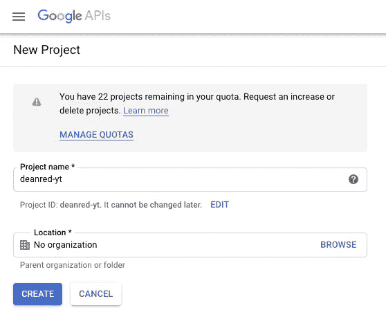

选择和创建凭据(API 密钥)

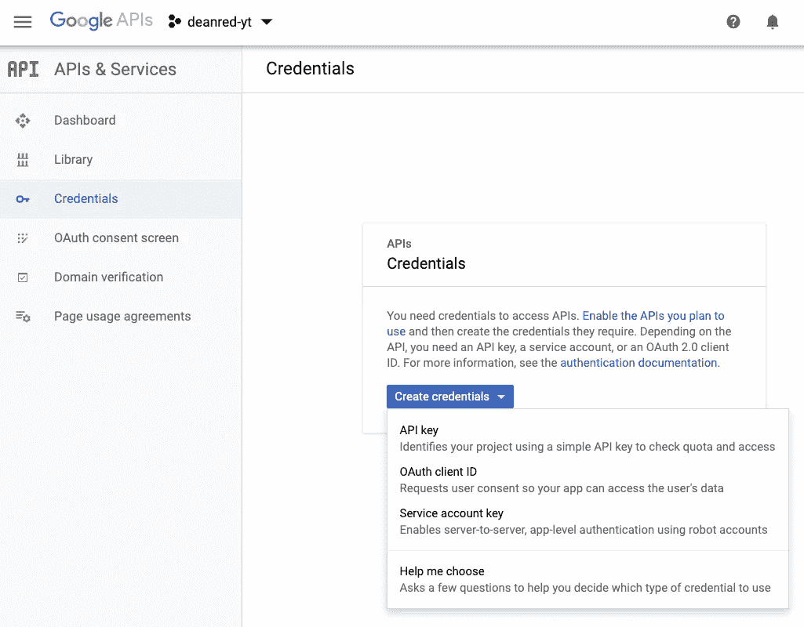

获取新生成的 API 密钥，并将其粘贴到您的。环境文件。这将在我们的整个应用程序中可用。

```
// .envAPIKEY=PasteYourKeyHere
PLAYLIST=appABC
```

在您的 Google 控制台上，导航到您的仪表板并启用 API & Services。

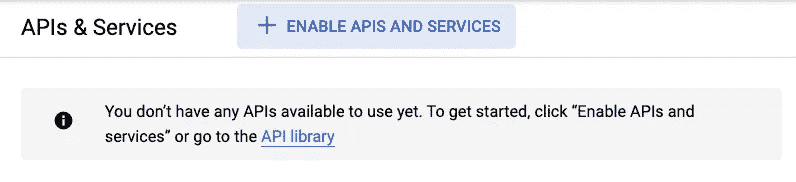

搜索“Youtube ”,然后选择并启用 **Youtube 数据 API v3**

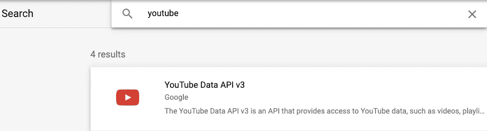

现在让我们获取播放列表 ID。导航到您的 youtube 播放列表。复制 URL，然后将 ID 粘贴到您的。环境文件:

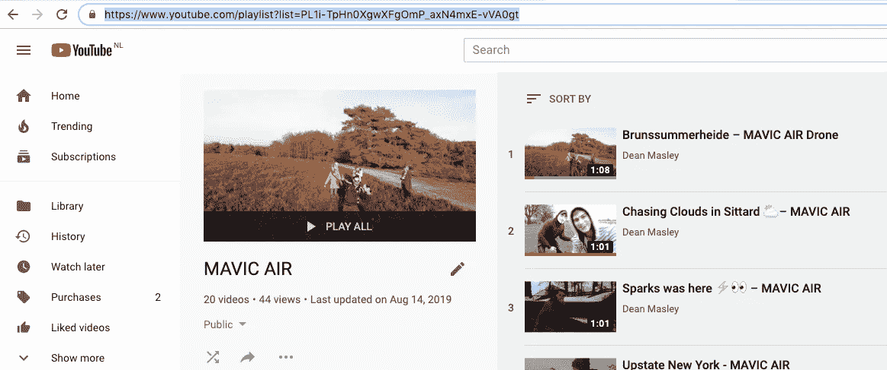

```
// url of the youtube playlist[https://www.youtube.com/playlist?list=**PL1i-TpHn0XgwXFgOmP_axN4mxE-vVA0gt**](https://www.youtube.com/playlist?list=PL1i-TpHn0XgwXFgOmP_axN4mxE-vVA0gt)// .envAPIKEY=PasteYourKeyHere
PLAYLIST=PL1i-TpHn0XgwXFgOmP_axN4mxE-vVA0gt
```

打开您的/api/server.js 文件，取消我们之前隐藏的代码的注释。我们可以注释掉 *res.status(200)。json(apiURL)* 以便我们可以在以后需要时使用它进行调试。

```
// pages/api/server.jsimport fetch from 'axios'
import getConfig from 'next/config'const key = process.env.APIKEY
const playlist = process.env.PLAYLIST
const maxResults = 3
const apiURL = `[https://www.googleapis.com/youtube/v3/playlistItems?part=snippet&type=video&order=date&maxResults=${maxResults}&playlistId=${playlist}&key=${key}`](https://www.googleapis.com/youtube/v3/playlistItems?part=snippet&type=video&order=date&maxResults=${maxResults}&playlistId=PL1i-TpHn0Xgz8ASjlgGUG-OpCCaKrqZsC&key=${key}`)module.exports = async (req, res) => {

    try {
      const result = await fetch(apiURL)
      res.status(200).json(result.data)

      // res.status(200).json(apiURL)} catch (err) {
      res.status(500).json('Whoops, something went wrong')
    }

}
```

保存一切并重启你的服务器(Ctrl-C，然后 npm run dev)。编译完成后，访问 localhost:3000/api/server，您应该会得到如下所示的 json:

```
{"kind":"youtube#playlistItemListResponse","etag":"\"p4VTdlkQv3HQeTEaXgvLePAydmU/ONj3fEgwTdkCNzYy4qEjt_a2i_A\"","nextPageToken":"CAMQAA","pageInfo":{"totalResults":20,"resultsPerPage":3},"items":[{"kind":"youtube#playlistItem","etag":"\"p4VTdlkQv3HQeTEaXgvLePAydmU/BaaKN-5F21x53nw6GEnHSwaNtDw\"","id":"UEwxaS1UcEhuMFhnd1hGZ09tUF9heE40bXhFLXZWQTBndC5ENDU4Q0M4RDExNzM1Mjcy","snippet":{"publishedAt":"2019-02-17T00:57:40.000Z","channelId":"UCNLJ9gzT_wVT8wbX8OVuaCA","title":"Brunssummerheide – MAVIC AIR Drone","description":"🎶this feeling by..( ... snipping to save room ... )
```

**恭喜你！！！**您已经成功创建了一个可以安全地从 youtube 播放列表中抓取视频的后端！现在，我们可以通过这个自定义后端调用整个应用程序中的这些数据。

# 创建前端

现在我们有了一个可以从 youtube 播放列表中获取视频 json 的后端，我们现在可以使用该信息动态生成一个视频页面。

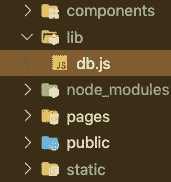

首先，让我们在前端创建一个从后端获取数据的函数。首先在根目录下创建一个名为 **lib** 的新文件夹。在这个文件夹中，创建一个名为 **db.js** 的文件

```
// lib/db.jsimport fetch from 'axios'async function getResults () {
  const apiURL = `/api/server`try {
    const result = await fetch(apiURL)
    return result.data.items
  } catch (err) {
    console.log(`Shoot! You hit an error: ${err}`)
  }
}export { getResults }
```

现在我们可以使用 **getResults()** 来获取播放列表数据，而不用暴露我们的 api 键！

回到 index.js 并导入 **getResults()** ，然后在 render()上面的**componentidmount(){ }**中 console.log 结果。这将在页面加载时立即调用 getResults()。

```
import React, { Component } from 'react'
import TheHead from '../components/TheHead'
**import { getResults } from '../lib/db'**export default class index extends Component {**componentDidMount () {
    getResults().then(data => {
      console.log('videos: ', data)
    })
  }**
  render () {
    return (

(... rest of app ... )
```

现在，如果我们转到主页，打开浏览器控制台，我们可以看到 json 可供我们使用:

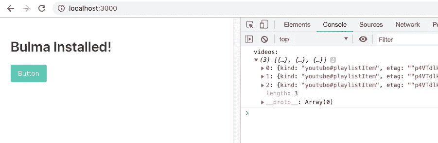

## 创建可重复的视频组件

现在我们有了一个对象数组，让我们准备一个组件，它可以获取这些信息并创建一个带有缩略图、视频链接和视频标题的卡片。

在组件文件夹中创建一个新文件 **Video.js** 。

```
// components/Video.jsimport React, { Component, Fragment } from 'react'export default class Video extends Component {
  constructor (props) {
    super(props)
  }render () {
    const vid = this.props.data.snippet
    console.log(vid) const thumbnailURL = vid.thumbnails.high.url
    const { title, description } = vid
    const vidID = vid.resourceId.videoId
    const vidURL = `[https://youtu.be/${vidID}`](https://youtu.be/${vidID}`)return (
      <Fragment>
        <div className='card'>
          <div className='card-image'>
            <figure className='image is-4by3'>
              <a href={vidURL}>
                
              </a>
            </figure>
          </div>
          <div className='card-content'>
            <div className='media'>
              <div className='media-content'>
                <p className='title is-4'>{title}</p>
              </div>
            </div>
            <div className='content'>{description}</div>
          </div>
        </div>
        <style jsx>{`
          .card {
            margin-bottom: 2rem !important;
          }
        `}</style>
      </Fragment>
    )
  }
}
```

现在我们有了这个视频组件，我们可以编辑我们的 index.js，用我们的 json 遍历这个组件。我们将向 index.js 添加一个构造函数，这样我们就可以用来自 json 的数据设置状态。然后，我们可以为播放列表中的所有视频映射视频组件。

```
// pages/index.jsimport React, { Component } from 'react'
import TheHead from '../components/TheHead'
import Video from '../components/Video'
import { getResults } from '../lib/db'export default class index extends Component {
  constructor (props) {
    super(props)
    this.state = {
      videos: []
    }
  }componentDidMount () {
    getResults().then(data => {
      this.setState({ videos: data })
    })
  }
  render () {
    return (
      <div>
        <TheHead />
        <section className='section'>
          <div className='columns'>
            <div className='column is-4 is-offset-4'>
              <h1 className='title'>Drone Videos</h1>
              {this.state.videos.map((vid, i) => (
                <Video key={i} data={vid} />
              ))}
            </div>
          </div>
        </section>
      </div>
    )
  }
}
```

保存项目并重新启动服务器。你的主页现在应该加载视频卡！

[](https://youtubeplaylist.now.sh/)

查看网站演示:[https://youtubeplaylist.now.sh/](https://youtubeplaylist.now.sh/)

# 部署网站

现在，我们的应用程序已经准备好向全世界展示了。在此之前，我们需要将**秘密**添加到我们的 Zeit Now 账户中。这将替换我们的。环境文件。

在根目录下创建一个名为 **now.json 的新文件。**这将我们的 env 变量替换为我们现在要使用的秘密。

```
*// now.json*{
    "build": {
        "env": {
            "APIKEY": "@ytplaylist-key",
            "PLAYLIST": "@ytplaylist-playlist"
        }
    }
}
```

接下来，打开您的终端，用下面的命令加载您的秘密。用您的。环境文件。

```
now secrets add ytplaylist-key PasteYourAPIKeyHerenow secrets add ytplaylist-playlist PasteYourPlaylistIDHere
```

一旦您添加了您的秘密，您就可以从终端部署您的项目。导航到您的项目，从根目录键入:

```
now
```

**恭喜你！！！**您的应用程序现已可用！[点击此处查看演示。](https://youtubeplaylist.now.sh/)