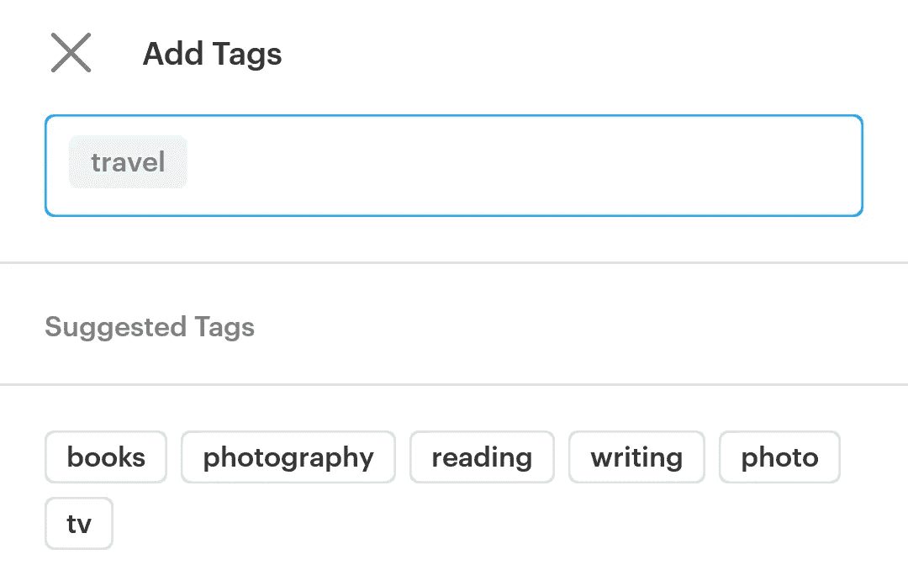

# 将业务需求转化为机器学习问题

> 原文：<https://levelup.gitconnected.com/turn-business-needs-into-machine-learning-problems-43408d445139>

## 机器学习问题

## 商业问题的 6 大机器学习解决方案

奥拉夫·阿伦斯·罗特内在 [Unsplash](https://unsplash.com?utm_source=medium&utm_medium=referral) 上的照片

## 介绍

当谈论大数据革命、行为预测，或者简单地说**公司的数字化转型**时，数据科学和机器学习是两个非常流行的词。

它们是新的工作领域，增强了传统的分析能力，有助于公司做出更好的决策。它依赖于有用的数据，只能应用于某些特定的问题。

> 数据科学已经成为公司增值的来源。

## 预测营销活动的盈利能力

公司通常需要评估一个活动的投资回报率，或者简单地比较几个活动，然后再推出，以便评估是否值得努力。也是广告代理公司**用来实时**调整其指标和价格的方法(如 [PPC](https://en.wikipedia.org/wiki/Pay-per-click) ( *点击付费、*一个广告的点击成本 *)* 或 [CPM](https://en.wikipedia.org/wiki/Cost_per_impression) ( *每印象成本*，一个广告的每千印象成本)。

亚马逊网站点击率(点击链接的访问者百分比)的预测。来源:代码为的[文件](https://paperswithcode.com/sota/click-through-rate-prediction-on-amazon)

这种类型的预测使用**回归**方法，因为我们试图预测一个数值。

## 产品推荐

推荐是数据科学家经常遇到的问题:建议在亚马逊上购买其他产品，在网飞上观看电影，在 Spotify 上听音乐，等等。这对最终用户和公司来说都非常有用，他们可以推荐最相关的内容。

推荐是对用户已经喜欢的产品的相似内容的提议。必须翻译的是相似性的概念。

的确，这个问题可以用许多不同的方式来表述。一种广泛使用的技术是**协同过滤**，它基于用户之间的相似性，或者产品之间的相似性。在这两种情况下，这都是一个**无监督问题**:我们将所有数据交给算法，让它尝试确定不同实体之间的关系。

来源:[5 分钟内建立自己的推荐系统！](https://towardsdatascience.com/build-your-own-recommender-system-within-5-minutes-30dd40388fbf)

## 给客户打分

评分是营销领域中一种广泛使用的技术。所获得的分数通常反映了个人将对营销请求做出响应或将属于期望目标*的概率(例如，潜在客户将成为付费客户的概率，或者在银行或保险公司的情况下，客户将不偿还贷款的概率)。*

评分通常与**回归**方法、**监督或非监督**相关，取决于训练数据。

曾经是统计人员的责任，现在往往是数据科学家的责任，为客户打分。这种类型的评分通常使用定义客户的许多特征(年龄、性别、城市等)来完成。).

## 识别异常值和罕见事件

第一种类型的自动分类是识别所谓的罕见事件:*垃圾电子邮件、欺诈性交易、辱骂性文本等。*

我们可以通过标注训练数据(例如“罕见事件”和“正常事件”)将这个问题视为一个监督分类问题。

但事实上，我们也可以执行第一次建模(**监督或非监督**)，这将允许我们对通常的行为进行建模。然后，我们简单地设置一个距离标准，该标准允许我们确定输入是否离模型太远，即离预期行为太远。那么，困难就在于如何选择针对当前问题的正确距离标准。

在下面的图表中，我们可以说一些值离其余的值太远，因此可以被认为是异常值**。**

****

**来源:[描述性统计:数据分析](https://medium.com/dataseries/understand-descriptive-statistics-c29282b7a62e)**

## **给产品分配一个类别**

**随着经销商产品目录的增长，编目问题会慢慢解决，因为这需要艰苦的工作，因此需要大量的时间。有了正确的训练输入，这个任务可以用**分类算法**自动完成。**

**事实上，我们在这里处理的是典型的**监督分类问题**:已经分类的产品可以用作训练数据，产品特征，甚至直接是图片，可以用作我们分类算法的输入变量。**

****

**来源: [getpocket](https://help.getpocket.com/article/906-pocket-premium-suggested-tags)**

## **细分网站访问者**

**基于之前的研究或对公司客户的定性了解，您希望自动对您的客户进行分类，并将他们分配到不同的细分市场(*或多或少可能会购买，例如*)。**

**在实践中，这种自动细分对于网站的访问者非常有用，以便向他们推荐合适的产品。**

**我们可以:**

1.  **通过手动注释训练客户群中感兴趣的部分，执行**监督分类**。**
2.  **尝试使用**回归**预测客户的转化敏感度，然后根据该标准进行细分(例如，< 1%对> 1%可能转化)；**
3.  **执行**无监督分类**以检测可单独作为目标的新兴趣组；**

**使用这些算法的困难，特别是对于罕见的事件，是收集足够的训练数据，包含最大的变化。在将模型部署到生产中之前，由您来处理您拥有的数据，最重要的是验证模型的性能！**

## **结论**

**您已经看到了一些针对业务问题的常见机器学习解决方案的示例:**

1.  **预测营销活动的盈利能力。**
2.  **产品推荐。**
3.  **给客户打分。**
4.  **识别异常值和罕见事件。**
5.  **给产品分配一个类别。**
6.  **细分网站访问者。**