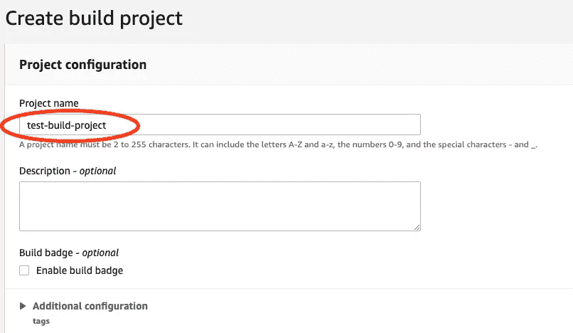

# 将 Raspberry Pi 转化为服务器并在 AWS 中实现 CI/CD 管道

> 原文：<https://levelup.gitconnected.com/turn-raspberry-pi-into-server-and-implement-ci-cd-pipeline-in-aws-752c5321dfe4>

我一直致力于自我发展和学习新技术。所以，我问我的大脑，为什么不利用这些有趣的隔离时间来刺激它。不到一毫秒，我的大脑回答道:“见鬼，是啊”。那是所有行动开始的地方！

我被邀请加入一个名为“Pi 的一片”的小型社区团体，寻找希望通过项目推动他们对树莓 Pi 的理解的爱好者。

通过小组的推荐，我点了一杯树莓派零度。几个小时后，我想起我已经有一个前阵子别人借给我的没用过的树莓 Pi 3 了。一个巨大的微笑浮现在我的脸上，因为我不必等待新邮件的到来。该小组的想法是在家里安装一台服务器，“只是因为”这是一种学习体验。

该小组的想法是在家里安装一台服务器，作为一种学习体验。(过度缩放)

最终，我们的架构会是这样的。这包括您托管在 Raspberry Pi 上的网站，可通过公共互联网访问。


我们一起去执行任务吧。

**获得装备:**

您将需要以下内容:

*   微型 USB
*   电力电缆
*   HDMI 电缆
*   微型 SD 卡(建议 32GB)
*   键盘
*   树莓派
*   带 HDMI 输入的监视器
*   路由器连接到 WiFi
*   老鼠
*   SD 卡适配器

**准备 SD 卡**

希望你有 SD 卡读卡器。

将 microSD 卡插入适配器，然后插入您的笔记本电脑/PC，并完全格式化。

现在让我们在这里为来自[的树莓 Pi 安装操作系统(OS)。完成后，用你最喜欢的工具将它刻录在你的 microSD 卡上(我的工具是](https://www.balena.io/etcher/) [BalenaEtche](https://www.balena.io/etcher/) )。如果不知道怎么刻录，就按照*_ 将 OS 镜像刻录到 microSD 卡 _* 一节。

如果您现有的 SD 卡中有您不使用的数据，您也可以按照以下说明对其进行格式化

**Linux 操作系统 GUI:**

1.  将 microSD 卡插入 SD 适配器

2.右键单击 SD 卡，然后单击*_ 属性 _*

3.点击*打开磁盘*

4.选择要格式化的分区。

5.点击*设置*图标(两个轮子)

6.选择*格式化分区*

7.选择*擦除*

8.使用为所有设备选择

*格式化所花的时间会因数据量的不同而不同。同时，喝杯咖啡。*

***将操作系统映像刻录到 microSD 卡***

*1.解压缩您下载的压缩 Raspbian 操作系统映像。*

*2.打开 BalenaEtcher。*

*3.选择要刻录到 SD 卡上的操作系统映像*

*4.选择目标为 SD 卡。*

*5.点击*闪光灯**

***在 microSD 卡上安装操作系统***

*将 microSD 卡插入 Pi 并打开 Pi。它自己引导和安装操作系统。*

**错误提示——如果您插入 SD 卡，显示器屏幕保持黑屏。**

*1.把 SD 卡拿出来，*

*2.轻轻地向上拉黑色部分(如下所示),直到它自己停止*

*3.把它推回去。*

*4.将 SD 卡插入*

**

***将 Pi 连接到互联网***

*按打开端子。CTRL + ALT + T 并通过运行以下命令切换到 root 用户*

```
*sudo su*
```

*在哪里*

*su —代表超级用户*

*然后，跑*

```
*raspi-config*
```

*这将打开 Raspberry Pi 配置工具*

*进入**网络选项**>**WiFi**>**【输入你的网络名称】** >点击**确定** > **【输入你的网络密码】** >点击**确定***

*现在在 GUI 中使用您的网络名称连接到互联网。*

***SSH 进入 Pi***

*您可以从 Linux、Mac 或其他 Pi 连接到该 Pi。我将从 Mac 上演示。*

*首先，我们需要知道 Pi 的 IP 地址。要找到它，请在您的 Pi 终端上键入 hostname -I。如果您正在运行 Pi headless(没有监视器)，您可以从路由器上的设备列表中找到 IP 地址。*

*我们需要从 rasp-config 中启用 SSH。打开终端，通过以下方式切换到超级用户:*

```
*sudo su*
```

*然后，跑*

```
*raspi-config*
```

*进入**界面选项**，启用 **SSH** 。*

*现在转到 SSH，在您的客户机上打开终端并键入*

```
*ssh [piUser]@[Pi_IP_ADDRESS]*
```

**安全提示:为了安全起见，请务必更改默认密码。**

***代码解释:***

*`ssh`:用于 ssh-ing 的关键字*

*`[piUser]`:无论你的用户名是什么(不要包括方括号)*

*`[Pi_IP_ADDRESS]`:您的 Pi 的 IP 地址(不包括方括号)*

*例如:*

```
*ssh pi@111.111.1.1*
```

*按下回车键后，系统会提示您输入密码，就这样，您就成功了。*

***将 Nginx 安装到码头上***

*首先，确保所有的包都通过运行*

```
*sudo apt update*
```

*现在，通过运行以下命令安装 nginx:*

```
*sudo apt install nginx*
```

***代码解释:***

*`sudo`:获得管理权限*

*`apt`:Ubuntu 的打包系统*

*`install`:安装关键字*

*`nginx`:要安装的包*

***测试网络服务器***

*现在，web 服务器应该已经启动并运行了。要检查运行:*

```
*sudo systemctl status nginx*
```

*输出应以绿色显示*活动(运行)**

*也就是说，最好的测试方法是通过以下方式请求页面:*

*1.`cd /var/www/html`:导航到 html 文件夹*

*2.`touch index.html`:创建一个名为 index.html 的文件*

*3.`vim index.html`:打开文件(如果`vim`不工作，安装它)*

*4.插入基本的 html 来测试服务器工作*

*5.转到您的浏览器*

*6.键入 pi 的 IP 地址(`[http://111.111.1.1](http://111.111.1.1)`)*

*如果一切顺利，你在家里有自己的服务器来显示你创建的页面。您的 Pi 已准备好托管。*

***通过 CI/CD 管道上传至 Pi***

*接下来，我们将在 AWS 中创建一个 CI/CD 管道，使用 Github 作为源代码和 CodeBuild 来构建项目。因此，当 Github 被提交时，就会自动触发管道。*

***第一步:***

*登录 **AWS** > **服务***

**

***第二步:***

*转到 **AWS 代码管道***

**

***第三步:***

*创建管道*

**

***第四步:***

*填写细节*

*出于以下原因，请确保该角色拥有对 S3、KMS 和 SSM 的读取权限:*

*   *S3 将存储我们加密的 SSH 私有密钥，我们需要从 S3 那里获得私有密钥*
*   *KMS 将解密从 S3 获取的 ssh 密钥*
*   *SSM 将存储我们的域名*

*点击**下一步***

**

***第五步:***

*选择 **Github** 作为**源级**。一旦选中，点击按钮，say 的**连接到 Github***

**

*连接后，填写存储库详细信息*

**

*点击**下一个**。*

***第六步:***

*从下拉列表中选择 AWS CodeBuild 作为构建提供者，并填写详细信息。如果您还没有创建一个构建项目，请单击创建项目(按照 6.1 中的步骤)。如果已经有了(跳到第 7 步)，它应该在**项目名称**的下拉列表中。*

*完成后，点击**下一步***

**

***步骤 6.1***

*单击构建项目:*

**

***第 6.2 步***

*命名项目并向下滚动*

**

***第 6.3 步:***

*从下拉列表中选择一个**源提供商**作为 **Github** ，然后**连接到你的 Github 账户**。选择您连接的回购是公开的还是您自己的。然后向下滚动。*

**

***步骤 6.4:***

*填写环境详细信息并向下滚动*

**

***第 6.5 步***

*添加一个**服务角色***

**

***步骤 6.6***

*选择 ***使用一个 buildspec 文件*** (见下图后的代码为您的 buildspec 文件)。这个 buildspec 文件必须位于项目目录的根目录下*

**

*下面是代码是`buildspec.yml`*

```
*version: 0.1env:parameter-store:PI_DNS: /codebuild/piRoarcoderphases:install:commands: - gem install jekyll bundler jekyll-paginate jekyll-sitemap jekyll-gistbuild:commands: - echo “******** Building Jekyll site ********” - jekyll build - echo “******** Get ssh key from S3 ********” - aws s3 cp s3://ssh-keys-zain/encrypted_id_rsa $HOME/encrypted_id_rsa - aws kms decrypt — ciphertext-blob fileb://$HOME/encrypted_id_rsa — output text — query Plaintext | base64 — decode > $HOME/decrypted_id_rsa - chmod 400 $HOME/decrypted_id_rsa - echo “******** Upload to Raspberry Pi ********” - scp -r -oStrictHostKeyChecking=no -i $HOME/decrypted_id_rsa ./* pi@$PI_DNS:/var/www/roarcoder.dev/html/ - rm $HOME/decrypted_id_rsa - rm $HOME/encrypted_id_rsa`*
```

***代码解释:***

*`version: 0.1`:表示正在使用的 buildspec 版本。*

*`env`:表示自定义环境变量的信息*

*`parameter-store`:从 AWS 系统管理器参数存储(SSM)中检索自定义环境变量。将值存储为键:值对*

*`BUCKET`:表示使用 S3 桶*

*`/codebuild/piRoarcoder`:SSM 参数命名约定，如`/{serviceName}/{parameterName}`*

*代码构建有不同的阶段，但是我们只使用安装和构建。每个阶段都包含各自要运行的命令。*

*`install` : Sections 运行命令来安装构建项目所需的所有必要工具*

*安装 Jekyll 及其所有依赖项，因为我正在使用 Jekyll 静态网站生成器*

*`build`:运行构建项目所需命令的部分*

*`jekyll build`:在不包含源代码的单独的 folder _site 中输出应用程序的生产就绪版本。*

*`aws s3 cp s3://ssh-keys-zain/encrypted_id_rsa $HOME/encrypted_id_rsa` —从我的 S3 桶中获取我的加密私有 ssh 密钥，并将其存储在容器中*

*`aws kms decrypt — ciphertext-blob fileb://$HOME/encrypted_id_rsa — output text — query Plaintext | base64 — decode > $HOME/decrypted_id_rsa`:解密加密密钥使用*

*`chmod 400 $HOME/decrypted_id_rsa`:授予密钥只读权限*

*`scp -r -oStrictHostKeyChecking=no -i $HOME/decrypted_id_rsa ./* pi@$PI_DNS:/var/www/roarcoder.dev/html/`:将当前目录下的所有内容安全地直接复制到我的虚拟主机 Pi 的 html 中。*

*`rm $HOME/decrypted_id_rsa`:从容器中取出解密的密钥私钥*

*`rm $HOME/encrypted_id_rsa`:从容器中取出加密密钥私钥*

***第 6.7 步***

*从下拉菜单中选择**无工件**。*

*工件是构建产生的输出。我们不想在 AWS 中保存它们，因此我们选择**无工件**。buildspec 文件中的命令行会将文件直接传输到 Pi 上。*

*向下滚动*

**

***步骤 6.8:***

*保留所有默认设置，并点击**创建构建项目***

**

***第七步:***

*我们不会在部署阶段使用任何东西，所以单击**跳过部署阶段。***

**

*您将被要求确认，点击**跳过***

**

***第八步:***

*查看管道，滚动到页面底部，点击**创建管道***

**

***第九步:***

*您的管道将被构建，执行将自动开始。我不得不停止执行死刑，因为我只是想让你看看。*

**

*现在，只要您提交对 Github 存储库的更改，这个管道就会自动触发。*

*通过从您的私钥位置运行，将目录文件从您的计算机(客户端)安全地复制(`scp`)到您的 pi(主机):*

*假设:您已经知道如何在客户机和主机之间设置 ssh 密钥*

```
*scp -i your-private-key /path/to/website/folder/* pi@111.111.1.1:/var/www/html*
```

*其中:*

*`scp`:安全复印*

*`-i`:指定私钥*

*`your-private-key`:您的私钥名称*

*`/path/to/website/folder`:你网站的文件夹路径*

*`*` —文件夹内的所有文件*

*`pi@111.111.1.1`:Pi 的用户和 Ip 地址*

*`:` : ip 地址和路径分隔符*

*``/var/www/html` ` —内容将上传到的 HTML 目录的路径*

*如果一切顺利，你应该看到你的网站上的 ip 地址 111.111.1.1(这将是你自己的 IP 地址)*

***在 Pi 中设置 SSL 证书***

*我们将使用 Certbot 来获取我们的 SSL 证书。如果您不熟悉 Certbot:*

> *Certbot 是一个免费的开源软件工具，可以自动使用 Let's 加密手动管理的网站上的证书来启用 HTTPS。*

*1.嘘进入你的 pi*

*2.通过运行以下命令安装 certbot*

```
*apt-get install certbot*
```

*3.获得证书*

```
*certbot certonly — standalone -d [your-domain-name]*
```

***代码解释:***

*`certbot`:生成证书的服务*

*`certonly`:只领证，其他不领。因为 certbot 可以自己安装证书，但我不希望它对我的配置文件进行更改以启用 SSL。我想自己进行配置更改。*

*`— standalone` : Certbot 将使用自己的 web 服务器来通过域的验证过程*

*`-d`:指定域名的参数*

*`[your-domain-name]`:指定你的域名。例如:不带方括号的`example.com` 或`[www.example.com](http://www.example.com)`*

*4.回答所有被问到的问题*

*5.一旦生成，它将显示一段**重要提示**并按它说的做。*

*6.复制粘贴`fullchain.pem`和`privkey.pem`的路径。你很快就会需要它。*

*7.转到`/etc/nginx/sites-available`复制默认页面并将其重命名为您的域名*

*8.转到站点-可用文件夹*

```
*cd /etc/nginx/sites-available*
```

*9.创建另一个页面*

```
*touch [your-domain-name]*
```

*10.将**默认**页面的内容复制到您新创建的页面*

```
*cp default [your-domain-name]*
```

*11.找`**听 80；**`和`**server _ name[some-domain]**`及其下输入:*

```
*listen 443 ssl default_server;ssl_certificate [copy and past the line from step 6 that has fullchain.pem at the end]ssl_certificate_key [copy and past the line from step 6 that has privkey.pem at the end]root /var/www/[folder-where-you-uploaded-your-site]*
```

*12.通过按下 **ESC** 并键入`:wq`保存并退出文件*

*13.运行以下命令，检查配置文件中是否有语法错误*

```
*sudo nginx -t*
```

***代码解释***

*`nginx`:服务器*

*`-t`:测试*

*你不应该收到任何错误*

*14.重新加载 Nginx*

```
*sudo systemctl reload nginx*
```

*在哪里*

*`systemctl`:控制服务管理器和 systemd 系统*

*`reload`:不停止服务器(用于避免停机)*

*`nginx`:服务器名称*

*15.通过运行以下命令在 Pi 上启用 HTTPS(端口 443 ):*

```
*sudo ufw allow 443*
```

***通过公共互联网访问 Pi***

*由于您的 Pi 位于您的专用网络中，您无法使用当前配置从公共互联网连接到它。为此，路由器必须配置端口转发。*

*端口转发允许您在特定端口上将入站流量转发到您的专用网络，将它们连接到您的 Pi 的本地 IP 地址。每个路由器都不一样。*

*1.转到您的路由器 IP 地址*

*2.使用管理员凭据登录*

*3.转到您的**动态域名服务器(DDNS)** 设置并启用它。对我来说，那是在互联网服务中*

**

*4.根据您的路由器，您将有一个提供商。我有 DynDns.org 和 No-IP.com。我选择了 DynDns.org，因为 No-IP.com 不支持我的路由器*

*5.注册服务并在 DDNS 设置中输入详细信息，如上图所示。*

*6.点击**保存**。*

*7.转到端口转发并启用以下端口*

*   *SSH 的端口 22*
*   *HTTP 的端口 80*
*   *HTTPS 的 443 端口*

*下面是如何转发端口 22，其他类似*

**

*`Mapping Name`:给你的端口起个名字*

*`Application`:协议名(SSH 为 SecureShellServer，HTTPS 为 SecureWebServer，HTTP 为 WebServer)*

*`Internal Host`:设备名称(您的 Pi)*

*然后，点击**保存**。*

*最后，您的端口映射部分应该如下所示*

**

*就是这样。现在你可以通过公共互联网访问你的网站/博客。*

*为了测试它，连接到您的**家庭网络 WIFI** ，并在浏览器中输入您的 **Pi 的私有 IP** 地址。*

*要从公共互联网进行测试，请断开您家中的 WIFI，并在 URL 中输入`[hostname].[domainName]`，您应该会看到您上传到 Pi 的`index.html`。*

***结论***

*虽然网络不是我的强项，但这个项目给了我更多的理解和信心。*

*如果它对你不起作用，或者你正面临任何问题，请随时联系我，我会帮助你。*