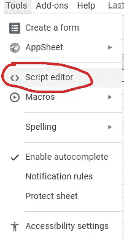
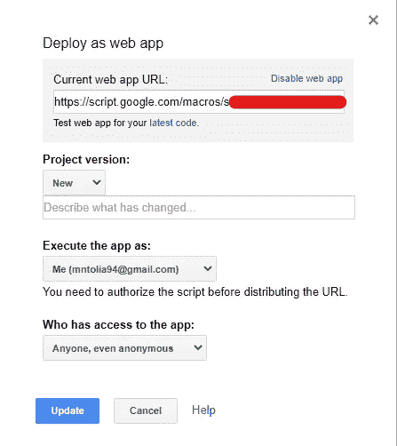
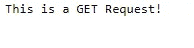
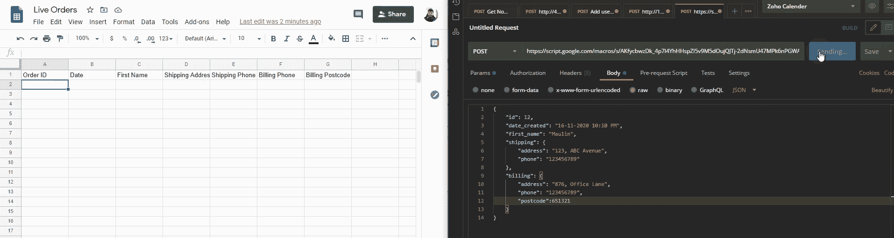
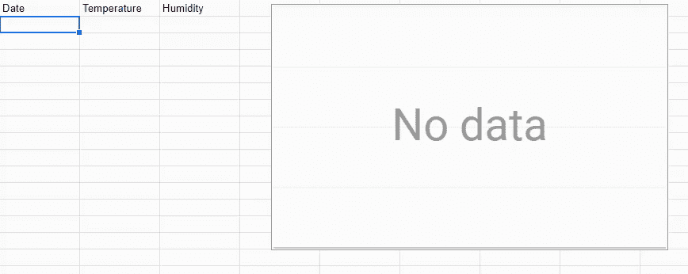

# 把你的谷歌表单变成一个网络应用

> 原文：<https://levelup.gitconnected.com/turn-your-google-sheet-into-a-web-application-f766f1ff8b98>

Samuel Sianipar 在 [Unsplash](https://unsplash.com/s/photos/excel?utm_source=unsplash&utm_medium=referral&utm_content=creditCopyText) 上拍摄的照片

当与 [Apps 脚本](https://developers.google.com/apps-script)结合使用时，Google Sheets 会是一个非常强大的工具。应用程序脚本类似于 MS Excel 中的宏，但有更多的可扩展性。

想象一下，您有一个电子商务网站，您需要一个电子表格在下订单时更新。你可以使用 API 在固定的时间间隔提取数据，但是一个更简洁的方法是使用 Google Sheets 作为网络服务器或者一个[网络钩子](https://en.wikipedia.org/wiki/Webhook)。

在本文中，我将向您展示如何将您的 Google Sheet 转换成一个 web 应用程序来捕获数据并填充表单。这是使用类似于 [Zapier](https://zapier.com/) 的工具的免费替代品，但是需要一些编码经验。

# 先决条件

*   基本了解 web 服务(`GET` & `POST`请求)。
*   JSON 的基础知识。
*   最低限度的 Javascript 经验。

# 设置表单

我们需要设置的第一件事是我们将用来捕获数据的表。

导航到*工具- >脚本编辑器*。这将为应用程序脚本编辑器打开一个新标签。

脚本编辑器

# 创建 Web 服务器

为了收集数据，我们需要能够捕获数据源发送的`GET`或`POST`请求。为此，我们可以使用`doGet`和`doPost`功能。以下是包含这两个函数的示例代码:

样本函数

您可以在“应用程序脚本”选项卡中将代码添加到 Code.js 文件中。代码很简单。`doGet`和`doPost`函数分别用于处理`GET`和`POST`请求。

大多数时候，数据是作为 POST 请求发送的，所以我将重点放在`doPost`函数上。`doPost`函数使用来自请求体(`e.postData.contents`)的`JSON.parse()`解析 JSON 数据，并将我需要的数据添加到工作表中。

> 应用程序脚本也可以解析 CSV 和 XML 数据。

现在我们需要一个 URL 来发送请求。

# 部署 Web 应用程序

在应用程序脚本选项卡上导航到*发布- >部署为 web 应用程序…* 。

几秒钟后，会弹出一个菜单:

部署为 web 应用程序屏幕

web 应用程序的 URL 将列在顶部。**复制它**。每个部署的 URL 将保持不变。

每当您更改代码并部署新版本时，将项目版本设置为 *New* 。

设置*执行 app 为*到 *Me* 。

最后一个字段是有权访问应用程序的*。将此设置为*任何人，甚至匿名*。*

> 这将允许任何拥有 web 应用程序 URL 的人向其发送请求。你总是可以用[令牌认证](https://github.com/tanaikech/taking-advantage-of-Web-Apps-with-google-apps-script#requiredparameters)来保护它。

完成后，点击*更新*按钮。

# 测试功能

要测试您是否正确设置了应用程序脚本，只需复制上一步生成的 URL，并在浏览器中打开它。`doGet`函数返回如下响应:

> 如果页面没有打开或要求您登录，请确保您的代码是正确的，并且您已经使用上述配置部署了 Apps 脚本。

为了测试`doPost`函数，我将使用 [Postman](https://www.postman.com/) 向 URL 发送几个`POST`请求。这是我将使用的样本数据:

你可以在下面的 GIF 中看到，当我发送`POST`请求时，*实时订单*表会自动更新。

实时订单

现在，我可以将 URL 作为 webhook 添加到我的电子商务网站，以便实时收集订单数据。

这方面的应用是无限的。这是我创建的另一个表，显示来自各种传感器的温度和湿度数据的实时图表。

使用 Google Sheets 的最大优势是它的简单性，即使对于非技术用户来说也是如此。

# 限制

谷歌应用程序脚本有[配额](https://developers.google.com/apps-script/guides/services/quotas)取决于你的谷歌账户类型。(消费者(免费用户)、G 套件、G 套件业务)。

Apps 脚本的运行时间限制被设置为每次调用 6 分钟 & *50 MB* 数据*——这意味着你不能向它发送大数据块。*

对于一个**免费用户**来说，请求的数量也被限制为每天 ***20，000 个*** ，对于一个 **G 套件用户**来说，请求的数量被限制为每天 ***100，000 个*** ，这对于大多数用例来说已经足够了。

# 结论

在本文中，我们看到了如何将 Google Sheets 用作简单的 web 服务器&如何用 POST 请求数据填充表单。您也可以将此功能用于其他服务，如 Google Docs、Slides 等。

根据您的用例，您可以使用 Google Sheets 创建一个带有可视化功能的全面的实时仪表板。

后续文章:[https://medium . com/git connected/how-to-call-APIs-direct-from-Google-sheets-6e 3d 25 c 42 e 09](https://medium.com/gitconnected/how-to-call-apis-directly-from-google-sheets-6e3d25c42e09)

# 有用的链接

 [## Codelabs:应用程序脚本基础| Google 开发者

developers.google.com](https://developers.google.com/apps-script/quickstart/fundamentals-codelabs)  [## Web 应用程序|应用程序脚本| Google 开发者

### 如果您为脚本构建了用户界面，则可以将脚本发布为 web 应用程序。例如，一个脚本可以让…

developers.google.com](https://developers.google.com/apps-script/guides/web)  [## tanaikech/使用 google-apps 脚本利用 Web-Apps

### 这是一份利用谷歌应用程序脚本(GAS)的网络应用程序的报告。有 Web 应用程序作为应用程序之一…

github.com](https://github.com/tanaikech/taking-advantage-of-Web-Apps-with-google-apps-script#accesstokenforaccessingtowebapps) 

# 分级编码

感谢您成为我们社区的一员！ [**订阅我们的 YouTube 频道**](https://www.youtube.com/channel/UC3v9kBR_ab4UHXXdknz8Fbg?sub_confirmation=1) 或者加入 [**Skilled.dev 编码面试课程**](https://skilled.dev/) 。

 [## 编写面试问题+获得开发工作

### 掌握编码面试的过程

技术开发](https://skilled.dev)