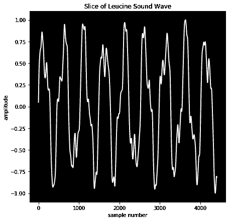
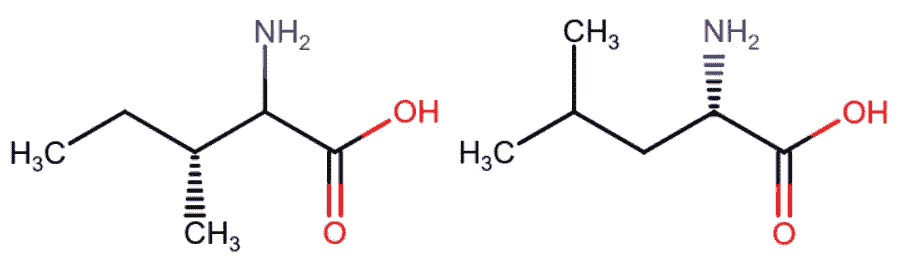
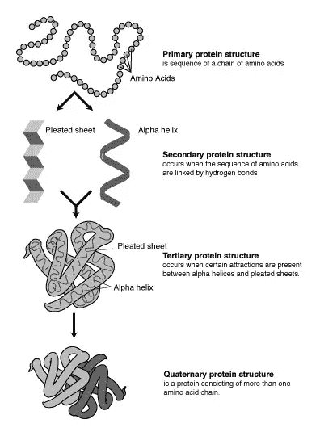
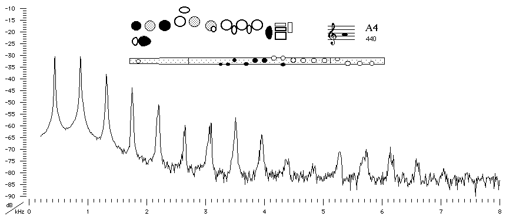

# 用 Python 把蛋白质变成音乐(第 1 部分)——旋律

> 原文：<https://levelup.gitconnected.com/turning-a-protein-into-music-with-python-ba655c694097>

发音是将信息转换成非语音音频。一个经典的例子是盖革计数器，它产生一种咔嗒声，其频率指示了电离辐射的水平。这项技术可以应用于几乎任何类型的信息，2019 年 6 月发表的[论文](https://pubs.acs.org/doi/10.1021/acsnano.9b02180?__cf_chl_jschl_tk__=c25b1ad8cf4674b202bdd90af9c7aa2fd48d6889-1586897343-0-AcQi-NxWRr5uZsR7WgQGa_HG7bw2_JVK4GVXeh39HUMVRCLwCOrqo2lyeZRdR6DB3UaM5GbL8UQWs_xCzFqpn2fRZRoqeFkj_UfGRmlD229p2NTmC58h5MdsOtkZyqUGI9ekHrfRhWtQM8-689ucrYP-v1aR-Ef1lIw3fYVVZw-aRfpXOH4Lfo2GyQA4D10jZAPXdStZXGkeTRGQMLDddO_wWc4QwiPSqF7UOPz9VV--YDplR3YRxiDb3MSngsHRqLev98yePv6p6kLzA9zEKkB94aJus69gCbpsPcW396himRBln-KiPvPhMUJS92tX3A)中介绍了一个有趣的应用。它描述了一种将蛋白质转化为音乐的方法。然而，这种转变并不纯粹是为了艺术。这些音乐被输入到一个 RNN 中，可以用来生成新的音乐序列。**如果某种特定质量的蛋白质被发音并用于训练神经网络，那么音乐输出也将具有这种质量。**这在蛋白质结构的研究中有着有趣的含义。



氨基酸亮氨酸的声波切片。

## 蛋白质到底是什么？

蛋白质是对生命至关重要的生物分子。它们执行各种各样的任务，从转录 DNA 到在血液中携带氧气。蛋白质是通过由一段 DNA 编码的称为氨基酸的分子链的*折叠*形成的。只有 20 种氨基酸用于蛋白质合成，它们都具有相同的核心结构，但不同之处在于它们的侧链不同。这可以从下图中看出，图中显示了两种氨基酸的化学结构。



氨基酸的两个例子:异亮氨酸(左)和亮氨酸(右)。每个分子的右边是相同的，但是左边部分，称为侧链，由于甲基的位置不同而不同。

蛋白质的功能与其结构直接相关，其结构与其序列直接相关。你可以在这里了解更多关于序列与结构的关系[，但是重要的思想是氨基酸的序列决定结构。尽管我们理解了这种关系，但我们仍然无法仅根据氨基酸序列来预测蛋白质的结构。](http://www.fordcombs.com/protein_modeling/)

这个领域的[蛋白质结构预测](https://en.wikipedia.org/wiki/Protein_structure_prediction)正在不断前进，有许多易于使用的服务器可供您试用。例如，看看[瑞士型号](https://swissmodel.expasy.org/)和 [Phyre2](http://www.sbg.bio.ic.ac.uk/~phyre2/html/page.cgi?id=index) 。我们知道蛋白质的结构是由如下所示的序列编码的，但是我们不能完全确定地预测它的结构。蛋白质的超声处理给了我们隐藏在氨基酸链中的信息的不同视角，并可能导致该领域的新进展。



NHGRI 提供:https://commons.wikimedia.org/w/index.php?curid=1318488 国家人类基因组研究所，公共领域

**氨基酸作为音符**

音符有两个基本属性:音高和音长。用最简单的术语来说，一个音符的音高就是它以赫兹为单位的频率。无论你在钢琴上还是在吉他上弹奏 A4，你都会听到类似的 440 赫兹振动的声音。声音之间的差异被称为音色。当你在任何乐器上演奏一个音符时，你实际上创造了不止一个振动。你以基本振动的整数倍触发振动；这些被称为[谐波](https://en.wikipedia.org/wiki/Harmonic#Partials,_overtones,_and_harmonics)或泛音。乐器的物理特性增强了一些谐波，这导致了不同的声音质量。**关键概念是有许多振动相互叠加。**这可以从下面一支笛子的声谱中看出。



[https://newt.phys.unsw.edu.au/music/flute/modernB/A4.html](https://newt.phys.unsw.edu.au/music/flute/modernB/A4.html)

[**分子振动**。](https://en.wikipedia.org/wiki/Molecular_vibration)原子之间的键可以拉伸、扭曲、摇摆，并做出其他几种运动。这些运动被称为振动频率，它们被测量用于蛋白质合成的[氨基酸](https://www.sciencedirect.com/science/article/pii/S1044030506007094)。**2019 年论文中提出的新观点是，这些振动模式可以被视为音乐泛音。在接下来的章节中，我将向你展示如何使用这种技术通过 python 将蛋白质转换成音乐。**

**获取频率**

这里有一个字典，可以很容易地将三个字母的氨基酸符号转换成一个字母的氨基酸符号:

```
# Dictionary to be used for converting amino acid abbreviations
aa_3to1 = {'CYS': 'C', 'ASP': 'D', 'SER': 'S',
'GLN': 'Q', 'LYS':'K','ILE': 'I', 'PRO': 'P',
 'THR': 'T', 'PHE': 'F', 'ASN': 'N', 'GLY': 'G',
 'HIS': 'H', 'LEU': 'L', 'ARG': 'R', 'TRP': 'W',
 'ALA': 'A', 'VAL':'V', 'GLU': 'E', 'TYR': 'Y', 'MET': 'M'}
```

你可以从我的 github [这里](https://github.com/frodoCombs/Amino_Acid_Frequencies)下载氨基酸频率表。

```
# Collect amino acid vibrational frequencies as wavenumbers
# nu refers to the greek letter Nu, used for wavenumbersimport pandas as pd
nu_df = pd.read_csv('path/to/aa_freq.csv', sep=',',header=0)
# replace NA's with 0's
nu_df.fillna(0,inplace=True)
```

注意，这些是以每单位距离的周期数测量的波数频率。音乐频率通常以赫兹或每秒的周期数来衡量，因此我们需要进行以下转换:频率=光速/(1/波数)。这是在下面完成的。

```
from scipy.constants import speed_of_light as speedlight
#convert to np array
nu = nu_df.values
for ro in range(nu.shape[0]):
    for co in range(nu.shape[1]):
        if co == 0:
        #Convert amino acid code from 3 letter to 1 letter
            aa = nu[ro][co]
            aa = aa[0:3].upper()
            nu[ro][co]= aa_3to1[aa]
        else:
        # Convert from wavenumber to frequency
        # wavelength = 1/wavenumber
        # frequency = speed of light / wavelength
            if nu[ro][co] > 0:
                freq = speedlight / (1/nu[ro][co])
```

现在我们需要将这些频率调整到人类听觉范围，大约是 20 到 20，000 Hz。在下面的代码中，频率表中包含氨基酸单字母代码的第一列被删除并存储在 aa_list 中。然后将该表缩放到人类听觉范围。

```
aa_list = nu[:,0]      # list of amino acids
nu = nu[:,1:]          # remove first column                
max_freq = nu.max()    # max and min 
min_freq = nu.min()    # need to exclude first columnhuman_range = 20000 - 20
for ro in range(nu.shape[0]):
    for co in range(nu.shape[1]):
        if nu[ro][co] > 0:
            # First scale to 0 to 1
            nu[ro][co] = (nu[ro][co] - min_freq)/ max_freq - min_freq
            # Scale to human hearing range 20 - 20000 Hz
            nu[ro][co] = (nu[ro][co] * human_range) + 20
```

**使用频率构建音符**

利用泛音的概念，我们可以通过将频率相互叠加来为每个氨基酸构建音符。在一个典型的乐器中，泛音随着频率的增加而变得越来越小，所以我在这里应用了这个概念。做这件事没有正确的方法。我建议您尝试用不同的方式添加泛音，并聆听产生的声音。下面的代码片段显示了一个生成给定长度的“氨基酸注释”的函数。

```
def aa_note(aa,length)
    row = np.where(aa_list == aa)[0][0]
    wave = np.zeros(int(44100 * float(length)))
    harm = 0

    for freq in nu[row]:
        if freq == 0:
            break
        else:
            volume = np.exp(-harm)
            phases = np.cumsum(2.0 * np.pi * freq / 44100 * np.ones(int(44100 * float(length))))
            wave += np.sin(phases) * volume
            harm += 1
    # scale wave to values between 1 and -1
    wave = 2.*(wave - wave.min())/np.ptp(wave)-1
    return wave
```

该函数以秒为单位接收一个氨基酸字母和一个长度。然后使用氨基酸字母在频率表中找到相关的频率行。然后空波以每秒 44100 个样本初始化，谐波计数器初始化为 0。然后，通过遍历表中的每个频率来构建波。当谐波计数器使用指数函数增加时，频率的音量减小。phases 数组中的每个元素保存波在给定样本中循环通过的弧度数的值。然后将相位输入 np.sin()以生成波，该波乘以体积并添加到现有波中。通过这种方式，谐波以递减的音量叠加在一起，从而产生一个给定长度的音符。最后，这个波形被缩放到[-1，1]的范围，以防止扬声器在播放过程中削波。

**制作音乐**

现在我们可以使用来自[尤马·米希拉](# https://github.com/yuma-m/synthesizer)的非常酷的合成器库来制作一些音乐。首先我们像这样打开一个播放器:

```
from synthesizer import Player, Synthesizer,
player = Player()
player.open_stream()
```

然后我们像这样创造我们的音乐序列:

```
# a sample protein sequence
protein_sequence = 'GIWGVDSAQVVT'unit_length = 0.5
melodic_sequence = []
for residue in protein_sequence:
    sound_wave = aa_note(residue,unit_length)
    melodic_sequence = melodic_sequence + sound_wave.tolist()melody = np.asarray(melodic_sequence)
melody = 2*(melody - melody.min())/np.ptp(melody)-1
```

我已经包含了一个样本蛋白质序列，但是你可以从 [UniProt](https://www.uniprot.org/) 下载真实序列。我使用 0.5 秒的固定单位长度，但是你可以创造性地改变长度。最后我们可以演奏我们的音乐。

```
player.play_wave(melody)
```

**音乐样本**

这里有一些众所周知的蛋白质的简单例子。每个氨基酸音符持续播放 0.3 秒，带有一个简单的包络以减少削波和一些混响以使其更有趣。

**未来工作**

使用上述方法，蛋白质可以被转换成音乐序列。在创作方面，可以对音符创作进行一些修改。除了仅使用正弦波，还可以使用其他类型的波，如方波或锯齿波或几种波形的组合。随着谐波频率的增加，体积的变化也是可变的。其他想法包括创建一个 ADSR 包络来改善音质，以及某种形式的音符长度控制来改变旋律模式。

我正在努力重新创建和发布的 2019 年论文还有两个方面:I)应用 music21 库创建传统西方音乐记谱法的乐谱，ii)训练 RNN，以便可以从类似蛋白质的数据集创建新音乐。

一定要去看看[第二部(和声)](/turning-a-protein-into-music-with-python-part-2-harmony-a3c2ffa748be)和[第三部(RNN)](https://towardsdatascience.com/protein-music-with-python-part-3-applying-a-recursive-neural-net-c841aee25126) 。