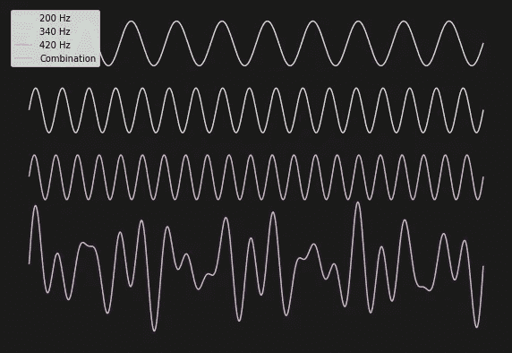
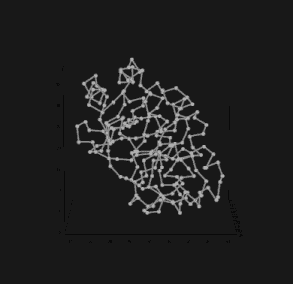
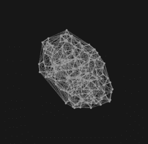
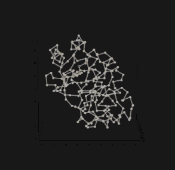
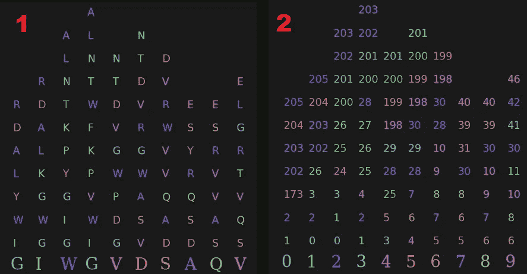
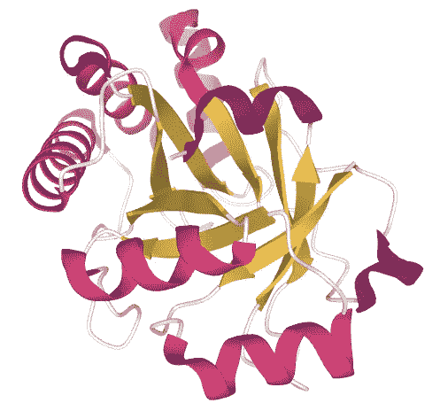

# 用 Python 把蛋白质变成音乐(第二部分)——和谐

> 原文：<https://levelup.gitconnected.com/turning-a-protein-into-music-with-python-part-2-harmony-a3c2ffa748be>

蛋白质可以通过将其分子振动转化为声波而变成音乐。我已经展示了一个简单的 [Python 实现](/turning-a-protein-into-music-with-python-ba655c694097?source=friends_link&sk=54426e7c7a62bd7eb89e0dd008895775)，它采用一系列氨基酸并产生一段旋律，但是音乐可以不仅仅是旋律。激发这项研究的[论文](https://pubs.acs.org/doi/10.1021/acsnano.9b02180?__cf_chl_jschl_tk__=c25b1ad8cf4674b202bdd90af9c7aa2fd48d6889-1586897343-0-AcQi-NxWRr5uZsR7WgQGa_HG7bw2_JVK4GVXeh39HUMVRCLwCOrqo2lyeZRdR6DB3UaM5GbL8UQWs_xCzFqpn2fRZRoqeFkj_UfGRmlD229p2NTmC58h5MdsOtkZyqUGI9ekHrfRhWtQM8-689ucrYP-v1aR-Ef1lIw3fYVVZw-aRfpXOH4Lfo2GyQA4D10jZAPXdStZXGkeTRGQMLDddO_wWc4QwiPSqF7UOPz9VV--YDplR3YRxiDb3MSngsHRqLev98yePv6p6kLzA9zEKkB94aJus69gCbpsPcW396himRBln-KiPvPhMUJS92tX3A)提出了一种蛋白质发音方法，可以产生有节奏、有旋律的音乐。本文展示了如何扩展该方法以包含和声**。**

**旋律与和声**

不同频率的声波结合产生了和声。

旋律的简单定义是一连串被视为一条音乐线的音符。这个系列的第一部分中制作了旋律的例子。虽然这些例子很有趣，但大多数音乐作品都包含和声，或者同时演奏的几组音符。同时演奏的音符可以是悦耳的，称为协和音，也可以是紧张而不和谐的，称为不协和音。我们的音乐品味决定了我们对和谐与不和谐的定义，但是这些对立的概念存在于所有的音乐中。

**蛋白质和谐**

发音和音乐创作的主要区别在于前者是客观的，后者是主观的。在这里，将非听觉信息转换成声音是一种从不同角度观察信息的工具。在确定转换方法时所做的选择可以被认为是创造性的和主观的，但是这些选择不能以丢失信息为代价。在[第一部分](/turning-a-protein-into-music-with-python-ba655c694097)中，通过将序列中每个氨基酸的分子振动转换成音符，蛋白质序列被转换成旋律。通过定义一致的方法来识别要一起演奏的音符组，可以创造出和声。

蛋白质是三维生物分子。蛋白质序列中的每个氨基酸在蛋白质结构的 3D 空间中都有邻居。这些邻居可以包括来自序列的许多不同部分的氨基酸。利用这个概念，旋律序列可以伴随着由相邻氨基酸音符组成的和声。

**镶嵌**

给定 3D 中的一组点，有许多方法来定义特定点的邻域。一个简单的方法是得出一个任意的距离，并包括从一个中心点落在该距离内的所有点。一个更有趣的方法是应用镶嵌的拓扑概念。

图一。蛋白质 1SFS 的简化结构。

图 1 显示了蛋白质 1SFS 的简化结构。蛋白质序列中的每个氨基酸都用一个点来表示。该点根据相关 PDB 文件中的 x、y 和 z 坐标定位。连接这些点的线代表蛋白质骨架。

图二。1sf 的 Delaunay 镶嵌。

图 2 显示了上述点集的 Delaunay 镶嵌(DT)。你可以在这里了解更多关于 DT [的知识，但重要的概念是 DT 中的每个点都是一个或多个*单形的一部分，*单形是四个点的集合。单纯形中的四个点是自然邻居。](https://www.ti.inf.ethz.ch/ew/Lehre/CG13/lecture/Chapter%206.pdf)

图 3。由镶嵌定义的剩余 28(红色)的邻居(金色)。

蛋白质的 DT 可以用来识别蛋白质骨架中每个氨基酸的所有邻居。图 3 示出了由 DT 定义的剩余部分 28 的所有黄金邻居。请注意，邻居来自蛋白质主链的不同区域。

**DT 邻居一样和谐**

蛋白质 1SFS 前十个残基邻居的两种不同观点。1)用 1 个字母的符号表示氨基酸，2)表示序列中相应的位置。两者的底部行显示了蛋白质序列的前十个残基。这些列显示了每个位置的所有邻居。

和声是旋律赖以存在的基础；它为旋律提供支持和背景。**因此，支持一个有旋律的氨基酸音符的和声可以从该音符的相邻音符中构建出来，如 DT 所定义的。**上图显示了邻居的数量和位置如何变化。在接下来的几节中，我将向您展示如何用 Python 实现这项技术。

> 请复习[第一部分](/turning-a-protein-into-music-with-python-ba655c694097)学习如何构建氨基酸音符，将蛋白质序列转化为旋律。

# Python 代码

**收集蛋白质坐标**

已知结构蛋白质的坐标可以从蛋白质数据库中下载( [PDB](https://www.rcsb.org/) )。每个蛋白质文件包含蛋白质的一般信息，如起源的生物体、实验信息和二级结构分类。对于这项技术，我们只对链中每个氨基酸的 c-alpha 坐标感兴趣。你可以在这里了解 PDB 文件格式。下面的代码可以用来下载一个 PDB 文件。

下一段代码将提取蛋白质序列中每个氨基酸的 c-alpha 原子坐标。

**细化并收集邻居**

现在我们有了坐标，我们可以执行 DT。要获得每个氨基酸的邻居列表，我们可以遍历 DT 中的单形列表，并将每个单形添加到字典中，其中每个键都是主干上的一个位置，每个值都是唯一的邻居列表。

**确定和声**

创建一个大小为(序列长度的 20 倍)的空白矩阵来保存谐波信息。每行与 20 种氨基酸中的一种相关联。每一列与蛋白质链上的一个位置相关联。通过迭代邻居字典中的每组邻居来填充矩阵。每组邻居对应于序列中的一个位置，并与一列相关联。如果在相邻组中找到与该行相关的氨基酸，则在每行中放置“1”。

下面的代码遍历每一行，并将 1 的字符串转换为它们的总和。例如，[0，0，1，1，1，0，1，1，0]将变成[0，0，3，0，0，0，2，0]。这种简单的转换使得和声变得更加复杂。它允许主链上相邻连续位置的氨基酸转化为更持久的音符。所以，一个氨基酸，它是三个连续位置的邻居，会变成一个音符，持续三个旋律音符的长度。

**二级结构为节奏**

第一部分产生的旋律没有节奏，每个音符都有相同的持续时间。启发这项工作的[论文](https://pubs.acs.org/doi/10.1021/acsnano.9b02180?__cf_chl_jschl_tk__=c25b1ad8cf4674b202bdd90af9c7aa2fd48d6889-1586897343-0-AcQi-NxWRr5uZsR7WgQGa_HG7bw2_JVK4GVXeh39HUMVRCLwCOrqo2lyeZRdR6DB3UaM5GbL8UQWs_xCzFqpn2fRZRoqeFkj_UfGRmlD229p2NTmC58h5MdsOtkZyqUGI9ekHrfRhWtQM8-689ucrYP-v1aR-Ef1lIw3fYVVZw-aRfpXOH4Lfo2GyQA4D10jZAPXdStZXGkeTRGQMLDddO_wWc4QwiPSqF7UOPz9VV--YDplR3YRxiDb3MSngsHRqLev98yePv6p6kLzA9zEKkB94aJus69gCbpsPcW396himRBln-KiPvPhMUJS92tX3A)使用二级结构(SS)分类来确定音符长度。SS 是指在蛋白质中发现的局部结构，有三种主要类型:螺旋、链和卷曲。

蛋白质 1SFS 根据二级结构着色:螺旋(粉红色)、链状(黄色)和卷曲(白色)。

蛋白质主链中每个残基的 SS 分类可以从 PDB 的给定蛋白质条目的“序列”标签中下载。或者，你可以将 PDB 的文件提交给像 [DSSP](https://www3.cmbi.umcn.nl/xssp/) 这样的服务器。

**建筑和声**

和声是同时演奏的音符。这是在下面的代码中完成的，为每个残差构建一个*轨迹*，然后将所有轨迹组合在一起。每个音符的时间和持续时间都保存在音乐矩阵中，因此遍历这些行允许我们一次一个氨基酸地构建和声。当我们遍历每一行时，首先我们检查该位置的 SS 类以确定持续时间。如果该列包含零，则创建零容量的便笺。如果该列包含大于零的值，则创建一个注释。音符的总长度是通过确定每个位置的 SS 并相应地修改持续时间来计算的。然后，做一个总长度的波，应用一个包络。最后，我们跳到标记音符长度结束的那一栏，继续。

上述代码的最后一部分通过将每个音符叠加在一起，将它们按顺序组合在一起。当多个音符响起时，和声就产生了。这个想法是本文的第一个形象展示。

**创作旋律**

以下代码用于以与[第一部分](/turning-a-protein-into-music-with-python-ba655c694097)相同的方式创建旋律。

随着和声和旋律的产生，它们可以被组合并缩放到[-1，1]的范围内，以防止音频削波。

**音乐样本**

完整的音乐可以用[尤马·米希拉](https://github.com/yuma-m/synthesizer)的**合成器**库以[第一部分](/turning-a-protein-into-music-with-python-ba655c694097)中描述的方式播放。以下是一些调和蛋白质音乐的样本:

请务必查看第 3 部分，在那里我应用了一个递归神经网络。