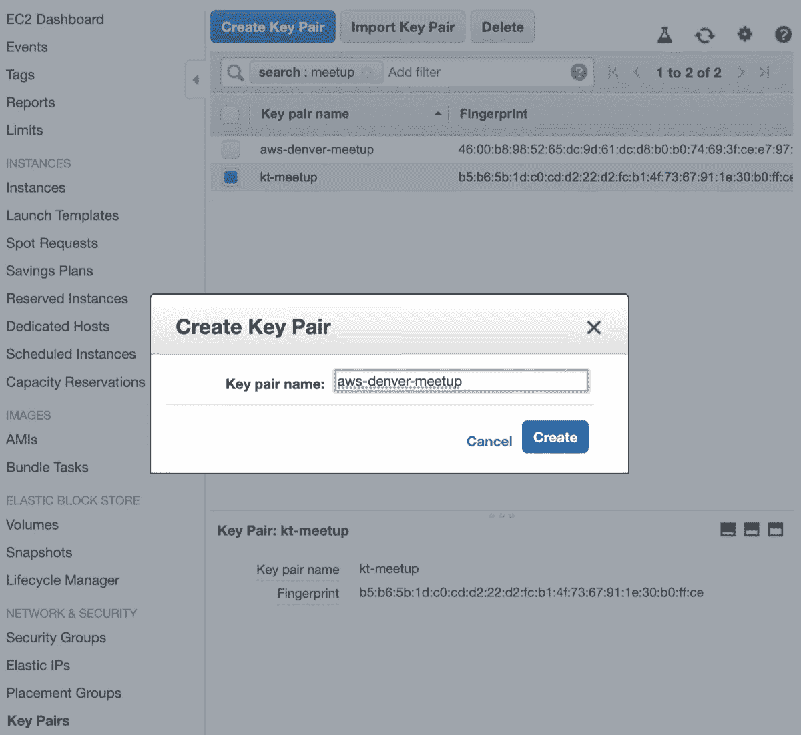
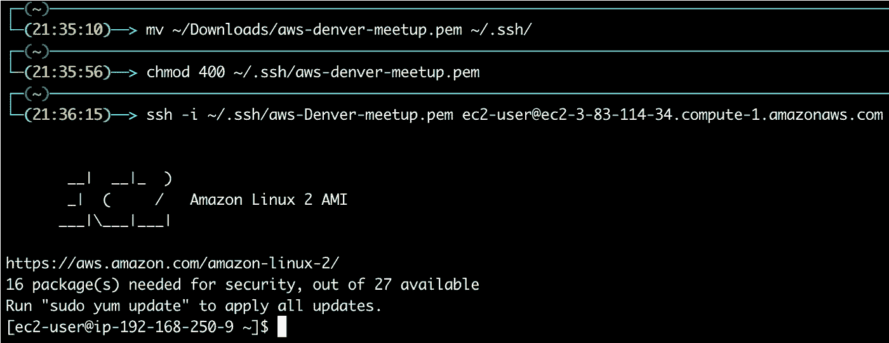
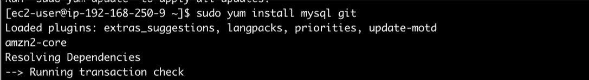
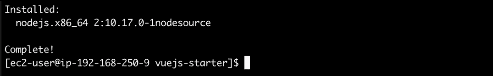
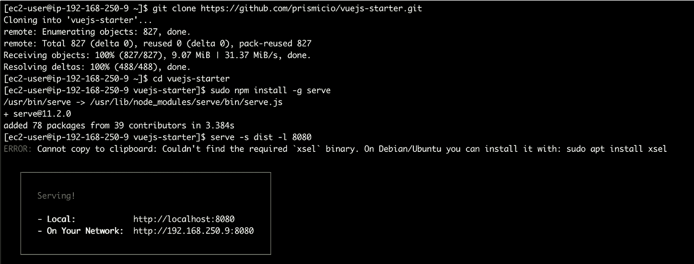
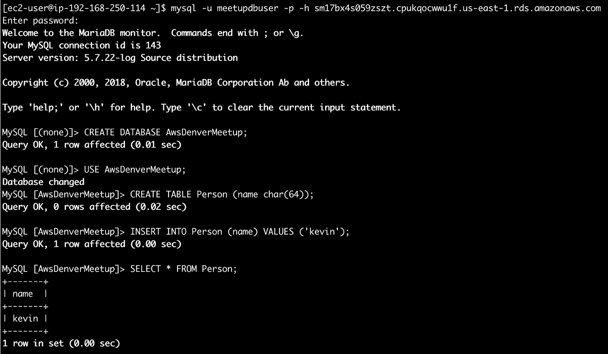

# 使用 MySQL 的 VPC 和 EC2 云信息模板

> 原文：<https://levelup.gitconnected.com/tutorial-aws-cloudformation-lab-c35790477023>

*作者:* [*凯文·汀*](https://www.linkedin.com/in/kevin-tinn-634956198/)*&*[*奥斯汀·洛夫莱斯*](https://www.linkedin.com/in/austin-loveless/)*—2019 年 12 月 19 日*

在本教程中，我们将了解 AWS CloudFormation，并使用 EC2 实例和 mySQL 数据库构建 AWS VPC。所有代码都在这里:[https://github . com/kev async/AWS-Denver-cloud-formation-meetup](https://github.com/kevasync/aws-denver-cloud-formation-meetup)

# 样本云形成链接

*   [AWS 样本模板](https://docs.aws.amazon.com/AWSCloudFormation/latest/UserGuide/sample-templates-services-us-west-2.html)
*   [AWS 实验室样本模板](https://github.com/awslabs/aws-cloudformation-templates)

# 入门指南

*   在 AWS 控制台中创建 EC2 密钥对
*   下载并设置 ssh pem 文件的权限
*   克隆此回购
*   使用提供的 YAML 创建一个 CloudFormation 堆栈(您将需要刚刚创建的 EC2 密钥对的名称)

创建密钥对:

下载并设置 ssh pem 文件的权限:

# SSH 到 EC2 实例并安装依赖项

*   `ssh -i ~/.ssh/aws-denver-meetup.pem ec2-user@<EC2 Dns Name>`
*   `sudo yum install mysql git`
*   `curl -sL https://rpm.nodesource.com/setup_10.x | sudo bash -`
*   `sudo yum install nodejs`

SSH 到 EC2:

安装 MySQL 和 Git:

安装 Node.js:

# 克隆并启动 Vue.js starter 站点

*   `git clone [https://github.com/prismicio/vuejs-starter.git](https://github.com/prismicio/vuejs-starter.git)`
*   `cd vuejs-starter`
*   `sudo npm install`
*   `sudo npm install serve -g`
*   `npm run build`
*   `serve -s dist -l 8080`
*   从机顶盒上的浏览器中，导航至:`http://<EC2 DNS NAme>:8080`
*   例如`[http://ec2-18-206-159-5.compute-1.amazonaws.com:8080](http://ec2-18-206-159-5.compute-1.amazonaws.com:8080)`

启动网站:

# 连接到 MySQL 并创建/查询数据:

*   连接到您的 MySQL 数据库:`mysql -u meetupdbuser -p -h <RDS DB DNS Name>`
*   例如`mysql -u meetupdbuser -p -h sm17bx4s059zszt.cpukqocwwu1f.us-east-1.rds.amazonaws.com`
*   输入创建堆栈时使用的密码
*   `CREATE DATABASE AwsDenverMeetup;`
*   `USE AwsDenverMeetup;`
*   `CREATE TABLE Person (name char(64));`
*   `INSERT INTO Person (name) VALUES ('kevin');`
*   `SELECT * FROM Person;`

插入/查询 SQL:

网址:[awsmeetupgroup.com](https://awsmeetupgroup.com)
推特: [@GroupAWS](https://twitter.com/GroupAws)
脸书:[https://www.facebook.com/awsmeetupgroup](https://www.facebook.com/awsmeetupgroup)