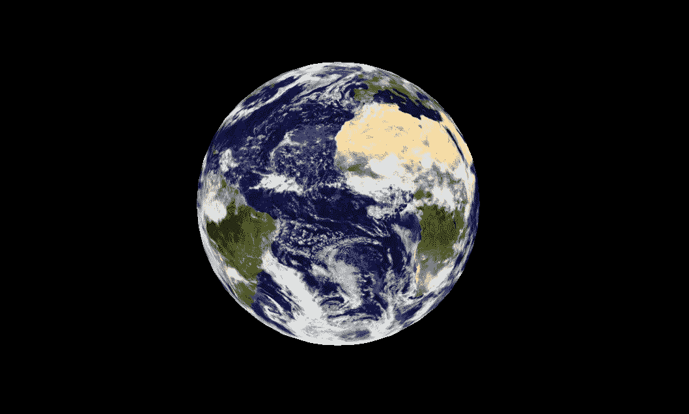

# 教程:用 Three.js 构建交互式虚拟地球

> 原文：<https://levelup.gitconnected.com/tutorial-build-an-interactive-virtual-globe-with-three-js-33cf7c2090cb>

通过构建一个互动的、旋转的地球开始体验 VR/3D！

[演示](https://globedemo.herokuapp.com/) | [代号](https://github.com/jocaron27/threejs-tutorial/blob/master/app/components/Root.jsx)

**TL；博士:**我最近开始意识到虚拟现实的力量，从它创造有趣的、身临其境的体验的能力到它对精神健康领域的影响。我进入了 **three.js** ，这是一个在浏览器中渲染 3D 的流行库，学习如何用 JavaScript 构建交互式的三维体验。这篇文章包括一个介绍性的教程，它将向你展示这个库，并教你如何制作一个交互式旋转地球仪。

[](https://globedemo.herokuapp.com/)

单击图像打开演示(在台式计算机上效果最佳)

# **我的 VR 之路**

虚拟现实刚成为一个东西的时候，我并没有感觉到炒作。我的印象是它只是为游戏玩家准备的，我想，那不适合我。

然后我得到了谷歌 Pixel，这是我的第一部真正的智能手机。有了它，我开始拍摄 360 张我想重游的地方的照片(比如风景、难忘的聚会、我长大的房子...).我还见证了朋友和家人通过我的谷歌 Cardboard 在谷歌地图上访问他们多年未去的家乡时的兴奋和怀旧情绪。

我用谷歌像素在犹他州峡谷地国家公园拍摄的 360 度照片

作为一名以前在心理健康领域工作的程序员，我开始考虑虚拟现实如何改善残疾人、特殊需求者和精神疾病患者的生活，特别是通过提供用户可能无法获得的治疗体验。不用说，我开始对虚拟现实的世界产生了兴趣。

> 这项技术不可思议的地方在于，你会觉得自己真的和其他人在另一个地方。尝试过的人说，这与他们一生中经历过的任何事情都不一样。”
> 
> [**——马克·扎克伯格**](https://www.facebook.com/zuck/posts/10101319050523971)

我和虚拟现实之间的下一个障碍实际上是弄脏我的手。这对我来说就像火箭科学，我无法理解用*代码构建一个三维的、沉浸式的、互动的世界的复杂性。*然而，随着我开发更多的二维应用程序，增加另一个维度的想法逐渐不再觉得遥不可及。

我对虚拟现实还是完全陌生，但我想带你一起踏上我的探索之旅。

## 今天我将教你如何用 JavaScript 构建一个简单的交互式 3D 应用。如果你和我一样，想进入 VR 的世界，希望这篇教程能给你起步的信心。

# **我们要建什么**

在这个演练中，我们将使用 [**three.js**](https://threejs.org/) **，**构建一个 3D 场景，这是一个在浏览器中渲染 3D 的流行库。

**目标是创建一个球体(也许是地球？)当您按下键盘上的←→↓按钮时，它会旋转(移动鼠标时也是如此)。**虽然我们没有创造沉浸式虚拟现实体验，但它*是 3D 的*和它*是互动的*，所以我们有了一个良好的开端！

[这就是它的样子*。](https://globedemo.herokuapp.com/)

*最适合台式电脑/笔记本电脑

# **入门**

注意:如果你没有使用 Node 的*，参考 three.js 文档中的[启动代码，而不是执行下面的步骤 1 & 2。](https://threejs.org/docs/index.html#manual/introduction/Creating-a-scene)*

***1。** **建立你的档案***

*如果你看我的[代码](https://github.com/jocaron27/threejs-tutorial)，你会看到一个 Express app 在前端使用 React 将 3D 组件注入到我的 HTML 文件中。这与本教程无关，所以您的文件结构可以只包含一个. html 和一个. js 文件。确保已经创建了 package.json 文件(可以运行 **npm init - y)** 。您还需要安装 [webpack](http://webpack.github.io/docs/tutorials/getting-started/) 来捆绑您的。js 文件带有三个*模块*。*

*您的 HTML 文件可能如下所示:*

```
*<!DOCTYPE html>
<html>
 <head>
 </head>
 <body>
     <div id="container" width="100vw" height="100vh" />
     <script src="bundle.js"></script>
 </body>
</html>*
```

***2。安装并添加 three.js***

*通过运行 **npm 安装 three** 来安装 three.js，然后导入到你的主。js 文件。*

```
*const THREE = require('three');*
```

***3。** **获取你想要附加场景的 DOM 元素***

```
*const container = document.querySelector('#container');*
```

*我们很快就会将我们的 3D 渲染器添加到*容器* div 中。*

# *创建 3D 渲染器*

> *为了能够用 three.js 显示任何东西，我们需要三样东西:一个**场景**、一个**相机**和一个**渲染器**，这样我们就可以用相机渲染场景。 [(three.js 文档)](https://threejs.org/docs/#manual/introduction/Creating-a-scene)*

***4。创建 WebGL 渲染器***

*[WebGL(网络图形库)](https://threejs.org/docs/#api/renderers/WebGLRenderer)在浏览器中渲染交互式二维和三维图形。这就是我们马上要创建并附加到我们的 HTML *容器* div 中的内容(在我们创建了将进入渲染器的所有组件之后)。*

*要实例化它:*

```
*const renderer = new THREE.WebGLRenderer();*
```

*你还需要设置渲染器的大小。我已经设置了窗口的宽度和高度:*

```
*const WIDTH = window.innerWidth;const HEIGHT = window.innerHeight;renderer.setSize(WIDTH, HEIGHT);*
```

***5。创建一个摄像机***

*Three.js 有一个[***Camera***](https://threejs.org/docs/#api/cameras/Camera)类，由它的各个子类继承，如 [PerspectiveCamera](https://threejs.org/docs/#api/cameras/PerspectiveCamera) (我们将使用的那个)或 [OrthographicCamera](https://threejs.org/docs/#api/cameras/OrthographicCamera) 。透视相机最常用于 3D 场景，因为它模拟了人眼的视觉方式。*

*首先，我们将设置相机属性:*

```
*const VIEW_ANGLE = 45;const ASPECT = WIDTH / HEIGHT;const NEAR = 0.1;const FAR = 10000;*
```

*然后实例化摄像机:*

```
*const camera = new THREE.PerspectiveCamera(VIEW_ANGLE, ASPECT, NEAR, FAR);*
```

*我们还将设置摄像机在 x、y 和 z 轴上的位置:*

```
*camera.position.set( 0, 0, 500 );*
```

*6。创建一个场景*

*安装快完成了！现在我们创建一个 ***场景*** :*

```
*const scene = new THREE.Scene();*
```

*并添加黑色背景:*

```
*scene.background = new THREE.Color( 0x000 );*
```

***7。将摄像机添加到场景中***

*现在我们有了一个场景，我们可以给它添加摄像机:*

```
*scene.add(camera);*
```

***8。将渲染器附加到 DOM 元素。***

*最后，正如承诺的那样，我们将渲染器添加到容器中。*

```
*container.appendChild(renderer.domElement);*
```

# *创造地球*

*现在我们可以继续我们的地球了！*

***9。创建一个球体***

*Three.js 使用几何网格创建原始的 3D 形状，如球体、立方体、圆柱体等。因为我要做一个行星地球的外观，我将使用一个球体。*

*我们将从定义球体的属性开始:*

```
*const RADIUS = 200;const SEGMENTS = 50;const RINGS = 50;*
```

*然后，因为我们想用地球的图像纹理球体，我们将创建一个 ***组*** ，它将保持我们的球体和它的纹理网格在一起:*

```
*const globe = new THREE.Group();scene.add(globe);*
```

*现在，我们将创建我们的球体及其纹理，并使用 three.js 的***texture loader***将它们网格化在一起:*

```
*var loader = new THREE.TextureLoader();*
```

*我们调用 ***load*** 方法，该方法将我们的图像 url ( [这里是我使用的图像](https://eoimages.gsfc.nasa.gov/images/imagerecords/57000/57735/land_ocean_ice_cloud_2048.jpg))作为第一个参数，以及一个函数:1)创建一个具有预定义属性的球体，2)将 ***纹理*** 映射到 ***材质*** (在此阅读更多[关于 three.js 文档中的](https://threejs.org/docs/#api/constants/Materials))，3)创建一个[](https://threejs.org/docs/#api/materials/MeshBasicMaterial)*

***注意:如果你遇到关于图片链接的错误，使用这个:*[*https://EO images . gsfc . NASA . gov/images/image records/57000/57735/land _ ocean _ ice _ cloud _ 2048 . jpg*](https://eoimages.gsfc.nasa.gov/images/imagerecords/57000/57735/land_ocean_ice_cloud_2048.jpg)**

```
**loader.load( 'land_ocean_ice_cloud_2048.jpg', function ( texture ) { // Create the sphere var sphere = new THREE.SphereGeometry( RADIUS, SEGMENTS, RINGS ); // Map the texture to the material.  var material = new THREE.MeshBasicMaterial( { map: texture, overdraw: 0.5 } );
 // Create a new mesh with sphere geometry. var mesh = new THREE.Mesh( sphere, material ); // Add mesh to globe globe.add(mesh);} );**
```

**现在我们有了球体，让我们将它向后(沿 z 轴)放置，这样我们就可以看到它:**

```
**globe.position.z = -300;**
```

****10。添加照明****

**由于我们在上一步中使用了 MeshBasicMaterial(一种不受光照影响的材质)，下一步是可有可无的，但我想在本教程中包括它，因为它通常是 3D 场景的重要组成部分。**

**首先我们将创建一个 ***点光源*** (该库中有其他几种类型的[光源](https://threejs.org/docs/#api/lights/Light)):**

```
**const pointLight = new THREE.PointLight(0xFFFFFF);**
```

**现在我们设置灯光的位置:**

```
**pointLight.position.x = 10;pointLight.position.y = 50;pointLight.position.z = 400;**
```

**然后我们将它添加到场景中:**

```
**scene.add(pointLight);**
```

**此时，如果您在浏览器中打开 HTML 文件，您应该会看到一个静态的地球仪。让我们开始制作动画吧！**

# **创建动画**

**我将创建两组函数:一组用于用箭头键旋转地球仪(步骤 12)，另一组用于在鼠标移动时旋转地球仪(步骤 13)。*注意:我在这里主要使用我自己的代码。Three.js 确实提供了* [*动画系统*](https://threejs.org/docs/index.html#manual/introduction/Animation-system) *和* [*控件*](https://videlais.com/2017/01/15/learning-three-js-part-5-controls/) *，但是我自己还没有成功实现这个内置功能。***

****11。设置****

**首先，我们将为内置的***request animation frame***设置 ***update*** 函数来初始渲染我们的场景，并在更改后重新渲染我们的场景:**

```
**function update () { //Render: renderer.render(scene, camera); // Schedule the next frame: requestAnimationFrame(update); } // Schedule the first frame:requestAnimationFrame(update);**
```

****12。按下**箭头键旋转**

**为了让我们的地球仪基于箭头键旋转，首先我们将定义一个函数，它接受一个方向并相应地旋转地球仪(基于方向，旋转+-x 或+-y):**

```
**function animationBuilder(direction) { return function animateRotate() { switch (direction) { case 'up': globe.rotation.x -= 0.2; break; case 'down': globe.rotation.x += 0.2; break; case 'left': globe.rotation.y -= 0.2; break; case 'right': globe.rotation.y += 0.2; break; default: break; } }}**
```

**接下来，我们将创建一个 directions 对象，在其中存储每个方向的适当动画调用:**

```
**var animateDirection = { up: animationBuilder('up'), down: animationBuilder('down'), left: animationBuilder('left'), right: animationBuilder('right')}**
```

**现在，我们将定义我们希望在按键后发生的监听器函数:**

```
**function checkKey(e) { e = e || window.event; e.preventDefault(); //based on keycode, trigger appropriate animation: if (e.keyCode == '38') { animateDirection.up(); } else if (e.keyCode == '40') { animateDirection.down(); } else if (e.keyCode == '37') { animateDirection.left(); } else if (e.keyCode == '39') { animateDirection.right(); }}**
```

**最后，按键时，我们将调用上面的监听器函数:**

```
**document.onkeydown = checkKey;**
```

**此时，您应该能够使用箭头键来控制地球的旋转。**

****13。鼠标移动时旋转****

**这是我最喜欢的部分，因为当你用鼠标或触控板控制地球时，几乎感觉像是用自己的手在旋转地球。**

**首先，我们将设置一个数组来存储我们以前的鼠标位置，其起始值位于页面的中心:**

```
**var lastMove = [window.innerWidth/2, window.innerHeight/2];**
```

**接下来，我们将定义一个在鼠标移动时触发的侦听器函数:**

```
**function rotateOnMouseMove(e) { e = e || window.event; //calculate difference between current and last mouse position const moveX = ( e.clientX - lastMove[0]); const moveY = ( e.clientY - lastMove[1]); //rotate the globe based on distance of mouse moves (x and y)  globe.rotation.y += ( moveX * .005); globe.rotation.x += ( moveY * .005); //store new position in lastMove lastMove[0] = e.clientX; lastMove[1] = e.clientY;}**
```

**最后，我们定义我们的事件监听器:**

```
**document.addEventListener('mousemove', rotateOnMouseMove);**
```

**现在你知道了！**

**随意试验球体的纹理/图像(其他星球？)，背景(加明星？)、动画(缩放、调整大小……)等等。还有其他三个. js 地球仪[在那里，我很想在评论中看到你自己的变化！](http://learningthreejs.com/blog/2013/09/16/how-to-make-the-earth-in-webgl/)**

**我希望你喜欢这个入门练习。一旦你习惯使用这个库，一定要尝试一些[更复杂的教程](https://www.sitepoint.com/bringing-vr-to-web-google-cardboard-three-js/)，这将真正让你建立一个交互式的虚拟现实体验。(虽然我自己要完全了解这个库还有很长的路要走，但我很高兴知道像[短途旅行](http://www.ashortjourney.com/)和[纸飞机](https://paperplanes.world/)这样的应用程序就是用它创建的。)**

**你可能也有兴趣看看脸书的[React VR](https://facebook.github.io/react-vr/)…我知道我是！**