# 教程:用 AWS Lambda 构建无服务器 API。

> 原文：<https://levelup.gitconnected.com/tutorial-building-a-serverless-api-with-aws-lambda-92aa5fa32d47>

*作者:* [*奥斯丁无爱*](https://www.linkedin.com/in/austin-loveless/)*—2019 年 12 月 19 日*

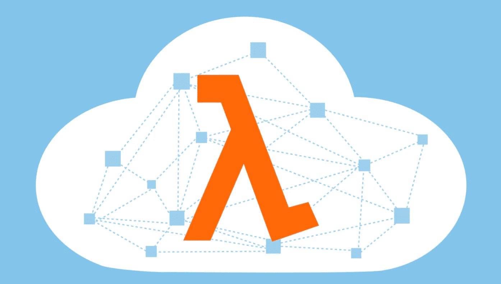

**订阅**AWSMeetupGroup YouTube 频道:[https://www.youtube.com/channel/UCG3Si_vP2tijvvyE5xr7lbg](https://www.youtube.com/channel/UCG3Si_vP2tijvvyE5xr7lbg)

**加入 Meetup.com 上的**AWSMeetupGroup:
[https://www.meetup.com/AWSMeetupGroup/](https://www.meetup.com/AWSMeetupGroup/)

我们将构建两个 API。一个有 lambda，一个没有。所有的代码都在这里:[https://github.com/austinloveless/AWSDenver-serverless.git](https://github.com/austinloveless/AWSDenver-serverless.git)。

# 先决条件

*   创建一个 [AWS 账户](https://aws.amazon.com/)
*   创建一个 [GitHub 账户](https://github.com/)
*   安装 Docker 桌面 [Mac](https://docs.docker.com/docker-for-mac/install/) 或 [Windows](https://docs.docker.com/docker-for-windows/install/)
*   安装 [AWS CLI](https://aws.amazon.com/cli/)
*   安装 [AWS SAM CLI](https://docs.aws.amazon.com/serverless-application-model/latest/developerguide/serverless-sam-cli-install.html)
*   安装 [Node.js](https://nodejs.org/en/download/)

# 这里有什么

该项目包括:

*   [README.md](http://README.md) —此文件
*   build spec . yml—AWS code build 使用该文件来打包您的服务，以便部署到 AWS Lambda
*   src/app.js —该文件包含 web 服务的示例 Node.js 代码
*   index.js —该文件包含 AWS Lambda 处理程序代码
*   template.yml —该文件包含 AWS CloudFormation 用来将服务部署到 AWS Lambda 和 Amazon API Gateway 的 AWS 无服务器应用程序模型(AWS SAM)。
*   routes.yaml —该文件用于通过 Swagger 和 AWS Lambda 为 API 网关定义路由
*   lambdalessRoutes.yaml —该文件用于定义 API 网关通过 swagger 直接到 DynamoDB 的路由
*   tests/ —此目录包含应用程序的单元测试
*   template-configuration . JSON-此文件包含带有占位符的项目 ARN，占位符用于使用项目 ID 标记资源

# 这个项目创造了什么？

您正在创建两个 API。一个有 Lambda，一个没有。

# 资源:

*   1 个 DynamoDB 表
*   2 个 AWS Lambda 函数“AWSDenverFunction”和“APIAuthorizer”
*   2 个 API 网关 API“AWSLambdalessAPI”和“AWSLambdafullAPI”
*   2 系统管理器参数存储参数。“丹佛 _ 表名”和“丹佛 _ 授权者 _ 令牌”。

# 辅导的

在安装了所有先决条件并克隆了 repo 之后，您可以执行以下操作来启动并运行项目。

# 第一

在 AWS 控制台中，我们需要创建一个 IAM 用户。

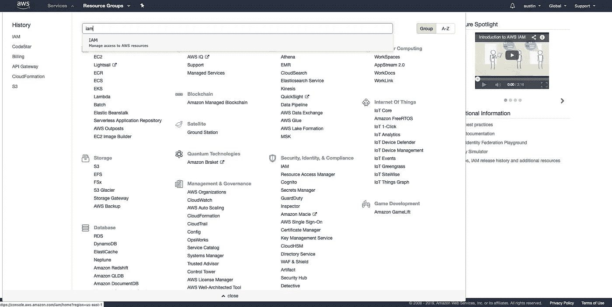

转到 IAM 仪表板并选择“用户”。然后选择“添加用户”。

给你的用户一个名字，然后选择“程序化访问”

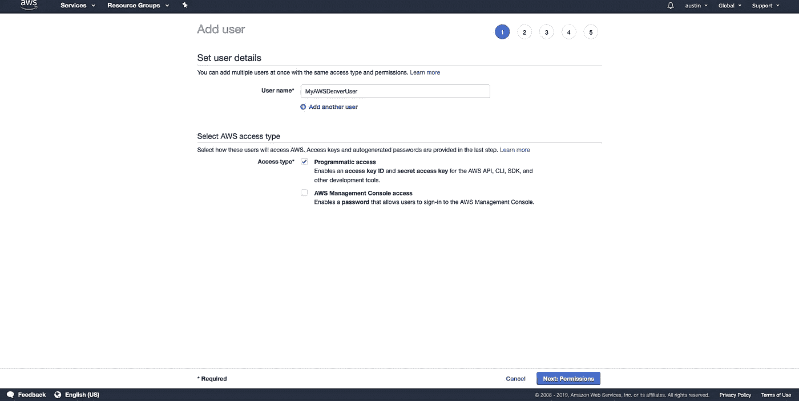

点击“下一步:权限”，然后选择“直接附加现有策略”。从那里添加“AdministratorAccess”。

然后点击“下一步:标签”添加任何标签，如果你愿意。最后点击“下一步:审查”和“创建用户”。

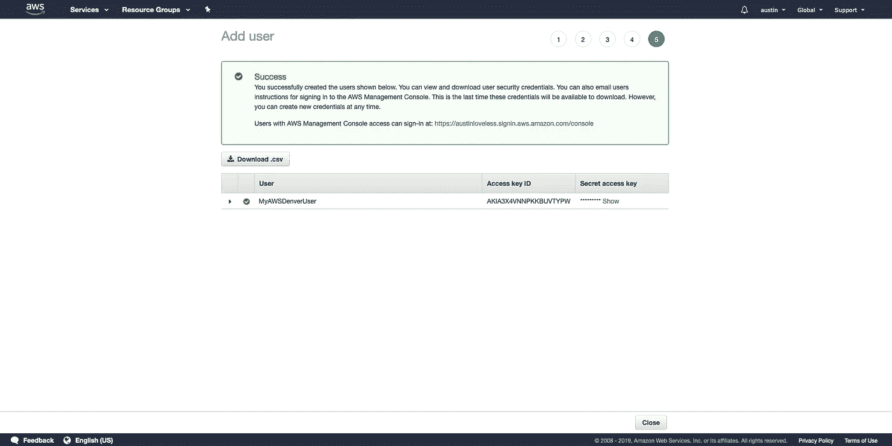

创建用户后，复制访问密钥并在终端运行命令`aws configure`,这将把你的机器与你的 AWS 账户连接起来。运行该命令后，系统会提示您输入“AWS 访问密钥 ID:”然后在 IAM 控制台中复制一个。并对“AWS 秘密访问密钥:”重复此操作。将您的地区设置为“美国东部-1”并按回车键。

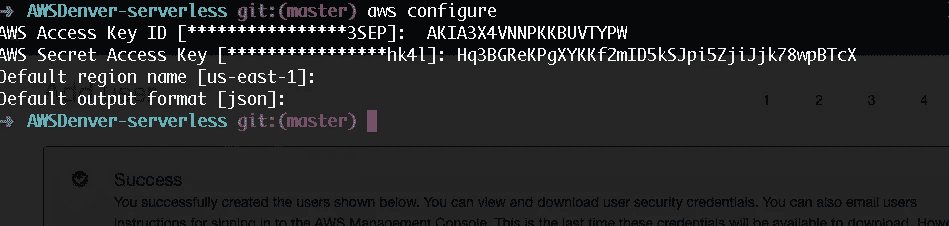

# 第二

输入 IAM 用户凭证并运行`aws configure`命令后，我们可以创建一些环境变量。

我们需要设置两个环境变量来保证信息的安全和模板的可重用性。

因此，我们使用 AWS 系统管理器参数存储来存储我们的私人信息。

第一个创建了一个名为“DENVER_TABLE_NAME”的参数来保护表的名称，并使这些模板可重用。

`aws ssm put-parameter --name "DENVER_TABLE_NAME" --value "YOUR_TABLE_NAME" --type String`

第二个参数称为“DENVER_AUTHORIZER_TOKEN ”,我们将创建它来保护 API authorizer 的值。

`aws ssm put-parameter --name "DENVER_AUTHORIZER_TOKEN" --value "allow" --type String`

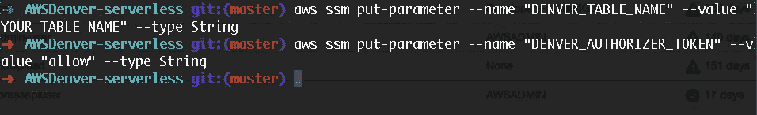

# 第三

现在我们已经有了环境变量和用户设置，我们可以创建实际的项目了。

我们需要回到 [AWS 控制台](https://aws.amazon.com/)，搜索一个名为“代码之星”的服务

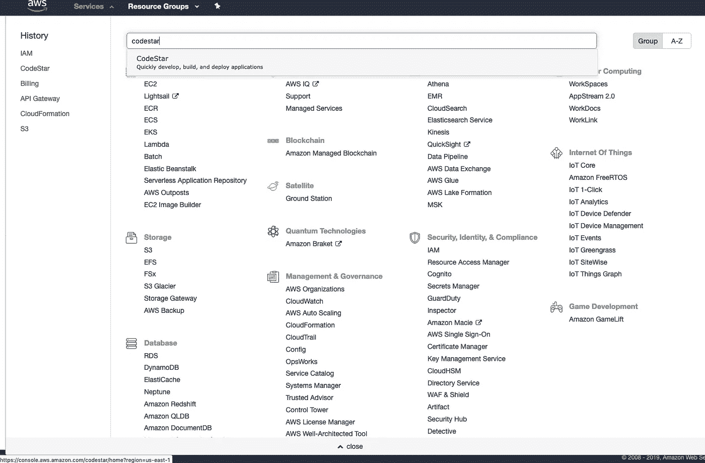

在 CodeStar 控制台中，单击“创建新项目”。然后选择“Express.js AWS Lambda”它在最右边”


给项目命名，并选择“GitHub”作为您的存储库。将您的项目连接到 github，然后选择“下一步”和“创建项目”。*确保选择 GitHub*

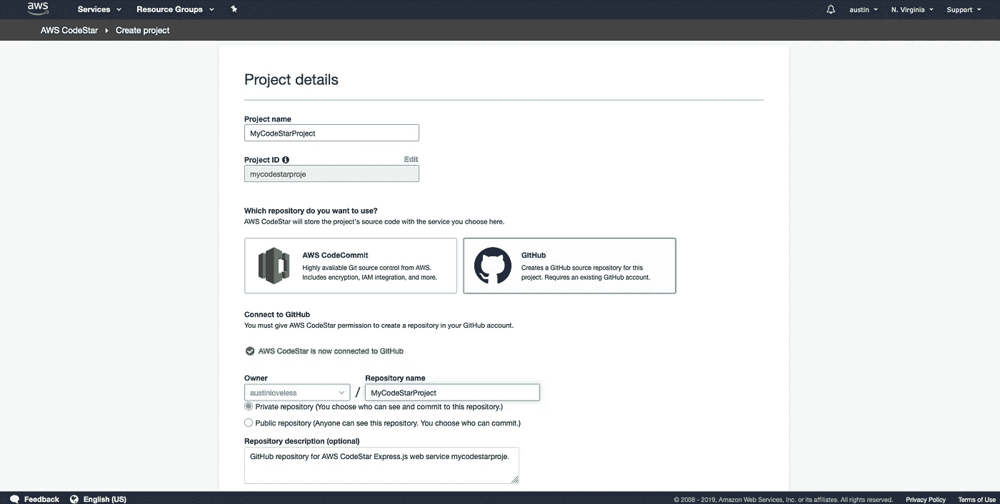

您的项目将需要几分钟的时间来创建，并将为您创建一个 repo 和一个完整的 CI/CD 管道。

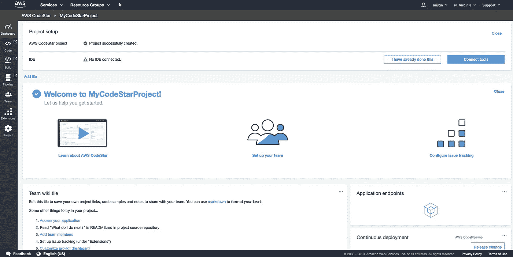

# 第四

现在，您已经在 CodeStar 中创建了一个模板项目，我们需要更新模板，使其具有与此回购相同的代码。与其复制粘贴并可能产生错误，我们应该施些魔法。

因此，请访问 CodeStar 中提供的回购链接。当你成功创建项目时，你应该在左边看到一个链接，上面写着“代码”。那会直接带你去回购。

一旦在回购中，在你的终端上运行一个`git clone < YOUR REPO >`,让项目进入你的机器。

首先克隆回购`git clone [https://github.com/austinloveless/AWSDenver-serverless.git](https://github.com/austinloveless/AWSDenver-serverless.git)`

在你把从 CodeStar 创建的 repo 和我的 repo cd 克隆到 CodeStar repo 的目录下并运行`git remote -v`之后。记下 url，例如`<your repo address> (fetch)`。

下一步`cd`进入 AWSDenver-serverless 目录，运行`git remote rm origin`删除原点。然后运行`git remote add origin <your repo address>`。

用`git remote -v`确认您已经更改了原点。

最后运行`git push --set-upstream origin master --force`将代码推送到 CodeStar，您应该有一个类似于这个 repo 的更新的 repo。

强迫掌握是非常危险的，如果你的公司有不允许的政策，甚至会给你的工作带来麻烦。非常小心地使用这项技术。在本实验中，您应该只需要强制推送一次。

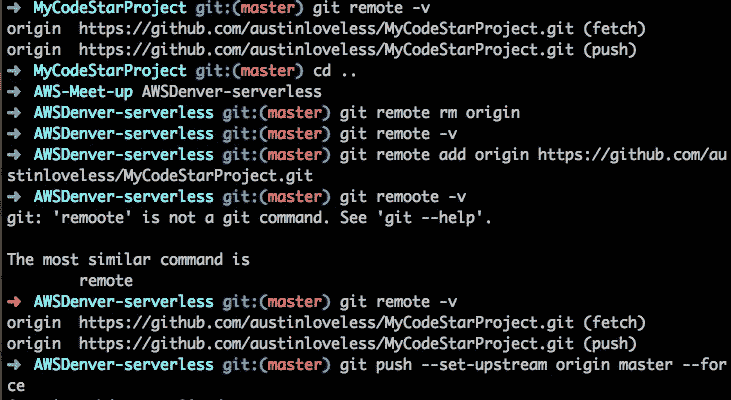

如果您回到 CodeStar，您应该会在“持续部署”部分看到它正在更新您的项目。

你的项目将会失败，因为我们需要做更多的步骤。我们需要更新 repo 中的一些代码，并更新 IAM 用户的权限。

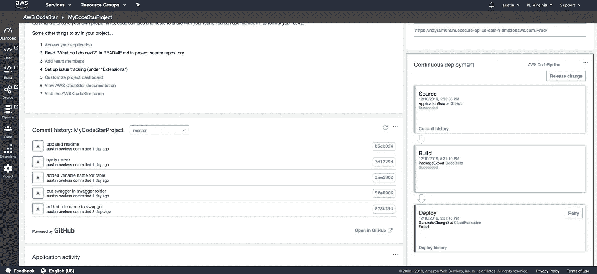

首先，我们可以在回购中更新 AccountID。不幸的是，CloudFormation 不支持在 Swagger 定义中添加 AccountIds 或 Regions。所以我们必须硬编码。如果你进入“Swagger”文件夹，你会看到两个文件。这是我们定义 API 的地方。进入两个文件并搜索`<YOUR ACCOUNT ID>`。我们需要用您的帐户 ID 替换所有这些内容。因此，我们必须返回控制台，获取帐户 ID 并将其粘贴进去。

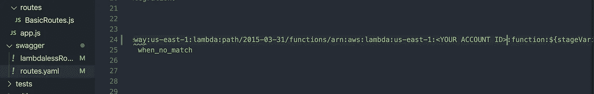

如果您进入控制台，并转到控制台的右上角，您应该会看到一个您的用户名。点击它，将会打开一个下拉菜单。单击“我的帐户”,您的 12 位帐户 ID 会列在“帐户设置”下。复制并粘贴到你的代码中。

# 最后

现在我们几乎完成了我们还有一个步骤，然后我们可以成功地部署我们的代码。

我们需要在 CodeStar 中的 Cloudformation 角色中添加 3 个角色。我们必须这样做，因为我们更新了 CodeDeploy、IAM 和 Systems Manager 中的一些设置。

所以进入 AWS 控制台，再次搜索 CodeStar。在最左侧，在您之前使用的导航中，单击最底部的“Project”进入代码。

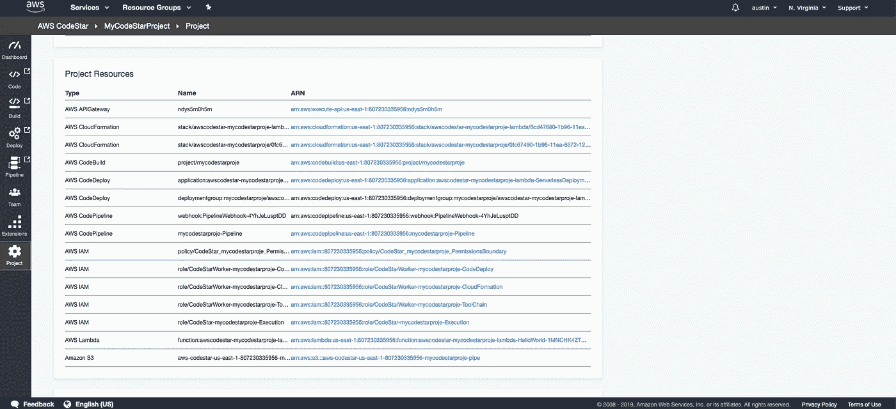

从那里你将能够“项目资源”，如果你向下滚动到它的底部，你将看到“AWS IAM”。查找扩展名为“CloudFormation”的角色，例如`arn:aws:iam::<AccountID>:role/CodeStarWorker-awsdenver-serve-CloudFormation`。

单击该角色，它会将您带到 IAM 页面。从那里你应该会看到一个蓝色的按钮称为“附加政策”点击它，并在搜索栏中寻找“AWSCodeDeployFullAccess”，“IAMFullAccess”，和“AmazonSSMFullAccess”选择它，并在底部点击“附加政策”。

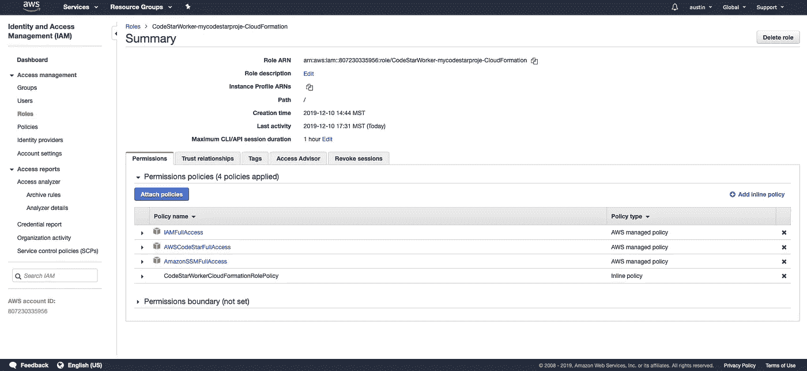

添加对这些服务的完全访问比你应该允许的更宽松，但是为了这个项目的简单性，我们添加了完全访问。如果您想更细化，可以根据需要调整策略。

完成后，您可以返回 CodeStar 控制台，然后单击“发布更改”。成功完成后，你应该有两个 API，一个有 Lambda，一个没有。

# 使用您新创建的 API

现在您已经成功地创建了项目，您应该测试 api 了。在 CodeStar 中，在右侧寻找“持续部署”,在底部寻找“CloudFormation”的链接，单击该链接会将您重定向到 CloudFormation 堆栈。从那里你可以点击“输出”,你应该会看到到你的 API 的链接。

# 测试 API

lambaless API 没有任何安全性，所以你可以毫无问题地点击它。

LambdaFull API 附带了一个授权器。为了被授权，你必须点击 api 并在端点的末尾添加`?auth=allow`来授权你自己。您可以查看`src/authorizer/authorizer.js`文件中的代码以了解更多信息。

因为这个项目为您创建了一个空的 DynamoDB 表，所以您不会有任何数据。所以当你到达终点时，很可能是一个空的响应。

# 在本地运行项目

克隆了回购协议后`git clone [https://github.com/austinloveless/AWSDenver-serverless.git](https://github.com/austinloveless/AWSDenver-serverless.git)`

安装完必备组件后。

您可以运行:

```
1\. npm install2\. npm start
```

这将启动应用程序。你可以在浏览器中进入`http://localhost:3000`。

开始摆弄`src/app.js`或`src/routes/BasicRoutes.js`中的代码，感受一下事情是如何工作的。

# 命令

启动应用程序运行:`npm start`

要验证对`template.yml`所做的更改是否正确，请运行命令`npm run validate`

# 在生产中运行我的项目之前，我应该做什么？

AWS 建议您在生产环境中运行所选示例应用程序之前，查看框架作者推荐的安全性最佳实践。对于应用程序中使用的依赖项，您还应该定期检查和应用任何可用的补丁程序或相关的安全建议。

最佳实践:[https://docs . AWS . Amazon . com/codestar/latest/user guide/best-Practices . html？icmpid=docs_acs_rm_sec](https://docs.aws.amazon.com/codestar/latest/userguide/best-practices.html?icmpid=docs_acs_rm_sec)