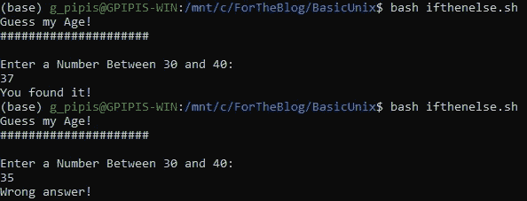
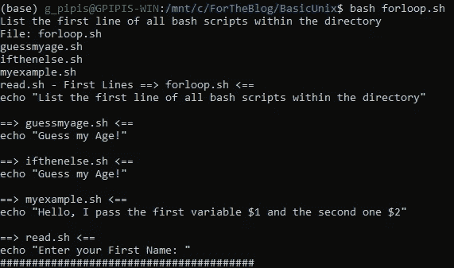
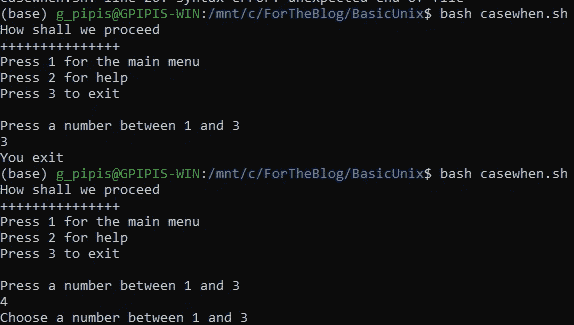
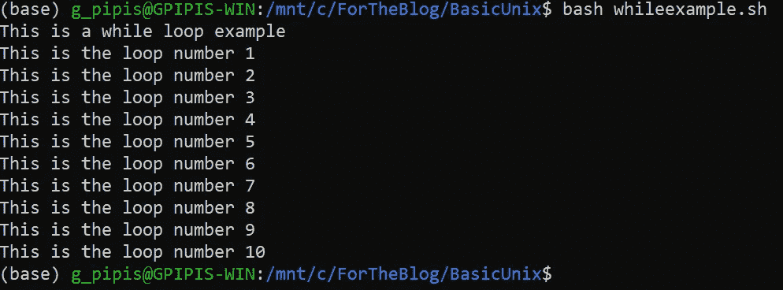

# 教程:Bash 脚本中的控制流

> 原文：<https://levelup.gitconnected.com/tutorial-conditional-statements-in-bash-scripting-d940a8b5e3c2>

## Bash 脚本中条件语句的例子

在本教程中，我们将提供 bash 脚本中条件语句的基本示例。

# 通过命令行向脚本传递变量

在脚本中，我们可以用美元符号`$`定义变量。通过添加一个数字，我们引用了我们想要传递的变量。因此，`$1`是第一个变量，`$2`是第二个变量，依此类推。让我们看一个例子。下面我们来考虑一下`myexample.sh`的脚本。

```
echo "Hello, I pass the first variable $1 and the second one $2"
```

让我们通过键入以下命令来运行它:

```
bash myexample.sh var1 var2
```

这里，**变量 1** 被分配给`$1`，而**变量 2** 被分配给`$2`，输出为:

```
Hello, I pass the first variable var1 and the second one var2
```

# if-then-else 语句

让我们提供一个简单的“if 语句”的例子。脚本`ifthenelse.sh`如下，它要求终端用户输入一个 30-40 之间的数字，如果猜测的数字等于 37 ( `-eq`)，那么它返回“**你找到了！**”，否则它返回“**错误答案！**”:

```
echo "Guess my Age!"
echo "#####################"
echo ""
echo "Enter a Number Between 30 and 40: "
read GUESSif [ $GUESS -eq 37 ]
then
    echo "You found it!"
else
    echo "Wrong answer!"
fi
```

让我们通过猜测正确的年龄 37 来运行它，然后再次输入 35。



注意，Bash 脚本中的 **else if** 是 Python 中的`elif`。

# for 循环

假设我们希望获得工作目录中每个 Bash 脚本的第一行:

```
echo "List the first line of all bash scripts within the directory"SHELLSCRIPTS=`ls *.sh`for SCRIPT in "$SHELLSCRIPTS"
do
    DISPLAY="`head -n 1 $SCRIPT`"
 echo "File: $SCRIPT - First Lines $DISPLAY"
done
```



# 案例陈述

让我们提供一个 Bash 中 case 语句的例子:

```
echo "How shall we proceed"
echo "+++++++++++++++"
echo "Press 1 for the main menu"
echo "Press 2 for help"
echo "Press 3 to exit"
echo ""
echo "Press a number between 1 and 3"read CHOICEcase $CHOICE in
1)
  echo "You are in the main menu";;
2)
  echo "You asked for help";;
3)
  echo "You exit";;
*)
  echo "Choose a number between 1 and 3";;
esac
```



# while 循环

让我们提供一个 while 循环的例子。

```
echo "This is a while loop example"COUNT=1while [ $COUNT -le 10 ]
do
  echo "This is the loop number $COUNT"
  COUNT="`expr $COUNT + 1`"
done
```



# 执行运算符(&&和||)

在 Bash 脚本中，**和**是`&&`，而**或**是`||`。只有左侧的退出状态为零(即真)时，`&&`的右侧才会被评估。`||`则相反:只有左侧退出状态不为零(即 false)时，才会对右侧进行评估。如果里面的测试评估为真，则返回零；否则返回非零值。例如:

```
$ false && echo howdy!$ true && echo howdy!
howdy!
$ true || echo howdy!$ false || echo howdy!
howdy!
```

*原载于*[*https://predictivehacks.com*](https://predictivehacks.com/tutorial-conditional-statements-in-bash-scripting/)*。*