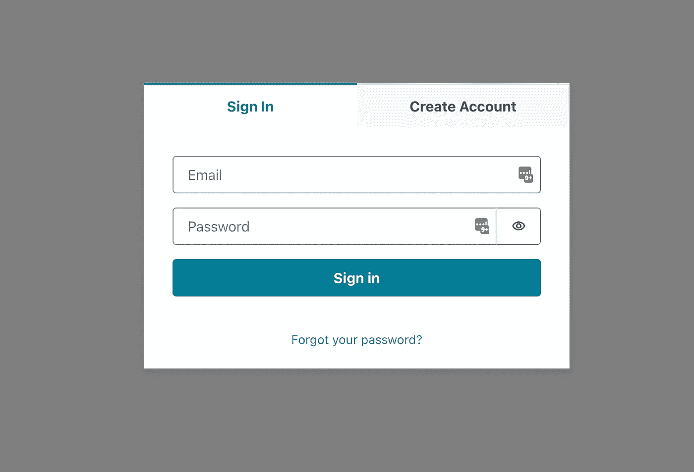
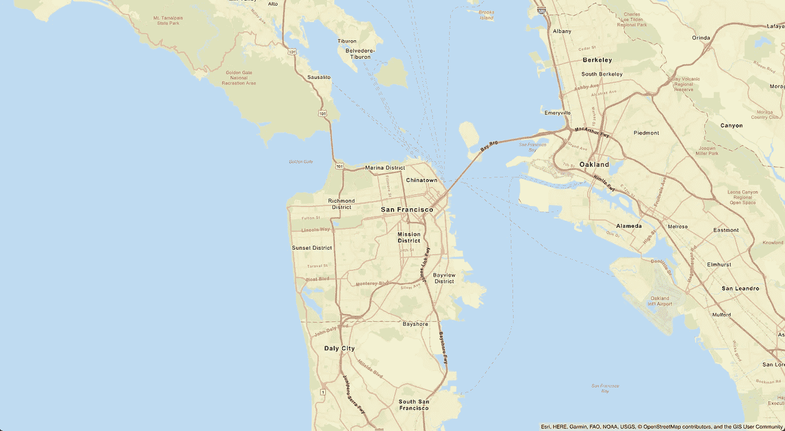
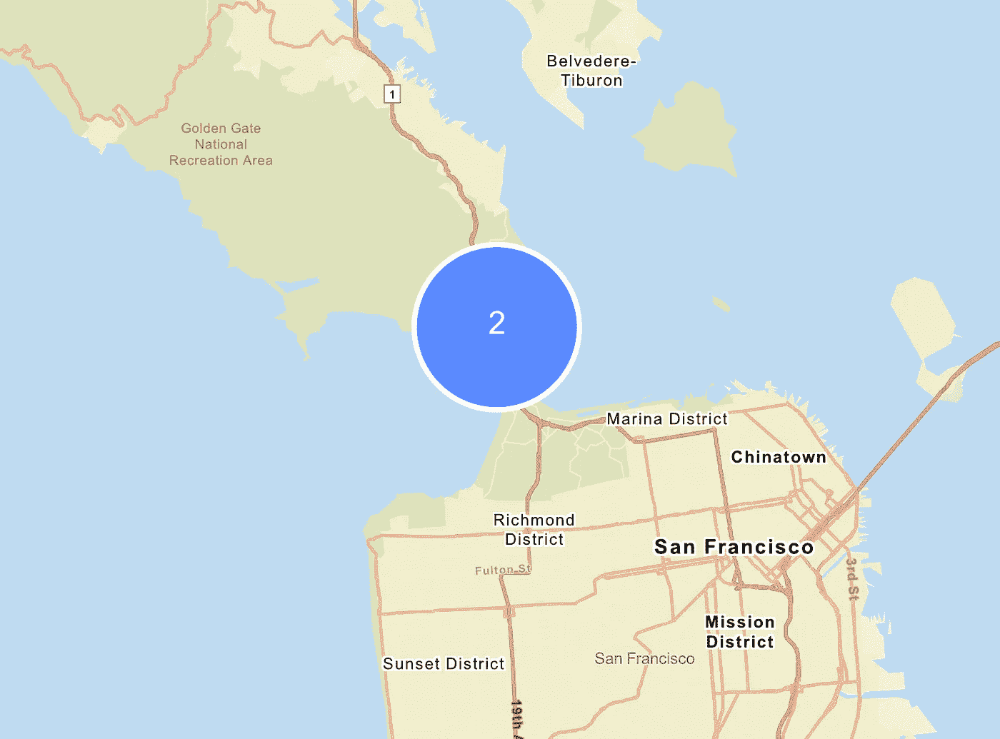
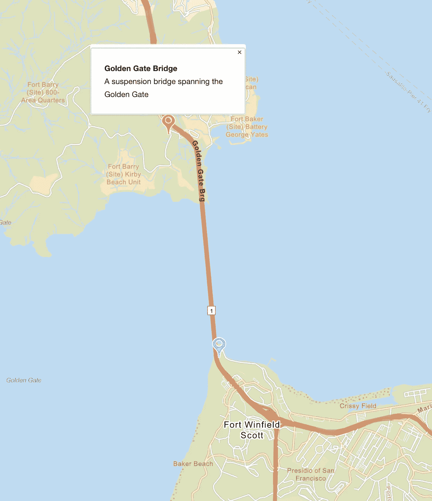
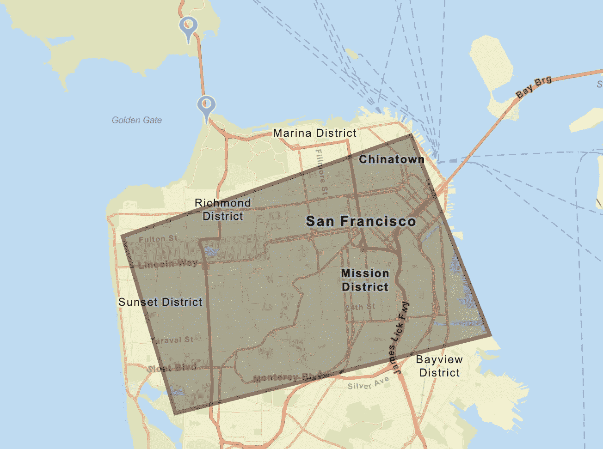
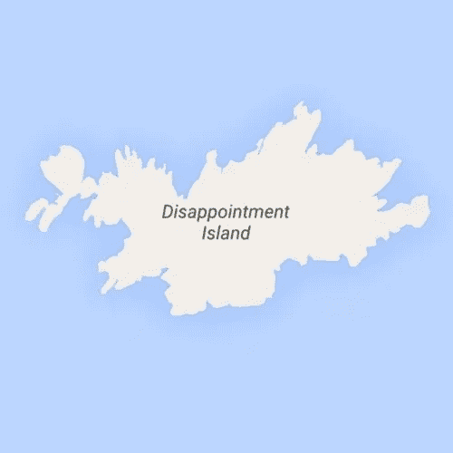

# 教程:用亚马逊定位服务+ React 创建一个地图应用程序

> 原文：<https://levelup.gitconnected.com/tutorial-cook-up-a-map-application-with-amazon-location-service-react-c3674c75ff6c>

## 实施 web 地图、标记、地理围栏和地址搜索


图为[托比亚斯](https://unsplash.com/@tobiash?utm_source=medium&utm_medium=referral)在 [Unsplash](https://unsplash.com?utm_source=medium&utm_medium=referral)

亚马逊定位服务于 2020 年 12 月在 Re:Invent 上推出，提供经济实惠的数据、跟踪和地理围栏功能，以及与 AWS 服务的本地集成。开发人员可以快速创建复杂的支持位置的应用程序，而无需从零开始开发定制 API、护栏和治理。在本教程中，我将深入研究亚马逊定位服务可以做什么，并展示如何将其集成到 React.js 应用程序中。

# 服务

那么 AWS 的新服务带来了什么呢？目前有 5 个主要特性，产品路线图上还有很多。

## 地图

作为来自安全服务器的[矢量切片](https://docs.mapbox.com/data/tilesets/guides/vector-tiles-introduction/)的 Web 地图由 [Sig V4 API 调用](https://docs.aws.amazon.com/general/latest/gr/signature-version-4.html)验证。

## 地方

搜索兴趣点、执行地理编码(即获取给定地址的纬度和经度)以及反向地理编码的能力。

## 路线

在地图上寻找 A 点和 B 点之间的最短路径。这包括大概的行驶时间、距离和方向。

## 追踪者

用于记录启用了跟踪客户端的设备的当前和历史位置的 API。

## 地理围栏

在地图上画出任意形状，并被通知涉及不可见“栅栏”的事件。

现在我们对定位服务有了一个基本的概念，让我们把这些东西放进锅里。

# 第一部分:设置 React 应用程序

我将使用 [npx](https://medium.com/@maybekatz/introducing-npx-an-npm-package-runner-55f7d4bd282b) 和[类型脚本模板](https://www.npmjs.com/package/cra-template-typescript)来执行我们的`create-react-app`引导。从这里[获取指令](https://create-react-app.dev/docs/getting-started#creating-a-typescript-app)，我们将简单地打开我们的终端并执行:

```
$ npx clear-npx-cache
$ npx create-react-app als-demo-app --template typescript
```

接下来，我将添加一些我需要的依赖项，以使这项工作顺利进行；即 [Maplibre](https://maplibre.org/) 和 [Amplify](https://aws.amazon.com/amplify/) 。

```
$ cd als-demo-app
$ npm install aws-amplify 
$ npm install @aws-amplify/ui-react
$ npm install maplibre-gl 
$ npm install maplibre-gl-js-amplify 
$ npm install @maplibre/maplibre-gl-geocoder
```

Maplibre 是开源的，将有助于显示网络地图并与之交互。Amplify 是一个前端库，用于与 AWS 上托管的后端服务进行交互。

# 第二部分:添加 Amplify 身份验证和 Geo

在这一点上，我只有样板 CRA 申请。然而，在接触代码之前，我将用几个简单的命令来配置整个后端:

```
$ npm i -g @aws-amplify/cli@geo
$ amplify configureFollow these steps to set up access to your AWS account:Sign in to your AWS administrator account:
[https://console.aws.amazon.com/](https://console.aws.amazon.com/)
Press Enter to continueSpecify the AWS Region
? region:  us-east-1 (or whatever region is closest to you)
Specify the username of the new IAM user:
? user name:  amplify-X0X0X
```

只需点击默认设置，然后下载 CSV 文件，最后在终端中按回车键。

```
Enter the access key of the newly created user:
? accessKeyId:  ******************** (copy this from the CSV file)
? secretAccessKey:  **************************************** (copy this from the CSV file)
This would update/create the AWS Profile in your local machine
? Profile Name:  als-demo-app
```

这是怎么回事？第一个命令是安装包含定位服务命令的特殊版本的 Amplify CLI。第二个命令用于设置全局配置。接下来，我需要初始化一个新的放大项目。这只是我要设置本地配置的一种奇特方式(与我在上一步中设置的全局配置相反)。

```
$ amplify initNote: It is recommended to run this command from the root of your app directory
? Enter a name for the project alsDemoApp
The following configuration will be applied:Project information
| Name: alsDemoApp
| Environment: dev
| Default editor: Visual Studio Code
| App type: javascript
| Javascript framework: react
| Source Directory Path: src
| Distribution Directory Path: build
| Build Command: npm run-script build
| Start Command: npm run-script start? Initialize the project with the above configuration? Yes
Using default provider  awscloudformation
? Select the authentication method you want to use: AWS access keys
? accessKeyId:  ******************** (copy this from the CSV file)
? secretAccessKey:  **************************************** (copy this from the CSV file)
? region:  us-east-1 (or whatever region is closest to you)
Adding backend environment dev to AWS Amplify app: xx0x0x00x0xxx
⠇ Initializing project in the cloud...
```

最后，我将向我们的后端添加身份验证和位置服务。

```
$ amplify add geo? Select which capability you want to add: Map (visualize the geospatial data)
✔ geo category resources require auth (Amazon Cognito). Do you want to add auth now? (Y/n) · yes
Using service: Cognito, provided by: awscloudformationThe current configured provider is Amazon Cognito.Do you want to use the default authentication and security configuration? Default configuration
 Warning: you will not be able to edit these selections.
 How do you want users to be able to sign in? Email
 Do you want to configure advanced settings? No, I am done.
✅ Successfully added auth resource alsdemoappxx0x0x00x0xxx locally✅ Some next steps:
"amplify push" will build all your local backend resources and provision it in the cloud
"amplify publish" will build all your local backend and frontend resources (if you have hosting category added) and provision it in the cloud✔ Provide a name for the Map: · alsDemoApp
✔ Who can access this Map? · Authorized users only
Available advanced settings:
- Map style & Map data provider (default: Streets provided by Esri)✔ Do you want to configure advanced settings? (y/N) · no
```

此时，我们的整个后端仍在等待部署到云中。如果你想知道，它也不在本地运行。为此，您需要使用一个名为 Local Stack 的项目做一些 docker 体操，但是我将在另一篇文章中讨论这个问题。启动并运行后端的最快方法是简单地推送您刚刚创建的本地配置:

```
$ amplify push
```

# 第三部分:安全地调用地图切片服务器

应用程序代码仍然显示样板 CRA 代码，所以现在是时候改变这种情况了。我们的`src/index.tsx`文件将看起来像这样:

```
import React from 'react';
import ReactDOM from 'react-dom';
import App from './App';
import Amplify from 'aws-amplify';
import awsconfig from './aws-exports';
import './index.css';

Amplify.configure(awsconfig);

ReactDOM.render(
  <React.StrictMode>
    <App />
  </React.StrictMode>,
  document.getElementById('root')
);
```

主要的变化是调用放大配置。跳到`src/App.tsx`我也要在这里做一些调整:

```
import React from 'react';
import logo from './logo.svg';
import { withAuthenticator } from '@aws-amplify/ui-react';
import '@aws-amplify/ui-react/styles.css';
import './App.css';function App() {
  return (
    <div className="App">
      <header className="App-header">
        
        <p>
          Edit <code>src/App.tsx</code> and save to reload.
        </p>
        <a
          className="App-link"
          href="https://reactjs.org"
          target="_blank"
          rel="noopener noreferrer"
        >
          Learn React
        </a>
      </header>
    </div>
  );
}

export default withAuthenticator(App);
```

添加`withAuthenticator`给你的应用一个完整的认证流程，让应用安全地调用定位服务 API。所以现在当你使用`npm start`启动你的应用程序时，你会看到一个登录/注册屏幕，而不是默认的 CRA 屏幕。



登录屏幕

现在有趣的部分来了:添加热门网络地图。

```
import React, { useEffect, useRef } from 'react';
import { Auth } from 'aws-amplify';
import maplibregl from 'maplibre-gl';
import { withAuthenticator } from '@aws-amplify/ui-react';
import { createMap } from "maplibre-gl-js-amplify";
import "maplibre-gl/dist/maplibre-gl.css";
import "@maplibre/maplibre-gl-geocoder/dist/maplibre-gl-geocoder.css";
import "maplibre-gl-js-amplify/dist/public/amplify-geocoder.css";
import '@aws-amplify/ui-react/styles.css';
import './App.css';

function App() {
  const mapRef = useRef(null);

  useEffect(() => {
    let map: maplibregl.Map;
    async function initializeMap() {
      if (mapRef.current != null) {
        map = await createMap({
          container: mapRef.current,
          center: [-122.431297, 37.773972],
          zoom: 11,
        });
      }
    }
    initializeMap();

    return function cleanup() {
      if (map != null) map.remove();
    };
  }, []);

  return (
    <div ref={mapRef} id="map" />
  );
}

export default withAuthenticator(App);
```

我也需要更新一下我的`src/App.css`:

```
#map {
  position: absolute;
  top: 0;
  bottom: 0;
  width: 100%;
}
```

一直以来，我都没有在自己的应用程序中创建一个帐户，所以我要暂停一下来创建一个帐户。我必须输入我的电子邮件和密码，然后等待亚马逊 Cognito 给我发一个愚蠢的小代码，我会把它粘贴到网络表单上，然后就可以走了。登录后，我应该能够看到以下内容:



这么热

# 第四部分:添加标记

有了设置好一切的开销，添加新功能的应用程序从此变得相当明确。我们的 useEffect 调用中的一小段额外代码

```
import React, { useEffect, useRef } from 'react';
import { createMap, drawPoints } from "maplibre-gl-js-amplify";
import { withAuthenticator } from '@aws-amplify/ui-react';
import "maplibre-gl/dist/maplibre-gl.css";
import "@maplibre/maplibre-gl-geocoder/dist/maplibre-gl-geocoder.css";
import "maplibre-gl-js-amplify/dist/public/amplify-geocoder.css";
import '@aws-amplify/ui-react/styles.css';
import './App.css';

function App() {
  const mapRef = useRef(null);

  useEffect(() => {
    let map: maplibregl.Map;
    async function initializeMap() {
      if (mapRef.current != null) {
        map = await createMap({
          container: mapRef.current,
          center: [-122.431297, 37.773972],
          zoom: 11,
        });
      }
      map.on('load', () => {
        drawPoints("pointsSource",
          [
            {
              coordinates: [-122.483696, 37.833818],
              title: "Golden Gate Bridge",
              address: "A suspension bridge spanning the Golden Gate",
            },
            {
              coordinates: [- 122.4770, 37.8105],
            },
          ],
          map,
          {
            showCluster: true,
            unclusteredOptions: {
              showMarkerPopup: true,
            },
            clusterOptions: {
              showCount: true,
            },
          }
        );
      });
    }
    initializeMap();

    return function cleanup() {
      if (map != null) map.remove();
    };
  }, []);

  return (
    <div ref={mapRef} id="map" />
  );
}

export default withAuthenticator(App);
```

我们得到了这个:



聚类标记

放大后，聚类会分开，您可以看到单个标记，其中包括一个信息弹出窗口，当您单击该标记时会显示该窗口:



弹出

# 第五部分:显示地理围栏

如果好篱笆造就好邻居，那我就要做几个假邻居了。从命令行，我需要将地理围栏添加到我当前的设置中:

```
$ amplify geo add? Select which capability you want to add: Geofencing (visualize virtual perimeters)
✔ Provide a name for the Geofence Collection: · alsDemoAppCollection
✔ Geofencing requires a Cognito user group for Admin only access control settings. Do you want to add it now? (Y/n) · yes
Select "Create or update Cognito user pool groups" to add a Cognito user group
Please note that certain attributes may not be overwritten if you choose to use defaults settings.
Using service: Cognito, provided by: awscloudformation
 What do you want to do? Create or update Cognito user pool groups
? Provide a name for your user pool group: admins
? Do you want to add another User Pool Group No
✔ Sort the user pool groups in order of preference · admins
```

需要进行一些更新，只需选择我在这里显示的选项

```
✔ Select one or more cognito groups to give access: · admins
✔ What kind of access do you want for admins users? Select ALL that apply: · Read geofence, Create/Update geofence, Delete geofence, List geofences
```

同样，配置是在本地创建的，所以我必须将它推送到云中。一旦它在云中被更新，我就可以用一个 geofence 集合样本填充后端。首先，我下载这个示例 JSON 文件，并把它放在我的根目录下(在`src/`上面):

[](https://github.com/beatleboy501/AmazonLocationServiceReactDemo/blob/main/geojson.json) [## AmazonLocationServiceReactDemo/geo JSON . JSON at main Beatle boy 501/AmazonLocationServiceReactDemo

### 通过在 GitHub 上创建一个帐户，为 Beatle boy 501/AmazonLocationServiceReactDemo 开发做出贡献。

github.com](https://github.com/beatleboy501/AmazonLocationServiceReactDemo/blob/main/geojson.json) 

然后，我执行 Amplify CLI 命令:

```
$ amplify push
$ amplify geo populate
```

现在，作为组件初始化的一部分，我可以更新我的`useEffect`钩子并向亚马逊位置服务发送一个`GetGeofenceCommand`。

```
import React, { useEffect, useRef } from 'react';
import { Auth } from 'aws-amplify';
import { withAuthenticator } from '@aws-amplify/ui-react';
import { LocationClient, GetGeofenceCommand } from "@aws-sdk/client-location";
import { createMap, drawPoints, drawGeofences } from "maplibre-gl-js-amplify";
import "maplibre-gl/dist/maplibre-gl.css";
import "@maplibre/maplibre-gl-geocoder/dist/maplibre-gl-geocoder.css";
import "maplibre-gl-js-amplify/dist/public/amplify-geocoder.css";
import '@aws-amplify/ui-react/styles.css';
import './App.css';

function App() {
  const mapRef = useRef(null);

  useEffect(() => {
    let map: maplibregl.Map;
    async function initializeMap() {
      if (mapRef.current != null) {
        map = await createMap({
          container: mapRef.current,
          center: [-122.431297, 37.773972],
          zoom: 11,
        });
      }
      Auth.currentCredentials()
        .then(async (credentials) => {
          try {
            const client = new LocationClient({ region: 'us-east-1', credentials: Auth.essentialCredentials(credentials) });
            const data = await client.send(new GetGeofenceCommand({
              CollectionName: <Paste your Collection Name Here>,
              GeofenceId: <Paste your Geofence ID Here>,
            }));
            map.on('load', () => {
              drawPoints("pointsSource",
                [
                  {
                    coordinates: [-122.483696, 37.833818],
                    title: "Golden Gate Bridge",
                    address: "A suspension bridge spanning the Golden Gate",
                  },
                  {
                    coordinates: [- 122.4770, 37.8105],
                  },
                ],
                map,
                {
                  showCluster: true,
                  unclusteredOptions: {
                    showMarkerPopup: true,
                  },
                  clusterOptions: {
                    showCount: true,
                  },
                }
              );
              // @ts-ignore
              drawGeofences('goldenGateBridgeSource', [data.Geometry.Polygon], map, {});
            });
          } catch (err) {
            console.error(err);
          }
        });
    }
    initializeMap();

    return function cleanup() {
      if (map != null) map.remove();
    };
  }, []);

  return (
    <div ref={mapRef} id="map" />
  );
}

export default withAuthenticator(App);
```

我现在可以看到我的假篱笆出现在整个旧金山:



地理围栏

# 第六部分:查找地址

诚然，这一步是最难的。

从 CLI 运行以下命令:

```
$ amplify add geo? Select which capability you want to add: Location search (search by places, addresses, coordinates)
✔ Provide a name for the location search index (place index): · alsDemoAppIndex
✔ Restrict access by? · Auth/Guest Users
✔ Who can access this search index? · Authorized users only
Available advanced settings:
- Search data provider (default: HERE)
- Search result storage location (default: no result storage)✔ Do you want to configure advanced settings? (y/N) · no$ amplify push
```

将导入语句更改到`src/App.tsx`的顶部

```
import { createMap, drawPoints, drawGeofences, createAmplifyGeocoder } from "maplibre-gl-js-amplify";
```

在`initializeMap:`的最后加一行

```
map.addControl(createAmplifyGeocoder());
```

你很快就会看到“失望岛”了。



天堂

# 结论

要清理演示，只需打开 AWS web 控制台，搜索“Cloudformation”。一旦进入云形成菜单，搜索你的堆栈并从你的生活中删除它们。如果你想看完整的代码，这里是 Github 上回购的链接:

[](https://github.com/beatleboy501/AmazonLocationServiceReactDemo) [## GitHub-Beatle boy 501/AmazonLocationServiceReactDemo

### 通过在 GitHub 上创建一个帐户，为 Beatle boy 501/AmazonLocationServiceReactDemo 开发做出贡献。

github.com](https://github.com/beatleboy501/AmazonLocationServiceReactDemo) 

感谢关注！

# 分级编码

感谢您成为我们社区的一员！更多内容见[级编码出版物](https://levelup.gitconnected.com/)。
跟随: [Twitter](https://twitter.com/gitconnected) ， [LinkedIn](https://www.linkedin.com/company/gitconnected) ，[迅](https://newsletter.levelup.dev/)
升一级就是转型科技招聘👉 [**加入我们的人才集体**](https://jobs.levelup.dev/talent/welcome?referral=true)