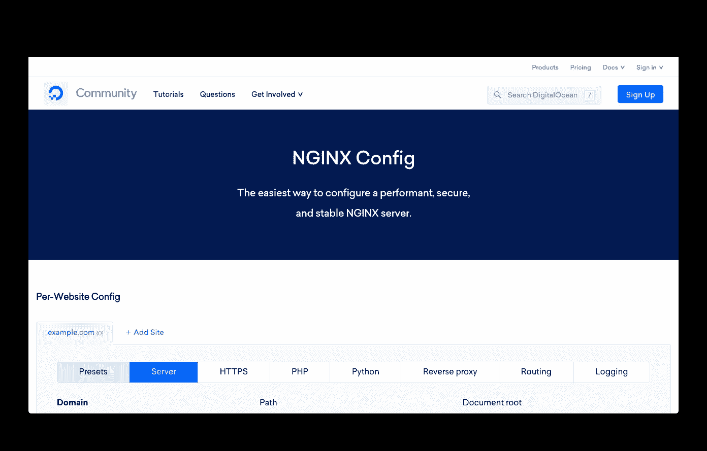

# 教程:在 Ubuntu 18.04 上创建或更新 NGINX 域/子域并添加 Let's Encrypt(仿生海狸)

> 原文：<https://levelup.gitconnected.com/tutorial-creating-or-updating-nginx-domains-subdomains-and-adding-lets-encrypt-d0ff13e7d2f1>

本教程将介绍如何创建或更新您的 NGINX 配置，以添加多个域/子域，并添加 SSL 证书与让我们加密。我将为 NGINX 创建三个不同的虚拟主机，这样我就可以创建两个静态站点(每个站点在不同的域上)和一个 Node.js 应用程序(作为子域)，这样我就可以展示每个站点的流程有何不同。

虽然我是这样做的，但你应该可以根据自己的喜好使用任意多或任意少的域/子域。

这里假设你已经安装了 Ubuntu 实例，安装了 NGINX，可以通过 SSH 访问，并且为你将要使用的域名/子域设置了正确的 DNS 记录。尽管我使用的是 AWS EC2 实例，但这应该适用于任何 Ubuntu 机器。

# NGINX 配置



数字海洋的 NGINX 配置生成器

我们将使用[sudo tee /etc/letsencrypt/renewal-hooks/post/nginx-reload.sh**sudo** chmod a+x /etc/letsencrypt/renewal-hooks/post/nginx-reload.sh](https://medium.com/u/9ee8d41c2743#!/bin/bash\nnginx -t && systemctl reload nginx' | <strong class=)

[**10。**最后，重新加载 NGINX。](https://medium.com/u/9ee8d41c2743#!/bin/bash\nnginx -t && systemctl reload nginx' | <strong class=)

```
**sudo** nginx -t && **sudo** systemctl reload nginx
```

[](https://medium.com/u/9ee8d41c2743#!/bin/bash\nnginx -t && systemctl reload nginx' | <strong class=)

# [你有它！](https://medium.com/u/9ee8d41c2743#!/bin/bash\nnginx -t && systemctl reload nginx' | <strong class=)

[现在你应该有一个正常工作的 NGINX 服务器，所有的域和子域都配置了 SSL！](https://medium.com/u/9ee8d41c2743#!/bin/bash\nnginx -t && systemctl reload nginx' | <strong class=)

[感谢阅读！如有任何问题，欢迎留言回复！](https://medium.com/u/9ee8d41c2743#!/bin/bash\nnginx -t && systemctl reload nginx' | <strong class=)

[](https://medium.com/u/9ee8d41c2743#!/bin/bash\nnginx -t && systemctl reload nginx' | <strong class=)