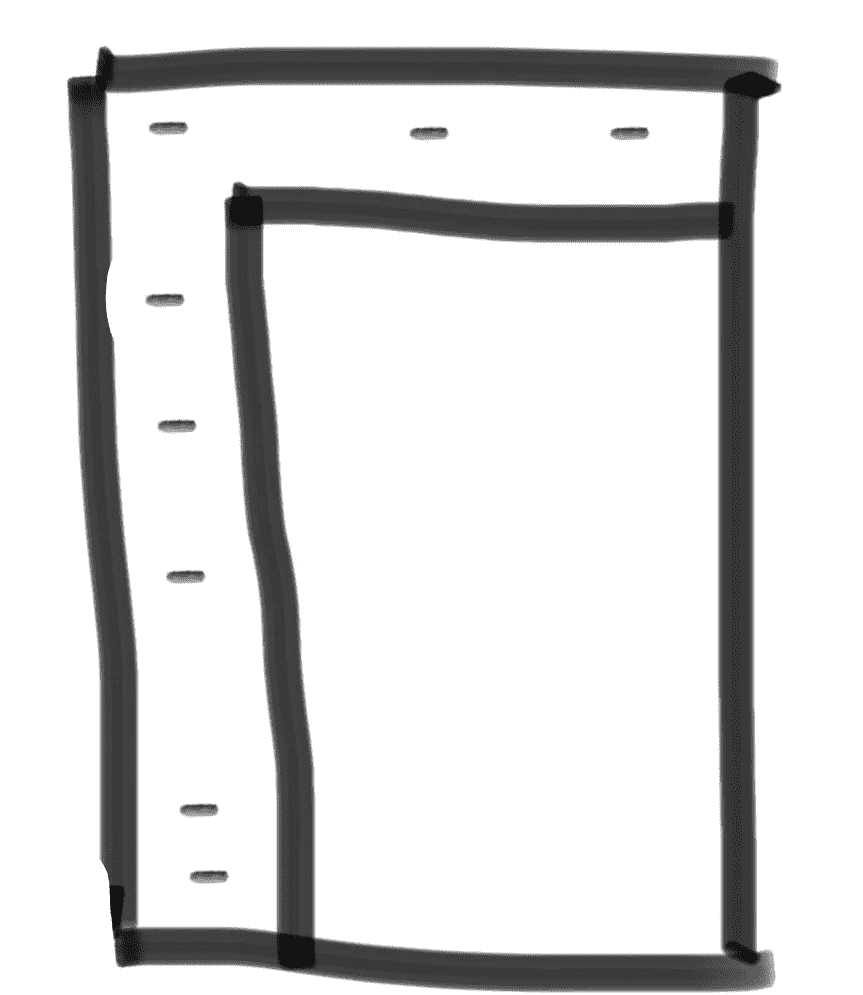
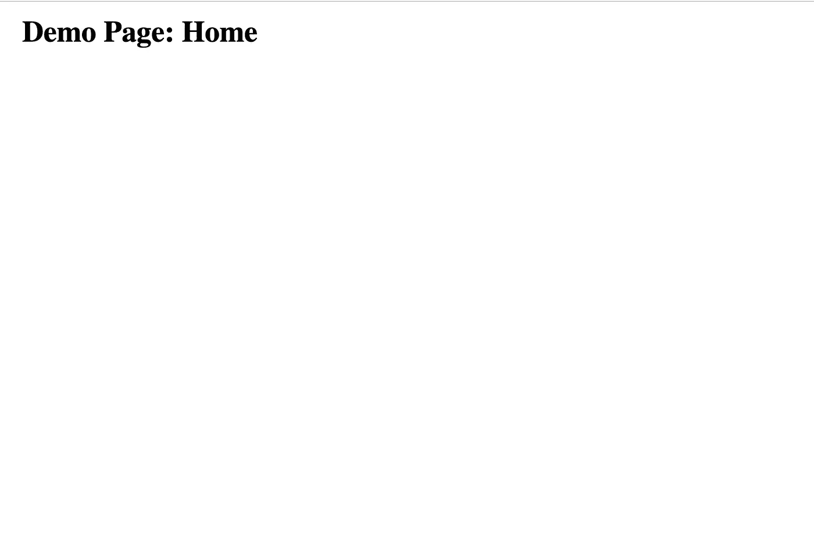
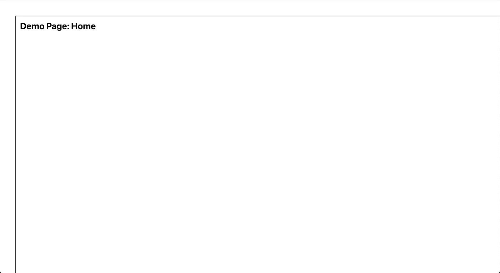
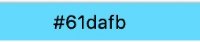
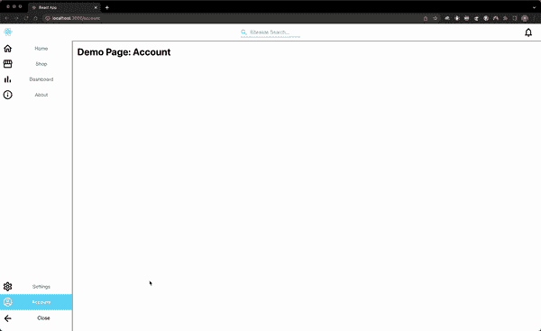

# 教程:开发一个带有路由的响应式 React 导航抽屉

> 原文：<https://levelup.gitconnected.com/tutorial-develop-a-responsive-react-navigation-drawer-hoc-with-routing-a92712e349a9>

## 在 Material UI 的一点帮助下


Maksym Kaharlytskyi 在 [Unsplash](https://unsplash.com?utm_source=medium&utm_medium=referral) 上拍摄的照片

有没有想过一个网站如何在每个页面上都有一个持久的导航菜单？在前端进行 URL 路由怎么样？对于一些人来说，这个功能可能看起来很基础，但是如果你是新手，下面的介绍会很有用。

# 方案

假设您有一个客户，希望您构建一个具有以下菜单选项的 UI:

*   主页
*   商店
*   仪表盘
*   设置
*   账户

此外，我们还为您提供了一些模型，显示了屏幕左侧和顶部的导航栏。菜单选项显示为文本旁边的图标和一个可展开的抽屉。



关闭状态的粗略模型

# 设置

作为先决条件，您应该[安装节点版本管理器](https://medium.com/geekculture/how-to-install-node-js-by-nvm-61addf4ab1ba)。一旦启动并运行，我们将使用(截至 2022 年 10 月 25 日)Node.js 的最新长期支持版本:

`$ nvm install 18 && nvm use 18`

接下来，我们将使用可靠的 create-react-app 来引导 React 项目:

`$ npx create-react-app navigation-drawer --template typescript`

这里的名字是“导航抽屉”,但你可以随意称呼它。create-react-app 将为您创建一个目录，因此在您的终端中切换到该目录:

`$ cd navigation-drawer`

然后，我们将从安装一些稍后会用到的软件包开始:

`$ npm i react-router-dom @mui/material @mui/icons-material @emotion/react @emotion/styled`

以下是对这些软件包的功能的解释，仅供参考:

*   `react-router-dom`*——(版本 6.3.0，解压后大小:169 kB)——React Router 是 React JavaScript 库的一个轻量级、全功能路由库。React 路由器运行在 React 运行的任何地方；在 web 上、在服务器上(使用 node.js)以及在 React Native 上*
*   `@mui/material`*——(版本 5.10.1，解压缩后大小:9.51 MB)——一个全面的组件库，它实现了谷歌* [*材料设计*](https://material.io/design/introduction/) *系统*
*   `@mui/icons-material`*——(版本 5.8.4，解压后大小:17.8 MB)——一个提供 Google* [*素材图标*](https://fonts.google.com/icons?icon.set=Material+Icons) *转换成* `[*SvgIcon*](https://mui.com/material-ui/api/svg-icon/)` *组件*的包
*   `@emotion/react`*——(版本 11.10.0，解压缩后大小:549 kB)——一个高性能、灵活的 CSS-in-JS 库。它建立在许多其他 CSS-in-JS 库的基础上，允许您使用字符串或对象样式快速设计应用程序。它有可预测的组成，以避免 CSS 的特殊性问题。有了源地图和标签，Emotion 就有了很好的开发者体验和出色的性能，并且在生产中有大量缓存*
*   `@emotion/styled`*——(版本 11.10.0，解压后大小:174 kB)——为@emotion/react 设计的风格化 API*

# 编码

这总是每个人最喜欢的部分。在[你最喜欢的 IDE](https://medium.com/cloud-native-the-gathering/what-is-the-best-react-reactjs-and-react-native-ide-170ad5e23ae3) 中打开自举 React 项目。首先在`src/`目录中创建 5 个目录:

```
$ cd src && mkdir components media pages styles types
```

现在，您的项目目录结构应该如下所示:

```
public/
src/
 **--> components/
  --> media/
  --> pages/
  --> styles/ 
  --> types/** .gitignore
README.md
package-lock.json
package.json
tsconfig.json
```

在`src/index.tsx`文件中，用以下内容替换样板文件内容:

```
import React from 'react';
import ReactDOM from 'react-dom';
import App from './components/App';

ReactDOM.render(<App />, document.getElementById('root'));
```

你应该会看到到处都是红线，但没关系，因为我们很快就会修复它。然后，我们将在`components/`目录`App.tsx`中创建一个文件，并用以下内容填充它:

```
import React, { FC } from 'react';
import { BrowserRouter as Router } from "react-router-dom";
import AppRouter from './AppRouter';

const App: FC = () => (
  <Router>
    <AppRouter />
  </Router>
);

export default App;
```

`BrowserRouter`(我们将其别名为`Router`)是一个使用 HTML5 历史 API 来保持你的 UI 与 URL 同步的组件。我们已经将这个包裹在我们的应用程序的路线中，这些路线在`AppRouter`中。接下来，我们需要在`components/AppRouter.tsx`中创建我们的应用程序的路线。该组件将如下所示:

```
import React, { Suspense } from 'react';
import { Route, Routes } from "react-router-dom";
import { Grid } from '@mui/material';

const DemoPage = ({ pageName }: DemoPageProps) => <h1 style={{ margin: '1rem' }}>Demo Page: {pageName}</h1>;const DemoSpinner = () => (<p>Spinner</p>);const AppRouter = () => (
    <Grid className="container">
      <Suspense fallback={<DemoSpinner />}>
        <Routes>
          <Route path="/" element={<DemoPage pageName="Home" />} />
          <Route path="/shop" element={<DemoPage pageName="Shop" />} />
          <Route path="/dashboard" element={<DemoPage pageName="Dashboard" />} />
          <Route path="/about" element={<DemoPage pageName="About" />} />
          <Route path="/settings" element={<DemoPage pageName="Shop" />} />
          <Route path="/account" element={<DemoPage pageName="Account" />} />
        </Routes>
      </Suspense>
    </Grid>
);

export default AppRouter;
```

这里我们的默认路径是主页。请注意我们如何在子路由列表上方的“根”`/`指定路由，即`/about`。以前这会给应用程序增加一个错误，因为`/`路线会拦截任何跟在它后面的东西。这个问题已经在`react-router-dom`包中解决了。现在，我们只有一个内容组件，我们将在所有路线中重复使用，因此让我们继续更新它。在`pages/`目录下创建`Page.tsx`:

```
import React from 'react';

interface PageProps {
  pageName: string;
}

const Page = ({ pageName }: PageProps) => (
  <h1 style={{ margin: '1rem' }}>Demo Page: {pageName}</h1>
);

export default Page;
```

这将作为本教程的占位符，但理想情况下，你不会在专业项目中这样做。我不会在这篇文章中讨论它，但是你应该在`pages/`目录中为你的网站中的每个页面创建一个不同的 React 组件。这隔离了功能，并且是一个比让每个页面都适合这个 React 组件更干净的实现。回头看看我们的`AppRouter.tsx`组件，我们看到还有一个`Spinner`组件正在被使用。每当我们向 DOM 加载新内容时，都会显示这个消息。让我们给`Spinner`它自己的文件；在`components/`中创建`Spinner.tsx`:

```
import React from 'react';
import { CircularProgress, Box } from '@mui/material';

const Spinner = () => {
  return (
    <Box sx={{ display: 'flex', color: 'grey.500' }}>
      <CircularProgress />
    </Box>
  );
};export default Spinner;
```

回到`AppRouter.tsx`，我们现在应该有一个`Page`和`Spinner`组件可以使用了。该组件的更新版本现在如下所示:

```
import React, { Suspense, lazy } from 'react';
import { Route, Routes } from "react-router-dom";
import { Grid } from '@mui/material';
import SiteNavigation from './SiteNavigation';
import Spinner from './Spinner';

const About = React.lazy(() => import("../pages/DemoPage"));
const Dashboard = React.lazy(() => import("../pages/DemoPage"))
const Account = lazy(() => import('../pages/DemoPage'));
const Shop = lazy(() => import('../pages/DemoPage'));
const Home = lazy(() => import('../pages/DemoPage'));

const AppRouter = () => (
  <SiteNavigation>
    <Grid className="container">
      <Suspense fallback={<Spinner />}>
        <Routes>
          <Route path="/" element={<Home pageName="Home" />} />
          <Route path="/shop" element={<Shop pageName="Shop" />} />
          <Route path="/dashboard" element={<Dashboard pageName="Dashboard" />} />
          <Route path="/about" element={<About pageName="About" />} />
          <Route path="/settings" element={<Shop pageName="Shop" />} />
          <Route path="/account" element={<Account pageName="Account" />} />
        </Routes>
      </Suspense>
    </Grid>
  </SiteNavigation>
);

export default AppRouter;
```

请注意，我们是如何延迟加载页面以接受对相应路由的请求的。惰性加载让您可以推迟加载某个组件的捆绑代码，直到它被调用。还有一个 SiteNavigation 组件，我们将路线包装在其中。这就是有趣的地方。要创建`SiteNavigation.tsx`，让我们从`components/`目录中的以下代码开始:

```
import React, { useState } from 'react';
import { useNavigate, useLocation, NavigateFunction } from 'react-router-dom';
import { Grid } from '@mui/material';
import * as H from 'history';
import ErrorBoundary from './ErrorBoundary';
import '../styles/SiteNavigation.css';

interface SiteNavigationProps {
  children: any,
}

function setInitialRoute(
  location: H.Location,
  navigate: NavigateFunction,
): void {
  // eslint-disable-next-line @typescript-eslint/no-unused-vars        
  const [_root, route] = location.pathname.split('/');
  if (route && route === 'logout') navigate('/');
}

const SiteNavigation = (props: SiteNavigationProps) => {
  const { children } = props;
  const location = useLocation();
  const navigate = useNavigate();
  setInitialRoute(location, navigate);
  // eslint-disable-next-line @typescript-eslint/no-unused-vars
  const [isSideBarOpened, setIsSidebarOpened] = useState(false);

  return (
    <Grid className="SiteNavigation">
      <Grid className="top">

      </Grid>
      <Grid className="bottom">
        <Grid className={isSideBarOpened ? 'left opened' : 'left'}>
          <Grid className="bottom-left-top">

          </Grid>
          <Grid className="bottom-left-bottom">

          </Grid>
        </Grid>
        <Grid className="right">
          <ErrorBoundary>
            {children}
          </ErrorBoundary>
        </Grid>
      </Grid>
    </Grid>
  );
};

export default SiteNavigation;
```

花一分钟暂停一下，看看目前为止的 app 它看起来很简单:



没有造型

如果我从头开始编写代码，我会在这一点上开始给所有组件添加样式。让我们从`styles/index.css`和`styles/App.css`开始:

styles/index.css

styles/App.css

为了做一个教程，我用普通 CSS 编写样式。对于一个专业的项目，你可能想使用[的首选方式，使用主题化和 CSS-in-JS](https://medium.com/codex/how-to-style-material-ui-components-6b21ad1e1d8f) 的材质 UI。接下来让我们来设计`SiteNavigation`组件(`styles/SiteNavigation.css`)的样式:

`styles/SiteNavigation.css`



造型后

现在，当我们在浏览器中查看应用程序时，它开始看起来更专业了。关于造型需要注意的一些重要事项:

*   它采用 flexbox 布局的响应式设计。`styles/SiteNavigation.css`的第 118 行显示了用于在移动屏幕上隐藏非核心功能元素的媒体查询。
*   我们坚持使用标准的配色方案，使用原色和二色十六进制代码(`#61DAFB`用于浅蓝色高光，`#FFFFFF`用于白色背景，`#000000`用于黑色文本和边框)。



淡蓝

*   单击箭头图标控制抽屉的打开/关闭状态。它也根据这个状态旋转。`styles/SiteNavigation.css`的第 154 到 172 行显示了这是如何完成的。
*   顶部菜单图标和底部菜单图标之间有一个分割线
*   如`styles/SiteNavigation.css`中第 135 至 151 行所示，高亮显示当前页面/路径。

我们现在要做的最后一件事是添加菜单选项。我们可以用以下内容更新`components/SiteNavigation.tsx`组件:

```
import React, { useState } from 'react';
import { useNavigate, useLocation, NavigateFunction, Link } from 'react-router-dom';
import { Alert, Badge, Grid, Typography } from '@mui/material';
import { NotificationsOutlined } from '@mui/icons-material';
import * as H from 'history';
import { bottomIcons, SiteNavigationIcon, topIcons } from '../types/SiteNavigationIcon';
import { NotificationItem } from '../types/NotificationItem';
import NotificationsList from './NotificationsList';
import RotatingArrow from './RotatingArrow';
import ErrorBoundary from './ErrorBoundary';
import Search from './Search';
import Logo from '../media/logo.svg';
import '../styles/SiteNavigation.css';

interface SiteNavigationProps {
  children: any,
}

function setInitialRoute(
  location: H.Location,
  navigate: NavigateFunction,
): void {
  const [, route] = location.pathname.split('/');
  if (route && route === 'logout') navigate('/');
}

const SiteNavigation = ({ children }: SiteNavigationProps) => {
  const location = useLocation();
  const navigate = useNavigate();
  setInitialRoute(location, navigate);

  // eslint-disable-next-line @typescript-eslint/no-unused-vars
  const [error, setError] = useState<Error | undefined>(undefined);
  const [pageName, setPageName] = useState('');
  const [isSideBarOpened, setIsSidebarOpened] = useState(false);
  const [numNotifications] = useState<number>(0);
  // eslint-disable-next-line @typescript-eslint/no-unused-vars
  const [showNotifications, setShowNotifications] = useState<boolean>(false);
  const [notifications] = useState<NotificationItem[]>([]);

  const onClickShowNotifications = () => {
    // Fill in your code for displaying the notifications list here!
  };

  const onSearch = (searchString: string) => { 
    // Fill in your code for calling the backend API here!
  };

  const toNavLink = (icon: SiteNavigationIcon) => {
    const IconComponent = icon.component;
    return (
      <Link
        to={icon.path}
        onClick={() => setPageName(icon.key)}
        key={icon.key}
        className={pageName === icon.key ? 'underlined icon' : 'icon'}
      >
        <IconComponent
          fontSize="large"
          htmlColor="#000"
        />
        {!!isSideBarOpened && (
          <Typography variant="body1">{icon.key}</Typography>
        )}
      </Link>
    );
  };

  return (
    <Grid className="SiteNavigation">
      <Grid className="top">
        {error && <Alert severity="error">{error.message}</Alert>}
        {!error && (
          <>
            <Grid className="left">
              
            </Grid>
            <Grid className="middle">
              <Search onSearch={onSearch} />
            </Grid>
            <Grid className="right">
              <Badge
                badgeContent={numNotifications}
                color="error"
                anchorOrigin={{
                  vertical: 'bottom',
                  horizontal: 'right',
                }}
                overlap="circular"
              >
                <NotificationsOutlined
                  fontSize="large"
                  htmlColor="#000"
                  className="icon"
                  onClick={onClickShowNotifications}
                />
              </Badge>
              {(showNotifications && notifications.length > 0) && (
                <NotificationsList
                  notifications={notifications}
                  onClickShowNotifications={onClickShowNotifications}
                />
              )}
            </Grid>
          </>
        )}
      </Grid>
      <Grid className="bottom">
        <Grid className={isSideBarOpened ? 'left opened' : 'left'}>
          <Grid className="bottom-left-top">
            {topIcons.map(toNavLink)}
          </Grid>
          <Grid className="bottom-left-bottom">
            {bottomIcons.map(toNavLink)}
            <Grid className="rotating-arrow">
              <RotatingArrow onOpen={() => setIsSidebarOpened(!isSideBarOpened)} />
              {!!isSideBarOpened && (
                <Typography variant="body1">Close</Typography>
              )}
            </Grid>
          </Grid>
        </Grid>
        <Grid className="right">
          <ErrorBoundary>
            {children}
          </ErrorBoundary>
        </Grid>
      </Grid>
    </Grid>
  );
};

export default SiteNavigation;
```

您需要在菜单中显示图标(`types/SiteNavigationIcon.ts`):

```
import React from 'react';
import HomeIcon from '@mui/icons-material/HomeOutlined';
import SettingsIcon from '@mui/icons-material/SettingsOutlined';
import AccountIcon from '@mui/icons-material/AccountCircleOutlined';
import ShopIcon from '@mui/icons-material/StorefrontOutlined';
import DashboardIcon from '@mui/icons-material/BarChartOutlined';
import AboutIcon from '@mui/icons-material/InfoOutlined';

export type SiteNavigationIcon = {
  key: string;
  component: React.ComponentType<any>;
  path: string;
}

export const topIcons: SiteNavigationIcon[] = [
  {
    key: 'Home',
    path: '/',
    component: HomeIcon,
  },
  {
    key: 'Shop',
    path: '/shop',
    component: ShopIcon,
  },
  {
    key: 'Dashboard',
    path: '/dashboard',
    component: DashboardIcon,
  },
  {
    key: 'About',
    path: '/about',
    component: AboutIcon,
  },
];

export const bottomIcons: SiteNavigationIcon[] = [
  {
    key: 'Settings',
    path: '/settings',
    component: SettingsIcon,
  },
  {
    key: 'Account',
    path: '/account',
    component: AccountIcon,
  },
];
```

# 结论

添加菜单选项后，您应该能够返回终端并启动服务器:

```
$ npm startCompiled successfully!

You can now view navigation-drawer in the browser.

  Local:            http://localhost:3000
  On Your Network:  http://xxx.xxx.x.xxx:3000

Note that the development build is not optimized.
To create a production build, use npm run build.

webpack compiled successfully
No issues found.
```

打开浏览器进入 [http://localhost:3000](http://localhost:300) 并查看您出色的导航抽屉:



完成导航菜单

总结一下我们的成果:

*   响应导航菜单(断点在 768 像素屏幕宽度)。例如，这可以隐藏手机屏幕上的搜索栏。
*   我们的单页应用程序的路由将请求定向到正确的页面，即`/shop`显示商店页面。
*   一个高阶组件，我们现在可以包装我们网站中每个页面的内容。这更具性能，因为导航菜单是持久的，我们可以只在需要的时候加载和替换页面的主要内容。

如果你想增加更多的功能，我可以给你一些灵感。以下是在专业项目中创建导航菜单后的一些逻辑功能:

1.  [用户认证](https://ui.docs.amplify.aws/react/connected-components/authenticator)和[路由守卫](https://medium.com/@thanhbinh.tran93/private-route-public-route-and-restricted-route-with-react-router-d50b27c15f5e)
2.  在通知图标下添加一个可取消的[弹出窗口](https://mui.com/material-ui/react-popover/)列出通知
3.  [去抖向后端 API 请求](https://medium.com/simars/react-debounce-with-higher-order-component-ce660cd4a967)进行搜索(使用前端的[获取 API](https://developer.mozilla.org/en-US/docs/Web/API/Fetch_API/Using_Fetch)
4.  商品详情视图在店铺页面中给定商品 ID 的 URL 中显示为查询变量(`http://localhost:3000/shop?productId=xxxx`)

要查看完整的代码，您可以访问下面的公共 GitHub repo

[](https://github.com/beatleboy501/react-custom-navigation) [## GitHub-Beatle boy 501/react-自定义-导航

### 这个项目是用 Create React App 引导的。在项目目录中，您可以运行:在…中运行应用程序

github.com](https://github.com/beatleboy501/react-custom-navigation) 

如果你喜欢我的写作风格，请跟我来。我一个月发表大约 1x，我喜欢网络，谢谢！