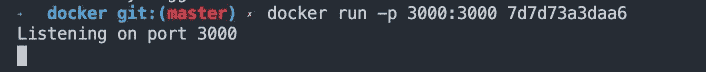

# 教程:对 Node.js 应用程序进行 Dockerizing

> 原文：<https://levelup.gitconnected.com/tutorial-docker-and-node-js-2d7fde6eb38b>

*作者* [*奥斯汀·洛夫莱斯*](https://www.linkedin.com/in/austin-loveless/)*—2020 年 1 月 11 日*

# 这个项目包含什么

我们将封装一个 node.js 项目，呈现一个简单的静态站点。我将在[https://github.com/austinloveless/Node-Docker-Lab](https://github.com/austinloveless/Node-Docker-Lab)提供所有代码。本教程中的内容可以应用于任何你想打包的应用程序，你只需要用你的运行时和依赖关系更新 docker 文件。

本教程假设您对 Docker 有基本的了解。如果你是 Docker 的新手，你可以阅读我之前的[帖子](https://medium.com/@awsmeetupgroup/intro-to-docker-1855b825de5e)向你介绍 Docker。

# 安装先决条件

# 下载 Docker 桌面。

如果你用的是苹果电脑，去[https://docs.docker.com/docker-for-mac/install/](https://docs.docker.com/docker-for-mac/install/)或者 Windows 去[https://docs.docker.com/docker-for-windows/install/](https://docs.docker.com/docker-for-windows/install/)。按照那里的安装说明和帐户设置。

# 安装 node.js

在这里下载 node.js [。](https://nodejs.org/en/)

# 项目设置

现在我们已经安装了我们的先决条件，我们可以构建我们的应用程序。这个项目不会把重点放在应用程序代码上，重点是更熟悉 Docker。因此您可以下载[存储库](https://github.com/austinloveless/Node-Docker-Lab)并将目录更改为`Node-Docker-Lab`目录。

如果你想在本地运行应用程序，比如说，去他妈的 docker，你可以在`Docker-lab`目录下运行`npm install` 。然后运行`node app.js`。要查看本地运行的网站，请访问`[http://localhost:](http://localhost:80.)3000`。

现在我们已经安装了 docker 并下载了 repo，我们可以看看`Dockerfile`。您可以将它想象成 docker 在构建容器或应用程序蓝图时要执行的一系列指令。

在顶部，我们声明了我们的运行时，即`node:12.4-alpine`。这基本上是我们应用程序的起点。我们从官方 docker hub [节点映像](https://hub.docker.com/_/node)中抓取了这个基础映像。

如果你去链接，你可以看到 12.4-阿尔卑斯。“-alpine”是一个小得多的基础图像，docker hub 建议“当最终图像尺寸尽可能小时”。我们的应用程序很小，所以我们将使用阿尔卑斯山的图像。

接下来，在 docker 文件中，我们将创建一个`/app`目录，并将 docker 容器中的工作目录设置为在`/app`中运行。

之后，我们将把`package.json`文件“复制”到 docker 容器上的`package.json`。然后我们从我们的`node_modules`安装我们的依赖项。“复制”整个目录。并运行命令`node app.js`来启动 docker 容器中的节点应用程序。

# 使用 Docker

现在我们已经讨论了 over 文件的无聊细节，让我们实际构建它。

所以当你安装 Docker 桌面时，它附带了一些工具。Docker 命令行、Docker 编写和 Docker 公证命令行。

我们将使用 Docker CLI 来:

*   建立码头工人形象
*   在本地运行容器
*   给图像加标签
*   并将图像上传到 Docker Hub。

# 建立形象

构建图像的命令是`docker build [OPTIONS] PATH | URL | -`。您可以进入[文档](https://docs.docker.com/engine/reference/commandline/build/)查看所有选项。

在应用的根目录下，可以运行`docker build -t intro-to-docker .`。这将把我们的图像标记为“intro-to-docker”并构建图像。

为了验证，您成功创建了可以运行`docker images`的映像。我的看起来像`intro-to-docker latest e088af51a10b 3 days ago 87.8MB`。

# 在本地运行容器

现在，我们将运行新创建的映像，并查看 docker 的运行情况。因此，复制您的“图像 ID”并运行`docker run --rm -p 3000:3000 <YOUR IMAGE ID>`。`-p`定义了您希望您的应用程序在哪个端口上运行。

您现在可以访问 [http://localhost:3000](http://localhost:80) 来查看应用程序。

要查看您的容器是否正在通过 CLI 运行，您可以打开另一个终端窗口并运行`docker container ls`。

要停止图像，您可以运行`docker container stop <CONTAINER ID>` 。再次用`docker container ls`确认其停止。

# 将图像上传到 Docker Hub

要上传一张图片到 Docker Hub，我们需要更新标签，让你的“Docker ID”是你第一次下载 docker desktop 时创建的；这是你的码头用户名。

我们需要使用`docker login --username=<YOUR USER NAME>`通过命令行界面登录 Docker Hub。它会提示你输入密码，并说“登录成功”。

运行`docker images`以获得您的图像 id，它应该看起来像 ff1019794aff。

现在用你的 docker 用户名和图片 id 运行`docker tag ff1019794aff <YOUR USERNAME>/intro-to-docker:latest`。通过运行`docker images`验证您是否正确创建了该标签。

让我们用`docker push <YOUR USERNAME>/intro-to-docker`将我们的图像推送到 Docker Hub。这将需要几分钟的时间，但一旦完成，你可以去[https://hub.docker.com/](https://hub.docker.com/)看看那里的图像。

码头枢纽

查看下一篇关于在 Amazon ECS、弹性容器服务、集群上运行 node.js 映像的教程。或者，如果你是 docker 的新手，请查看最后一篇[帖子](https://medium.com/@awsmeetupgroup/intro-to-docker-1855b825de5e)。