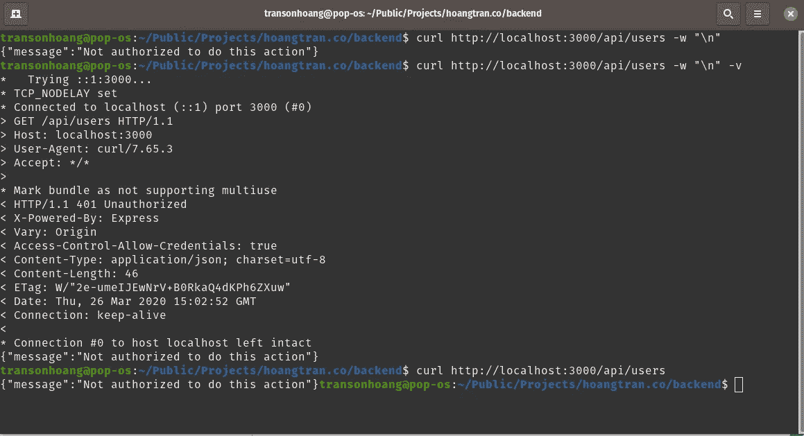

# 节点应用程序中的身份验证和授权教程

> 原文：<https://levelup.gitconnected.com/tutorial-for-authentication-and-authorization-in-a-node-application-772bef191dae>

## Nodejs

## 编写用于登录、注销、创建 JWT 令牌、加密密码和 CRUD 用户的 API 的端到端指南。


照片由[达拉凯奥](https://unsplash.com/@dara_photo?utm_source=unsplash&utm_medium=referral&utm_content=creditCopyText)在 [Unsplash](https://unsplash.com/s/photos/vietnam-coffee?utm_source=unsplash&utm_medium=referral&utm_content=creditCopyText) 拍摄

我一直在写关于如何构建服务器和 API 的文章。我之前展示了如何设置应用程序并将其连接到数据库。

[](/stop-using-a-starter-node-js-project-and-build-your-own-38a97aa723f9) [## 停止使用 Starter Node.js 项目，构建自己的项目

### 这篇文章基于我如何使用 expressjs 设置我的个人网站后端，因为我想将所有 API 从…

levelup.gitconnected.com](/stop-using-a-starter-node-js-project-and-build-your-own-38a97aa723f9) [](/the-complete-guide-to-connecting-to-a-database-in-node-js-9c7850235b91) [## Node.js 中连接数据库的完整指南

### 一个语法用于多个数据库，像 PRO in nodejs 应用程序一样进行 SQL 迁移和种子数据。

levelup.gitconnected.com](/the-complete-guide-to-connecting-to-a-database-in-node-js-9c7850235b91) 

在本文中，我将写另一个关于用户认证和授权的节点主题。

1.  向项目中添加 JWT
2.  如何加密密码
3.  实现登录
4.  实现授权中间件
5.  实施注销

*更多类似内容，请查看*[*https://betterfullstack.com*](https://betterfullstack.com)

个人认为这是一个节点应用需要的所有必备。在现实世界中，所有复杂的特性都是从这个基本实现开始的。

开始吧！

# 将 JWT 添加到项目

要将 JWT 添加到节点应用程序中，只需运行`npm i jsonwebtoken`。

注意:我们有另一个库叫做`jose` [JSON Web 几乎一切](https://www.npmjs.com/package/jose)。你可以安装这个库来代替`[jsonwebtoken](https://www.npmjs.com/package/jsonwebtoken)`。


将 jsonwebtoken 安装到 nodejs 应用程序

重要提示:

据[博客](https://auth0.com/blog/critical-vulnerabilities-in-json-web-token-libraries/)来自[auth0.com](https://auth0.com/):

> "我发现许多库存在严重漏洞，使得攻击者能够绕过验证步骤."

为了降低风险，帮助我们的节点得到更安全的应用。我建议应用一些基本的东西:

*   提供一个密钥。
*   向验证方法添加算法参数。默认的是 **HS256** 。
*   应包括`expiresIn`选项。

还有一件事，我创建了一个新的迁移文件来添加一个名为`tokens`的表，该表为用户存储令牌。


向现有数据库添加表标记

搞定了。

# 如何加密密码

我建议用`[bcryptjs](https://www.npmjs.com/package/bcryptjs)`加密用户密码。


安装加密密码的 bcryptjs

现在，我将转到种子文件，导入`bcryptjs`，加密管理员用户的密码，然后再次运行种子文件。


导入 bcryptjs 并再次运行种子文件。

注意:如果你想知道什么是种子数据，如何运行它，你可以在这里查看我的上一篇文章。它是关于如何在节点应用程序中正确地使用数据库。

现在，从数据库用户界面，我们可以看到我的管理员用户密码已被加密。


管理员密码已加密

我喜欢让事情变得简单。这足以让我们进入下一条路径。

# 实现登录

我想先总结一下登录的逻辑:

*   验证用户名
*   验证密码
*   生成令牌
*   创建或更新`tokens`表。我认为从这里开始，每个人都不一样。因为我做过一些项目，它允许为单个用户在`tokens`中创建多行。
*   对用户的响应

实施:

登录功能的基本实现

有两件事我们需要注意的是:

1.  通过`bcrypt`比较令牌
2.  通过`jsonwebtoken`生成令牌

在这里，我将他们的信息放入 JWT 的有效载荷中:`id`、`username`和`isAdmin`。

生成 jwt 令牌

通过所有验证后，我将在`tokens`表中创建一行，并将响应数据(包括用户信息和令牌)发送回浏览器。


成功登录后用 jwt 响应 200

注意:

*   你可以为这个特性添加更多的东西，比如日志，graphql，用户名和密码的验证。
*   我试着让事情尽可能简单。
*   您可以向有效负载添加更多信息。这对于我们稍后将实现的认证中间件来说是有用的信息。

# 实现授权中间件

如果你对什么是中间件有疑问，可以在这里找到答案[。](/stop-using-a-starter-node-js-project-and-build-your-own-38a97aa723f9?source=friends_link&sk=82fde8680655a301b5d77849f2f3dfc4)

为什么我们需要认证中间件？

中间件功能可以执行以下任务:

*   执行任何代码。
*   对请求和响应对象进行更改。
*   结束请求-响应循环。
*   调用堆栈中的下一个中间件。

使用它来执行一些代码，以确保用户得到验证，并向请求添加一些额外的数据。

如何实施？

首先，这里有一个关于如何用 Express 实现中间件的概貌。


如何在一般情况下实现中间件

其次，实施应包括 3 件事:

*   验证`Authorization`标题
*   用私钥验证令牌
*   从令牌有效负载中添加额外信息

认证中间件实现

最后，从 postman 或命令行检查结果:

`curl -v [http://localhost:3000/api/user](http://localhost:3000/api/user) -w "\n" -v`。



发送没有授权头的请求

当我们打电话去找`/api/users`时，你可以看到上面的信息。它将返回状态 **401** 和消息 ***未授权执行此操作。***

注意:

*   你可以从命令行注意到我添加了`-w "\n"`。这是在这种情况下添加一个新行，以避免您在命令行末尾看到的同一行。
*   发送错误后，我添加了`return`关键字。这是为了避免错误:

> [【ERR _ HTTP _ HEADERS _ SENT】:报头发送到客户端后无法设置](https://stackoverflow.com/questions/7042340/error-cant-set-headers-after-they-are-sent-to-the-client)

现在，让我们将`Authorization`添加到请求中以查看结果:


验证 jwt 后返回用户列表

搞定了。

# 实施注销

此 API 的目的是允许用户注销应用程序并删除数据库中的现有令牌。

注销功能将删除数据库中的现有令牌

我可以从`req.userId`获取用户 id 信息，因为这个信息是从`auth.middleware.js`添加的。

现在，您可以看到注销后，令牌已从数据库中删除。

```
curl http://localhost:3000/api/user/logout -w “\n” -v -H “Authorization: Bearer YOUR_JWT” -X POST
```


注销后令牌已从数据库中删除

搞定了。

# 结论

这篇文章是关于节点应用程序中的认证和授权的基础知识，可以帮助节点新手理解如何使用 [expressjs](https://expressjs.com/) 和 [knex](http://knexjs.org/) 创建简单的 API 进行认证，以及如何创建简单的中间件进行认证。

如果你觉得这篇文章有用！你可以在[媒体](https://medium.com/@transonhoang?source=post_page---------------------------)上关注我。我也在[推特](https://twitter.com/transonhoang)上。欢迎在下面的评论中留下任何问题。我很乐意帮忙！

示例源代码:

[](https://github.com/hoangtranson/starter-express-js) [## Hoang transon/starter-express-js

### 在 GitHub 上创建一个帐户，为 Hoang transon/starter-express-js 的开发做出贡献。

github.com](https://github.com/hoangtranson/starter-express-js) [](https://betterfullstack.com/stories/) [## 故事-更好的全栈

### 关于 JavaScript、Python 和 Wordpress 的有用文章，有助于开发人员减少开发时间并提高…

betterfullstack.com](https://betterfullstack.com/stories/)