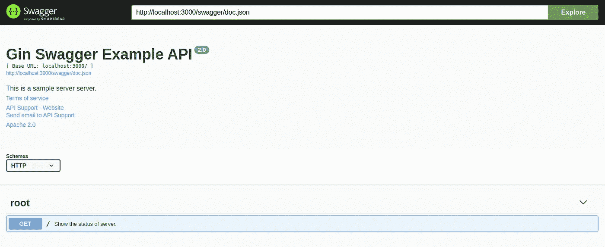

# 教程:为 Gin Go Web 框架生成 Swagger 规范和 SwaggerUI

> 原文：<https://levelup.gitconnected.com/tutorial-generate-swagger-specification-and-swaggerui-for-gin-go-web-framework-9f0c038483b5>

# 为什么选择 Gin Web Framework？

Gin 是最流行的围棋框架之一。用起来很简单。

# 为什么要 Swagger 规范？

编写规格说明书是软件工程中一个细致的过程。不管怎样，如果我们想让其他人使用我们的 API，这是必要的。它帮助其他人更轻松地集成没有 API 的组件。文档越好，其他人就越容易将它集成到他们的系统中。为了解决这个问题，我们应该遵循行业内创建 API 文档的标准化方式，*OpenAPI 规范或*原名 Swagger 规范。

> OpenAPI 规范，以前被称为 Swagger 规范，是定义 RESTful 接口的世界标准。OAS 使开发人员能够设计一个技术不可知的 API 接口，该接口构成了他们的 API 开发和消费的基础。

# 先决条件

你需要在你的机器上安装 Go 版本≥1.14。

# 步伐

1.  创建文件夹进行开发，我们将调用 app *ginsimple* 。

```
$ mkdir ginsimple
$ mkdir docs
$ mkdir docs/ginsimple
```

2.为 go 供应商系统初始化 go 模式。

```
$ go mod init
```

3.拉*轧棉*库。

```
$ go get -u github.com/gin-gonic/gin
```

4.在 *ginsimple* 文件夹中，创建一个新文件 *main.go* 并复制*下面的代码。*

```
**package** main

**import** (
   "log"
   "net/http"

   "github.com/gin-gonic/gin"
)

**func** main() {
   // Gin instance
   *r* := gin.New()

   // Routes
   *r*.GET("/", HealthCheck)

   // Start server
   **if** *err* := *r*.Run(":3000"); *err* != **nil** {
      log.Fatal(*err*)
   }
}

**func** HealthCheck(*c* *gin.Context) {
   *res* := **map**[string]**interface**{}{
      "data": "Server is up and running",
   }

   *c*.JSON(http.*StatusOK*, *res*)
}
```

5.运行应用程序。

```
$ go run ginsimple/main.go
```

您应该会看到如下所示的输出。

```
[GIN-debug] [WARNING] Running in "debug" mode. Switch to "release" mode in production. 
 - using env:   export GIN_MODE=release 
 - using code:  gin.SetMode(gin.ReleaseMode) 

[GIN-debug] GET / --> main.HealthCheck (1 handlers) 
[GIN-debug] Listening and serving HTTP on :3000
```

这意味着我们的服务器在端口 3000 上启动并运行。

6.通过添加*声明性注释格式*来更新我们的 *main.go* 。这些注释将在后面被用来自动生成 *Swagger 规格说明*。您可以使用参考资料中的链接了解更多关于*声明性注释格式*的信息。

```
**package** main

**import** (
   "log"
   "net/http"

   "github.com/gin-gonic/gin"
)// @title Gin Swagger Example API
// @version 1.0
// @description This is a sample server server.
// @termsOfService http://swagger.io/terms/

// @contact.name API Support
// @contact.url http://www.swagger.io/support
// @contact.email support@swagger.io

// @license.name Apache 2.0
// @license.url http://www.apache.org/licenses/LICENSE-2.0.html

// @host localhost:3000
// @BasePath /
// @schemes http
**func** main() {
   // Gin instance
   *r* := gin.New()

   // Routes
   *r*.GET("/", HealthCheck)

   // Start server
   **if** *err* := *r*.Run(":3000"); *err* != **nil** {
      log.Fatal(*err*)
   }
}// HealthCheck godoc
// @Summary Show the status of server.
// @Description get the status of server.
// @Tags root
// @Accept */*
// @Produce json
// @Success 200 {object} map[string]interface{}
// @Router / [get]
**func** HealthCheck(*c* *gin.Context) {
   *res* := **map**[string]**interface**{}{
      "data": "Server is up and running",
   }

   *c*.JSON(http.*StatusOK*, *res*)
}
```

7.拉招摇图书馆。

```
$ go get -v github.com/swaggo/swag/cmd/swag
$ go get -v github.com/swaggo/gin-swagger
$ go get -v github.com/swaggo/files
```

8.生成*摆动规格*。

```
$ swag init -g ginsimple/main.go --output docs/ginsimple
```

如果操作成功，您应该会在文件夹 *docs/ginsimple 中看到 3 个新文件。这些文件是:*

*   *docs.go* = >需要生成*swaggeri*。
*   *Swagger . JSON*=>*Swagger 规范*中的 *json* 文件格式。
*   *Swagger . YAML*=>*中的*Swagger 规范 *yaml* 文件格式。

如果您使用[*Confluence*](https://www.atlassian.com/software/confluence)*来分发您的文档，您可以在[*Confluence*](https://www.atlassian.com/software/confluence)*中创建一个新文件，并选择添加 OpenAPI 规范。然后复制粘贴 *swagger.yaml* 内容在里面。**

**9.更新*main . go to*add*swaggeri。***

```
****package** main

**import** (
   "log"
   "net/http"

   "github.com/gin-gonic/gin"
   _ "github.com/rizalgowandy/go-swag-sample/docs/ginsimple" **// you need to update github.com/rizalgowandy/go-swag-sample with your own project path**
   swaggerFiles "github.com/swaggo/files"
   ginSwagger "github.com/swaggo/gin-swagger"
)

// @title Gin Swagger Example API
// @version 2.0
// @description This is a sample server server.
// @termsOfService http://swagger.io/terms/

// @contact.name API Support
// @contact.url http://www.swagger.io/support
// @contact.email support@swagger.io

// @license.name Apache 2.0
// @license.url http://www.apache.org/licenses/LICENSE-2.0.html

// @host localhost:3000
// @BasePath /
// @schemes http
**func** main() {
   // Gin instance
   *r* := gin.New()

   // Routes
   *r*.GET("/", HealthCheck)

   *url* := ginSwagger.URL("http://localhost:3000/swagger/doc.json") // The url pointing to API definition
   *r*.GET("/swagger/*any", ginSwagger.WrapHandler(swaggerFiles.**Handler**, *url*))

   // Start server
   **if** *err* := *r*.Run(":3000"); *err* != **nil** {
      log.Fatal(*err*)
   }
}

// HealthCheck godoc
// @Summary Show the status of server.
// @Description get the status of server.
// @Tags root
// @Accept */*
// @Produce json
// @Success 200 {object} map[string]interface{}
// @Router / [get]
**func** HealthCheck(*c* *gin.Context) {
   *res* := **map**[string]**interface**{}{
      "data": "Server is up and running",
   }

   *c*.JSON(http.*StatusOK*, *res*)
}**
```

**如你所见，我们在 *main.go.* 上添加了两个重要的东西**

*   ***swaggeri*的新路线。**

```
***url* := ginSwagger.URL("http://localhost:3000/swagger/doc.json") // The url pointing to API definition
*r*.GET("/swagger/*any", ginSwagger.WrapHandler(swaggerFiles.**Handler**, *url*))**
```

*   **新导入为生成的 *docs.go* 和 *swag* 库。不要忘记用你的项目路径替换 github.com/rizalgowandy/go-swag-sample 路径。**

```
**import (
   ...
   _ "github.com/rizalgowandy/go-swag-sample/docs/ginsimple" **// you need to update github.com/rizalgowandy/go-swag-sample with your own project path**
   swaggerFiles "github.com/swaggo/files"
   ginSwagger "github.com/swaggo/gin-swagger"
   ...
)**
```

**10.最后，再次运行 app。**

```
**$ go run ginsimple/main.go**
```

**11.现在尝试，调用新添加的路由。**

```
**$ curl localhost:3000/swagger/doc.json**
```

**您应该会看到如下输出。**

```
**// 20210415135919
// [http://localhost:3000/swagger/doc.json](http://localhost:3000/swagger/doc.json){
  "schemes": [
    "http"
  ],
  "swagger": "2.0",
  "info": {
    "description": "This is a sample server server.",
    "title": "Gin Swagger Example API",
    "termsOfService": "[http://swagger.io/terms/](http://swagger.io/terms/)",
    "contact": {
      "name": "API Support",
      "url": "[http://www.swagger.io/support](http://www.swagger.io/support)",
      "email": "[support@swagger.io](mailto:support@swagger.io)"
    },
    "license": {
      "name": "Apache 2.0",
      "url": "[http://www.apache.org/licenses/LICENSE-2.0.html](http://www.apache.org/licenses/LICENSE-2.0.html)"
    },
    "version": "2.0"
  },
  "host": "localhost:3000",
  "basePath": "/",
  "paths": {
    "/": {
      "get": {
        "description": "get the status of server.",
        "consumes": [
          "*/*"
        ],
        "produces": [
          "application/json"
        ],
        "tags": [
          "root"
        ],
        "summary": "Show the status of server.",
        "responses": {
          "200": {
            "description": "OK",
            "schema": {
              "type": "object",
              "additionalProperties": true
            }
          }
        }
      }
    }
  }
}**
```

**12.使用此 URL 在浏览器中打开 SwaggerUI。**

```
**[http://localhost:3000/swagger/index.html](http://localhost:3000/swagger/index.html)**
```

**您应该会看到如下输出。**

****

**OpenAPI 规范用户界面**

**瞧，我们完成了。我们使用 *Gin* 框架成功创建了一个简单的 Go web 服务器，并生成了**Swagger 规范*和 *SwaggerUI* 。***

# **参考**

*   ****来源:【https://github.com/rizalgowandy/go-swag-sample】T22****
*   ****声明式评论格式:**[https://github.com/swaggo/swag#declarative-comments-format](https://github.com/swaggo/swag#declarative-comments-format)**