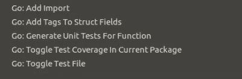
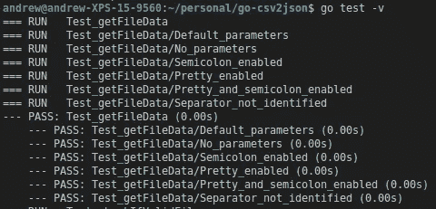
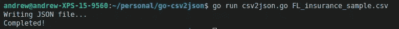
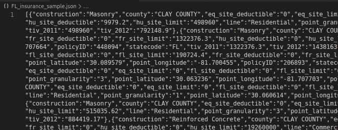
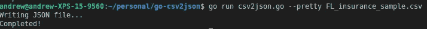
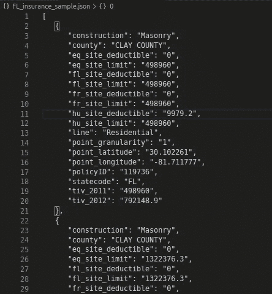
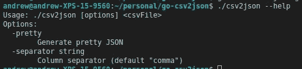

# 教程:如何在 Golang 中创建 CLI 工具

> 原文：<https://levelup.gitconnected.com/tutorial-how-to-create-a-cli-tool-in-golang-a0fd980264f>


壁纸洞穴[链接](https://wallpapercave.com/w/wp4185680)

所以 2020 年，我决定是时候学习一门新的编程语言了。我喜欢 Javascript——这一点可能永远不会改变。但与此同时，知道如何用更多的语言编写代码总是有好处的，原因有很多，比如成为一名更加全能的开发人员，能够使用更多样的工具。因为最终，这就是编程语言:我们用来构建软件的工具。

Golang 是一种已经存在了一段时间(从 2009 年开始)的编程语言，但是直到最近几年我才开始听到很多关于它的东西。在过去的一年里，在我目前的工作中，我们已经开始使用它来构建一些微服务。作为一个好奇的人，我对这门语言的兴趣开始增长。所以我告诉自己，*“好吧！是时候学习一门新的语言了。我来了！”*(一语双关)。

在这篇文章中，我将描述我在学习过程中发现的一些事情。请记住，我不是这种语言的专家。但是，我仍然能够很快学会它的工作原理和使用方法。我也从 Golang Reddit 社区获得了一些好的建议，并且在 web 开发方面有超过 9 年的经验。所以不用担心，我又不是完全的初学者！

# 你将在本教程中学到什么

对于本教程，我们将构建一个 **CSV 到 JSON** CLI(命令行界面)工具。希望在阅读完这篇文章后，你会知道如何:

*   通过定义命令参数和标志来实现 CLI
*   读取 CSV 文件
*   写文件
*   使用 go 程序和渠道
*   编写单元测试(因为测试很重要！)

# 你学不到的东西

要学习本教程，您不需要成为 Golang 专家，甚至不需要成为这种语言的中级开发人员。但是你需要知道基本的 Golang 语法是如何工作的。我们不会花时间学习如何声明变量、函数、结构、if 语句、for 语句等。那是*太无聊了*，而且大概你已经知道做那些事了。如果你没有，我邀请你去参观:[以身作则](https://gobyexample.com/)。这个网站是我现在用来了解关于 Golang 的几乎所有信息的主要来源。那个网页上的例子非常容易理解，而且直截了当。

# TL；速度三角形定位法(dead reckoning)

因此，如果您是那种不喜欢为了学习某样东西而阅读冗长的文章的开发人员，并且您认为仅仅通过阅读一些源代码就能够理解任何东西，那么就去查看我的 GitHub 存储库中的全部教程代码吧:

[](https://github.com/Andrew4d3/go-csv2json) [## Andrew4d3/go-csv2json

### 这是一个将 CSV 文件转换成 JSON 文件的工具。它将把一个文件中的所有 CSV 行解析成一个 JSON 数组，然后…

github.com](https://github.com/Andrew4d3/go-csv2json) 

但至少在你走之前给我留下一个掌声；)

# 定义我们的 CSV 到 JSON 应用程序

首先，让我们定义我们的 CLI 工具应该具有哪些功能和要求:

*   这个程序应该以 CSV 文件路径作为参数，并使用相同的数据生成一个 JSON 文件。
*   JSON 文件应该包含一个数组，其中每个数组元素代表输入 CSV 文件中的一行。
*   所有 JSON 数据都是字符串类型。
*   您将能够生成一个“格式良好”(缩进)的 JSON 文件。
*   您将能够指出输入 CSV 文件是使用“逗号”还是“分号”作为列分隔符。
*   这个程序必须有一个“帮助”选项，知道如何使用这个工具。

一般来说，此 CLI 工具应该具有以下签名:

```
Usage: ./csv2json [options] <csvFile>
Options:
  -pretty
        Generate pretty JSON
  -separator string
        Column separator (default "comma")
```

我们开始吧！

# 获取输入的文件数据

让我们创建我们的主 go 文件，名为:`csv2json.go`。最初，它看起来像这样:

```
package mainfunc main() {
}
```

这绝对是无所事事！因此，让我们通过添加一个 [Go 结构](https://gobyexample.com/structs)来改变这种情况，该结构将存储我们需要的文件信息:

```
type inputFile struct {
   **filepath**  string
   **separator** string
   **pretty**    bool
}
```

我们的文件结构称为`inputFile`，我们将使用它来存储 CSV 文件路径、使用的分隔符(逗号或分号)以及生成的 JSON 文件是否格式良好(“pretty”值)。一般来说，这个结构负责存储用户输入的所有输入数据。

现在是时候实现负责获取这些数据的函数了。我们将称它为`getFileData`。事情是这样的:

我加入了一些解释我所做的事情的评论

上面的函数负责从终端获取所有输入数据，然后返回两个值:一个`inputFile`实例和一个`error`。我加入了一些详细解释一切的评论。简而言之，它是这样做的:

*   验证参数的数量
*   解析命令参数
*   验证我们是否收到了正确的“分隔符”参数。
*   如果一切顺利，返回适当的`inputFile`实例。

还有一件事要做。我们刚刚创建的函数有来自 Go 标准库的多个包。如果你在使用 VSCode 时安装了所有必要的 Go 插件，你会注意到所有这些包是如何自动导入的。但是如果没有，您将需要手动导入它们。像这样:

```
import (
   "errors"
   "flag"
   "os"
)
```

现在我们有了程序的第一个函数。但是我们怎么知道它是否有效呢？您可能认为我们可以通过从主函数调用它，然后在终端中输入:`go run csv2json.go test.csv`来手动测试它。

```
func main() {
   fileData, err := getFileData()
}
```

这很方便，也很容易检查，但是本教程中我们想学的一件事就是编写**单元测试**。因此，让我们创建一个名为`csv2json_test.go`的文件，我们将在其中编写以下代码:

看起来我写了很多代码。但是我实际上使用了一个有用的 VSCode 特性，它允许我为特定的函数创建单元测试模板。为了使用它，首先，你需要安装所有必要的 Golang 插件。之后，你可以右击任何函数，然后点击“Go:Generate Unit Tests For Function”选项。您将看到如何为该函数创建一个好的样板测试代码。



你必须点击第三个选项

正如您在最后一段代码中看到的，我写了一些行内注释，详细解释了几乎所有内容。总而言之，这就是我们所做的:

*   我们想要为这个功能定义不同的测试用例。这就是为什么我们要创建您在顶部看到的`tests`切片。
*   我们通过迭代这个`tests`切片来运行每个测试用例
*   在每个测试中，我们的目的是模拟用户如何引入命令参数，这就是为什么我们需要使用`os.Args`引用
*   最后，我们执行所有必需的断言来验证我们是否得到了想要的结果

但是我们如何运行这些测试呢？只需在终端中运行以下命令:

```
$ go test -v
```

如果你的测试被正确定义并且被测试的函数没有任何错误。您将看到如下输出:



所有测试都通过了！

# 验证 CSV 文件

我们已经收集了文件数据，但是我们仍然不知道它是否是现有的 CSV 文件。为此，我们将创建一个名为`checkIfValidFile`的新函数。这样的函数将接收输入的文件路径作为唯一的参数，并返回一个布尔值，表明该文件是否有效。

如你所见，这个函数比前一个函数更短，更容易理解。我们正在执行两项验证:

*   使用`filepath.Ext`方法验证文件扩展名(CSV)
*   使用`os.Stat`方法验证输入的文件路径是否属于现有文件

如果一切都正确，我们返回`true`，否则，我们返回带有相应错误的`false`。请注意我们是如何使用标准库中名为`filepath`的新包的。所以别忘了导入它:

```
import (
   "errors"
   "flag"
   "os" 
   **"path/filepath"**
)
```

让我们对刚刚编写的函数进行单元测试:

这个测试函数和我们之前写的类似。我们正在定义一组测试用例，并对它们进行迭代。但是这次我们使用标准库中的`ioutil`包创建一个临时文件。一旦所有测试完成，临时文件将被自动删除。

# 处理 CSV 文件

现在是时候读取 CSV 文件了。为了做到这一点，我们将编写一个名为`processCsvFile`的新函数。这个函数中的参数是:`filedata`结构和一个“写者”通道。是的，没错…这次我们将使用 Go 频道。我们的函数是这样的:

我知道在这个解决方案中没有必要使用 **Go-channels** 和 **Go-routines** 。然而，我想把它们包含在本教程中，因为它们是 Go 语言中强大的特性，我们应该学习如何使用。主要思想是我们将有两个独立的 Go 例程(线程):一个用于读取 CSV 文件，另一个用于编写 JSON 文件。

功能`processCsvFile`是我们的第一个 go-routine。它的职责是顺序读取 CSV 文件并逐一处理每一行。为此，我们使用了几个效用函数，我将在下面解释。

第一个函数是`exitGracefully`，用于在意外情况发生时终止程序:

```
func exitGracefully(err error) {
   fmt.Fprintf(os.Stderr, "error: %v\n", err)
   os.Exit(1)
}
```

第二个功能是`check`，用来检查错误。如果发现错误，该功能还会重复使用`exitGracefully`功能。

```
func check(e error) {
   if e != nil {
      **exitGracefully**(e)
   }
}
```

最后一个函数——可能也是最复杂的一个——是`processLine`函数。它将获取`headers`和`line`切片，并从中创建一个字符串映射。

现在我们知道了我们的内部函数是如何工作的，让我们更详细地解释一下我们的主`processCsvFile`函数是做什么的:

*   首先，我们将使用相应的“分隔符”选项实例化一个 CSV 阅读器。
*   然后，我们将读取第一行，将 CSV 文件头放入一个字符串片段。
*   现在，我们将遍历每一行来获取列值。
*   由于标题和列值在不同的片段中，我们可以使用`processLine`函数从它们中构建一个字符串映射
*   一旦我们有了生成的字符串映射——或`recordMap`——我们就可以把它推送到我们的`writerChannel`。

如果您的编辑器还没有为您完成，不要忘记包含我们还没有导入的包:

```
import (
   "errors"
   "flag"
   "os" 
   "path/filepath"
   **"fmt"
   "encoding/csv"
   "io"** )
```

这个函数的单元测试如下所示:

正如您所看到的，我们的每个测试用例都会生成一个带有一些可测试内容的临时 CSV 文件。我们使用关键字`go`调用目标函数，以表明这个函数实际上是一个 go-routine，它将在与主函数不同的线程中执行。最后，我们迭代包含期望值的切片。该循环中的每一步都将从写入通道中获取一条记录，并做出相应的测试断言。

# 编写最终的 JSON 文件

还有一个主要功能。我们准备把它叫做`writeJSONFile`，正如它的名字所说，它的目的是编写最终的 JSON 文件。为此，我们将使用我们从过去的`processCsvFile`函数推入编写器通道的数据。事情是这样的:

正如你所看到的，这个函数也使用了一些实用函数(`createStringWriter`和`getJSONFunc`)。让我们检查他们做什么。

`createStringWriter`函数负责实例化一个 JSON 文件编写器。事情是这样的:

如您所见，这个函数依赖于“函数闭包”，这是一个常见的语言特性，您可以在 Javascript 等其他语言中找到。总而言之，这就是我们正在做的事情:

*   定义 JSON 文件的位置和名称，这将是与输入的 CSV 文件相同的文件位置和名称，但是带有一个`.json`扩展名，而不是`.csv`扩展名。
*   使用我们已经构建的位置打开文件。
*   返回将作为 JSON 文件编写器的函数。该函数将接受任何数据字符串，并将其写入 JSON 文件。如果没有更多的数据需要写入，我们就关闭文件。

现在我们来写`getJSONFunc`。这个函数也返回另一个函数和一个字符串值。它的职责是确保我们以正确的格式生成 JSON 数据。所有这些都是通过返回适当的 JSON 解析器函数和“换行符”来完成的。

正如您可能注意到的，我们依赖于标准库中的`json`包。具体来说，我们使用了`Marshal`和`MarshalIndent`方法。第一个是`pretty`选项激活时，第二个是未激活时。我们还定义了在编写新对象时是否应该换行。

现在我们知道了这两个效用函数是如何工作的，是时候解释一下`writeJSONFile`函数是做什么的了。简单总结一下:

*   在初始化和实例化我们的实用函数之后，我们编写 JSON 文件的第一个字符。因为我们正在生成一个对象数组，所以我们需要先打开方括号。
*   现在是时候迭代由写入者通道接收的记录了。我们通过使用 for-loop 语句来实现这一点。在每次迭代中，我们总是检查通道上是否有更多的记录。如果有更多，我们使用两个闭包函数。一个用于构建 JSON 数据，另一个用于将数据写入 JSON 文件。
*   如果没有更多的记录要处理，我们关闭括号(和 JSON 文件)并向`done`通道发送一个信号，指示所有工作都已完成。我们也打破了 for 循环。

像往常一样，不要忘记导入所使用的包:

```
import (
   "errors"
   "flag"
   "os" 
   "path/filepath"
   "fmt"
   "encoding/csv"
   "io"
   **"strings"
   "encoding/json"**
)
```

为了对这个函数进行单元测试，我们需要做一些额外的工作，创建两个 JSON 文件，我们将用它们来比较函数结果。因此，让我们创建一个包含以下文件的`testJsonFiles`文件夹:

包含以下内容的`compact.json`文件(只有一行):

```
[{"COL1":"1","COL2":"2","COL3":"3"},{"COL1":"4","COL2":"5","COL3":"6"}]
```

和一个包含以下内容的`pretty.json`文件:

如您所见，这两个文件有相同的数据，但格式不同。现在让我们编写相应的单元测试。

总之，我们想要的是将我们测试的函数生成的 JSON 文件内容与我们手动创建的 JSON 文件进行比较。您可以看到每个测试用例是如何与`testJsonFile`文件夹中的文件相匹配的。

# 把所有的放在一起

至此，我们已经实现了执行预期任务所需的所有功能。然而，我们仍然需要定义这些功能如何协同工作。所以让我们完成`main`函数的编写:

你可能已经注意到了一件事，那就是我们是如何给`flag.Usage`属性分配一个匿名函数的。这样做的目的是向我们的程序表明，当用户在终端中输入`--help`选项时，我们想要执行什么功能。

此时，代码的其余部分对您来说应该很熟悉了。首先，我们获取并验证所有输入数据，最后，我们调用分别用于读取和写入 CSV 和 JSON 文件的函数(或 go-routines)。注意这两个函数是如何使用`go`关键字调用的，这意味着它们将使用不同的线程同时运行。

现在我们的 CLI 工具完成了。如果你觉得你错过了什么，检查整个代码[这里](https://github.com/Andrew4d3/go-csv2json/blob/master/csv2json.go)。为了进行最终测试，我们需要一个真实的 CSV 文件。如果你手头没有，你可以在[这个网站](https://support.spatialkey.com/spatialkey-sample-csv-data/)上找到一些包含样本数据的 CSV 文件。一旦您选择了一个工具，就可以通过在终端中输入以下命令来测试我们最近创建的工具:

```
$ go run csv2json <CSV File path>
```

按“Enter”键，您应该会在终端中看到类似这样的内容:



在我的例子中，CSV 文件位于项目的根目录下

这意味着一切进展顺利。转到并导航到 CSV 文件所在的位置。现在您应该会看到一个同名的 JSON 文件。它应该是这样的:



我们没有启用任何“漂亮”选项。所以所有生成的 JSON 都在一行中，这是默认行为。让我们运行相同的命令，但现在启用“漂亮”选项:



现在我们得到了一个缩进的 JSON 文件。



如果您愿意，您可以找到一个使用分号而不是逗号的 CSV 并测试它。它应该没有任何问题。

让我们以构建程序二进制文件来结束:

```
$ go build csv2json.go
```

现在您有了一个可以发布和分发的可执行文件。让我们用这个文件测试一下`help`选项。我们应该看到我们在`flag.Usage`函数中打印的数据:



恭喜你！您已经使用 Go 成功创建了一个 CLI 工具。非常感谢你阅读我的教程。我希望你已经学到了一两件关于这门语言的新东西。*下次见！*

*快乐编码！*