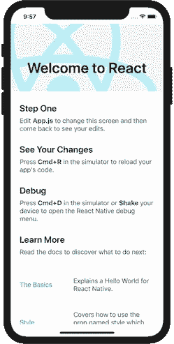
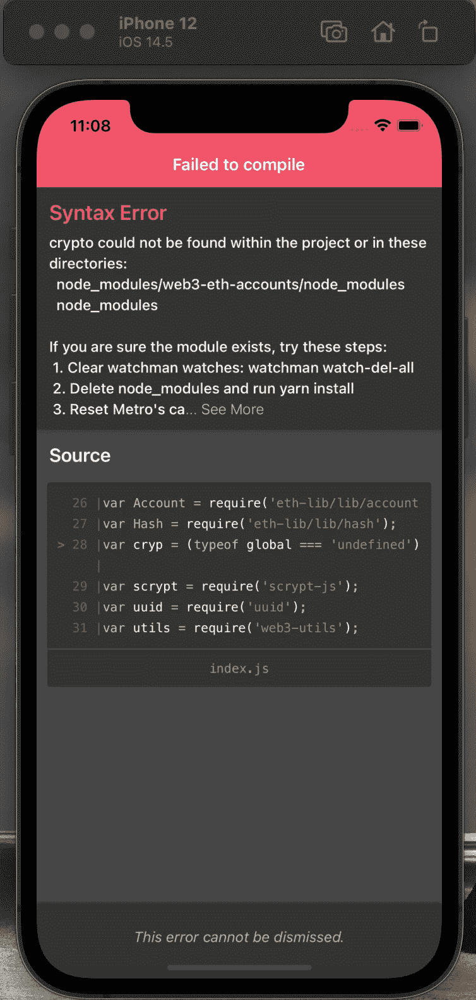
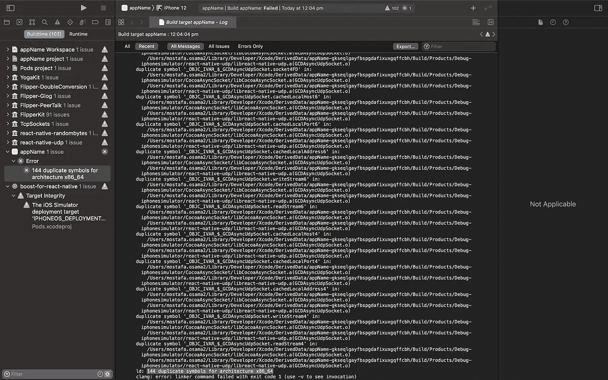
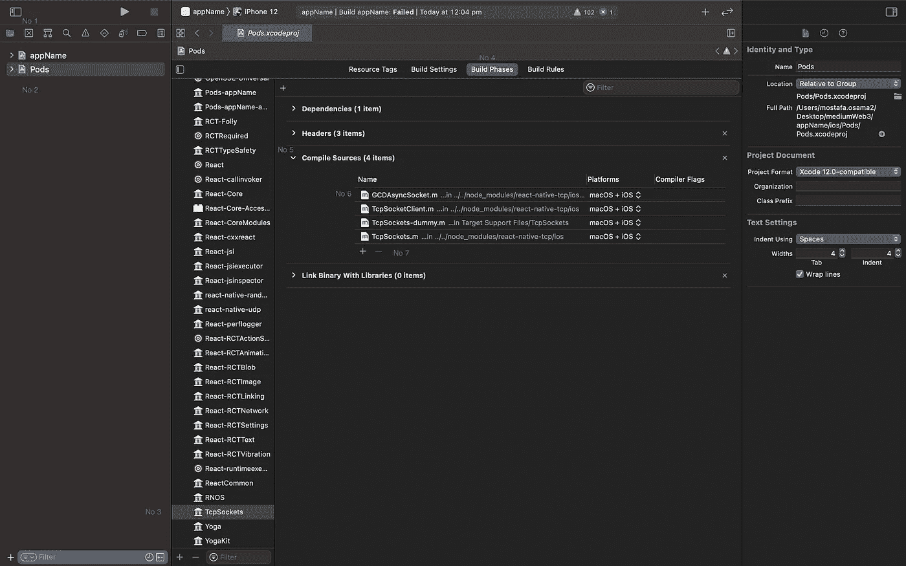

# 教程:如何用 React Native 0.6x 设置 web 3js 1 . x—2021

> 原文：<https://levelup.gitconnected.com/tutorial-how-to-set-up-web3js-1-x-with-react-native-0-6x-2021-467b2e0c94a4>

## 让 Web3JS 完全与 iOS 和 Android 兼容的旅程


在 [Unsplash](https://unsplash.com?utm_source=medium&utm_medium=referral) 上由 [Austin Distel](https://unsplash.com/@austindistel?utm_source=medium&utm_medium=referral) 拍摄的照片

区块链移动应用程序越来越受欢迎。最受欢迎的区块链图书馆之一是 Web3JS。Web3.0 是 Web 的最后一次迭代，其核心是去中心化，这使得区块链成为可能。Web3JS 提供了一套庞大的函数和类来实现您在移动应用程序中需要的各种区块链功能，例如创建帐户、签署交易、密钥加密和解密等等。在这篇文章中，我将向你展示如何让 Web3JS 完全在 iOS 和 Android 上工作，因为遗憾的是这并不像“npm 安装 web3”那么简单。

## **创建一个 react-native 模板项目**

我将在这里从头开始。我假设你已经安装了 node，如果你还没有，你可以在这里安装。这样做之后，您只需转到您想要创建项目的目录并运行这个命令。注意，比起 javascript，我更喜欢 typescript，而且我认为大多数专业开发人员都在使用 typescript，所以我将创建一个 react-native typescript 模板。

```
npx react-native init appName --template react-native-template-typescript
```

好了，现在您已经创建了应用程序，只需打开它:

```
cd appName
```

在我们继续之前，您需要确保您的环境设置正常工作。我将不包括这样做的步骤，因为这将使这篇文章相当长，这根本不是本教程所要讲的，你也可以找到许多关于这方面的教程。针对这一点的 [react-native docs](https://reactnative.dev/docs/environment-setup) 也相当不错。在所有情况下，如果运行“yarn android”或“yarn ios”时环境设置正确，您应该会看到如下内容:



图片是作者拍摄的

## 问题是:让我们试着添加 Web3

好了，现在我们已经解决了样板部分，让我们开始深入有趣的部分。我有一个相当令人沮丧的经历，因此我写这篇教程。与任何 npm/yarn 包一样，下一个合乎逻辑的步骤是添加包并再次运行项目！注意，因为我是 mac/iOS 用户，我将列出一些 iOS 命令，所以如果你是 android 用户，你不需要执行它们，但是不要担心，本教程对 android 和 iOS 都有效。

```
yarn add -D web3
```

对于 iOS 用户，您现在需要安装相应的 pods，所以很简单:

```
cd ios/ && pod install && cd ..
```

现在如果你再运行项目(yarn iOs/yarn android)，就可以了。但是，在你变得太兴奋之前，它实际上不起作用。如果您尝试使用任何 Web3 功能，例如像这样设置一个非常简单的连接(您可以将其添加到您的 App.tsx 中):

惊讶吧，惊讶吧，你会得到这个错误:



图片是作者拍摄的

正如软件开发世界中的许多事情一样，事情不会像你第一次尝试时期望的那样神奇地发生。如果你像我一样是一个典型的 react(非 react-native)开发人员，你可能会想“好吧，这是一些缺失的模块，让我们添加<this-missing-module>”。如果你这样做，你只是在给自己挖一个更大的坑。</this-missing-module>

## 为什么会这样？

好了，现在是时候后退一步，真正理解这些错误的来源了。这非常有用，因为它实际上发生在许多 npm 模块中。尽管您可能已经注意到 React 和 React-native 几乎完全相同，但它们的模块并不相同。React 的模块本来是要在浏览器上运行的，react-native 模块被 CocoaPods 或 Gradle(或者你的项目使用的任何 transpiler)编译成 native 模块。因此，在某些情况下，让 React 的模块在 React-native 上工作可能有些棘手。

如果你在思考，你可以找到一个 [web3-react-native](https://www.npmjs.com/package/web3-react-native) 模块，它只是工作，并没有。所以你将不得不使用广泛使用的 [Github 线程](https://github.com/ChainSafe/web3.js#issuecomment-688065593)

下一步是在 App.tsx 中导入 shim.js:

```
import './shim'
```

现在您终于可以将 web3 添加到您的模板项目中了:

```
npm i --save web3
```

唷！我知道这需要很多步骤，但是一旦你开始工作，这一切都是值得的。此时，您可以运行“纱线安卓”并且它工作了！为了仔细检查，我们可以尝试在 App.tsx 中创建一个基本帐户:

控制台日志:

```
{"address": "0x0025C592271824D33089AA29e9Bb5cB594aCc687", "encrypt": [Function encrypt], "index": 0, "privateKey": "0xf5ea7145028ede6d203082ba2d7a7f801ed6c5a7909b20588e21f0141f51e4b3", "sign": [Function sign], "signTransaction": [Function signTransaction]}
```

## 再走几步

好的，现在它工作得很好，但是等一下，让我们试着在 ios 上运行它:

```
cd ios/ && pod install && cd .. && yarn ios
```

遗憾的是，您将得到一个巨大的错误日志，让我们打开代码并在那里构建它来研究这个问题:

```
xed -b ios
```

构建后:



作者拍摄的图像

侧面提示:当你在 ios 上遇到构建错误时，最好在 Xcode 中构建应用程序，因为 RN 错误日志很长，很难阅读。Xcode 会给出更好的构建输出。

好了，让它在 ios 上工作还需要一步。基本上，当安装吊舱时，我们得到了一些副本，xcode 不喜欢这样。

1.  让我们转到项目导航选项卡(左上角的文件夹图标)
2.  转到窗格(然后所有窗格都应该出现在右侧)
3.  向下滚动到“TcpSockets”
4.  点击“构建阶段”(位于屏幕中间)
5.  然后展开“编译源代码”
6.  点击“GCDAsyncSocket.m”
7.  单击“-”按钮将其删除



作者拍摄的图像

最后一步是**对“react-native-UDP”Pod 做完全相同的事情。别忘了做这件事。在删除两个 pod 中的 GCDAsyncSocket.m 引用后，它们应该有 3 个编译源。**

现在只需在 Xcode 中构建您的应用程序，它应该可以工作。

## **最后一步**

每次添加新的 npm 包时，您都需要再次修改节点模块，要实现这一点，只需将其添加到您的包中即可。

```
"scripts": {
    ...
    "postinstall": "./node_modules/.bin/rn-nodeify --install 'crypto,buffer,react-native-randombytes,vm,stream,http,https,os,url,net,fs' --hack"
},
```

## 摘要

```
npx react-native init appName --template react-native-template-typescript
cd appName
npm i --save react-native-crypto react-native-randombytes  
cd ios/ && pod install && cd .. 
npm i --save-dev rn-nodeify@latest  
./node_modules/.bin/rn-nodeify --install  
npm i --save node-libs-browser  
npm i base-64# Modify metro.config.js
# Modify shim.js
# Add shim import to App.tsxnpm i --save web3
cd ios/ && pod install && cd ..
xed -b ios# Remove the 2 pod references
# Modify package.json
```

我希望你已经喜欢这个教程，并且它最后都工作得很好。这是大量失败、研究和挫折的产物。希望你不必经历这些！