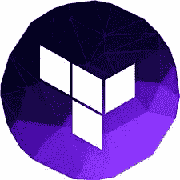
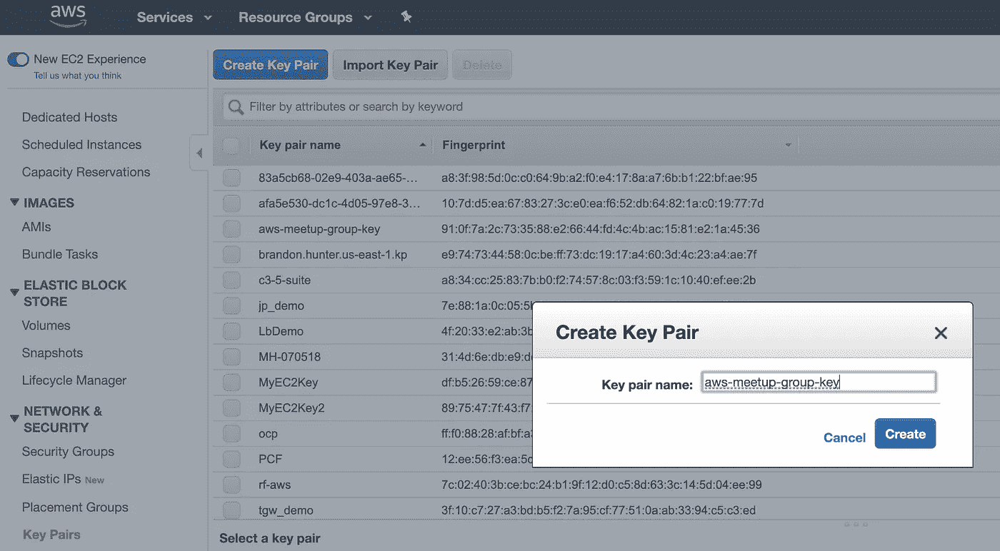

# 教程:Terraform 和 Pulumi 简介

> 原文：<https://levelup.gitconnected.com/tutorial-intro-to-terraform-and-pulumi-b0d4843038e5>

*作者* [*凯文·汀*](https://www.linkedin.com/in/kevin-tinn/)*&*[*奥斯汀·洛夫莱斯*](https://www.linkedin.com/in/austin-loveless/)*—2019 年 1 月 22 日*



【https://www.youtube.com/channel/UCG3Si_vP2tijvvyE5xr7lbg】订阅 AWSMeetupGroup YouTube 频道:

**加入 Meetup.com 上的 AWSMeetupGroup:
[https://www.meetup.com/AWSMeetupGroup/](https://www.meetup.com/AWSMeetupGroup/)**

# **资源**

*   这里的代码[是](https://github.com/kevasync/aws-meetup-group-terraform)。
*   点击跟随[观看 YouTube 直播。](https://www.youtube.com/watch?v=VrAKeXbAaRw)

在本教程中，我们将使用 [Terraform](https://www.terraform.io/) 构建一个 Hello World 应用程序。然后，我们将进行更深入的研究，用一个 RDS 实例和一个承载基本 web 应用程序的 EC2 实例构建一个 VPC。我们也将为[普鲁米](https://www.pulumi.com/)重复这一步骤。

# 入门指南

*   在 AWS 控制台中创建 EC2 密钥对
*   下载并设置 ssh pem 文件的权限
*   安装 Terraform 并创建第一个部署
*   创建 AWS CLI 帐户
*   使用 EC2 和 RDS 部署 IaaS 托管堆栈
*   安装 Pulumi 并部署 IaaS 托管堆栈

# 创建密钥对:



# 下载 ssh pem 文件并设置权限:

*   `mv ~/Downloads/aws-meetup-group-key.pem ~/.ssh/`
*   `chmod 400 ~/.ssh/aws-meetup-group-key.pem`

# 创建 AWS CLI 帐户

IAM >用户>新用户

*   名称用户


*   添加到具有管理权限的组或角色


*   配置访问凭据


# 安装 AWS CLI

*   Mac:
*   自制软件:`brew install awscli`
*   捆绑安装:`curl "https://s3.amazonaws.com/aws-cli/awscli-bundle.zip" -o "awscli-bundle.zip"` `unzip awscli-bundle.zip` `sudo ./awscli-bundle/install -i /usr/local/aws -b /usr/local/bin/aws`
*   窗口:
*   [Windows: MSI 安装程序](https://docs.aws.amazon.com/cli/latest/userguide/install-windows.html#install-msi-on-windows)

# 在本地配置 AWS CLI 访问

*   `aws configure`


*   通过查看`~/.aws/credentials`或`%UserProfile%\.aws\credentials`的内容进行配置


# 安装地形

*   家酿(Mac): `brew install terraform`
*   巧克力糖(Windows): `choco install terraform`
*   手动下载: [Terraform。IO](https://www.terraform.io/downloads.html)

# TF Hello World 文件

```
provider "aws" {
  version = "~> 2.0"
  region  = "us-east-1"
}
resource "aws_vpc" "main" {
  cidr_block = "192.168.225.0/24"
  enable_dns_support = true
  enable_dns_hostnames = true
  tags = {
    CostCenter = "tf-helloworld"
  }
}
resource "aws_subnet" "main-subnet" {
  vpc_id     = "${aws_vpc.main.id}"
  cidr_block = "192.168.225.0/25"
  availability_zone = "us-east-1a"
  tags = {
    CostCenter = "tf-helloworld"
  }
}
```

# 计划、应用、展示和销毁

*   `terraform plan`
*   `terraform apply`
*   `terraform show`
*   `terraform destroy`

# 创建 Pulumi 帐户并创建访问密钥

*   获得普鲁米访问令牌

# 安装 Pulumi 并安装 AWS 插件

*   Mac: `brew install pulumi`
*   Windows 操作系统
*   `choco install pulumi`
*   `@"%SystemRoot%\System32\WindowsPowerShell\v1.0\powershell.exe" -NoProfile -InputFormat None -ExecutionPolicy Bypass -Command "[Net.ServicePointManager]::SecurityProtocol = [Net.SecurityProtocolType]::Tls12; iex ((New-Object System.Net.WebClient).DownloadString('https://get.pulumi.com/install.ps1'))" && SET "PATH=%PATH%;%USERPROFILE%\.pulumi\bin"`
*   `pulumi plugin install resource aws 1.18.0`

# 初始化 Pulumi 堆栈并部署

*   `cd pulumi-iaas-hosting-stack`
*   `pulumi stack init`
*   您需要输入之前在 Pulumi 门户中创建的访问令牌
*   安装 Pulumi `npm install @pulumi/aws`
*   `pulumi up`

# 销毁资源并删除堆栈

*   `pulumi destroy`
*   `pulumi stack rm <account>/<stack>/<env> --force`