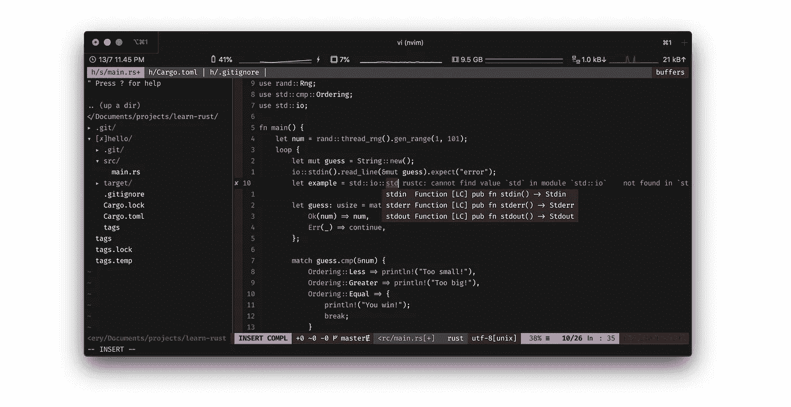
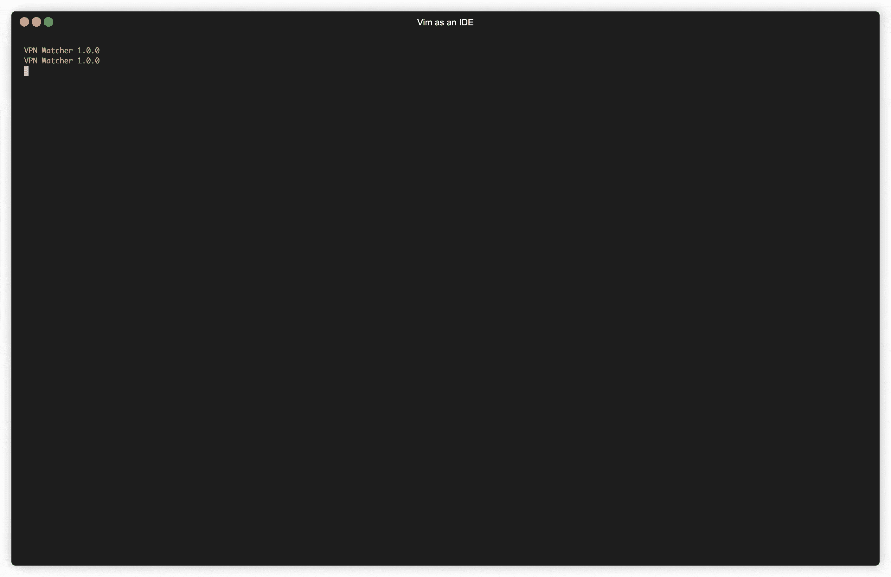

# 将您的 Vim 调整为一个强大的 IDE

> 原文：<https://levelup.gitconnected.com/tweak-your-vim-as-a-powerful-ide-fcea5f7eff9c>

> Vim 使用起来很愉快，它是如此的有思想和实用，以至于我想知道为什么有人会使用可视化开发工具。—:帮助报价

> vim (vim)名词——热情洋溢的活力和能量。
> ——【拉丁语，vis 的宾格，力量】(字典)

# 序言

程序员的旅程和代码编辑器的历史密不可分。早在 2008 年，我就开始用 Notepad++编写我的第一个网站。从那一年开始，我遇到了崇高的文本，并立即爱上了它。Sublime 是我接下来几年的默认代码编辑器。

在此过程中，我还尝试使用 Netbeans、Geany、代码块，甚至 Intellij 作为一个严重依赖于语言的 IDE，并尝试使用 Atom 和 VS 代码作为一个语言无关的代码编辑器。我不是那种倾向于崇拜 IDE 作为编写代码工具的典型的人。因为它有一堆我并不真正需要的功能。因此，使用 IDE 是很可怕的，因为它的加载和资源消耗都很大。

在来回寻找一个完美的 IDE 之后，我发现 Vim，Unix 默认编辑器，是一个完美的选择。尽管它很简单，缺少很多丰富的特性，但是通过插件将它转换成一个强大的 IDE 是可能的。

结果如下:

# 动机

如果你想知道为什么我们需要 Vim，我们使用 IDE 不是更容易吗？那么你可能需要一个背后的动机。否则，跳过这一部分。

使用 Vim 对我们的生产力有很大的好处。第一次学习 Vim 可能会很痛苦。但是，一旦你掌握了它，你会注意到速度的提高。键盘和鼠标/触控板之间不再有切换权衡。都在你的键盘上。更重要的是，使用 Vim 很有趣😎

> 再次感谢 Vim。我每天都在 Linux 上使用它。
> —《UNIX 编程工具》一书的作者 Eric Foster-Johnson

# 先决条件

采用内置 Vim8+或 [**NeoVim**](https://github.com/neovim/neovim) 。但是，我推荐你使用 NeoVim，它是 Vim 的重构版本，代码减少了 30%，向后兼容 Vim，并且可维护。

# 基本扩展

使用下面的基本扩展来使你的 Vim 更加出色。

*   [**病原体**](https://github.com/tpope/vim-pathogen) :由于我们将安装 5 个以上的插件，我们需要使用一个包管理器来避免分散安装插件的位置。
*   [**NERDTree**](https://github.com/preservim/nerdtree) :系统文件资源管理器，可以作为 Vim 侧边栏看到。使用这个插件，用户可以直观地浏览复杂的目录层次结构，快速打开文件进行阅读或编辑，并执行基本的文件系统操作。
*   [**航空公司**](https://github.com/vim-airline/vim-airline):Vim 的奇特状态栏和标签行。
*   [**素材**](https://github.com/kaicataldo/material.vim) :只是我现在用的一个主题:)

# 代码助手扩展

它帮助你在 Vim 上写任何代码。

*   [**Gutentags**](https://github.com/ludovicchabant/vim-gutentags):Vim 中的一个标签管理。代码中的所有方法、类、变量和其他标识符都将被索引，并将索引存储在标记文件中。这个插件可以帮助你根据标签跳转到定义。它需要丰富的 Ctags，但是我推荐你使用 [**通用 Ctags**](https://github.com/universal-ctags/ctags)
*   [**ALE**](https://github.com/dense-analysis/ale) :代表异步 Lint 引擎。这是 Vim 的一个代码检查插件，和[的语法](https://github.com/vim-syntastic/syntastic)一样。ALE 将基于你的外部 linter 异步检查你的代码库，所以它不会冻结你当前的缓冲区。ALE 支持各种语言的 style/lint fixer。
*   [**de complete**](https://github.com/Shougo/deoplete.nvim):针对 NeoVim。它为 NeoVim 提供了一个可扩展的异步完成框架。虽然在 Vim8 中可以安装，但是我发现很难配置。
*   [**Git-Gutter**](https://github.com/airblade/vim-gitgutter) :一个 Vim 插件，在 sign 列显示 git diff。它显示添加、修改或删除了哪些行。

# 特定于语言的扩展

虽然您可以自己探索它，但一般来说，有 3 个方面可以让您的 Vim 强大到足以处理高级语言:

*   棉绒
*   固定器
*   自动完成

对于棉绒和固定器， [**ALE**](https://github.com/dense-analysis/ale) 可以完美的作为几乎所有语言棉绒&固定器的底座。你需要做的是为目标语言安装一个 linter &固定器，并把它放到`.vimrc`到 [**ALE**](https://github.com/dense-analysis/ale) 配置上。

对于自动补全，可以使用[**language client-neo vim**](https://github.com/autozimu/LanguageClient-neovim)**配合[**deo complete**](https://github.com/Shougo/deoplete.nvim)引擎。这个插件足够智能，只要语言目标有[语言服务器协议(LSP)](https://langserver.org/) 支持，它就能为您的 vim 生成一个完成建议。不仅完成 LSP 还比 [**Ctags**](https://github.com/universal-ctags/ctags) 更精确地支持 goto 定义。**

**这是我最后的点文件，🍕**

**快乐编码:)**