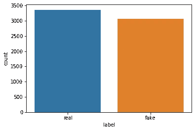
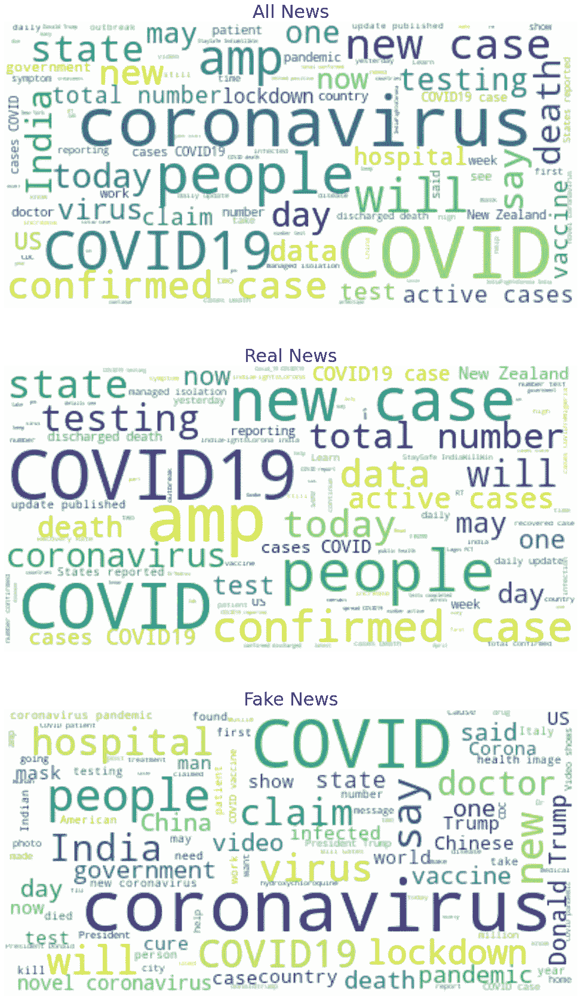
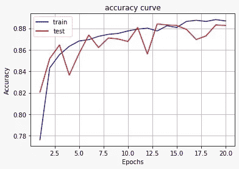
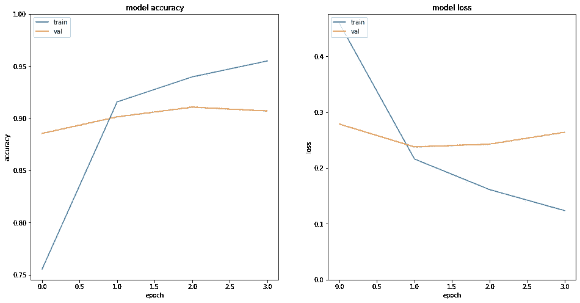
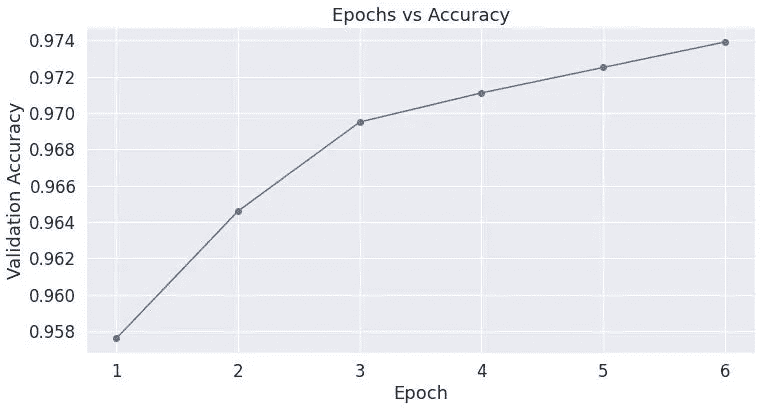

# 微博分析在新冠肺炎假新闻检测中的应用

> 原文：<https://levelup.gitconnected.com/tweet-analysis-for-covid-19-fake-news-detection-bf7cbea5c12d>

假新闻绝不是一个陌生的概念；自从人类学会交流以来，它就一直存在。但互联网和社交媒体的发明给它增加了另一个维度，使它比以往任何时候都更加突出和有影响力。其影响力的一个例子可以在新冠肺炎疫情事件之后爆发的假新闻以及由此发生的事件中找到。世界停止了，几代人以来，人们第一次在家里，互联网成为他们的主要信息来源，这是一个它还没有准备好的责任。互联网上充斥着关于封锁、潜在治疗和医院床位的错误信息。这些帖子弊大于利，并试图在全球范围内制造集体恐慌。

Twitter 是一个广泛使用的社交媒体平台，因此在假新闻爆发中发挥了重要作用。下面这篇文章比较了在新冠肺炎疫情期间 Twitter 上区分“假”新闻和真新闻的各种分类技术。

# **推文分析和预处理**

数据集包括 6，420 条带有标注标签的训练数据和 2，140 条测试数据。数据集在两个班级中几乎平分秋色，没有观察到班级不平衡。

针对训练数据集的类标签绘制计数图

对数据集中的词频进行了分析，观察到“真”和“假”标签有一组特定的词，而几个词在两个类别之间是共享的。得出的结论是，这些常用词对分类结果没有意义。

集合数据和“真”与“假”标签的词云

据观察，像“冠状病毒”、“covid”、“covid19”、“新”、“人”、“死亡”、“国家”和“一个”这样的词在两个标签中都很常见，因此它们与停用词、生僻词、标点符号和超链接一起从数据集中删除。

预处理步骤

# 基线模型性能

从数据集中清理出来的推文被标记化，并在计数矢量化后输入基线分类模型。据观察，被动-主动分类器的性能优于任何其他分类模型，SVM 紧随其后。

基线分类的结果如下:
1 .被动-攻击性量词- 94.39%
2。SVM- 94.31%
3。Logistic 回归- 92.24%
4。天真巴爷的- 91.92%
5。决策树- 85.03%
6。KNN- 69.26%

观察到最大准确度为 94.39%，并且可以得出结论，当使用像被动-主动分类器这样的健壮分类器时，计数矢量化本身对于自然语言处理来说是非常重要的。

# 深度学习模型:RNN 和伯特

与基线机器学习模型一起，为推文分类构建了三个深度学习。这三种架构包括具有手套嵌入的 RNN 模型、具有可训练嵌入层的 LSTM RNN 模型以及微调预训练的伯特模型。

具有手套嵌入的 RNN 使用大小为 50 的嵌入向量，并将每个 tweet 转换成一组手套向量。这些向量然后被输入到 RNN 模型中，该模型被训练 20 个时期以避免过度拟合。该模型显示了 88.27%的准确率，并且比决策树和 KNN 等分类器表现得更好，但是与其他基线模型相比失败了。

带手套 RNN 的精确 v/s 历元

具有可训练嵌入的 RNN 模型有一个额外的嵌入层，将单词转换成大小为 64 的向量。该模型的其余架构与嵌入手套的架构相似。它由两个双向 LSTM 层和两个密集层组成，其中一个作为最终层的输出维度。具有可训练嵌入的 RNN 显示出 91.88%的准确度，并且优于手套模型 3.61%，这无疑是一个改进，但是仍然低于基线。

使用可训练嵌入来训练和测试 RNN 性能

BERT 是一个预先训练的强大的 NLP 模型，可以通过在现有模型上添加分类架构来针对文本分类进行微调。在预训练的 BERT 模型上添加了一个两层分类架构，该模型可通过拥抱人脸库进行推文分类。正如预期的那样，BERT 模型以 97.39%的准确率优于所有基线模型。

BERT 验证精度 v/s 历元

# 结论

使用六个基线机器学习模型和三个深度学习模型，将推文数据分类为“真实”和“虚假”新闻。据观察，一些稳健的基线模型，如被动-积极分类器，SVM 和逻辑回归优于这两个 RNN 模型。另一个重要的观察结果是，具有可训练嵌入的 RNN 优于具有手套嵌入的，这表明使嵌入适合手头的问题在 NLP 分类中确实起着重要的作用。
另一方面，像 BERT 这样的预训练模型，经过微调以适应特定的数据集，表现优于所有其他模型。因此，可以得出结论，BERT 是迄今为止新冠肺炎假新闻检测的最佳模型，准确率为 97.39%。

该项目由 [Srishti Sahni](https://www.linkedin.com/in/srishtisahni/) 、 [Atul Rawat](https://www.linkedin.com/in/atul-rawat-iiitd) 和 [Vijay Ponnaganti](https://www.linkedin.com/in/vijayponnganti) 在我们的教授 [Tanmoy Chakraborty](https://www.linkedin.com/in/tanmoy-chakraborty-89553324/)
1 的指导下共同完成。Srishti Sahni 和 Atul Rawat 进行了探索性数据分析并对数据进行了预处理。
2。Vijay Ponnaganti、Atul Rawat 和 Srishti Sahni 构建了用于分类的基线机器学习模型。
3。Vijay Ponnaganti 创造了嵌入手套的 RNN 模型
4。Srishti Sahni 创建了具有可训练嵌入的 RNN 模型，以及
5。阿图尔·拉瓦特对伯特模型进行了微调

该项目是提交给[CONSTRAINT’21](https://constraint-shared-task-2021.github.io)workshop shared challenge 的。数据集的链接可在 [CodaLab](https://competitions.codalab.org/competitions/26655) 的竞赛页面上找到。