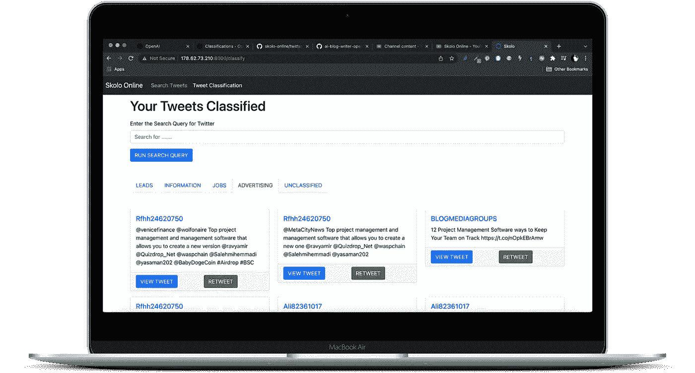

# 使用 Twitter 搜索 API V2、OpenAI API 和 Python 进行推文分类

> 原文：<https://levelup.gitconnected.com/tweet-classification-with-twitter-search-api-v2-openai-api-and-python-926a980b2fb7>

## 构建一个应用程序来分类推文，使用 OpenAI 分类 API 从 Twitter V2 API 检索推文。

在本教程中，我们将构建一个应用程序，该应用程序将使用 OpenAI 分类 API 对从 Twitter V2 API 检索的推文进行分类。我们将两者结合起来:

*   OpenAI API 用于 AI 函数执行分类。
*   Twitter API V2 搜索我们要分类的推文。


用 OpenAI GPT3 和 Python 实现推文分类

本教程既有全面涵盖所有步骤的 YouTube 视频，也有带代码的 GitHub repo。

## **GitHub 启动代码回购:**

[](https://github.com/skolo-online/twitter-v2-api) [## GitHub-skolo-online/Twitter-v2-API

### 在这个报告中，我用 python 和 tweepy 编写了利用新的 twitter API V2 的代码。

github.com](https://github.com/skolo-online/twitter-v2-api) 

## **GitHub 整理代码回购:**

[](https://github.com/skolo-online/Twitter-Search-API-V2-Tweet-Classification-OpenAI) [## GitHub-skolo-online/Twitter-Search-API-V2-Tweet-分类-OpenAI

### 在这个报告中，我加入了利用新的 twitter API V2 tweepy 和 OpenAI API 来搜索推文的代码…

github.com](https://github.com/skolo-online/Twitter-Search-API-V2-Tweet-Classification-OpenAI) 

## **Youtube 视频:**

## 我们将介绍使用 OpenAI API 完成推文分类的步骤:

1.  下载启动代码 Flask 应用程序
2.  创建人工智能培训文档
3.  将培训文档上传至 OpenAI
4.  将推文分类
5.  用分类功能更新 Flask 应用程序

# 下载 Twitter API V2 代码

克隆回购:

```
git clone [https://github.com/skolo-online/twitter-v2-api.git](https://github.com/skolo-online/twitter-v2-api.git)
```

按照配置文件中的要求输入 API 密钥，安装所需的 pip 库并运行应用程序。确保你可以从 Twitter 教程中看到这个应用程序，其他的一切都建立在它的基础上，你需要它来继续教程的其余部分。

# 创建人工智能分类文档

所有的人工智能模型都需要被训练来完成它们的任务。OpenAI 提供了模型和一些培训，但某些任务过于具体，需要有针对性的培训。

推文分类只是需要特殊训练的任务之一，因为每个用例都是不同的。在我们的例子中，我们将推文分为三类:

*   积极的
*   否定的；消极的；负面的；负的
*   中立的

因此，我们需要创建一个包含示例推文的文件，我们将这些推文分类到上面的这些组中，这样我们就可以教/训练人工智能如何对推文进行分类。所以我们会告诉它，积极的推文是什么样子，消极的和中性的也是一样。

在训练数据中，我们赋予它的多样性越多，模型对结果的分类就越好，但特别是对于推文，训练数据必须与将被分类的实际推文相似。

因此，我们将使用我们的 API V2 Tweepy 代码从 Twitter 中提取推文，并手动对它们进行分类。

如果您运行此功能:

```
return50Tweets(query)
```

在文件的底部，并提供一个查询—您将获得保存在应用程序根目录下的 JSONL 文件中的 tweets 列表。文件的每一行看起来都像这样:

```
{"text": "[@Tbose01](http://twitter.com/Tbose01) I\u2019m attending a funeral in Polokwane \ud83d\ude01"}
```

你需要做的是给这个文件的每一行添加一个标签，就像这样:

```
{"text": "[@Tbose01](http://twitter.com/Tbose01) I\u2019m attending a funeral in Polokwane \ud83d\ude01", "label": "Negative"}
```

# 将培训文档上传至 OpenAI，用于分类任务

一旦你创建了文档，你需要把它上传到 OpenAI。解释此过程的文档可在以下位置找到:

 [## OpenAI API

### 用于访问 OpenAI 开发的新人工智能模型的 API

beta.openai.com](https://beta.openai.com/docs/guides/classifications) 

这样做的代码将如下所示:

```
import os
import openai
import config
openai.api_key = config.OPENAI_API_KEYdef uploadClassificationDocument():
    filename = 'tweet-training.jsonl'
    response = openai.File.create(file=open(filename), purpose="classifications")
    return response
```

运行代码:

```
def uploadClassificationDocument()
```

保存响应，它应该是这样的:

```
# {
#   "bytes": 9401,
#   "created_at": 111111111111,
#   "filename": "tweet-training.jsonl",
#   "id": "file-1234567890123456",
#   "object": "file",
#   "purpose": "classifications",
#   "status": "uploaded",
#   "status_details": null
# }
```

# 将推文分类

记下“id”，您将需要它来运行代码的第二部分:

```
class_file = "file-1234567890123456" def classifyTweet(query):
    response = openai.Classification.create(
            file=class_file,
            query=query,
            search_model="ada",
            model="curie",
            max_examples=3)return response['label']
```

# 用 Tweet 分类更新 Flask 应用程序

最终的烧瓶应用程序应该如下所示:



分类推文

最后一步是将上述代码集成到我们现有的 Flask 应用程序中，以便用户可以从应用程序的前端输入搜索查询，并查看该搜索的结果——分类到训练文件中预定义的特定桶中。

完整的解释可以在本教程顶部的 YouTube 视频中找到。

## Flask App.py 更新

在 app.py 文件中，我们需要为第二个页面创建一个新的路径，如下所示:

此路线将作为主页上的第一条路线，当您第一次访问该路线时，将运行默认查询:

```
query = 'Polokwane lang:en -is:retweet'
```

将获取的结果的最大数量是 20，您可以在 10 和 100 之间调整该数量。

推文将被分类到这三个 python 列表中，这些列表将提供给前端。

```
positiveTweets = []
negativeTweets = []
neutralTweets = []
```

## 用于分类的 Python Flask HTML 模板

前端模板(class.html)将如下所示:

# 教程注释

欢迎对这种推文分类方法留下评论、笔记或建议。

*更多内容请看*[***plain English . io***](http://plainenglish.io/)*。报名参加我们的* [***免费周报***](http://newsletter.plainenglish.io/) *。在我们的* [***社区***](https://discord.gg/GtDtUAvyhW) *获得独家获得写作机会和建议。*