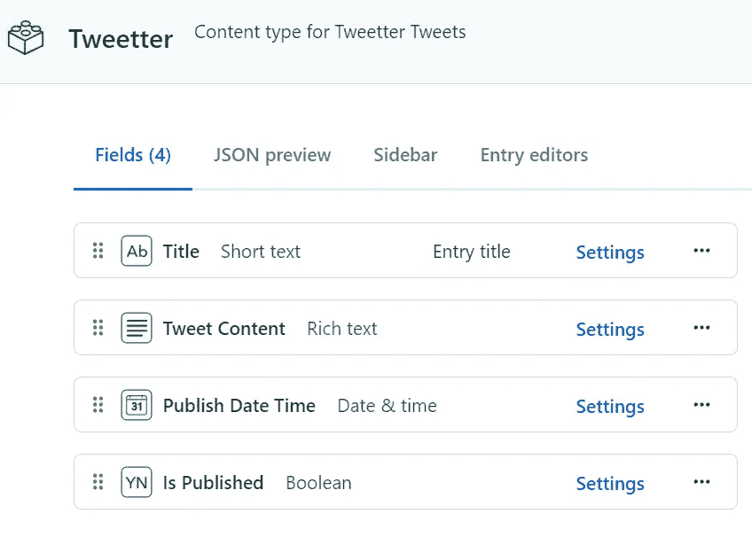

# 具有 Azure 功能和内容丰富的 Tweet planner 应用程序

> 原文：<https://levelup.gitconnected.com/tweet-planner-app-with-azure-functions-and-contentful-5495869520b>

*功能启动*

T2:ech Twitter 是一个很棒的社区。每天都有很多有用的信息被创始人、建设者、独立黑客和其他人分享。我最近开始在推特上谈论《进来》的新功能。NET 6，C# 10 和 Azure。我意识到试图每天拿出不同的内容来分享是困难和繁琐的。如果能提前计划好这些推文，并根据预先设定的时间表自动发布，那就太好了。我决定使用 Azure 函数和 Contentful 构建一个简单的工作流。

 [## Azure 函数概述

### Azure Functions 是一个无服务器解决方案，允许您编写更少的代码，维护更少的基础架构，并节省…

docs.microsoft.com](https://docs.microsoft.com/en-us/azure/azure-functions/functions-overview)  [## API-构建数字体验的首个内容平台

### 不仅仅是一个无头的 CMS，Contentful 是一个 API 优先的内容管理平台，用于创建、管理和发布内容…

www.contentful.com](https://www.contentful.com/) 

使用基于定时器触发的 Azure 功能，可以定期在指定的时间发布新的推文。接下来的问题是，我在哪里保存我的 Tweet 内容？我以前用过 Contentful，一个内容管理平台，他们有一个免费的社区空间，非常适合开发个人项目的开发者。所以我决定试一试。

你可以在[免费注册一个免费的内容丰富的账户|内容丰富的](https://www.contentful.com/sign-up/)

 [## 注册一个免费的内容丰富的帐户

### 使用您最喜欢的技术栈-您选择的语言和框架功能齐全的内容平台- REST 和 GraphQL…

www.contentful.com](https://www.contentful.com/sign-up/) 

## Tweetter 工作流程

下图显示了 Tweetter workflow 应用程序的消息流。它从一个定时器触发的 Azure 函数开始，`**TweetterTrigger**`将在世界标准时间每天上午 12 点运行。该函数调用 Contentful API 来检查是否有任何预定的 Tweet 需要发布到 Twitter。如果没有，函数就完成执行并停止。如果有一个新条目需要发布到 Twitter，它只需将一条消息放到`**post-to-twitter**`队列中，并完成它的执行。有一个队列被触发，`**TweetterPoster**` Azure 函数将使用队列中的消息，构建一个 Tweet 对象并发布到 Twitter。最后，它将另一条消息排队到由`**ContentfulEntryUpdater**` Azure 函数使用的`**contentful-entry-updater**` 队列中。该函数会将条目的`**IsPublished**` 属性更新为 true，以防止再次发布相同的 Tweet。

高音架构

## 内容丰富的内容模型

内容丰富的内容模型代表您创建的内容类型。内容模型有标准字段，包含关于内容类型、其字段和元数据的基本信息。`**Tweetter**`内容类型有以下字段:

*   **标题**:内容丰富的条目标题
*   **TweetContent** :实际 Tweet 内容的字段，可以嵌入链接资产，如 gif 和图像以及外部网站链接
*   **发布日期时间**:发布推文的日期和时间
*   **is published**:布尔字段，用于跟踪条目是否已发布到高音喇叭

 [## 数据模型|内容丰富

### Contentful 将内容组织到空间中，允许您将一个项目的所有相关资源组合在一起…

www.contentful.com](https://www.contentful.com/developers/docs/concepts/data-model/?utm_source=webapp&utm_medium=knowledge-base-content_model&utm_campaign=in-app-help) 

下面是 Tweetter 内容类型的字段列表以及使用该内容类型创建的第一个条目。

Tweetter 内容类型字段和使用内容类型的第一个条目

## 高音触发器⏲️

下面的代码包含一个 TimerTrigger Azure 函数`TweetterTrigger` ，它将在世界标准时间每天晚上 12 点运行。当该函数执行时，它调用 Contentful API 来检查内容类型为`tweeter`的条目，其中条目的`IsPublished`标志为`false`并且`PublishDateTime`小于或等于当前的 UTC 日期时间。如果没有新的预定 Tweets，那么函数简单地返回 null，不进行进一步的处理。如果有计划好的 Tweet，那么它会选取第一个计划好的项目，从条目中提取并构建 Tweet 内容，最后返回`TweetterTriggerResponse.`。response 类的`TweetContent`属性有`[QueueOutput("post-to-twitter")]`绑定，它会将消息放到`post-to-twitter`队列中，而不需要任何额外的代码🤯。消息被 Azure 函数消耗掉了。

## 推特发帖者🚀

`TweetterPoster` QueueTrigger Azure 函数监听`post-to-twitter`队列上的传入消息。我使用的是`Tweetinvi` NuGet 包，它提供了`TwitterClient`和其他各种类型，使得与 Twitter API 的交互更加容易。

 [## Tweetinvi 5.0 - Tweetinvi 5.0.4 文档

### Tweetinvi 是一个. NET C#库，用于访问 Twitter REST 和 STREAM APIs。它是一个. NETCore 库，可以用于…

linvi.github.io](https://linvi.github.io/tweetinvi/dist/index.html) 

队列中的传入消息被反序列化。如果对象包含一个有效的`imageUrl`字符串，那么图像首先被上传到 Twitter，然后 Tweet 被传入图像字节和媒体类别，否则它将简单地传入 Tweet 的内容。

## ✔️内容丰富

QueueTrigger Azure 函数是整个工作流程的最后一步。使用`ContentfulManagementClient,`进行 API 调用，将条目的`IsPublished`属性更新为`true`,以防止下一次触发工作流时再次发布 tweet。此外，条目的版本增加，内容的状态变为`Published`。

这是 Contentful 中的所有条目。

内容丰富的条目列表

在下面👇有些推文是用 Tweetter 自动发布的吗？

使用 Tweetter 自动发布的推文

想试试吗？在我的 GitHub 帐户上找到库的源代码。在 Twitter 上关注我，地址: [@rauniyrchandan](https://twitter.com/rauniyrchandan) 。

 [## GitHub-Chandankkrr/tweeter-App

### 克隆项目 git 克隆 https://github.com/Chandankkrr/Tweetter-App.git 切换到项目目录，确保…

github.com](https://github.com/Chandankkrr/Tweetter-App)