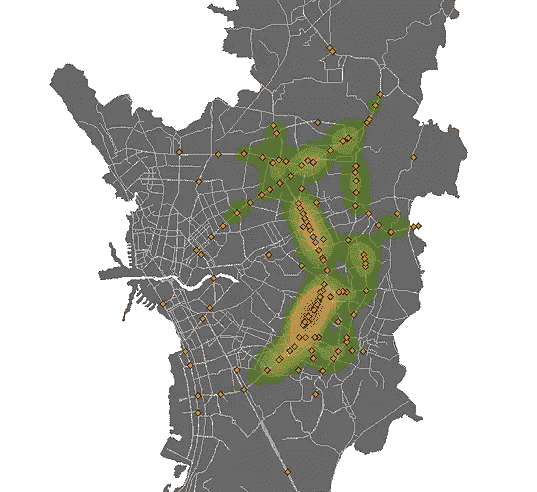
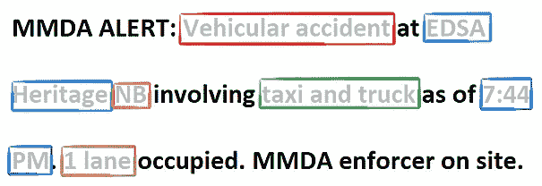
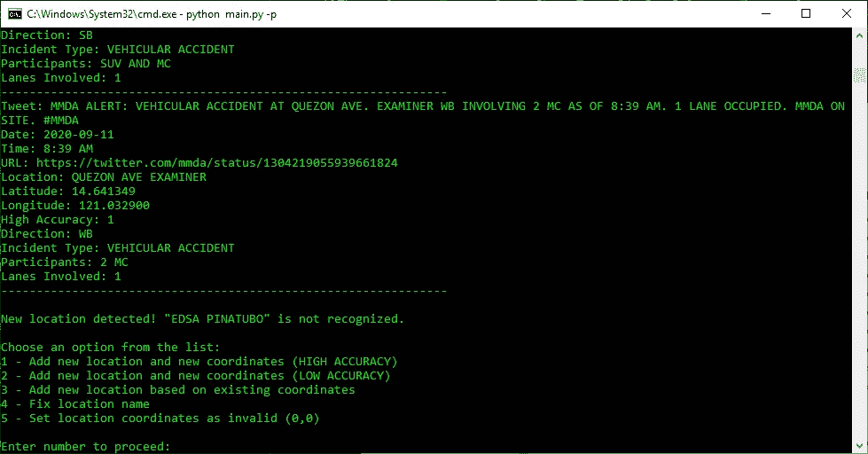
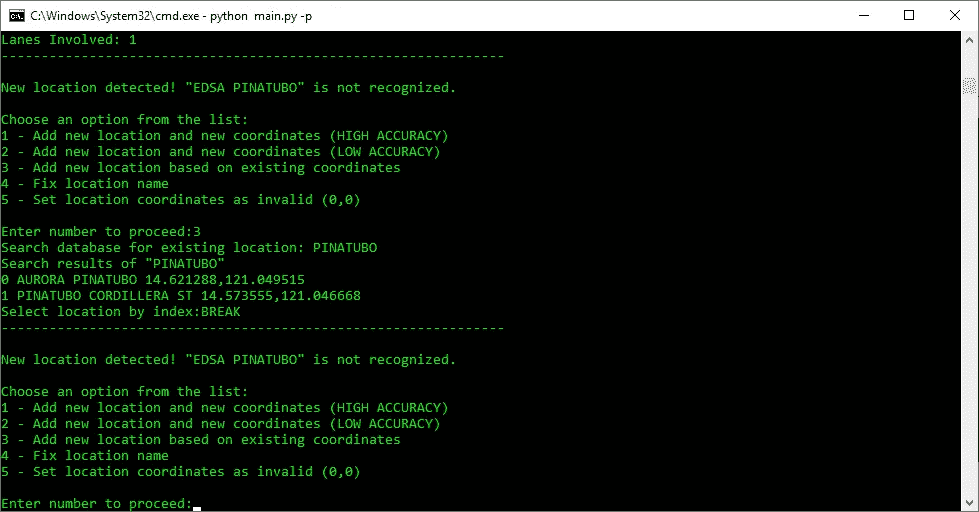
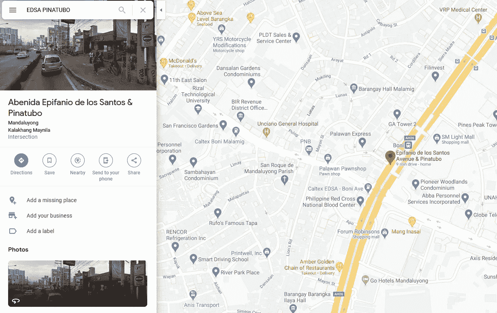
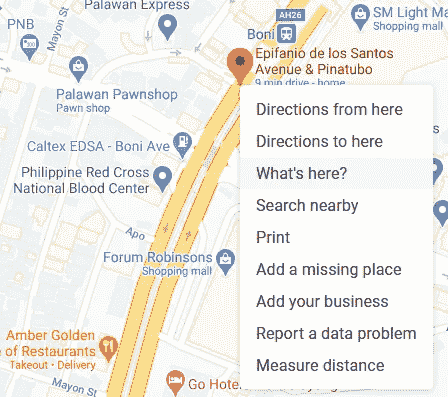
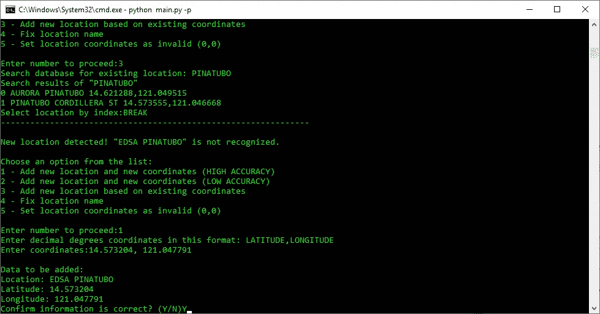
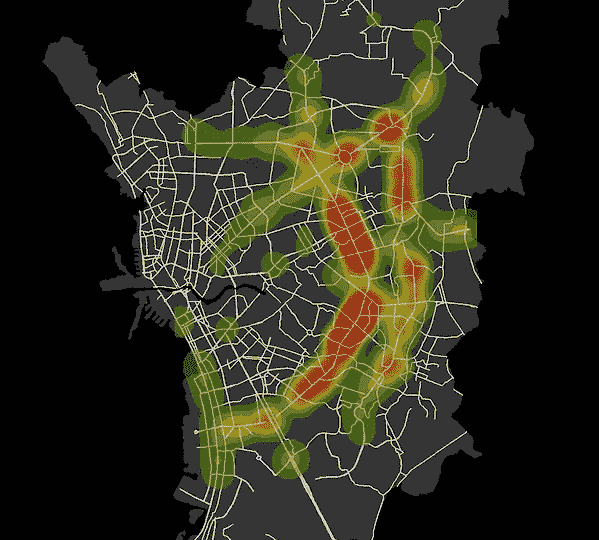

# Tweet2Map:马尼拉交通事故研究推特

> 原文：<https://levelup.gitconnected.com/tweet2map-twitter-for-traffic-accident-research-in-metro-manila-d0f861c9b8b7>

一个自动化的 Python 工具，用于解释来自 MMDA 的推文并提取大马尼拉地区的高精度交通事件数据

大马尼拉的交通事故逐年稳步增长，2019 年大马尼拉共有 121，771 起记录在案的事故[1]。公众可公开获得一些报告，如大马尼拉事故报告和分析系统( [MMARAS](http://www.mmda.gov.ph/homepage/2-uncategorised/3345-freedom-of-information-foi.html) )，但是它们已经是城市级别的汇总数据，并不提供城市内更精细的空间数据。

Tweet2Map 将特别关注大马尼拉发展局( [MMDA](https://twitter.com/mmda) )的 Twitter feed，旨在为 Twitter feed 上报告的每个事件附上高质量的点数据，以便准确定位每个事件。

大马尼拉选定交通事件的点位置以及核密度分析

这篇文章将重点介绍 Tweet2Map 脚本是如何工作的。我写这篇文章是为了庆祝 Tweet2Map 脚本的**版本 1.0** 在程序完全重写后的发布。本博客的下一篇文章将使用这些数据进行探索性的数据分析。Github repo 中提供了关于如何创建虚拟环境、配置和运行软件的完整说明:

 [## pbrotoisworo/tweet2map

### 作者:潘吉·布罗托伊斯沃罗联系人:panji.p.broto@gmail.com·MMDA tweet 2 map 是一个挖掘 MMDA 推文的 python 脚本…

github.com](https://github.com/pbrotoisworo/tweet2map) 

该脚本是一个自动化的 CLI 工具，默认情况下会下载推文并将其存储在缓存中以供以后处理。我安排脚本在 PythonAnywhere 免费层上每天运行一次。一旦我准备好处理数据，我就可以运行处理参数`-p`,它将加载最新的 tweet，还会加载缓存中存储的 tweet。该脚本通过检查缓存中唯一的 tweet ID、下载的新 tweet 和数据库中最新处理的 tweet 来过滤重复的 tweet。

# 数据挖掘 Twitter

MMDA 推特的特色是实时事件报道，其结构与下图相同。

下面是脚本解析推文的方式:

*   红色:事故类型
*   浅蓝色:位置
*   橙色:方向
*   格林:谁参与了
*   深蓝色:时间
*   棕色:车道被占用

目前，该脚本使用正则表达式来解析文本，但有计划包括自然语言处理(NLP)。这是因为尽管这些推文中有一个总体结构，但我观察到它们仍然是手动输入的。这是因为我不时会遇到错别字和错误，这些错别字和错误会混淆需要精确结构的正则表达式，从而导致无效的 tweets。我希望 NLP tweet 解析器更加灵活。

# 向数据库添加位置

截至发稿时，数据库中有 2，780 个命名的地点。大多数位置都具有可靠和准确的点数据，但也有相对不准确的名称。诸如“ROXAS BLVD .”之类的名称是不准确的，因为 Roxas Blvd .是一条很长的路，因此您无法准确地放置一个点，即使是在城市集合级别，因为这条路穿过几个城市。

该软件通过提供“高精度”列，提供了一种识别哪些位置是可靠的方法。由于我在 SQLITE3 上运行是为了与免费层云托管兼容，所以我不能创建 BOOL 列，所以它只是一个整数列，其中 1 为真，0 为假。

有两种不准确的数据。第一种情况是，名称完全错误，无法精确定位到某个位置，该位置标有坐标 0，0，因此无效。第二种不准确的数据是，你仍然可以大致确定事故发生的位置，但是你不能在几百米内确定准确的位置。第二种类型的不准确数据在城市聚合级别仍然可用，但如果您想要非常精确的坐标，它就不可靠。

当您使用`-p`参数处理数据时，如果遇到新的位置，会出现一个提示，并给出如下图所示的选项。你可以选择任何一个选项，但是如果你想返回菜单，只要输入“BREAK”就可以了。

让我们通过快速演示来完成在 a 中添加新位置的过程。这里“EDSA·皮纳图博”与位置数据库中找到的任何字符串都不匹配。

您可以使用字符串匹配在位置数据库中搜索现有位置，如下所示。我搜索了“PINATUBO ”,但是没有匹配的，所以我输入“BREAK”返回主菜单。

首先，我在谷歌上搜索这个位置，它显示这个位置有一个非常准确的位置。所以我们可以将它创建为一个高精度位置。

右键单击点位置，然后单击“这是什么？”。这将显示您可以复制并粘贴到终端的坐标位置。

现在我们在位置数据库里找到了 EDSA·皮纳图博。因此，如果这个位置再次出现，它不会提示输入坐标。

# 限制

这个数据集有一些限制。这些事故大部分是由 MMDA 人员报告的，因此大部分将被记录的事故将只发生在 MMDA 管辖的主要道路上。

因此，该数据不能完全代表大马尼拉的所有交通事故。

MMDA 事故报告的核分布

# 参考

[1]: [大马尼拉事故报告与分析系统 2019 年度报告](http://www.mmda.gov.ph/images/Home/FOI/MMARAS/MMARAS_Annual_Report_2019.pdf)