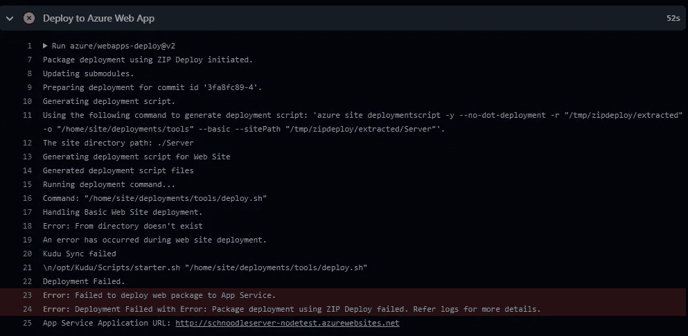
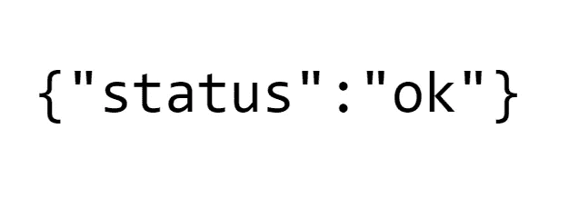

# TWIL:使用 GitHub 操作将 Node.js 部署到 Azure 应用服务

> 原文：<https://levelup.gitconnected.com/twil-deploying-node-js-to-azure-app-service-with-github-actions-e5244073966e>

TWIL(本周我学习了)关于使用 GitHub Actions 将 Node.js 服务器部署到 Azure 应用服务的所有内容。👨‍💻星期三，是我居住的荷兰的国王日。👑当大多数人穿着橙色的衣服出现在瓷砖上的时候，🧡我从早到晚埋在代码中学习为。

Schnoodle 使用所谓的 [monorepo](https://en.wikipedia.org/wiki/Monorepo) 。这是系统所有部分的所有代码都在一个 GitHub 库中的地方。这是由一些最大的科技公司引领的趋势，如谷歌、脸书、微软、优步、Airbnb 和 Twitter。🤯

这有很多好处，包括将所有代码放在一个地方。然而，在将 Node.js 服务器部署到 Azure App Service 时，这给我带来了三个问题。

# 问题 1:文件夹结构

服务器代码不在根文件夹中；在一个子文件夹里。📂这导致了各种构建和部署错误，让我绞尽脑汁了几个小时，🤔我在网上找到了各种各样的黑客解决方案，看起来都有点难看。🧟‍♂️:最后，为了让它以一种干净的方式工作，我必须做三个主要的改变:

1.  一个变化是在工作流文件中设置默认的`working-directory`，这样构建过程使用正确的文件夹来构建堆栈溢出的[解决方案。](https://stackoverflow.com/q/57806624/197591)
2.  另一个变化是将`PROJECT`添加到 App Service 应用程序设置中，并为其分配 repo 中项目的路径。这样服务器代码将被部署在 **wwwroot** 中，而不是它的子文件夹中。否则，互联网上的通话将无法正常工作。🚫这个问题与 Kudu 有关，Kudu 是 Azure App Service 中与基于源代码控制的部署相关的许多功能背后的引擎。一旦我的搜索引导我到 GitHub 上提出的一个关于 Kudu 的类似问题[，这引导我到这里](https://github.com/projectkudu/kudu/issues/2661)记录的解决方案[。💪有时，解决方案被很好地记录下来，但是需要有人去体验如果没有正确的代码让谷歌搜索算法引导你找到这些解决方案，你就会遇到的问题。](https://github.com/projectkudu/kudu/wiki/Customizing-deployments#using-app-settings-instead-of-a-deployment-file)
3.  最后，由于一个莫名其妙的错误，我又做了一个改动，将应用程序设置中的`SCM_DO_BUILD_DURING_DEPLOYMENT`设置为`false`。一个相当恼人的错误，我在网上发现的一些讨论暗示这是 GitHub Actions 的一个 bug。🪲:无论如何，这是根据我找到的[这篇文章](https://errorsfixing.com/vs-code-publish-specific-folder-to-azure/)解决的。

# 问题 2:智能协定构建文件

当 [Truffle](https://trufflesuite.com/) 在编译期间生成智能合约构建文件时，它们被输出到一个文件夹中，但是 Node.js 服务器和前端 React 应用程序都必须能够访问这些文件。对于 monorepo，在本地开发环境中使用相对路径很容易。👨‍💻然而，对于服务器部署，这不起作用，因为部署的文件不包含 monorepo 中的所有文件；monorepo 中特定应用程序所需的文件，如 Node.js 服务器。🙀

为了解决这个问题，我必须使用符号链接来引用包含智能合约构建文件的文件夹。🔗我以前因为其他原因使用过很多次符号链接，但从来没有在 GitHub repo 中使用过。我在 GitHub [这里](https://stackoverflow.com/q/954560/197591)找到了一个关于符号链接的很好的讨论。然后我通过添加两个符号链接解决了这个问题。一个用于 Node.js 服务器，一个用于 React 应用程序。问题解决了！✅一篇关于如何在 Windows 中添加符号链接的有用文章可以在这里找到。

# 问题 3:部署中有大量文件

由于 **node_modules** 中的文件数量(一个相当臭名昭著的“问题”)，我在构建期间收到了一个警告:

> ⚠️“这个工件中有超过 10，000 个文件，考虑在上传之前创建一个归档文件，以提高上传性能。”

线索就在消息中，我遵循了[这个堆栈溢出答案](https://stackoverflow.com/a/69402502/197591)中的有用说明，它建议在部署期间压缩和解压缩工件。

不幸的是，由于同时使用`working-directory`选项的不寻常组合，这并不像我希望的那样顺利。😿

将压缩工件与工作目录选项一起使用时出现部署错误

我花了几个小时寻找解决方案，直到我自己写了一个关于堆栈溢出的问题来寻求某人的答案。然后我恍然大悟💡(仔细查看日志一段时间后)。解压到我解压的同一个文件夹。这成功了！🎉我贴出了解决方案，作为对我自己问题的[回答](https://stackoverflow.com/a/72051608/197591)。

# 秘密！

最后，我现在正在挑灯夜战，🕯️，我想解决存储和访问机密的问题🤭例如在任何桥操作中与目标链交互的 [EOA](https://ethereum.org/en/glossary/#eoa) 的私钥。在本地开发期间，设置和秘密可以存储在**中。使用 [dotenv](https://github.com/motdotla/dotenv) 访问 env** 文件。

值得庆幸的是，我已经在开发 NFT 平台时建立了一个 Azure Key Vault，我们在这里存储秘密，如 Pinata API 密匙，以及 Azure Cosmos DB 和 Azure storage 账户的密匙。🦾:我现在只需要在那里添加应用程序秘密，并按照这里的说明(使用 Azure 托管身份)从 Node.js 服务器访问它们。

# 成功！

瞧。服务器现在已经部署好了。💥这不仅是 SNOOD 迈出的重要一步，因为我们越来越接近发布加密领域最安全、最先进的令牌桥，对我来说，这也是一次非常充实、愉快的个人技术之旅。学习新技能让我们保持头脑清醒，大脑健康。🧠

永不停止。永不放弃。做一个胜利者！🥇即使这意味着在国庆节连续 24 小时不停地玩电脑！

我说的是极客，不是瘸子！

通过[链接](https://test.server.schnoodle.finance/Alive)随意测试服务器是否处于活动状态。🕺

{ "状态":"正常" }