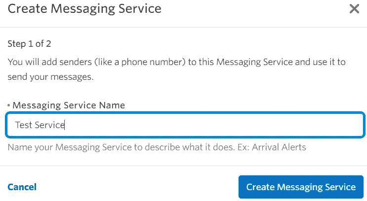
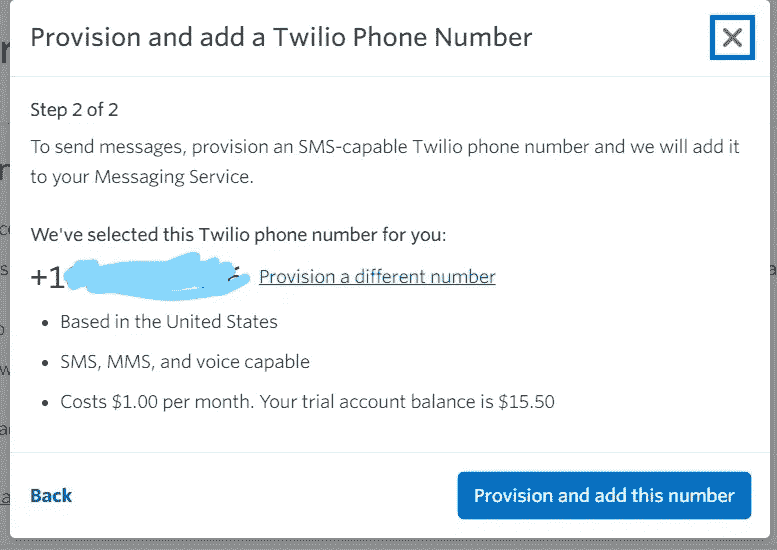
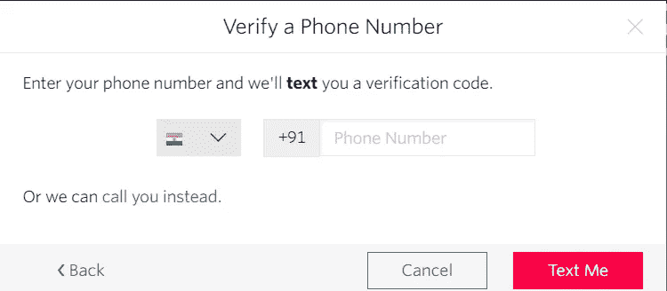
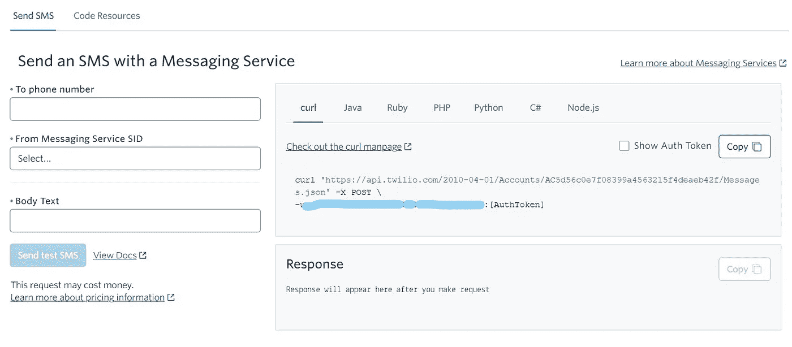
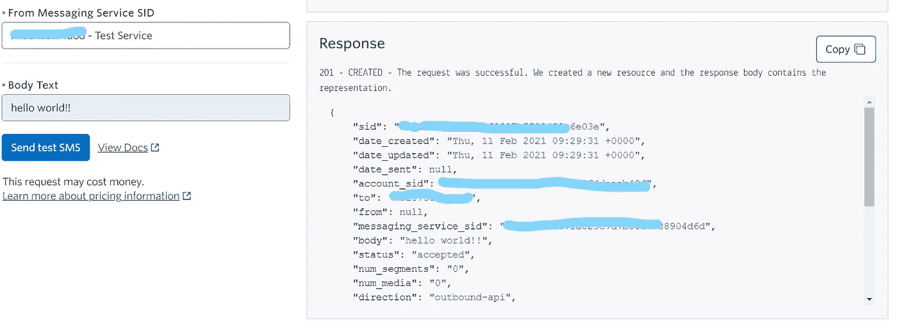

# Twilio 文本消息与颤动🚀

> 原文：<https://levelup.gitconnected.com/twilio-text-messages-with-flutter-fe63f41eebe9>


*大家好，这是我的第一篇文章。我已经尽了最大努力来传递我对这个话题的所有知识。如果你发现任何错误或有建议，请让我知道，这将有助于我提高很多！*

在本文中，我将指导您在 Flutter 应用程序中集成 Twilio API。在开始所有令人讨厌的东西之前，让我们了解什么是 Twilio 以及我们为什么使用它。

# 什么是 Twilio


Twilio 是一个使用 web APIs 为我们提供云通信即服务的平台。等一下！这些沉重的字眼是什么意思？🙄

我举一个简单的云通信的例子。你们大部分人都做过网上支付吧？因此，每当你进行网上支付时，你都会在交易前收到一个 **OTP** ，在支付成功或失败后，你会收到一条来自银行的关于支付的**短信**。你有没有想过，这些 OTP 和短信是怎么发给你的？这正是云通信发挥作用的地方。

Twilio 提供了**一个装满 API**的盒子，可以非常安全地将这样的服务或功能嵌入到移动应用或网站中。

*如果你不知道什么是 API，那么 API 基本上就是一堆在不同软件产品之间传递数据的代码。*

不用担心怎么做这个集成，我举一个 Twilio 集成在 Flutter 应用中的简单例子。

# 什么是颤振？？


Flutter 是目前**应用开发**中最流行的词汇之一。Flutter 是 Google 开发的 UI 框架。它使用 Dart 编程语言。

它可以用于从单一代码库**开发 Android 应用程序、iOS 应用程序、网站、Windows 桌面应用程序、Google Fuchsia、Linux 和 MacOS。简单地说，这对开发者来说是一个惊喜。**

好了，介绍部分到此为止。让我们开始动手操作🤓…


# 设置和测试 twilio

## 第一步

你必须在 [Twilio](https://www.twilio.com/) 上创建一个账户。通过创建一个帐户，您的帐户中将获得 15.50 美元的信用点数，随着您使用 API，该点数将会减少。

## 第二步

注册后，您将被重定向到 Twilio 仪表板，在那里您可以看到您的身份验证令牌和帐户 SID，我们将在向 api 发出请求时使用它们。


*不要与任何人共享此身份验证令牌和 SID*

## 第三步

在这篇博客中，我们将使用 Twilio 向特定的手机号码发送一条简单的短信。这项服务在 Twilio 中被称为**“可编程消息”**。

因此，我们首先必须在 Twilio 上注册我们将向其发送文本消息的手机号码*(它必须是现有的手机号码)*，还必须选择发送消息的号码*(您不必提供真实号码，Twilio 上会提供选择)*。

从仪表板左侧的菜单进入**“可编程信息”**，然后进入**“试用”**部分，然后点击**“开始设置”**并按下开始设置按钮。

为您的信息服务提供一个名称，然后 Twilio 将为您选择一个号码，作为您服务的发送方。

这将每月从您的点数中扣除 1 美元。



*将该编号复制到某处，我们将在编码部分需要该编号*

现在，我们正在使用试用帐户，所以当我们想发送短信到一个号码时，我们首先必须在 Twilio 上验证该号码。

*如果您升级了您的帐户，那么您可以直接向任何号码发送消息，而无需验证它们*

前往**电话号码** > > **验证来电显示** > > **添加新号码**

然后输入号码，之后输入 OTP。



现在这个号码可以接收 Twilio 的短信了

终于，我们准备好发送第一条信息了。你兴奋吗🤩😁？？

所以，我们走吧！！！🚀🚀

## 发送消息

返回**试用**部分，点击**试用短信**，并提供您刚刚在上一步中验证的*手机号码*。

然后把你开始时生成的*消息服务 SID* 放入*正文*中写入消息。当你填写你可以在右边看到的细节时，相应的源代码也以不同的编程语言生成。



并且点击**发送**。如果它成功了，那么你在不到 3 分钟的消息将被传递。您可以在右侧看到响应状态。



传递的消息将如下所示…


**呜呜呜🎉🎉现在让我们做一些编码部分，准备好了吗？我们走吧🚀**


# 颤振积分

有两种方法可以将 Twilio 集成到 flutter 应用程序中，

1.  使用 http 请求
2.  使用`twilio_flutter: ^0.0.5`包

我们将使用第一种方法，以便您可以了解实际的 API 调用。

## 第一步

创建一个颤振项目。

在`pubspec.yaml`文件中添加`http: ^0.12.1`包

将`http.dart`导入到您的 dart 文件中，如下所示

`import 'http.dart' as http`

## 第二步

在一个函数中或者任何你想实现的地方写下面的代码

```
var credentials = 'ACCOUNT_SID:AUTH_TOKEN';

var bytes = utf8.encode(cred);

var base64Str = base64.encode(bytes);var url = 'https://api.twilio.com/2010-04-01/Accounts/ACCOUNT_SID/Messages.json';

var response = await http.post(url, headers: {
      'Authorization': 'Basic ${base64Str}' }, 
body: {
      'From': 'ENTER_YOUR_TWILIO_SENDER_NUMBER',

      'To': 'ENTER_RECEIVER_NUMBER',

      'Body': 'WRITE_YOUR_MESSAGE'
    });print('Response status: ${response.statusCode}');

print('Response body: ${response.body}');
```

## 代码解释

1.  将 **ACCOUNT_SID** 和 **AUTH_TOKEN** 替换为您的(*可在 Twillio 仪表盘*上找到)
2.  然后，我们将凭证( *Account_SID 和 Auth_token* )编码到 base64 中，因为我们必须在 API 调用中传递它们以进行身份验证
3.  之后，我们向 Twilio API 发出 http **POST** 请求。你可以从 Twilio 文档中获得 url。
4.  提供请求正文所需的详细信息
5.  最后，我们只是打印响应体和响应状态代码，以检查请求是否成功。

**大功告成！！！🎉**

这是发送 SMS 的第一种方法，在其他方法中，您可以直接使用 [twilio_flutter](https://pub.dev/packages/twilio_flutter) 包并调用内置方法来发送 SMS。

# 展示一些爱和支持

如果你觉得这篇文章有帮助，那么请给一些掌声👏👏

更了解我:[https://linktr.ee/yashpaneliya](https://linktr.ee/yashpaneliya)