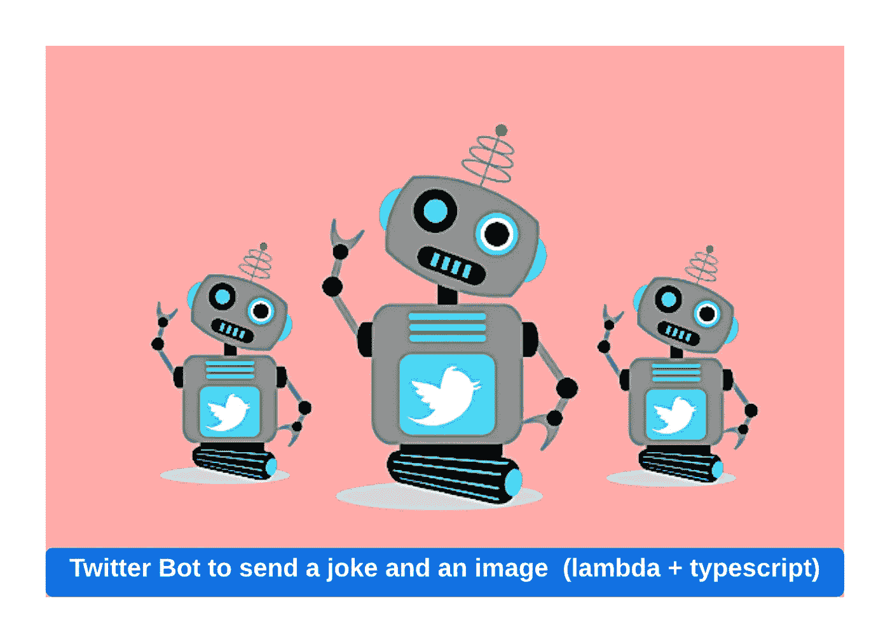
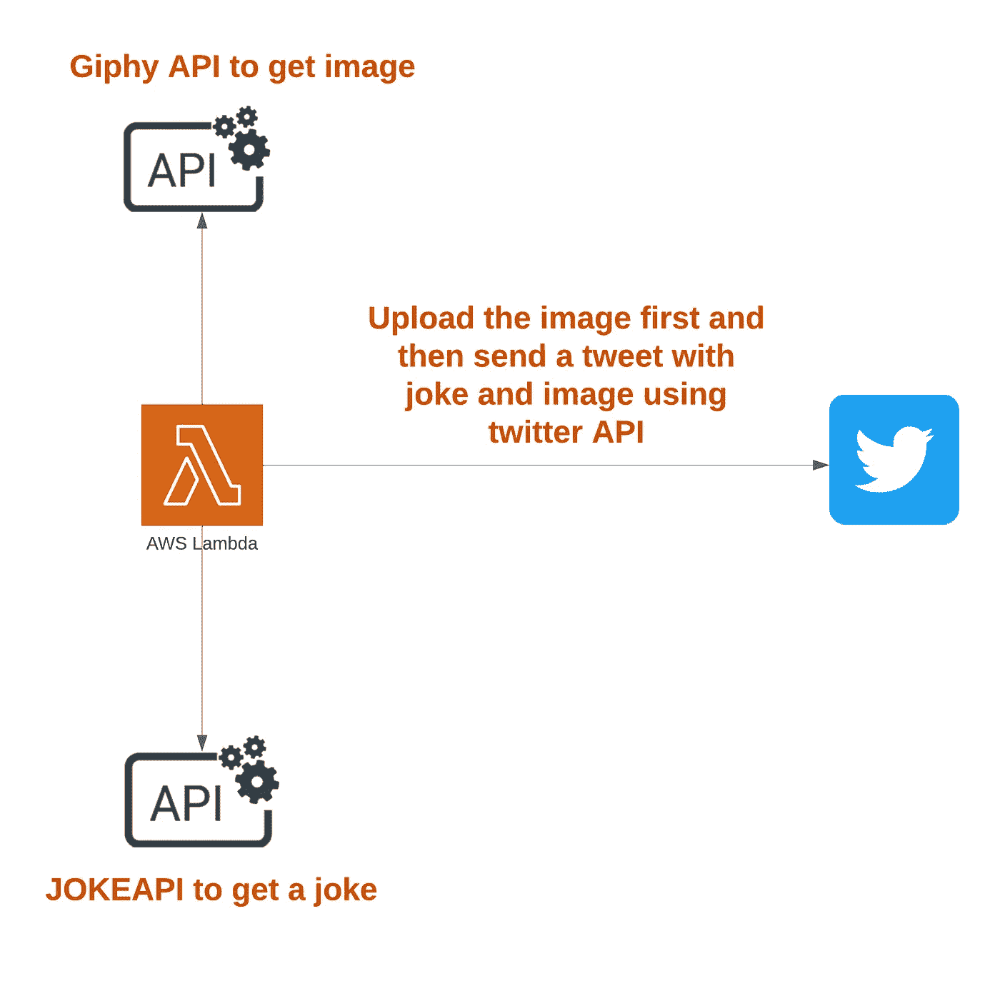
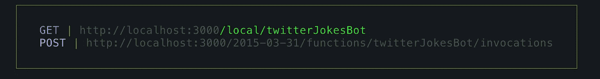

# Twitter BOT 发送笑话和图像(lambda + typescript)

> 原文：<https://levelup.gitconnected.com/twitter-bot-to-send-a-joke-and-an-image-lambda-typescript-c8bcbd481bb7>



推特机器人

在这篇博文中，我将向你展示如何构建你自己的 Twitter 机器人，它会定期发送带有图片的推文(笑话)

**如何运作？**

*   我们将从[https://jokeapi.dev/](https://jokeapi.dev/)API 得到一个随机的笑话。它是免费的，但在命中率等方面有一些限制。
*   我们将使用[https://developers.giphy.com/](https://developers.giphy.com/)API 得到一个随机但相关的图像
*   我们将使用 Twitter API 和`twitter-api-client`节点包创建并发送一条 tweet



**最终结果将会是这样的**

笑话推特

**先决条件**

*   你应该有一个 twitter 账户来注册 Twitter 的[开发者门户](https://developer.twitter.com/)
*   AWS 访问密钥&在 AWS 上部署的秘密密钥

**第一步:在 twitter 的开发者门户注册并获得相关密钥**

从 twitter 的开发者账户获取密钥是一个非常简单直接的过程。你可以从这个视频中得到一步一步的指导-

**第二步:注册 giphy 的开发者账户，并获得他们的访问密钥**

同样，这非常简单，不言自明([https://developers.giphy.com/](https://developers.giphy.com/))，但是如果你需要一些关于这个 API 的详细信息，以及如何获得它的访问密钥，你可以看这个视频

**第三步:现在你有了你的 twitter & giphy 键，所以让我们开始写机器人代码**

我们将使用[无服务器](https://www.serverless.com/)框架来编写这个 lambda 函数。

> *全局安装无服务器*

```
npm install -g serverless
```

> *从无服务器模板库中创建一个 typescript 项目*

```
sls create --template aws-nodejs-typescript
```

> *安装本项目所需的节点包*

```
npm install --save axios twitter-api-client
npm install --save-dev serverless-offline
```

[**axios**](https://www.npmjs.com/package/axios)**:**Promise based HTTP client for the browser and node . js
[**Twitter-API-client**](https://www.npmjs.com/package/twitter-api-client)node . js client for Twitter API
[**server less-offline**](https://www.npmjs.com/package/serverless-offline)这个无服务器插件在您的本地机器上模拟 AWS λ和 API Gateway 以加快您的开发周期。

> *像这样在 serverless.ts 中定义你的函数*

这里我们定义了一个名为`twitterJokesBot`的函数，它的类型为`GET`

**确保将** `**serverless-offline**` **插件添加到 serverless.ts** 的插件列表中

> *定义 twitter-api-client*

**确保您已经将这些密钥和令牌添加到您的环境中**

> *定义笑话功能*

这包括两个部分

*   `**getJokeTweet**`是从`jokeapi.dev`那里得到一个随机的笑话，然后添加你的标签和其他你想附在这条推文中的文字。它还检查它是否不超过 280 个字符(截至 2022 年 2 月的 tweet 字符限制)，如果它然后递归并在 API 调用中获得另一个笑话 **Lookout for** `**blacklistFlags**` **。这可以确保你得到一个漂亮的干净笑话**
*   `**getJokeImage**`使用我们之前得到的 giphy api 密钥得到一个随机的 giphy 图像。你必须把它作为一个`arraybuffer`以便我们可以把它作为一个`base64`图片上传到 Twitter

> *把它们都放在你的*里`*handler.ts*`

这也是一个两步过程

*   第一个是将媒体资产上传到您的 Twitter 帐户
*   然后使用上传媒体响应中的`media_id_string`,用它发送推文

> *好了，现在你可以开始测试了*

在您的终端中运行`sls offline --stage local`,您应该准备好您的端点来测试



🎉🎉🎉你的机器人可以发射了。

如果您希望将它部署到您的 AWS 帐户，那么在环境中设置您的 AWS 访问密钥和 AWS 秘密密钥并运行`sls deploy --stage dev`

你可以从这个库[https://github.com/appletreeat56/twitter-bot](https://github.com/appletreeat56/twitter-bot)得到完整的例子

感谢您的阅读，如果您想支持我，请关注我，成为会员，支持更广泛的社区。

[](https://medium.com/@metacollective/membership) [## 通过我的推荐链接加入媒体 Meta Collective

### 作为一个媒体会员，你的会员费的一部分会给你阅读的作家，你可以完全接触到每一个故事…

medium.com](https://medium.com/@metacollective/membership)