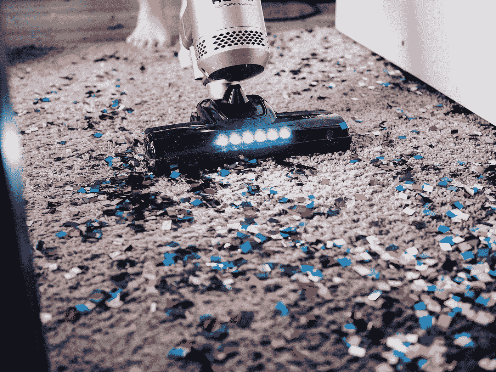

# Twitter 可以在一周内移除假货

> 原文：<https://levelup.gitconnected.com/twitter-can-remove-fakes-within-a-week-115a94d17fe8>

照片由[没有修改](https://unsplash.com/@norevisions?utm_source=medium&utm_medium=referral)的 [Unsplash](https://unsplash.com?utm_source=medium&utm_medium=referral)

埃隆·马斯克[暂时搁置了价值 440 亿美元的 Twitter 交易](https://www.reuters.com/technology/twitter-estimates-spam-fake-accounts-represent-less-than-5-users-filing-2022-05-02/)，原因是 Twitter 上可能有超过 5%的虚假账户。

换句话说，埃隆·马斯克宣布，除非能证明机器人占 Twitter 用户的比例低于 5%，否则他不会继续收购 Twitter。

5%的虚假账户数字是 Twitter 向监管部门引用的。Twitter 的用户总数为 2.29 亿美元。

对于像 Twitter 这样拥有 100 万用户的公司来说，这似乎是一项艰巨的任务。然而，对于 Twitter 这样的软件工程巨头来说，这应该不难。

> 对一个公司来说很难，但对一个软件巨头来说并不难

可能是管理层没有看对方向。又或许，它不想。

# 任何软件在设计时都考虑到了迁移:

当软件架构师决定创建一个简单的图书馆图书租赁系统时，他/她会考虑以下事项:

*   将存储多少数据实体
*   它们的 CRUD 操作( **C** reate， **R** ead， **U** pdate， **D** elete)将如何发生，它将如何影响系统的数据完整性
*   最重要的是:迁移将如何进行。

对于大多数软件新手来说，数据迁移是令人头痛的事情，但是软件架构师首先想到的是迁移。事实上，如果不讨论迁移，他们拒绝编写第一行代码。

任何软件产品的数据迁移策略都包括:

*   系统将如何随着新用户的涌入而扩展(资源的纵向与横向扩展)
*   为用户提供最新数据副本的频率(缓存)
*   它将如何处理尚未分解的数据项(即通过添加数据库/表格)
*   它将如何消除过时的数据。

很难理解 Twitter——一家创建了 OpenID(通过它你可以使用谷歌或脸书的 ID 登录任何网站)和 OAuth 的公司——没有用户迁移策略。

用户迁移是 Twitter 根除虚假账户的过程。

# Twitter 如何根除虚假/垃圾账户:

几个月前，我在我的文章中提到电子邮件作为身份的基础是所有与虚假账户相关的罪恶的根源。

民主的基本原则是一人一票。假账户以最小的摩擦违反了这一原则。它们不仅允许一个人尽可能多地投票，还有助于建立复杂的在线对话模式，以推动有利于既得利益和财力雄厚的政党的叙事。

> 民主的基本原则是一人一票。假账户以最小的摩擦违反了这一原则。

例如，利用虚假账户，一个人/一方可以对两个极端的故事进行辩论，并完全掩盖第三种选择(这可能伤害他/他的恩人，但有利于大众)。

任何一个存在如此巨大设计漏洞的平台，怎么能自称是一个启用言论自由的平台？

如果认真考虑，技术解决方案并不是火箭科学:

*   这一次，强制用户通过移动设备登录。
*   提示用户输入用户名、密码以及指纹。
*   将指纹(或在设备上计算的等效散列)传输到服务器
*   将输入的用户名与新数据库表中提交的指纹(或散列)相关联
*   将提交重复指纹的用户名与之前注册的用户帐户相关联，例如，如果 user1@email.com 的**和 user2@email.com 的**都使用相同的指纹进行认证，则将他们关联到一个帐户下。****
*   强制指纹登录 7 或 14 天后，删除所有没有相关指纹数据的帐户。
*   一段时间后(几个月)，根除所有基于电子邮件的登录。删除用户名/电子邮件的索引。通过移动指纹限制认证。不需要其他信息。
*   我很清楚有人会说什么:在没有任何预识别数据项(最好是索引用户 id 或电子邮件)的情况下，扫描十亿条记录数据库中的指纹散列是很可笑的。但是，如果有人不得不冒险执行单一认证实体的任务，这将是一个大问题。正常的工作流程(**扫描用户名= >在匹配的情况下，比较密码/令牌**)甚至被初创公司遵循。当谈到数十亿美元的先发优势时，大型技术总是推动创新，在 5G、比特币铸造和具有不可想象容量的显卡的时代，他们没有理由负担不起。
*   在通过桌面网络进行后续身份验证尝试时，提供一个可在智能手机上访问的 QR 码链接，该链接将收集指纹哈希，并将其与已经收集的数据进行匹配。如果找到匹配项，则在桌面网站上进行身份验证。

我的解决方案可能有技术故障。但 Twitter 上肯定有人比我更聪明。它当然有能力雇佣一个顶尖的网络安全团队来提出一个更好的解决方案。

最多是技术上有难度，但不是不可能。

# 为什么 Twitter 不这么做？

去除假货和垃圾邮件并不是一项技术挑战。这是合法的。

这不是挑战，这是噩梦。

10 亿会员是 Twitter(和所有其他基于互联网的公司)对其(免费或付费)客户的 USP。

> 亿万美元估值的整个董事会游戏是基于一个被称为 MAU(每月活跃用户)的神奇数字进行的

想象一下，告诉一个名人，他的粉丝数从几百万到几千——接下来你会看到大批人离开。想象他们贬低他们的竞争对手(“嘿，你真正的追随者数量刚刚低于我！”)，同时也把自己的败落归咎于平台。

用户数量也是科技公司对投资者的承诺。亿万美元估值的整个董事会游戏是基于一个被称为 MAU(每月活跃用户)的神奇数字进行的。没有人关心这些用户是否属于唯一的人。

创始人和早期投资者躲在 MAU 数字后面，不断向后期投资者证明他们亏损的企业。这让他们的股票在每月的账单上浮动。这是一场没有人会输的游戏，除了中小企业，它们的广告预算因为幻想着它们的广告活动所描绘的美丽图表而落空。

# 结论:

如今，数以百万计的虚假账户被受雇于营销黑手党(企业、政客、名人)的中层媒体公司创建和拥有。那些中层公司的名字很少出现在主流媒体上。

他们的工作是统一安排 tweets/FB/Insta 帖子，并自动+定期发布到他们客户的账户上。这种一致性让他们的追随者参与进来。

他们使用的工具依赖于社交媒体公司(这里是 Twitter)的 API。

如果 Twitter(或脸书/Instagram/Snapchat)决定根除假货，这些公司的产品将停止工作。更糟糕的是，由于追随者数量的突然下降，他们可能会在一夜之间失去所有合同，并且永远无法从损失中恢复。它们可能会完全消失，这取决于它们存在的地点。

这个单一的行动可能会打开诉讼的闸门，不仅会冲击 Twitter，还会冲击整个广告行业。

然而，如果这样的事情在不久的将来不被采纳，电子邮件依赖系统将有一天成为一个噩梦。这不会杀死社交媒体巨头，但会让他们变得无足轻重。

Twitter 失败的交易可能只是一个开始。因 Twitter 的正当行为而受到伤害的行为者可能会联手加剧其问题。

具有讽刺意味的是，一项研究报告称，超过 23%的埃隆·马斯克的追随者是假冒的或垃圾邮件。

Twitter 可能永远也不会得出垃圾邮件账户的实际数量。

马斯克很可能已经知道了。也许他 440 亿美元收购 Twitter 背后的整个计划是为了纠正失去的 30 年身份管理不善的错误。

如果没有，至少，揭开它。

*   如果您想在[笔磁](https://tipsnguts.medium.com/)发布的任何时候收到电子邮件，请点击下面的链接:

 [## 每次 Pen Magnet 发布时收到一封电子邮件。

### 每次 Pen Magnet 发布时收到一封电子邮件。通过注册，您将创建一个中型帐户，如果您还没有…

tipsnguts.medium.com](https://tipsnguts.medium.com/subscribe) 

*   想看完 Medium 上的每一个故事？点击下面的链接成为**媒体会员**。您的部分订阅费可能会支付给[笔磁铁](https://tipsnguts.medium.com/)。

 [## 用我的推荐链接加入媒体-笔磁铁

### 作为一个媒体会员，你的会员费的一部分会给你阅读的作家，你可以完全接触到每一个故事…

tipsnguts.medium.com](https://tipsnguts.medium.com/membership)