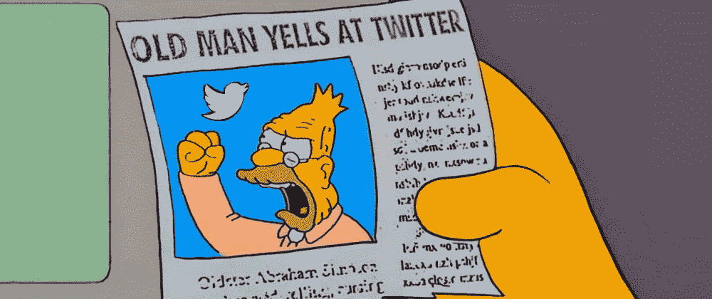

# Twitter，骗子，开发者，以及我们所知的开发者 Twitter 的终结

> 原文：<https://levelup.gitconnected.com/twitter-grifters-devrels-and-the-end-of-everything-as-we-know-it-3b024476fab7>

## 一些 Dev Twitter 用户正在囤积对话，但他们并没有真正为其进展做出多大贡献

> 这是一场咆哮。更多的是一个“老人对着云大喊”的时刻…所以，在经历它之前，请随意离开这篇文章

# 开发推特

让我先说**我不太喜欢开发推特的概念。我觉得很可笑。**这让 Twitter 上的所有开发人员看起来都以同样的方式思考和行动，而实际上，这是一个极其多样化的群体，经常是分歧和矛盾的。然而，为了简单起见，我将在本文中多次使用术语 Dev Twitter。

在我浏览 Dev Twitter 的时候，我发现许多类型的开发人员可以根据他们发布的内容/方式进行分类:

*   大部分时间阅读而很少分享发展的人。
*   谈论 dev 和分享原创内容的人。
*   分享原创内容的人(但大多不是他们的)。
*   谈论编程的人(但不分享 dev 内容)。
*   大多数不谈论编程的人，主要是感觉良好的和当前的话题(又名模因)。

不是严格的分类，很多用户从一个跳到另一个。但一般来说，在任何给定的时刻，大多数用户都属于这五个群体之一。

我将谈论属于最后两类的人:谈论编程的 Twitter 用户，但大多数他们不这样做。

# 推特骗子

Twitter 骗子是指在 Twitter 上建立受众的人。他们不关心什么，谁，或如何。他们最关心的是数字(以及如何从中赚钱)。骗子无处不在，但是 Dev Twitter 有很多骗子。

他们可以谈论软件开发或喜马拉雅山上甘蔗的生长，但他们选择了软件开发，因为这更有利可图。

骗子们捕食刚开始发展的人。学习编程并不容易，有时会令人困惑:有太多的资源来自太多的地方。很难找到合适的东西，也很容易迷路。一个把感觉良好的信息和精心策划的信息结合起来的人是有吸引力的。骗子利用了这一点。他们以教师和教育工作者的身份出现，但事实并非如此。

以下是一些你可能面对 Twitter 骗子的线索:

*   他们贴了很多。像是直达。以这种*不健康*的速度来算。
*   他们的大多数帖子都是以“开头的列表或线索👇 🧵."
*   他们的大部分内容不是原创的，而是从各种来源(通常没有正确的归属)引用的内容。)
*   他们的趋势迷因的内容比率非常高(他们喜欢这些东西，像冠军一样冲浪。)
*   他们喜欢开放式的问题，这些问题有一个主观的答案，并且会产生很多回应(与上面的想法相同)。
*   他们喜欢并转发(再转发，再转发几次)他们自己的内容。
*   他们的励志信息的内容比例相当高。
*   他们可能会(也可能不会)大谈发展，但他们实际上并不分享他们所做的任何发展。
*   他们谈论更多的是他们的追随者数量，而不是其他任何事情。

最后一个有许多变体:

*   "当我有 Y 个粉丝时，我会做 X . "
*   "我是 X 追随者，简称 y。"
*   "如果这得到 Y 个赞/转发，我会分享 X . "
*   “我成功了，X 追随者！现在出发去 Y！”

我个人最喜欢的是“*当我在 Youtube 上拥有 1，000 名订阅者时，我会分享更多的视频*”为什么是 1000 而不是 100、250 或 500？(这将是更现实的预期)。答案很简单:一个愿意提供广告服务的 Youtuber 必须至少有 1000 名订户——你猜对了。这从来都不是关于信息或观众。总是为了钱。

一些读者现在可能会说，“*我知道有一群人会检查大部分这些东西，但他们肯定不是骗子*你绝对是对的。有些人是“普通人”，有些人是开发者。

# 德弗尔斯

我简称他们为 DevRel，但是他们有很多名字:Dev Relations、福音传道者、倡导者等等。公司影响开发商已经成为一个时髦的*新职位。*

但是开发者并不是“开发影响者”他们的角色不仅仅是写关于发展的文章或者在 Twitter 上分享励志名言。DevRels 是外部开发者和公司开发者之间的桥梁。他们需要与观众互动，但不是像 Twitter 骗子那样。

尽管如此，DevRel 和 Twitter 骗子之间的界限还是很模糊。有些人经常在这两者之间跳来跳去:他们以骗子的身份建立大量的观众，然后他们被公司雇佣为开发者，试图利用大量的追随者作为促销噱头。

DevRels 关于编程的帖子，但是很多时候没有实际编码。他们分享鼓励和鼓舞人心的话，但大多数是针对他们的受众，而不是一般的开发人员，而是一些特定的工具用户。

# 我们所知的一切的终结

Dev Twitter 在过去十年中不断发展。十年前，还没有 Dev Twitter。当时，这是一个模糊的想法，现在集中在一组人(称他们为开发影响者)身上，他们谈论和定义主题。

问题是 **Twitter 骗子正在囤积对话，但他们并没有真正为对话的进展做出多大贡献:他们的话题是重复的，他们的信息缺乏意义或深度，他们并不真正关心他们的观众**(只要它增长)。这导致 Dev Twitter 生态系统变得陈旧。

DevRels 可以帮忙，他们更好，也更活跃。但他们中的许多人上 Dev Twitter 并不是为了和其他开发者在一起，而是因为这是他们在 XYZ 公司工作的一部分。因此，他们与开发人员一起工作，但最终为一家公司工作，在他们的互动中呈现出一种(并不总是清晰的)偏见。

那么，我们如何防止 Dev Twitter 落入骗子之手呢？我不知道，也许我们不能。系统就是这样建立的。但是，不幸的是，更多的观众意味着更多的新观众。这是一个恶性循环。

也许，我们可以通过让其他(更好的)开发者更多地参与进来并关注他们来打破这个系统。但这并不总是可能的。我所知道的最好的开发者在 Twitter 上并不太活跃。他们在这里或那里阅读和评论，但他们不太参与对话。实际的开发和教学不是在 Twitter 上完成的，而是在他们的工作中完成的。他们没有时间也没有兴趣在网上扮演角色。

我不知道需要做什么。但不管是什么，我们都不能归咎于个人。这应该是整个社区的集体努力。骗子可能会有帮助，因为他们有很多观众。但他们会想改变自己的方式，继续前进吗？

*原载于 2021 年 8 月 14 日*[*【https://alvaromontoro.com】*](https://alvaromontoro.com/blog/67984/dev-twitter-grifters-devrels-and-the-end-of-it-all)*。*