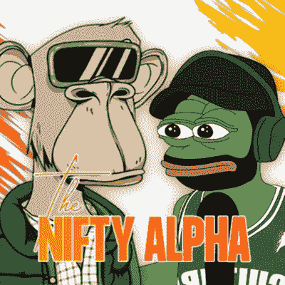

# 推特 NFT 专家改变了我的生活，让我变得更加有洞察力

> 原文：<https://levelup.gitconnected.com/twitters-nft-experts-changed-my-life-made-me-infinitely-more-insightful-e54db875a781>

## 以及我对该跟随谁的建议。

[这只是一个迷因冷静下来](https://knowyourmeme.com/memes/yall-got-anymore-of)

我在学校的每一门功课都不及格。每一个。可悲的是。包括英语。我在这里写作。

正如里奇·格威斯所描述的，“他比格里塔·图恩伯格受的教育还少。”

当老师把试卷还给我时，d、E 和 F 是我熟悉的字母表中的字母。当我做了一个荒谬的决定去上大学时，我的出勤率和成绩变得更差了。

尝试未分级。这就是试卷上没有足够的信息让评估员给你打分的地方。我甚至有可能在表格上把我的名字拼错了，以此来掩盖那是我的事实。

我在学校的表现会让 Garyvee 那份被广泛记载的学校报告相形见绌。

这是我经常和那些把正规教育放在基座上的朋友进行的对话。我不认为这对你的职业发展像人们说的那样重要。

我并不是说我的事业已经起飞，但我也不认为拥有学位的人有任何实质性的优势。

我相信，经历了几次失败后，对自己有一点清晰的认识是我的答案。我也认为寻求专家的建议是提升自己最可靠的方法。

一个创业的朋友曾对我说。

> “有人已经解决了你的问题。找到这些人是关键。”

成为一个如饥似渴的读者是否有助于为你的职业生涯铺平道路，这个问题还没有定论。或者在游戏中与皮肤一起呆在战壕里会给你更大的洞察力和更敏锐的技能。

也许答案是两者都有。

通过我在 NFTs 的第一个熊市周期和在 Crypto 的第二个熊市周期，我知道下次这种宏观经济狗屎来到我家门口时该怎么做。

有些伤口和瘀伤是你在书上读不到的，在大学里学不到的。

NFT Twitter 是一个游戏规则改变者，只要你按照专家的建议采取行动。这是容易的部分。

很难判断他们是在胡说八道，谷歌和粘贴专家，还是只是阅读和背诵他们的推文中的知识。

我从阅读文章和观看 YouTube 视频中学习得最好，然后将这些知识付诸行动。

很多专家在加密、去伪存真和非功能性加密方面有 5 到 10 年的知识缺口。

是的，NFT 已经存在一段时间了。著名的 2017 Crypto Punks 系列的最早收藏者都是非常富有的。知识和远见极其丰富。

[信用:密码朋克](https://nftnow.com/guides/cryptopunks-guide/)

说到非功能性食物，秘密朋克是最佳选择。为了清楚起见，这意味着有史以来最伟大的。在这个星球上行走的人不会告诉你任何不同。

根据定义，最初的“朋克持有者”在这个空间中受到尊敬，因为他们深谋远虑地意识到非传统音乐具有文化意义。

或者他们考虑过这个吗？大概不会。

这些早期采用者中的大部分人只是运气好吗？

绝对的。

大多数人从来没有想到，声称一个免费的像素化艺术造币厂有一天会价值数十万美元。

有些价值数百万。

对我来说，这些早期采用者是我们都需要坐起来听的空间的先驱。他们在 Twitter 上写有见地的帖子，对区块链技术了如指掌。

我下面要提到的其他人是 NFTs 的新手，但是有坚实的商业背景。如果有人在他们的领域取得了很高的成就，我倾向于倾听。

我是一个痴迷于 NFTs 的内容消费者，所以在 NFT Twitter 上学习是一种非常轻松的体验。

以下是我对平衡人员的建议。他们说的没有一句是财务建议。

我这么说并不是为了掩护他们，而是为了鼓励你发展自己的投资理论，让你对自己辛苦赚来的资本有更高的信心。

# 推特账号:punk6529

[https://mobile.twitter.com/punk6529](https://mobile.twitter.com/punk6529)

这家伙是一个他妈的野兽。他是匿名的，但自 2013 年以来一直在 Crypto。他对区块链技术的方向有着令人兴奋的理念。使用历史参考资料，了解文化，并深入了解关于 NFTs 和区块链技术的几乎每个主题的微小细节。

如果你有一个 Twitter 账户并且喜欢 NFTs，这将是一个值得关注的账户。就这一个。这是他围绕 NFTs 的每个方面创建的一条巨型线程。 [PUNK6529 百万线程](https://twitter.com/punk6529/status/1429399888786333697?s=20&t=erkyYlQcddzZ5K6Y5k2Clg)

# Twitter 账号:DCInvestor.eth

[https://mobile.twitter.com/iamDCinvestor](https://mobile.twitter.com/iamDCinvestor)

华盛顿名副其实。他是一名投资者，住在华盛顿特区，碰巧拥有最顶级的 NFT 藏品之一。

拥有最好的和最多样的 NFT 投资组合之一，以及对该资产的合理论述，D.C .将为你提供他的指导投资原则的线索。他的人生经验来自于他作为 Web2 员工和秘密投资者的经历。

# Twitter 账号:gmoney.eth

[图片来源:GMONEY](https://boardroom.tv/gmoney-brick-breaker-cryptopunks/)

我第一次看到格莫尼是在“现在营销”节目中，他用一个虚拟的 3D 头像在他的脸上方说话，不想暴露他的身份。

起初，我想，这真他妈的奇怪。这只成年猩猩正和一只脸上蒙着像素的猩猩说话。

我想每个人都有第一次进入 NFTs 的那一瞬间。正常阶段会很快离开你。我不再从判决杯中啜饮，而是听他说些什么。

Gmoney 的无术语风格让我对 NFTs 和整个空间有了更清晰的认识。你可能知道他是以 140 Eth 的价格买下他的加密朋克的家伙，并把这一举动称为“一个 flex”。购买时大约是 17 万美元。

这位总部位于波多黎各的投资者也是 Delphi INFINFT 的普通合伙人，该基金是与加密研究和投资公司 Delphi Digital 共同建立的，致力于投资 NFT 项目。

你会经常看到他在 NFT 的大型会议上发言。如果你有机会和他合影，帮他一个忙，只在社交媒体上发布他的秘密朋克照片。

# Twitter 账号:Garyvee

[加里维](https://knowyourmeme.com/memes/people/gary-vee)

如果你从没听说过他，你会上网吗？这个家伙是 NFTs 的勒布朗·詹姆斯，很可能会成为“那个家伙”

不管那是什么意思。

这位白俄罗斯裔美国企业家和连续投资者变成了励志演说家，当他不在推特上发布飞机失事的消息时，他会给推特带来火一样的见解。

Garyvee 的 Twitter 是一个你想打开通知铃的 Twitter，因为他经常发现他认为有机会做得很好的项目，并与他的社区分享。

# Twitter 句柄:Pio.eth 和 NFTNick.eth

【https://anchor.fm/niftyalpha 

[@Pio](http://twitter.com/Pio) 。eth 和 [@NFTNick](http://twitter.com/NFTNick) 。瑞士联邦理工学院主办最有趣和机敏的每日推特空间称为 NFT 早晨阿尔法。他们与交易专家和受邀参加展会的高级嘉宾讨论当前的市场状况。

在让我歇斯底里地大笑 1 小时 30 分钟的同时，我在体育馆里被动地听着。

你可以在他们的网站[thenifty.com](https://www.thenifty.com/)上订阅《每日文摘》,这是一个非常好的关于市场状况的信息资源。

如果你错过了他们的每日节目或现场直播，他们会把这些录像发布到人类已知的每一个流媒体服务上。这些人在内容方面可不是闹着玩的，他们紧跟 NFT 空间的脉搏。

# 推特账号:乔希·博布罗斯基

信用—[https://www.entrepreneur.com/article/327963](https://www.entrepreneur.com/article/327963)

这家伙像机器一样发微博。在疫情之前，他筹集了 700 万美元，而他的企业估值为 4000 万美元，后来几乎为零。

他最终会回到他妈妈的地下室和他的女朋友住在一起。她听起来像一个圣人，或者她是美元成本平均回来，玩长期游戏。

不管怎样，我永远不会完全相信一个至少一次都没有被炒鱿鱼的人。这些人更清楚。

我喜欢这个人描述非技术产业投资机会的清晰风格。他是一个伟大的思想家，并对久经考验的经营者深信不疑。

他在自己的 Twitter 空间中也充满了善意，并积极寻求少数群体的参与和意见。

> 以上都不是理财建议。我不是一个合格的财务顾问，尽管我尽了最大努力，我也无法预测未来。
> 
> **NFT 空间是有风险的。**
> 
> **专家称目前 99%的项目都将走向 0。**