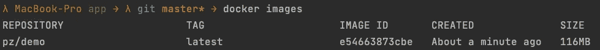
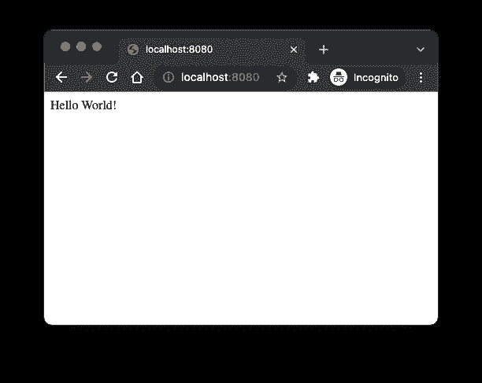
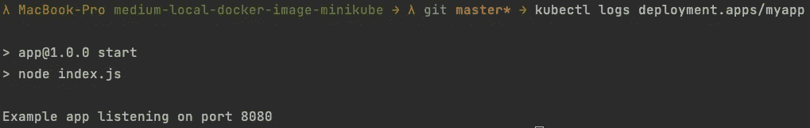

# 在 Minikube 中使用本地 Docker 图像的两种简单方法

> 原文：<https://levelup.gitconnected.com/two-easy-ways-to-use-local-docker-images-in-minikube-cd4dcb1a5379>

这篇短文将向您展示在 Minikube 中使用本地 Docker 图像的两种简单方法。


## 要求

*   [Docker](https://www.docker.com/get-started) 安装并运行
*   安装并运行 Minikube
*   [kubectl](https://kubernetes.io/docs/tasks/tools/) 已安装

## 你将学到什么

本教程将教你如何在 Minikube 设置中使用本地 Docker 图像。由于 Kubernetes 默认从注册表中提取图像，因此它不希望使用本地图像，也不应该用于生产。但是，如果您可以轻松地使用本地映像，而不需要每次都将它们上传到注册表、进行身份验证并在本地机器上再次提取，那么对于您的本地测试设置来说，这是非常常见和方便的。

像往常一样，我准备了一个 [GitHub 库](https://github.com/Abszissex/medium-local-docker-image-minikube)供您查看完成的代码库，并遵循本文中描述的步骤。

[](https://github.com/Abszissex/medium-local-docker-image-minikube) [## abszisex/medium-local-docker-image-minikube

### 此时您不能执行该操作。您已使用另一个标签页或窗口登录。您已在另一个选项卡中注销，或者…

github.com](https://github.com/Abszissex/medium-local-docker-image-minikube) 

## 一般设置

```
/
|- app/
  |- Dockerfile
  |- index.js
  |- package.json
|- deployment.yaml
```

在上面的文件夹结构中，我概述了我们将在本教程中使用的最重要的文件:

*   `app/Dockerfile` —用于构建包含 Node.js web 服务器的本地 Docker 映像的 Docker 文件，我们将把它部署到 Minikube
*   `app/index.js`—node . js web 服务器的应用代码
*   `app/package.json`—node . js web 服务器的依赖关系。在这个例子中，只有`express`，它用于简单设置 web 服务器。
*   `deployment.yaml` —在 Kubernetes 上运行我们的 web 服务器的部署配置

文件夹`app`中文件的实际内容与本教程无关。我只是提供了示例应用程序，以便有一个循序渐进的路径可以遵循，但是您可以随意使用您的应用程序。如果您想使用`app`应用程序，请注意在容器内部，一个监听根路径的小型 web 服务器正在端口 8080 上运行。

## 部署配置

在下面的代码片段中，您可以看到`deployment.yaml`文件的内容。

这里唯一重要的部分是`imagePullPolicy`和`containerPort`配置。

通过`containerPort`我们公开端口 8080，应用程序正在监听，以便我们稍后可以通过 web 浏览器访问它，以验证一切都如预期那样工作。

更相关的部分是`imagePullPolicy`。如果你想使用本地 Docker 图像，那么`imagePullPolicy`需要是`Never`。否则，Kubernetes 将在注册表中搜索您提供的图像名称。

## 建立码头工人形象

为了验证我们想要在 Kubernetes 集群中运行的 Docker 映像是否有效，让我们构建并运行它。

首先，我们导航到`app`文件夹。接下来，我们通过`docker build -t pz/demo .`构建 Docker 容器，使用`-t`参数将图像名称设置为`pz/demo`。



构建成功后，我们可以通过将本地 8080 端口转发到 Docker 容器的端口 8080 来运行它。接下来，我们可以在`localhost:8080`上打开网页浏览器，会看到“Hello World！”表明容器运行良好。



## 在 Minikube 上运行本地 Docker 映像

如果您现在通过`kubectl apply -f deployment.yaml`将上述`deployment.yaml`应用到您的 Minikube 集群，spin-up Pod 将不会找到您刚刚构建的 Docker 映像。

您可以通过`kubectl logs deployment.apps/myapp`检查日志来验证这一点:


日志会告诉你 Pod 正在等待启动，因为 Kubernetes 拉不到图像。这是因为 Minikube 无法访问您的本地 Docker 图像。

幸运的是，有两个简单的命令可以帮助解决这个问题。

第一个是`image load`命令。您可以使用以下命令将 Docker 映像从本地机器加载到 Minikube 集群中。

```
# General
minikube image load <IMAGE_NAME># Example
minikube image load pz/demo
```

将映像加载到 Minikube 集群后，您可以重新启动上述部署的 pod，并注意到它们开始运行良好。

但是它可以变得更加容易。使用前面的方法，您总是在本地机器上构建 Docker 映像，然后将它移动到 Minikube 容器，这同样需要一些时间，尽管不是很多。

使用 Minikube 的`image build`命令，我们可以直接在 Minikube 容器中构建图像。

```
# General
minikube image build -t <IMAGE_NAME> .# Example
minikube image build -t pz/demo .
```

使用`minikube image build`命令，图像立即可用于 Minikkube，无需在第二步通过`minikube image load`命令明确加载。

使用这两种方法之一将我们的应用程序 Docker 映像放入 Minikube 并重启 Pods，我们可以重新检查部署日志:



此外，为了端到端地验证一切正常，我们可以使用以下命令将本地端口 8080 转发到部署的 8080:

```
kubectl port-forward deployment/myapp 8080:8080
```

重新检查浏览器，我们看到本地构建的应用程序在 Minikube 集群上运行良好。🎉🎉🎉


# 摘要

在这个简短的教程之后，您应该能够使用`minikube image load`和`minikube image build`命令在 Minikube 容器中使用本地 Docker 映像。

## 你想联系吗？

如果你想联系我，请通过 [LinkedIn](https://www.linkedin.com/in/pascal-zwikirsch-3a95a1177/) 联系我。

另外，可以随意查看[我的书籍推荐](https://medium.com/@mr-pascal/my-book-recommendations-4b9f73bf961b)📚。

[](https://mr-pascal.medium.com/my-book-recommendations-4b9f73bf961b) [## 我的书籍推荐

### 在接下来的章节中，你可以找到我对所有日常生活话题的书籍推荐，它们对我帮助很大。

mr-pascal.medium.com](https://mr-pascal.medium.com/my-book-recommendations-4b9f73bf961b) [](https://mr-pascal.medium.com/membership) [## 通过我的推荐链接加入 Medium—Pascal Zwikirsch

### 作为一个媒体会员，你的会员费的一部分会给你阅读的作家，你可以完全接触到每一个故事…

mr-pascal.medium.com](https://mr-pascal.medium.com/membership)