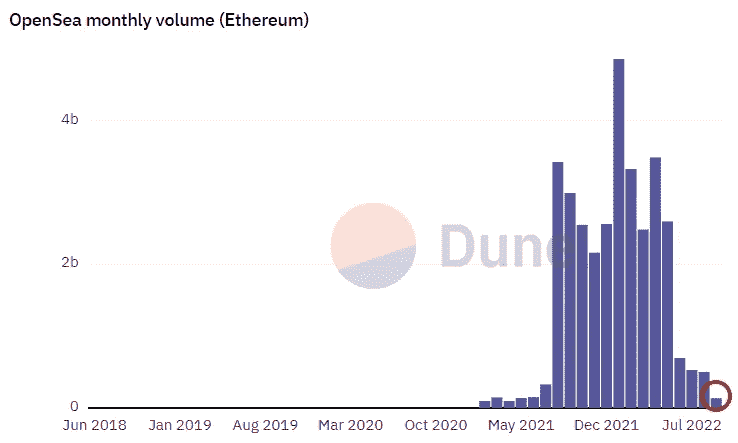

# 在购买任何非功能性食物之前，你必须知道两个观点

> 原文：<https://levelup.gitconnected.com/two-insights-you-must-know-before-buying-anymore-nfts-7d9627c8faaf>

或者在买你的第一个 NFT 之前

[信用——uctoday.com](https://www.uctoday.com/unified-communications/6-insightful-uc-in-financial-services-case-studies-to-read-in-2022/)

受欢迎的 NFT 市场 Opensea 目前的月销售额为 2021 年 5 月的 2.7%。

郁闷。

在短短的三个月内，整个市场直线下降，现有项目为零，已有团队的新项目没有销售一空。

很乱。

下面我们来仔细看看这些数据。

根据 [Dapp 雷达](https://dappradar.com/multichain/marketplaces/opensea)流行的 NFT 市场， [Opensea](https://opensea.io/) 昨天的销量如下。

> **以太坊 NFT 销售额 783 万美元**—2022 年 9 月 11 日

将此与

> **以太坊 NFT 销售额为 4.0574 亿美元**—2021 年 5 月 1 日

像 2017 年 ICO 崩盘和 1999 年互联网泡沫这样的历史参考意味着我们可以看到这种情况的到来。

在狂热中“喝得酩酊大醉”会在某个时候结束。

你是否做了什么是另一个问题。如果你是 NFTs 的新手，现在是一个很好的购买机会。

根据来自 [Dune Analytics](https://dune.com/rchen8/opensea) 的月度数据，Opensea 已经完成；

> **2022 年 9 月至今 1.359 亿美元**(下面用红色圈出)****

**与…相比**

> ****2022 年 1 月以太坊 NFT 月销售额 48.5 亿美元****

********

****[信用—沙丘分析](https://dune.com/rchen8/opensea)****

****最近的市场调整非常健康。****

****有太多的低投入的 NFT 项目，其创始人在没有商业经验的情况下一夜暴富——这使得他们的路线图成为一个幻想。****

****尽管“街上血流成河”，但如果我知道的话，还是有一些基本面因素会让我在买第一辆 NFT 之前受益匪浅。****

****他们也能帮助你。****

****下面重点介绍在购买 NFT 时如何思考。****

****关于买什么的更多信息，请阅读[三种将去月球的 NFT 项目。](https://medium.com/gitconnected/3-types-of-nft-projects-thatll-go-to-the-moon-8e3eeb43585b)****

## ****购买最低价格或最高价格的 NFTs，不要购买中间价格。****

****在大多数项目中，购买一套中档 NFT 很可能是财务回报最少的职位。****

****对收藏品的研究将表明，早期市场通常对入门级物品做出反应，作为新人首次接触 IP 或项目的一种方式。****

****随着 Web3 的成熟，收藏者最终会被更稀有、更高价的物品所吸引。****

****在这一发展时期，中端代币的价格受到挤压，通常会高于底价，这使得它们更难销售。****

****在未来，这可能会不同。它只是需要一些时间让新项目呼吸，经历他们的价格发现阶段，并有另一波采用。****

****我认为，中间层令牌是目前应该避免的。****

# ****避免价格锚定****

****如果你长期相信这个项目，错过了铸造一个 0.35 ETH 的项目，但能够从二级市场上购买 0.5ETH 仍然是一个很好的机会。****

****从本质上来说，Web3 为我们提供了一份创始人项目的经济价值，从定义上来说，要求我们更像一个风险资本家，而不是一个消费者。****

****Web2(社交媒体)通过电子商务、销售广告和电子邮件营销来训练和营销我们，除非我们以理想的价格购买一些东西，否则我们就会错过机会。****

> ****不要错过大减价，马上就要结束了****

****许多人都很失望，他们错过了以 0.5ETH 的价格铸造《T2》第一季的机会，而在当时，你可以在二级市场上以 0.75ETH 的价格购买一个地板令牌****

****底价高达 23 ETH，对于 99%了解该项目的人来说，这仍然是有史以来最重大的投资。****

****从我的经验来看，避免在一个项目上 FOMO(害怕错过),在二级市场上支付一点溢价也没关系，并做长线投资。****

****某人 3 年内可承受的起点可能是你梦寐以求的出口。****

****在[媒体](https://t.co/0WsCUfngD2)、 [LinkedIn](https://www.linkedin.com/in/jayden-levitt-aa93511b9/) 或 [Twitter](https://twitter.com/JaydenLevitt) 上关注我。****

*****本文仅供参考；不应将其视为财务、税务或法律建议。在做出任何重大财务决定之前，请咨询财务专家。*****