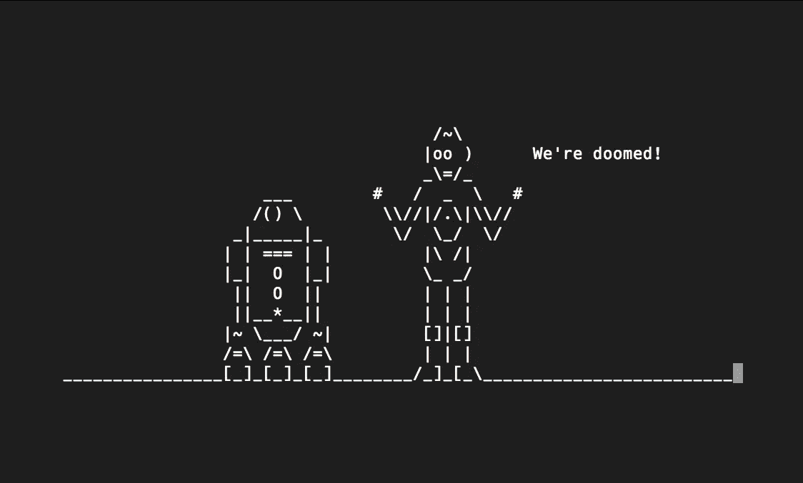
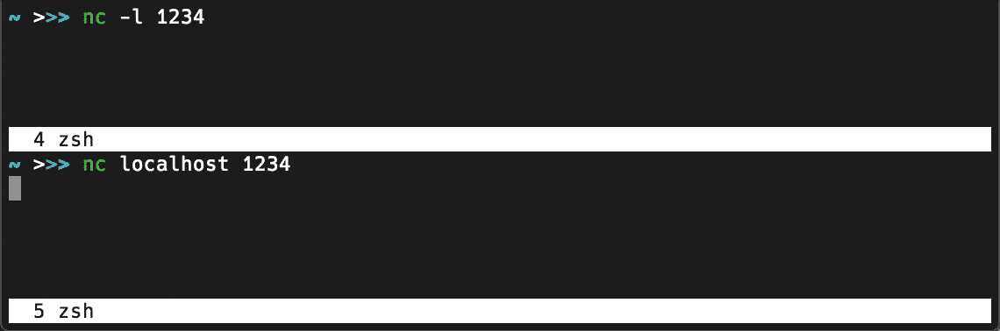
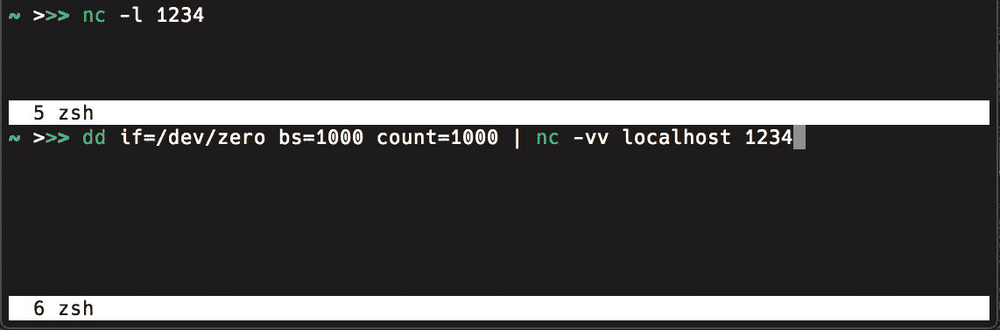

# Unix 忍者的两个电源命令

> 原文：<https://levelup.gitconnected.com/two-overlooked-commands-for-unix-ninjas-55b8bfc4dc84>

使用这些被忽略的工具提升您的 Unix 水平



星球大战截图来自`blinkenlights.nl Telnet session`

在这篇文章中，我将解释两个非常有用但经常被忽视的强大的 Unix 命令。

# netcat

netcat 或`nc`是一个多功能的网络瑞士军刀。一种思考方式是通过 UDP 或 TCP 建立客户机-服务器连接，在主机之间发送任意数据。

例如，我们可以创建简单的“聊天”会话，如下所示:

```
nc -l 1234
```

这告诉`nc`使用端口`1234`作为本地机器上的服务器来“监听”`-l`。

然后在单独的终端中:

```
nc localhost 1234
```

这告诉`nc`使用端口`1234`作为本地机器上的客户端进行连接。然后，客户端将等待输入，如果您键入一些内容，在每次回车之后，缓冲区将在服务器中回显:



netcat Hello World

当然，如果服务器和客户机运行在不同的机器上，这将变得更加有用。netcat 的应用包括:

*   使任何进程成为服务器
*   创建一次性 web 服务器
*   端口扫描

关于 netcat 的更多信息，维基百科页面[是一个很好的起点。](https://en.wikipedia.org/wiki/Netcat)

# 截止日期（Deadline Date 的缩写）

dd 是最古老的 Unix 命令之一，最初是由 Ken Thompson 在 1974 年开发的。在某种意义上，它可以被认为是“netcat for files”，因此，netcat 在网络连接上发送和接收，dd 读取和写入文件。因为在 Unix 中“一切都是文件”，这使得它非常通用。

像 netcat 一样，`dd`也是相当低的级别，提供对“原始”文件数据的访问。因此，最常见的应用之一是创建磁盘映像。

例如，如果您在`/dev/dvd`安装了一个 DVD，您可以创建一个 iso 映像，包含:

```
umount /dev/dvd
dd if=/dev/dvd of=/my/path/dvd.iso bs=65536
```

这可能看起来有点令人不知所措，但是`dd`的论点是记忆术，并且容易记住:

*   `if` =输入文件
*   `of` =输出文件
*   `bs` =以字节为单位的块大小

块大小是可选的，但是将其设置为高于默认值可以大大加快传输速度。

`dd`的应用包括:

*   创建一个任意大小的测试文件，用随机数据填充
*   文件的就地直接修改
*   数据恢复

高级用法见[此处](https://en.wikipedia.org/wiki/Dd_(Unix))。

# 结合 Netcat 和 dd

原来我们可以*结合* `nc`和`dd`来测量网络文件传输速度！

为此，在服务器上，我们再次以“监听”模式运行 netcat:

```
nc -l 1234
```

在客户机上，我们使用 dd 在连接上传输 n 个字节的零:

```
dd if=/dev/zero bs=1M count=1K | nc -vv 10.10.0.2 1234
```

这里`bs`是之前以字节为单位的块大小，`count`是发送的块数。`nc`的`-vv`参数告诉它产生详细的输出。

对于 1000 x 1000 字节，这会产生以下输出:



用 netcat 和 dd 测量文件传输速度

# 奖金命令！

干得好，走了这么远。现在给你奖励！还记得我在开始时贴的星球大战 ASCII 图片吗？原来这是电影的截图。当然不是官方的，而是由 blinkenlights 的不可思议的人们制作的一个完整的 ASCII 版本。

要观看，您需要一个 Telnet 客户端，在 macOS 上，您可以通过 Homebrew:

```
brew install telnet
```

然后:

```
telnet towel.blinkenlights.nl
```

不客气！